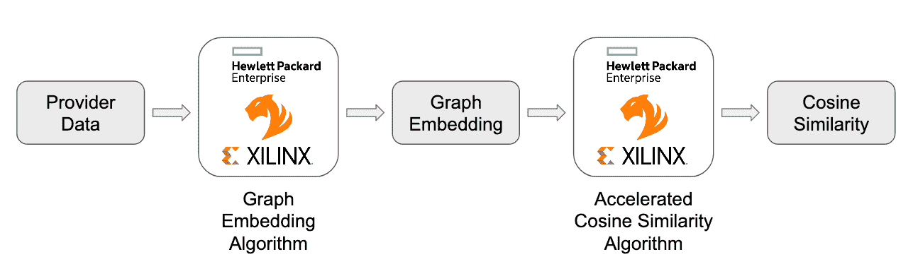
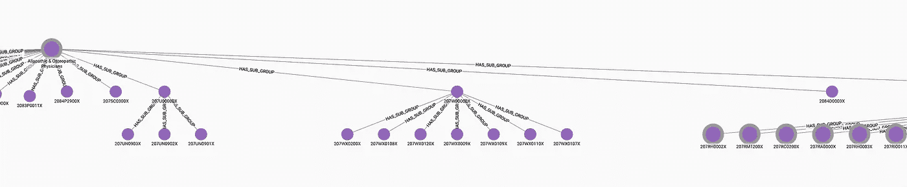
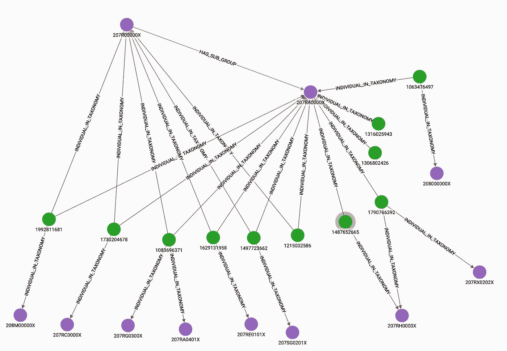
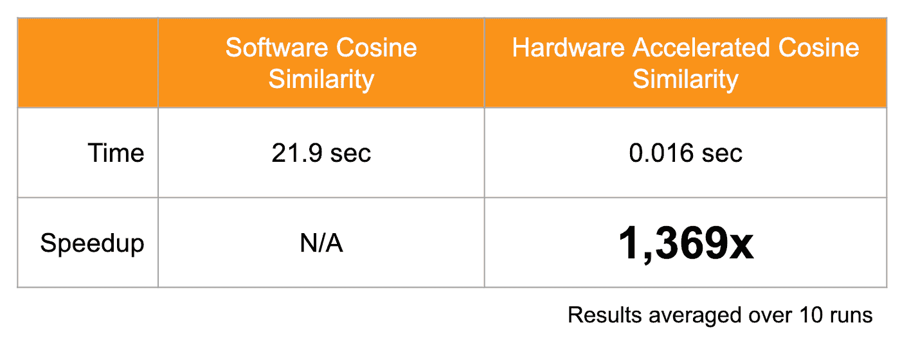

# 基于图形嵌入的硬件加速余弦相似度

> 原文：<https://towardsdatascience.com/hardware-accelerated-cosine-similarity-with-graph-embeddings-521d725d0e86?source=collection_archive---------32----------------------->

## 使用 TigerGraph 图形数据科学库

许多行业都普遍需要高质量和快速的推荐，如医疗保健、零售和娱乐。这些推荐应该能够考虑不同的数据来源，比如用户的朋友、兴趣、位置等等。

TigerGraph 是能够存储大量用户信息并对其进行实时分析的主要候选产品。在此示例中，使用了国家提供商标识符(NPI)分类数据。该数据包含所有医疗保健提供者及其专业，如麻醉学或肿瘤学。这些专业被组织在一个分类树中，因此一个儿科麻醉学分类单元属于更一般的麻醉学分类单元。提供者和分类法都被加载到 TigerGraph 中，以便使用嵌入和余弦相似性来执行提供者相似性计算。提供者之间的相似性分数是基于他们在专业树中的位置来确定的。

例如，两个在麻醉学分类下有子专业的提供者比一个是儿科麻醉师和另一个是全科儿科医师的提供者更相似。余弦相似性过程随后通过使用 [HPE 参考架构中的](https://www.hpe.com/psnow/doc/a50004892enw?section=Document%20Types) [Xilinx](https://www.xilinx.com/products/acceleration-solutions/tigergraph.html) Alveo U50 数据中心加速卡进行加速图形分析。进一步的实现细节可以在 [GitHub 库](https://github.com/TigerGraph-DevLabs/provider-similarity)中找到。

数据流概述(图片由作者提供)

嵌入将高维数据转换到低维空间。例如，所有地图都是地球的嵌入图，将 3D 空间转换为 2D 空间。图形嵌入技术将一个非常高维的空间(图形中的顶点数)转化为开发人员选择的低维向量(通常在 100-500 维左右)。降维是有益的，原因有两个:稀疏的高维数据对于机器学习算法来说更难解释并做出良好的预测，并且通过使用密集的低维表示可以显著改善时间和内存。此外，嵌入技术不需要耗时且昂贵的人工特征创建来进行机器学习。相反，嵌入算法会自动确定如何最好地表示低维空间中的数据。这使得数据科学家能够花费更少的时间清理和手动构建数据中的要素。

专业分类摘录(图片由作者提供)

GraphStudio 中的数据示例。紫色顶点是提供者专业，而绿色顶点代表提供者。(图片由作者提供)

[FastRP](https://arxiv.org/abs/1908.11512) 图嵌入算法用于创建表示 NPI 数据库中每个提供者和分类代码的嵌入。FastRP 使用一种称为随机投影的技术，其中矩阵稀疏地填充随机值。这个矩阵是维度 NxD，其中 N 是数据的原始维度，D 是降维后的维度。将邻接矩阵(维数为 N)乘以随机矩阵得到每个顶点的 D 维表示，这就是顶点的嵌入。TigerGraph 通过消息传递算法实现这种乘法。在 [TigerGraph 图形数据科学](https://github.com/tigergraph/gsql-graph-algorithms/tree/master/algorithms/GraphML/Embeddings/FastRP) Github 资源库中查看 FastRP。

一旦为每个顶点创建了嵌入，我们希望使用余弦相似性来比较它们。在这种情况下，使用 FastRP 创建了 200 维嵌入，目标是在给定一个输入提供者的情况下获得 10 个最相似的提供者。这个过程需要比较一个嵌入和 530 万个其他嵌入之间的余弦相似性得分。TigerGraph 可以使用图形数据科学库中的[嵌入相似性代码](https://github.com/tigergraph/gsql-graph-algorithms/tree/master/algorithms/GraphML/Embeddings/EmbeddingSimilarity)在数据库中完成这项工作，但也可以与 Xilinx 加速卡结合使用。这些 FPGAs 可以在其高带宽存储器中缓存嵌入，并以高度并行的方式计算输入提供者和所有其他提供者之间的余弦相似性。

FPGA 实现的这种高度并行性带来了大约 1300 倍的性能提升。非加速性能仍然令人钦佩，但如果需要实时提供建议，例如在网站加载期间，或者在患者与医疗保健提供商互动期间，FPGA 加速可以大规模实现这种实时功能。

给定目标嵌入，找到前 10 个相似嵌入的平均时间(图片由作者提供)

这种方法的一些扩展包括在其他机器学习算法中使用余弦相似性作为距离度量，例如用于分类的 k-最近邻和用于图形内顶点的无监督聚类的 k-均值。此外，嵌入和余弦相似性加速可以用于推荐算法，例如协同过滤。将来，可以使用诸如图形神经网络之类的更先进和精确的嵌入方法来生成嵌入，然后可以使用硬件加速的相同流水线来比较它们。

这里介绍的算法和演示只是 TigerGraph 正在研究的可扩展图形机器学习方法的开始。很快，将发布 TigerGraph 机器学习工作台，使数据科学家能够轻松连接到他们的 TigerGraph 实例，运行他们喜欢的图形算法，并使用 Python 和 Jupyter 笔记本训练图形神经网络。我们还将建立一个像这样的教程和演示库，以展示图形算法、图形特征工程和图形机器学习的可能性。有想法或反馈？伸出手去[tgds-feedback@tigergraph.com](mailto:tgds-feedback@tigergraph.com)。

## **资源:**

【https://github.com/TigerGraph-DevLabs/provider-similarity】医疗保健提供商相似性知识库:

**TigerGraph 图形数据科学库:**[https://github.com/tigergraph/gsql-graph-algorithms](https://github.com/tigergraph/gsql-graph-algorithms)

**本演示图+AI 峰会录制:**[https://info . tiger Graph . com/Graph-AI-Summit-fall-session-using-Graph](https://info.tigergraph.com/graph-ai-summit-fall-session-using-graph)

**Xilinx with tiger graph:**[https://www . Xilinx . com/products/acceleration-solutions/tiger graph . html](https://www.xilinx.com/products/acceleration-solutions/tigergraph.html)

**加速图分析的 HPE 参考架构:【https://www.hpe.com/psnow/doc/a50004892enw?】T22**section=Document%20Types