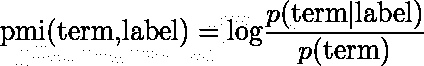
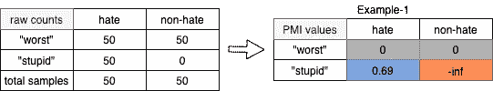
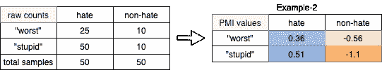
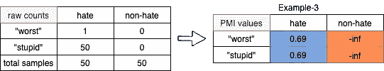
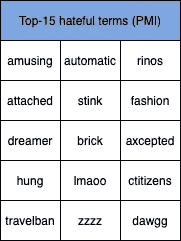
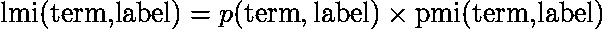
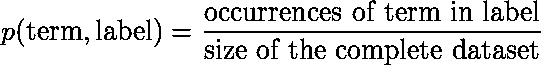
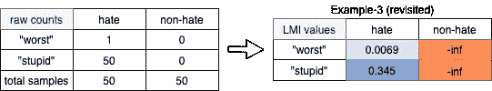
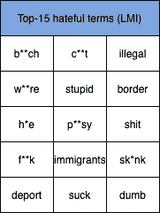

# 收获互信息的力量，在你的 NLP 数据集中发现偏差

> 原文：<https://towardsdatascience.com/harvesting-the-power-of-mutual-information-to-find-bias-in-your-nlp-dataset-c172c0dddebe?source=collection_archive---------27----------------------->

## 直观的数学介绍

## 局部互信息来发现 NLP 数据集中有偏见的术语，以及为什么它应该优先于逐点互信息

文森特·莱德维纳在 [Unsplash](https://unsplash.com/s/photos/powerful?utm_source=unsplash&utm_medium=referral&utm_content=creditCopyText) 上拍摄的照片

[在我的[上一篇文章](/is-your-nlp-dataset-suffering-from-bias-9fa26db33de0)中，我试图了解 NLP 中有偏见数据集的一些不同原因。请随意去看一看，因为这篇文章是在它的基础上构建的！]

如前所述，当某些术语与某个特定标签相关联时，数据集往往会有偏差。我们在这些数据集上训练的模型开始捕捉这种关联，当这些术语的上下文颠倒时，表现很差。例如，一个模型已经看到了术语*在“仇恨”推文中的用法*，将*偏向*预测任何包含该术语的新推文为“仇恨”而不是“非仇恨”。

在本文中，我将进一步隔离数据集中最有可能引入偏差的术语。

# 识别有偏见术语的 2 个指标

我将通过互信息的两个常见衍生来量化术语与标签的相关性。

## 逐点互信息(PMI)

让我们逐一剖析这个等式，并尝试理解为什么 PMI 有助于找到术语-标签相关性:

1.  *p* (术语|标签):给出我们看到*术语出现在属于*标签*的样本(或推文或文档，选择你最喜欢的)中的概率*
2.  *p* (术语):给出在任何样本中看到一个术语的概率(即跨越*所有*标签)
3.  *日志*:为了更好的理解，让我们简化日志

可能有两种情况值得关注

*   *p*(term | label)>*p*(term):当*项相对于整个数据集**或** *更有可能出现在*标签的样本中时，*项与*标签正相关。在这种情况下，得出的 PMI 也将是**正*****
*   ****p* (项|标签)< *p* (项):当*的*项与整个数据集**或** *相比，在*的*标签样本中出现的可能性较低时，*项与*的*标签负相关。在这种情况下，得出的 PMI 将是负的***

*因此，我们看到 PMI 捕捉到了术语-标签相关性的影响。*

*我们用一些例子来了解一下。*

**

*   *“最差”两个标签的 PMI 值都为 0，因为它的出现不会给出任何关于标签可能是什么的信息*
*   *“愚蠢”为仇恨标签获得正值，因为它只出现在该标签中
    ,为非仇恨标签获得负值，因为它从未出现在该标签中*

**

*   *对于*仇恨*标签,“最坏”获得的 PMI 低于“愚蠢”,因为它出现在较少的仇恨样本中；对于这个标签，两个术语都获得正值，因为两个术语都与其相关度高于另一个标签*
*   *对于*非仇恨*标签,“最坏”比“愚蠢”获得更高的 PMI，因为“愚蠢”与*仇恨*标签更密切相关*

**

*等等，你发现这个例子有问题吗？我们在“最差”和“愚蠢”这两个词上得到了相同的分数，因为这两个词都与憎恨这个标签密切相关。但是我认为**这不公平**因为“最坏”在整个数据集中只出现一次！这是很糟糕的，因为一个词在整个数据集中只出现一次就可能成为最有倾向性的词。*

**

*作为一个具体的例子，我在来自(Basile 等人，2019 年)的仇恨言论检测数据集(Hateval)上找到了*仇恨*标签的前 15 个有偏见的术语。经过检查，我发现所有这些术语都带有相同的 PMI 值，因为它们只出现在这个标签上。请注意，该列表还包含许多拼写错误，这些错误很可能在整个数据集中只出现一次！*

## *当地共同信息(LMI):一个重新加权的采购经理人指数*

*我们刚刚看到了 PMI 的一个重要警告:它可能无法解释术语频率，给数据集中很少出现的术语赋予很高的权重，如许多拼写错误。*

*解决办法是重新加权 PMI 值。*

**

***LMI 的 PMI 是根据任期发生率调整的***

1.  **p* (术语，标签):为调整系数*

**

*请注意，每一项的分母都是常数，但分子直接取决于该项的频率。这就是我们一直在寻找的缺失部分。*

**

*重新调整示例 3 使用 LMI，现在术语“最坏”被正确地分配了比更频繁的“愚蠢”小得多的值。*

**

*将 LMI 应用到前面的具体例子中，最具偏见的*憎恨*标签的术语实际上是如此的可恶，以至于我不得不将它们探测出来👶*

# *下一步是什么*

*在本文中，我们看到了如何在我们的 NLP 数据集中分离出引起偏见的术语。既然我们知道了谁是我们的敌人，我们可以开始计划如何打败它了，⚔️*