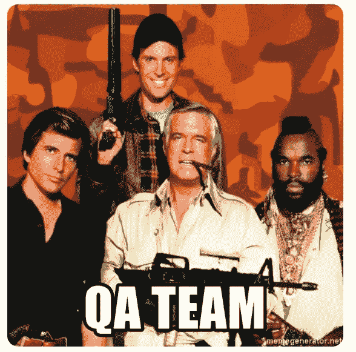
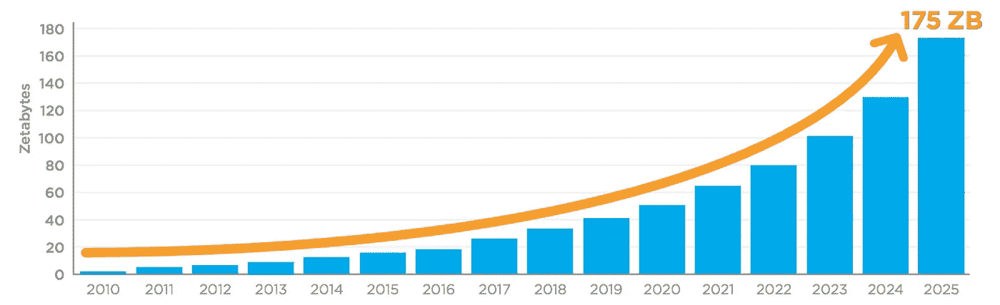

# DevOps 是否扼杀了 BA/QA/DBA 角色？

> 原文：<https://towardsdatascience.com/has-devops-killed-the-ba-qa-dba-roles-fbc187abdde?source=collection_archive---------0----------------------->

## 看看软件开发人员如何承担更多的责任，这对传统的技术角色意味着什么

彼得·冈博斯在 Unsplash 上拍摄的照片

从历史上看，IT 部门是跨技术线构建的，如应用程序、UX 和数据库团队。最近， [2-pizza DevOps 团队](https://docs.aws.amazon.com/whitepapers/latest/introduction-devops-aws/two-pizza-teams.html)已经出现，并围绕业务线宣传重组。现在，单个团队负责端到端的特定业务功能。这开启了全栈开发人员的时代——可以为系统的任何方面做出贡献的工程师。数据库连接丢失？开发人员正在调查此事。基础设施瘫痪？戴夫正在处理。

随着开发人员的职责范围扩大，BA/QA/DBA 等传统技术工作还剩下什么？在 DevOps 时代，他们还有作用吗？

# 商业分析师

业务分析师是用户和技术团队之间的混合角色。开发者)，CIO.com 描述如下:

> 业务分析师(BAs)负责使用数据分析来评估流程，确定需求，并向高管和利益相关者提供数据驱动的建议和报告，从而弥合 IT 和业务之间的差距([来源](https://www.cio.com/article/2436638/project-management-what-do-business-analysts-actually-do-for-software-implementation-projects.html))。

根据美国劳工统计局的数据，英国航空公司的就业前景预计在未来十年增长 11%。尽管有这样的增长，许多开发人员认为 BA 角色在 DevOps 复兴之后已经过时，基本上是多余的。

## 针对 BAs 的案件

针对 BAs 的案例在这个办公空间的经典场景中得到了完美的总结。

来自办公空间的这个剪辑形成了反对 BAs 的争论的症结，并且可能不公平地使许多开发人员对业务分析师产生偏见。

英国航空公司的工作本来就很困难。他们是技术熟练的开发人员和领域熟练的用户之间的中间人。不知何故，人们期望助理能与两者的专业知识相匹配，在他们的直接沟通中进行调解，并凭空变出额外的价值——哎呀。

当 BA 出问题时，通常是组织出了问题，**BA 转变为中继**。换句话说，BA 只是把所有用户的问题都推给了开发者，反之亦然。对于一个开发者来说，给建筑协会发一封电子邮件，却收到一字不差的抄送，这是很烦人的。当电子邮件缺乏上下文、截图或任何其他 BA 应该捕捉到的明显信息时，这就更令人恼火了。当这种情况再次出现时，我只是直接与用户交谈。

## BAs 的案例

此时，您可能会想“为什么开发人员不总是与用户交流？”。当然，这是一种选择。例如，在初创公司中，可能没有理由需要 BAs。但是随着组织、应用程序和团队的成长，开发人员和用户之间的反馈环也在增长。当然，与用户的一次性聊天是好的，但实际上能为此节省多少时间呢？例如，您是否经常与几十个用户建立电话来审查功能请求？一个好的 BA 应该每天花几个小时与几十个用户交谈，建立一个网络和融洽的关系。通过这种方式，BAs 获得了对系统的整体理解，例如，一个屏幕对一个团队来说很好，但对另一个团队来说就不好了。只有在他们整理了这些信息之后，他们才应该把它们交给开发人员。开发人员*应该*参与到与 BAs 和用户的讨论中，但只能以预先计划好的系统方式进行。

作为开发人员，我们并不总是对我们的资源有多贵敏感。如果一个开发人员每年挣 12 万美元，一个 BA 挣 6 万美元，那么把同样多的非技术性工作交给其他人无疑是有意义的。此外，过多的[上下文切换](https://simpleprogrammer.com/context-switching/)的负面影响严重阻碍了开发效率。最后，这可能令人震惊，但是**许多开发者根本不擅长用户关系。我见过许多人，他们认为自己的用户愚蠢透顶。有一次在工作面试中，我的面试官直截了当地告诉我，他们内部 SAAS 平台的用户都是白痴，尽管他们中的大多数都是博士。很难理解得出这样的结论所需要的错觉，即一个博士团队是愚蠢的，而不是你的软件很烂并且不用户友好。**

# 数据库管理员

该角色可概括如下:

> 数据库管理员(DBA)是信息技术人员，负责指导或执行与维护成功的[数据库](https://searchsqlserver.techtarget.com/definition/database)环境相关的所有活动。数据库管理员确保一个组织的数据库及其相关的应用程序能够有效运行([来源](https://searchsqlserver.techtarget.com/definition/database-administrator))。

根据劳工统计局的数据，2019-2029 年的十年就业前景预计将增长 10%——低于所讨论的其他角色，但仍高于全国平均水平。

## 反对数据库管理员的理由

随着大多数行业迁移到云，管理数据库的开销正在快速下降。例如，在下面的视频中，GCP 的 Postgres 数据库在 5 分钟内就完成了。此外，云产品内置了身份和访问管理解决方案。随着开发人员在数据/基础设施级别(即后端)，他们开始质疑为什么数据操作需要专门的角色或团队。

在 5 分钟内启动一个 GCP 实例

在一家大银行的前一份工作中，我花了两个月的时间试图为一个新的应用程序启动一个 Mongo 实例。一个官僚 DBA 每一步都和我作对。在某一点上，他甚至坚持认为我的应用程序不需要对数据库进行写访问。如果一个应用程序不能写入数据库，它怎么能工作呢！？最后，他给我当了两个星期的鬼，后来我发现他正要离开公司，已经精神检查过了。这一经历让我对 DBA 产生了多年的偏见。

## 数据库管理员案例

虽然开发人员通常对基础设施和 SQL 有足够的了解来构建有状态的应用程序，但是一个好的 DBA 会带来更广泛的知识和视角。DBA 通常是 SQL 方面的专家，可以帮助开发人员优化查询和与数据库相关的任务。*然而，数据库不仅仅是查询*。作为应用程序开发人员，我们有时会忘记这一点。

例如，一个 DBA 曾经提出一个触发函数作为一个棘手问题的解决方案。在这之前，我从未听说过触发函数。还有一次，我们不得不在不停止生产版本的情况下从 Linux 服务器备份中恢复一个旧表。要做到这一点而不耗尽数据库资源，需要 DBA 付出相当多的精力和专业知识。对于 DBA 除了编写查询之外所做的所有工作，我们都没有给予足够的信任。

最后，我们不要忘记过去十年数据技术的寒武纪大爆发。想想无数的数据库引擎(CouchDB、RocksDB、Aurora 等...)，以及数据仓库的进步(即雪花)、人工智能和数据科学。在这个新世界中，很难夸大数据专业知识的价值。

# 质量保证工程师

QA 工程师是一个技术人员，他确保发布的软件可供最终用户使用。从文章“[一个软件质量保证工程师做什么](https://www.thebalancecareers.com/list-of-software-quality-assurance-qa-engineer-skills-2062484)？”，他们的职责包括:

*   发现新的和预先存在的错误(回归)
*   执行手动和自动测试
*   检查用户界面的一致性和功能性。

由于 QA 和开发人员的职责重叠，很难获得单独的工资统计数据。事实上，这种重叠形成了针对 QA 工程师的核心案例。

## 针对 QA 的案例

对 QA 工程师的一个普遍看法是，他们仅仅是“测试人员”，或者充其量是初级开发人员。他们发现错误并运行测试，通常是手动的。那么，难道软件开发人员不应该自己编写自动化测试并发现错误吗？当 bug 进入生产时，最终是开发人员接受修复的指责和责任。

此外，QA 过程减缓了发布周期。当一个简单的特性花了几个小时开发，但却在等待 QA 几天时，这可能会令人沮丧。通常需求是不清楚的(咳咳，BAs ),因此 QA 可能测试错误的东西，报告非问题，或者仅仅需要大量的指导。当 QA 过程以这种方式受到损害时，开发人员将不可避免地采取*的心态，我会自己测试它*。

我有过的最糟糕的 QA 经历是在 2015 年，当时我们的 QA 团队在离岸，只有短暂的时区重叠。他们会在我们喝咖啡之前就给我们打电话，浏览过时的手工 UI 回归案例的电子表格。95%的问题是不相关或不相干的，整个过程变成了徒劳无益的令人沮丧的练习。这让我对 QA 团队产生了很长一段时间的偏见，而实际上这是一个沟通的问题。

## 质量保证的案例

反对 QAs 的理由成立；然而，它包含了几个假设。首先，一切都可以/应该自动化的想法对于绿地项目是有意义的。但是在实践中，尤其是在大公司，大多数软件都是遗留的，缺乏测试覆盖率。此外，最初的开发人员可能已经离开很久了，大多数关于系统的知识都在 QA 团队中。在这种情况下，QA 团队将能够提供关于系统的无价的上下文、视角和想法。

第二个假设是 QAs 的工作仅仅是发现 bug。但是真正优秀的 QA 工程师往往能够识别出超越代码的用户陷阱。例如，虽然一个新按钮可能工作正常，但 QA 可能意识到公司的一些用户使用较低分辨率的显示器。在紧凑视图中，在复制旁边的文本时，按钮很容易被误点击；他们过去见过。这在单元测试中并不容易捕捉到…

图片来源:[https://meme generator . net/instance/60318094/good-guys-a-team-QA-team](https://memegenerator.net/instance/60318094/good-guys-a-team-qa-team)

让我们也挑战自动化测试可以排除所有错误的假设——考虑以下几点。

1.  **有些变化甚至不需要测试。**例如，某些用户界面的改变很容易被人验证，但是很难自动化。对于具有高变动和大部分美学变化的 ui，测试套件是一个速度阻力。
2.  **有些事情是无法预料的。**系统总会有不可预测的方面。代码审查可能会有所帮助，但是没有什么可以代替实际的人施加压力。一个好的 QA 人员仍然会发现各种各样的东西。你有没有不耐烦地向 QA 团队坚持说你的特性很好,*只是一个基本的改变*,结果却让他们增加了一些东西？我确信我脸上的蛋。

# 展望未来

## 这些角色会持续下去吗？

随着行业继续向 DevOps 和云发展，这些领域将变得越来越少。**每个角色都将趋向于更加专业化，特别是 DBA** ，因为维护数据库的运营开销正在迅速降低。他们会在大公司呆得更久，但是对表现差的人的容忍度会急剧下降。然而，与此同时，对数据专业知识的需求将继续加速增长，如下文预测所示。仓储和数据科学的发展应该确保数据专业化仍然有利可图，数据库管理员也做好了转型的准备。

在 Pamela Fox 的文章中，她预测到 2025 年数字数据的总大小将超过 175 兆字节。如果一粒米=一个字节，那么一个 ZettaByte 将会充满整个太平洋。

在这三者中，**BA 角色似乎最安全。普通的软件开发人员根本没有时间(通常也没有能力)去维护一个强大的 BA 的社交网络。然而，随着更多的公司迁移到 DevOps/Agile，用户和开发人员之间的反馈障碍将继续缩小。事实上，没有技术能力的 BAs 将会被淘汰。**

QA 角色是最难预测的。随着自动化程度的提高，对 QA 人员运行手动脚本和“捕捉错误”的需求将会消失。然而，现代系统日益增长的复杂性和性能要求意味着质量保证比以往任何时候都更加重要。对许多 SaaS 公司来说，即使很短的停机时间也是有害的。 [Slack 最近宕机一小时，这成了新闻](https://www.theverge.com/2021/5/20/22446007/slack-down-outage-messages-trouble-loading)。因此，能够发现用户界面陷阱和恶化的人才将继续受到欢迎。QA 是否仍然是一个真正的角色，还是退化为专业化，很难预测。

## 关于开发者的偏见

**如果你两年前问我这些角色，我的想法会是“不想要他们也不需要他们”。我刚刚离开了一个沉闷的官僚机构，去了一家只有开发人员的初创公司。相比之下，这似乎是一个乌托邦。然而，当我因为 Covid 而失去工作，转到一家中型公司时，我的偏见暴露无遗。**

在新的工作中，BA/DBA/QA 人员很有帮助。回顾过去，我意识到过去的大部分摩擦可归因于以下几点:

*   沟通不畅(例如，团队成员跨越重洋工作)。
*   受限制的责任，例如不能进行数据库查询的 BAs 或不能查看/运行代码的 QA 人员。
*   缺乏认同:好的团队不分角色，一起赢，一起输。

最后，软件开发人员倾向于认为他们自己可以做任何工作。他们可以戴上分析师的帽子，但反过来通常是不正确的，这种不对称助长了自我。重要的是要记住，仅仅因为我们可以做一些事情，这样做可能不划算，而且我们可能不像自己认为的那样擅长。

**你怎么看？**得到了不同的拍摄；我全弄错了吗？留下评论让我知道。