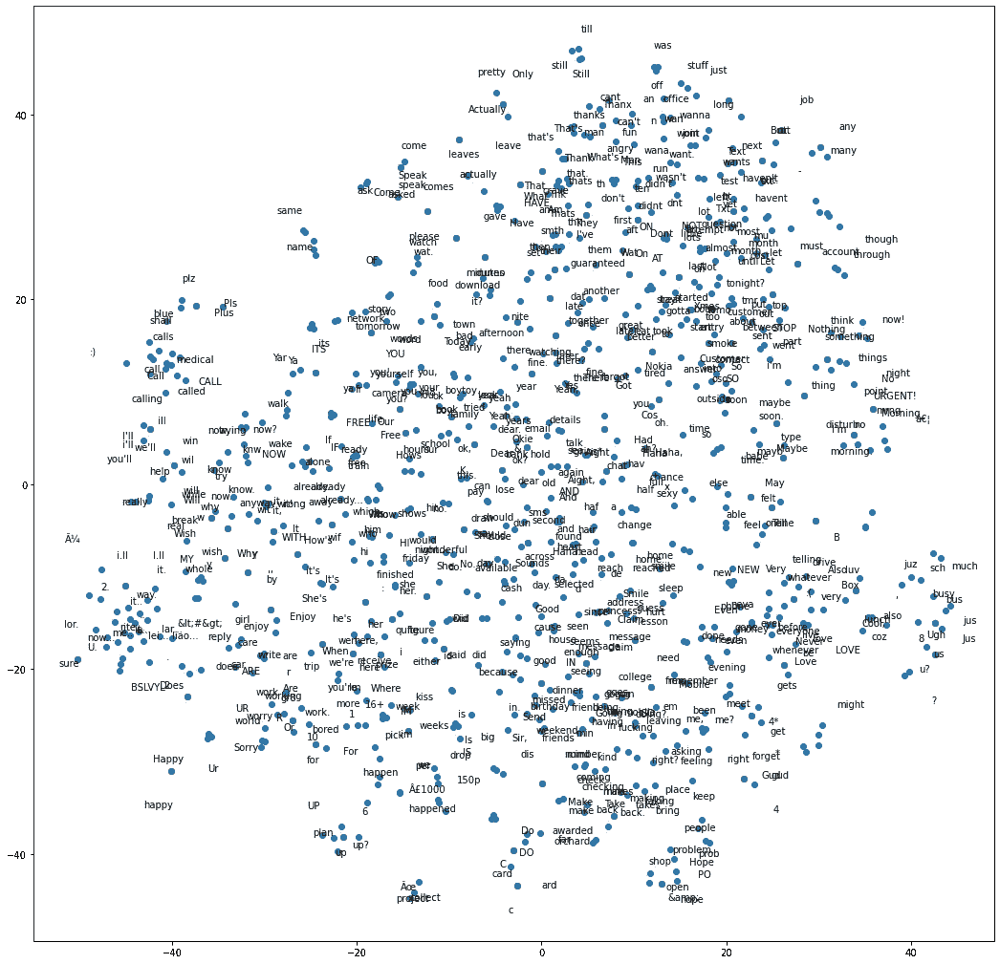
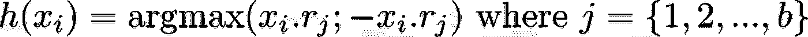
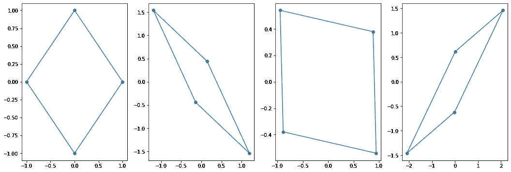
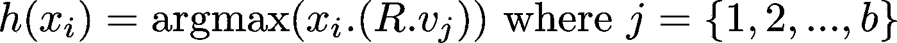
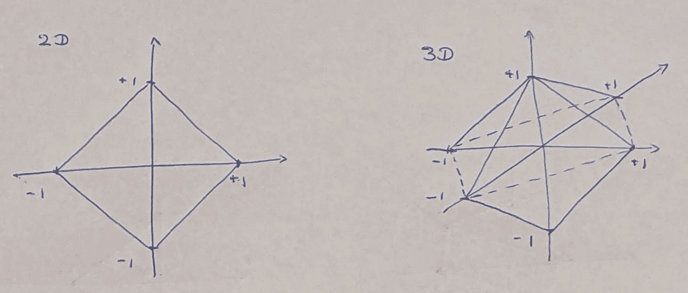

# Hash2Vec:单行单词向量

> 原文：<https://towardsdatascience.com/hash2vec-one-liner-word-vectors-c8ec39ff1dfe?source=collection_archive---------13----------------------->

## 我最近做了一个有趣的实验，试图把单词向量和 LSH 拼在一起


图片来自 [Pixabay](https://pixabay.com/?utm_source=link-attribution&utm_medium=referral&utm_campaign=image&utm_content=3655668) 的 [Markus Spiske](https://pixabay.com/users/markusspiske-670330/?utm_source=link-attribution&utm_medium=referral&utm_campaign=image&utm_content=3655668)

我们现在就跳进深水区吧。那样会很有趣。假设你有一个文本语料库。

```
[“dog barked at the tree”, “cat drank milk”]
```

现在将每个单词/标记表示为一个 ngram 包向量。为此，首先我们需要所有令牌中的所有 n 元语法。让我们取 1 & 2 克向量。

```
[d, o, g, b, a, r, k, e, d, …, m, i, l, k, do, og, ba, ar, …, mi, il, lk]
```

现在将每个单词表示为一个 ngram 向量

```
dog   —>[1, 1, 1, 0, 0, 0, 0, 0, 0, …, 0, 0, 0, 0, 1, 1, 0, 0, …, 0, 0, 0]barked->[0, 0, 0, 1, 1, 1, 1, 1, 1, …, 0, 0, 0, 0, 0, 0, 1, 1, …, 0, 0, 0]…milk  ->[0, 0, 0, 0, 0, 0, 0, 0, 0, …, 1, 1, 1, 1, 0, 0, 0, 0, …, 1, 1, 1]
```

一旦你有了每个单词的 n 元向量，计算如下。

> w = xR-xR

这里，`x`是大小为`(V , d)`的 ngram 矩阵，`R`是大小为`(d ,(b/2))`的随机正规矩阵。所以我们以一个`(V , b)`结束。这里，`V`是词汇大小，`b`是超参数(散列箱的数量)。换句话说，我们为每个令牌准备了一个大小为`b`的向量。

你可以使用像 T-SNE 这样的降维技术来可视化这些向量，你会得到下面的结果。



转换后学习单词向量。我们可以看到有相似成分的单词(例如 up，UP？、up 或 i.ll、I.ll)聚类在一起(图片由作者提供)

仔细看看，

```
watch ['wat.', 'always', 'Wat', 'wat', 'Was']
Free ['free', 'FREE', 'here,', 'fine.', 'alone']
My ['my', 'MY', 'whole', '&lt;DECIMAL&gt;', '&lt;#&gt;']
sending ['Send', 'send', 'end', 'dinner', 'seeing']
May ['may', 'mayb', 'mail', 'well', 'Well']
was ['was', 'WAS', 'office', 'wan', 'wana']
Enjoy ['Enjoy', 'write', 'wit', 'sorry', 'Sorry']
```

你可以看到有相似成分的单词最终会组合在一起。

> *插入令人惊叹的迷因*

**代码:** [此处](https://github.com/thushv89/packt_nlp_tensorflow_2/blob/dev/Misc/Hash2Vec-One_liner_word_vectors.ipynb)

# 霍勒普。刚刚到底发生了什么？


图片来自 [Pixabay](https://pixabay.com/?utm_source=link-attribution&utm_medium=referral&utm_campaign=image&utm_content=2717058) 的克里斯蒂扬·普杰克

不要害怕！我不会把你丢在一个没有解释的悬崖上。这种可能性背后的核心思想在于位置敏感散列(LSH)。现在让我告诉你我最初是如何意识到这个有趣的属性的故事。

# 序言

前阵子我在看[改革者](https://arxiv.org/pdf/2001.04451.pdf)(变形金刚模型的一个变种)的论文。那篇论文中最引人注目的特性是 LSH (Locality Sensitive Hashing)算法，他们用它来绑定查询和 Transformer 模型的键。我对它的简单和强大感到惊讶。对 LSH 最简单的解释(我猜)是，

> LSH 做的与普通哈希函数相反。哈希函数试图减少唯一项目的冲突，而 LSH 算法试图最大化相似项目的冲突(基于某种输入表示)。

但对我来说，真正的灯泡时刻是不同的。我在想，是否有一种方法可以使用重整器中的 LSH 算法来产生粗糙而快速的单词向量。事实上，我花了很多时间在单词向量上(对此我不能给出一个很好的理由为什么？)可能已经种下了种子。

现在我们有了背景，让我们进入它的症结！第一站，LSH。

# LSH 背后的想法

LSH 源于一个非常恼人的常见问题[寻找近似最近邻居(安)](/comprehensive-guide-to-approximate-nearest-neighbors-algorithms-8b94f057d6b6)。近似 NN(最近邻)意味着通过牺牲一定程度的准确性来快速找到 NN。例如，推荐模型在 ANN 上蓬勃发展，因为从数以亿计的用户群中找到与给定用户相似的用户不是在公园里散步！不要忘记这样一个事实，这需要一个快速的用户触发(例如，点击按钮，滚动页面，等等)。).

好的，回到 LSH。有许多不同的 LSH 算法可用，包括像 [minhash](https://web.stanford.edu/class/cs276b/handouts/minhash.pdf) 这样的流行算法。这个想法是想出一个散列函数，

> 对于高度相似的输入，增加冲突(相同散列输出)的概率

不过 Minhash 有点复杂，不在我们的讨论范围之内。为引擎盖下的重整器提供动力的算法要简单得多。该算法被称为[角度 LSH](https://arxiv.org/pdf/1509.02897.pdf) (或[球面 LSH](https://lib-repos.fun.ac.jp/dspace/bitstream/10445/3004/4/kterasaw_2007_01_wads.pdf) )。事实上，如果你去掉多余的脂肪，可以用一行程序来表达。现在，让我们深入研究一下 Reformer 论文中使用的 LSH 算法的细节。

```
bins = 32R = np.random.normal(size=(5, bins//2))
inputs = np.array([[1,1,0,0,1], [1, 1, 1, 0, 0], [0, 0, 1, 1, 0]])h_x = np.dot(inputs, R)# The crux of the computation is a single line
# outs is a hash bin that is similar for similar inputs
hash_bins = np.argmax(np.concatenate([h_x, -h_x], axis=-1), axis=-1)
```

这就是你所需要的！哦，对了，我猜你想让我相信冰淇淋也来自冷冻的奶牛？不，真的，有用。原因如下？

# 直觉:球形 LSH

球形 LSH 围绕一个单位长度的球体(在某个 D 维中)和一个相同维 D 的查询向量旋转，

> 如果在这个球体上有 B 个随机旋转的顶点，具有相似表示的查询向量将得到与它们最近的邻居相同的顶点

这正是上面的计算所做的，具体来说，



获取查询的哈希桶的公式。";"表示串联操作

R ( `r_j`)中的每一列都可以被认为是我们的超球体的一个随机旋转的顶点(这是一个你可以保持原样的细节——但是对于相当精通数学的人来说，这里有一个小附录)。`x_i.r_j`就是简单的取点积。点积的另一个名称是“相似性”(点积越高，越相似)。然后`argmax` 给出顶点的索引，这是查询的神经网络。这有时被解释为“分配给一个容器”,但原理是一样的。是啊，就这么简单！

需要注意的一件重要事情是实体`x_i.r_j`这是一个向量，表示给定的查询与空间中的任意顶点有多相似。并且类似的查询将被放置在附近。当你在许多随机的顶点上这样做的时候，你最终会得到每个查询的向量。



与随机矩阵相乘如何在 2D 空间旋转形状(图片由作者提供)

# 我如何配合 LSH 获得良好的词向量？

很高兴你问了。首先，LSH 和词向量都瞄准了相似的目标，“在一个大的语料库中找到相似的输入单元”。所以我在这里试图回答的问题是，我们能不能想出一个 LSH 机制来得到一些快速单词向量？

我们简单地把`argmax`从等式中去掉。因为这给我们留下了到高维空间中每个随机顶点的距离向量。对于相似的单词(每个单词被表示为一个单词包)，这些向量是相似的。

## 为什么我们不保留一包向量呢？

所以另一个问题是，我们正在利用我们的 ngram 包表示中已经存在的相似性。为什么首先要进行这种转变？有两个主要原因

*   n-gram 向量的包可以变得任意大，因为大小由语料库中不同 n-gram 的数量控制，其中在该方法中，`b`控制向量的大小
*   强迫高维 n-grams 在一个较低的维度，迫使它学习更多的相似性。同样的原理也适用于单词向量。当维度很小时，它迫使单词向量学习单词中的相似性。

# 垃圾邮件分类任务的性能

评估单词向量的典型方法是在下游任务中使用它们。在这里，我在一个垃圾邮件分类数据集上评估了以下内容。

*   Hash2vec 载体
*   ngram 包向量
*   实际单词向量

你可以在这里找到实验的代码。该模型是基于向量的简单逻辑回归模型。经过 10 次试验(每次训练 10 个时期)，我得到以下结果。

*   Hash2vec: 82.18 +/- 0.93 %
*   多宿主:83.99 +/- 0.28%
*   Word2vec: 92.04 + /- 0.36%

我们可以看到 Hash2vec 不是神谕。但是它的性能相当不错，尽管比多孔(网袋)方法的尺寸要小。这里我们结束了对方法的讨论。你可以看到这个实验的代码:[这里](https://github.com/thushv89/packt_nlp_tensorflow_2/blob/dev/Misc/Hash2Vec-One_liner_word_vectors.ipynb)。

# 为什么和为什么没有 Hash2Vec

## 为什么选择 Hash2Vec

*   仅捕获成分相似性-这是确保具有相似结构的单词(例如 walk 和 walked)或具有较小拼写错误的单词(例如 third vs thrid)映射到相似向量的好方法
*   没有训练的简单单词向量——不需要训练。简单的矩阵乘法给出向量
*   适用于任何模型——与词向量不同，它们不需要处于端到端的可区分架构中(例如，可用于像 [xgboost](https://xgboost.readthedocs.io/en/latest/) 这样的模型)
*   散列法可能出错——在 LSH，没有人能保证完全相反的东西会在完全不同的垃圾箱里。在极少数情况下，它们可以映射到同一个 bin。这就是为什么我对这个实验进行了多次试验。

## 为什么不是 Hash2Vec

*   捕获语义——单词向量将捕获语义(例如，猫对猫),而上述方法不会。
*   没有矢量运算——与 Word2vec 不同，您不能用 Hash2vec 执行矢量计算(例如，king — man = queen — woman ),因为它不捕获语义。
*   准确性——word 2 vec 比这种方法更有效。因此，如果您追求准确性，Word2vec 是一个更明智的选择。

# 如果你不能打败他们，就加入他们

这些方法(Hash2vec & Word2vec)不需要互斥。他们也可以互相授权。举个例子，

*   你可以用 Hash2vec 给词向量提供一个很好的初始化，然后正常训练词向量。
*   您可以使用 LSH 开发一个简单的拼写纠正机制。因为 LSH 将相似的单词映射到相似的桶，所以您可以使用该属性开发一个简单的拼写纠正查找字典。然后将相同桶中的单词映射到 word2vec 层中的相同向量。

# 结论

本文的目的不是介绍 word2vec 的竞争对手，而是展示简单 LSH 机制的威力，并通过单词向量练习巩固它。它给了我们一种不需要任何训练就能得出低维单词向量的方法。此外，这些向量可以捕捉单词之间的组成相似性。最后，这些方法也可以相互受益。

**PS:** 我没见过类似这样的技术被实验过，以前也没用过。这就是驱使我写这篇文章的原因。但是由于迷失在大量发表在空间中的 ML 论文中，类似的工作被忽视的情况并不少见。如果你看到一篇论文在做类似的工作。请随意发表关于他们的文章。

<https://thushv89.medium.com/membership>  

# 附录

## 随机旋转和矩阵乘法

我们一直在说`h(x) = argmax(xR;-xR)`中的`R`代表一个超维空间中随机旋转的结构。为了理解为什么会这样，我们必须把注意力转向论文[“单位超球面上近似最近邻搜索的球面 LSH”](https://lib-repos.fun.ac.jp/dspace/bitstream/10445/3004/4/kterasaw_2007_01_wads.pdf)。在本文中，实际的计算看起来像这样，



其中`R`是一个随机矩阵(本文使用`A`),`v_j`代表一个正则超球面的`j^th`顶点。所以这里我们特别使用一个随机旋转矩阵来旋转一个规则超球面的顶点。那么我们如何将`x_i(R v_j)`缩小到`xR;-xR`(where“；”是串联)。诀窍在于我们用什么作为我们的形状。这里我们使用一种特殊的多面体(一种高维多边形的推广)，称为“正多面体”。一个正射曲面的顶点仅仅是所有`{+/- 1, 0, 0, 0,…}`的排列。例如，在 2D 空间中是`[1, 0], [0, 1], [-1, 0]`和`[0, -1]`。



2D 和 3D 空间中的 Orthoplex(图片由作者提供)

换句话说，顶点是`I`和`-I`，其中 I 是单位矩阵。所以用`I`和`-I`代替`v_j`，我们得到`xR`和`— xR`。一个简单的整形将给出`xR;-xR`。