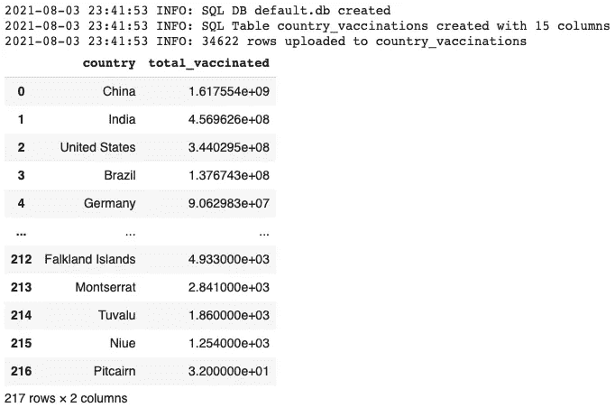

# 有 SQL 面试吗？使用谷歌 Colab！

> 原文：<https://towardsdatascience.com/have-a-sql-interview-coming-up-ace-it-using-google-colab-6d3c0ffb29dc?source=collection_archive---------8----------------------->

## 只需 2 个辅助函数，即可在 Google Colab 中设置和运行 SQL！

格伦·卡斯滕斯-彼得斯在 [Unsplash](https://unsplash.com?utm_source=medium&utm_medium=referral) 上拍摄的照片

如今，编码测试几乎是数据科学面试过程中的标准。作为一名数据科学招聘经理，我发现一个 20-30 分钟的现场编码测试，加上一些准备好的任务，可以有效地识别出能够成功胜任我通常招聘的职位的候选人。

Google Colab [ [链接](https://colab.research.google.com/notebooks/intro.ipynb?utm_source=scs-index) ]由于其熟悉的笔记本环境和方便的分享选项，是各种离线和现场数据科学编码面试的优秀工具。但是 Colab 很大程度上局限于 Python(和一些黑客的 R)。

以我个人的经验，SQL 是成为一名成功的数据科学家的重要技能。深度学习很棒，但是如果你不能编写 SQL 查询，你可能会永远停留在你的猫和狗的分类器上😜(如果你想学习如何做，可以查看这个[链接](/how-to-choose-the-best-keras-pre-trained-model-for-image-classification-b850ca4428d4))。

因此，我开始寻找进行实时 SQL 编码测试的方法，瞧！我偶然发现了这种在 Colab(或任何 Python 环境)中运行 SQL 的简单方法，只需要两个助手函数。

在这篇文章中，我将介绍我们可以用来在 Google Colab 中设置和运行 SQL 的两个 Python 函数，具体来说就是:

1.  创建一个数据库，并上传一个熊猫数据帧到谷歌 Colab 的数据库表中
2.  在 Google Colab 中对数据库和表编写和执行 SQL 查询。

所有代码都可以在我的 [Github 账户](https://gist.github.com/stephenleo/492469c191d56a53ace718e9d6d443f1)上获得。也可以直接在 Google Colab 上打开代码(下次面试不要多此一举了😎)点击此链接:[ [链接](https://colab.research.google.com/github/stephenleo/medium-python-hacks/blob/main/02_sql_on_colab/main.ipynb)

 [## 谷歌联合实验室

### 编辑描述

colab.research.google.com](https://colab.research.google.com/github/stephenleo/medium-python-hacks/blob/main/02_sql_on_colab/main.ipynb) 

# SQLite

> 需要是 i̶n̶v̶e̶n̶t̶i̶o̶n̶发现之母

当我对 SQLite 有了更多的了解后，我的灵光一现。剩下的就是简单的 Python 编码来创建 2 个辅助函数。在这次搜索之前，我只是模糊地听说过 SQLite，但从未需要更深入地研究它。根据 SQLite 官方网页[ [链接](https://www.sqlite.org/index.html) ]

> SQLite…实现了一个[小](https://www.sqlite.org/footprint.html)，[快](https://www.sqlite.org/fasterthanfs.html)，[完备](https://www.sqlite.org/selfcontained.html)，[高可靠](https://www.sqlite.org/hirely.html)，[全功能](https://www.sqlite.org/fullsql.html)，SQL 数据库引擎。SQLite 是世界上最常用的数据库引擎。SQLite 内置于所有手机和大多数计算机中，并捆绑在人们每天使用的无数其他应用程序中。

听起来很有希望！SQLite 的工作原理是创建一个本地`.db`文件，我们可以像连接一个普通的 SQL 数据库一样连接它。然后，我们可以在这个`.db`文件上创建表格、上传数据和查询数据。很简单！

事实证明，创建 SQLite 并与之交互的 Python 模块(`sqlite3`)是 Python 标准库的一部分。所以它在 Colab 上开箱即用。多方便啊！

首先，让我们导入`sqlite3`和`pandas`模块，这是我们任务的唯一需求

导入需求

## 功能 1: Pandas 数据帧到 SQL 数据库表

我们的第一个任务是创建一个数据库，并将熊猫数据帧上传到数据库中的一个表中。

下面的代码将它实现为一个函数，我将一步一步地介绍它。该函数将一个`input_df`数据帧、`table_name`和`db_name` ( `.db`文件名)作为输入，并运行以下步骤。

1.  设置一些日志来跟踪函数的执行
2.  找到数据框中的所有列。这是必要的，因为我们需要在创建表和向表上传数据时提供这些信息。
3.  如果存在，连接到一个`.db`文件。如果该文件不存在，请在本地创建一个新文件。
4.  在我们在上一步中连接到(或刚刚创建)的`.db`文件中创建一个表
5.  将数据行从`input_df`上传到我们在上一步刚刚创建的表中
6.  提交更改并关闭与数据库的连接

功能 1:创建一个数据库，并上传一个熊猫数据帧到数据库中的一个表中

## 功能 2:对熊猫数据框架的 SQL 查询

我们的第二个任务是在第一个任务中创建的数据库和表上编写和执行 SQL 查询。

下面的代码将它实现为另一个函数，我也将一步一步地介绍这个函数。该函数将一个`sql_query_string`和`db_name` ( `.db`文件)作为输入，运行以下步骤，并返回一个熊猫数据帧作为输出。

1.  连接到`.db`文件中的 SQL DB
2.  执行`sql_query_string`中的 SQL 查询
3.  运行 SQL 查询后，获取结果数据和输出的列名
4.  关闭与数据库的连接
5.  以熊猫数据帧的形式返回结果

功能 2:在数据库和表上编写和执行 SQL 查询

差不多就是这样！我们现在有两个功能，可以粘贴到任何 Colab 笔记本上来解决我们的两个任务。让我们通过一个例子来看看如何使用这两个函数

# 使用 2 个函数在 Colab 中运行 SQL

由于 COVID 基本上是我们这些天谈论的唯一话题，我从 Kaggle [ [Link](https://www.kaggle.com/gpreda/covid-world-vaccination-progress) ]下载了一个样本 COVID19 疫苗接种数据集，以测试我们的两个令人敬畏的函数。这些函数的用法非常简单，如下所示

1.  将下载的 csv 文件加载到熊猫数据框架中
2.  使用我们的第一个函数`pd_to_sqlDB`将我们在上一步中加载的数据帧上传到一个名为`default.db`的 DB 中的一个名为`country_vaccinations`的表中
3.  在名为`sql_query_string`的字符串变量中编写一个 SQL 查询。正如您在下面的代码片段中看到的，我们可以编写任何我们能想到的复杂 SQL 查询。
4.  使用我们的第二个函数`sql_query_to_pd`在`default.db`上执行上一步的 SQL 查询，并将结果保存在`result_df`数据帧中

测试两个功能

“测试两个函数”代码片段的输出。图片作者。

从结果中，我们可以看到(在撰写本文时)，中国在接种疫苗的人数方面领先世界，其次是印度和美国。我们通过在 Google Colab 中对一个数据库执行 SQL 查询得到了这些结果！

这就是了。你现在可以在下一次面试中展示你高超的 Python 和 SQL 知识了！此外，节省一些时间，直接使用我在本文开头链接的 Google Colab 笔记本，它包含了上面的函数和示例查询。

我希望这篇文章对你有用。感谢您的阅读！