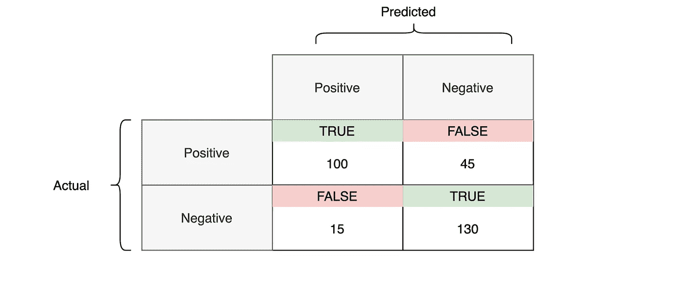
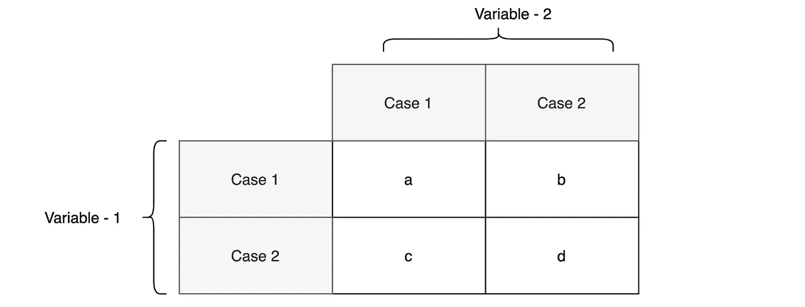
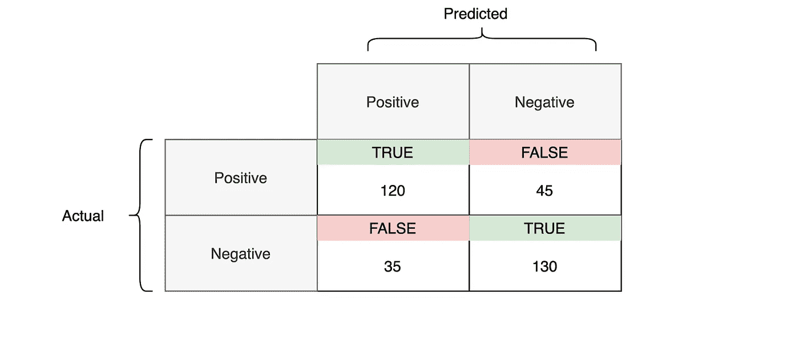

# 你曾经这样评价过你的模型吗？

> 原文：<https://towardsdatascience.com/have-you-ever-evaluated-your-model-in-this-way-a6a599a2f89c?source=collection_archive---------8----------------------->

## 用麦克内马检验评价分类模型

费尔南多·席尔瓦在 [Unsplash](https://unsplash.com/s/photos/i-know?utm_source=unsplash&utm_medium=referral&utm_content=creditCopyText) 上的照片

模型评估是模型开发过程的辅助部分。这是决定模型是否表现更好的阶段。因此，根据每种可能的评估方法考虑模型结果至关重要。运用不同的方法可以提供不同的视角。

有不同的度量标准(或方法),如准确度、召回率、精确度、F1 分数。这些是分类中用于模型评估的最常用和已知的度量。他们每个人都以不同的方式评估这个模型。例如，准确性提供了对模型如何正确预测的洞察，而回忆提供了对模型如何对正类敏感的洞察。在这篇文章中，我将解释另一种叫做麦克纳玛测试的方法。这种方法也可以提供另一个角度来评估你的模型。

# 分类模型的模型评估

分类模型用于通过给定的输入变量预测某些类别。然而，它们的结果是由名义数据或离散数据组成的。因此，在评估模型结果时，混淆矩阵是最优选的。它确保根据单元格值正确比较实际类别和预测类别。下图中有一个 2x2 混淆矩阵的例子。这是一个混淆矩阵，显示了预测类和实际类。

混淆矩阵示例(由作者创建)

正如你从上表中看到的，有两种类型，积极和消极。它们也可以表示为 0 和 1，或者 A 和 b，这没有任何区别。标记为 True 的单元格表示已被正确预测的类的数量。标记为假的单元格正好相反。评价你的模型，不如对这个困惑矩阵问几个问题，了解你的实际期望。每个问题都可以用不同的评估标准来回答。让我们来看看这些问题，

1-预测所有类别时模型的准确性如何？
2 —模型在预测阳性类别时有多敏感？
3 —模型在预测阳性类别时有多精确？
4 —预测负面类别时，模型的敏感度如何？

第一个问题可以用最常用的“准确性”来回答。第二个可以通过使用一个叫做“召回”的指标来找到。第三个问题可以用“精确”来回答，第四个问题可以用“特异性”来回答。还有其他相关的问题和指标，但我想重点谈谈要求 McNemar 使用的问题。

# 使用 McNemar 进行模型评估

评估分类模型时的一个错误是只考虑真实案例。这意味着只寻找模型如何正确地估计实际情况。因此，当结果不令人满意时，人们试图应用不同的方法或不同的变化来获得令他们满意的结果，而不考虑导致该结果的主要原因。不要忘记，准确性也取决于假预测，就像它取决于真预测一样。因此，在作出某种判断之前，也必须考虑错误的预测。这些是我们希望尽可能少的预测。通过考虑错误案例，称为召回和精确度的度量稍微解释了肯定类别(或否定类别)的性能。但是，我想说的是，假阳性和假阴性应该进行比较，就像它们在真实情况下进行比较一样。这就是应该使用麦克内马检验来获得假阴性和假阳性之间的差异概率的地方。

与其他指标一样，有一个问题麦克纳玛测试也可以回答。这个问题是 ***“你的模型对于错误(错误)预测的表现如何？*** 。如果统计上有差异**，你可能会想把注意力放在造成更大差异的那个阶层上。您可以重新检查您的训练过程或数据集，以减少或平衡错误预测的数量。**

> **注意:在相同的情况下，当模型使用不平衡的类进行训练时，会出现不平衡的假阴性和阳性预测。**

## **麦克内马试验**

**McNemar 检验适用于 2x2 列联表，以确定成对样本的行和列边际频率是否相等[1]。对于混淆矩阵来说，行和列的边际频率意味着正类和负类的错误预测数。它使用卡方分布来确定差异的概率。让我们来看看下面的表格，并试着理解它们是如何产生差异的。**

****

**列联表(由作者创建)**

**在上表中,“b”和“c”单元格代表边际频率。麦克内马检验的零假设为( *p* 为比例)`*p*a + *p*b = *p*a + *p*c`和`*p*c + *p*d = *p*b + *p*b`。如果我们在这里做数学计算，我们可以从两个方程得到`*p*b = *p*c`。所以，零假设是 b 细胞的比例等于 c 细胞的比例，另一个假设是 b 细胞的比例不等于 c 细胞的比例。下面的公式给出了麦克内马统计量。**

****

**麦克内马的统计数据(由作者创建)**

## **麦克内马检验在混淆矩阵中的应用**

**在二进制分类模型上预测之后获得的混淆矩阵也是 2×2 表格的形式。因此，边际频率之间的差异可以通过使用麦克纳默测试来获得。让我们看看下面的混淆矩阵，并尝试找出错误预测之间是否有区别。**

****

**应用麦克内马检验的混淆矩阵(由作者创建)**

**从上表可以看出，假阴性和假阳性之间的差异是 10(45–35)。不要忘记，这个结果来自您用来开发模型的样本测试集或训练集。当模型进入生产阶段时，它可能会得到更多不同的输入值。因此，我们需要找出这种差异在统计上是否显著。如果差异在统计上是显著的，则预计在生产中会得到相同的差异。这就是为什么需要一个概率值的原因。**

**我将使用 Python 来应用 McNemar 的测试。计算起来真的很简单，从前面的公式可以看出。此外，我们需要通过使用麦克纳玛统计量从卡方检验中获得 p 值。可以通过使用来自“scipy.stats”模块的两种方法`chi2.cdf`或`distributions.chi2.sf`来找到它。为了使用这些方法，我们还需要自由度的值。它是由行和列(2–1)*(2–1)的减一的乘积得到的。对于 McNemar 检验，零假设是边际频率之间没有差异，另一个假设是边际频率之间有显著差异。因此，如果 p 值大于 0.05，可以得出结论，假阴性和假阳性之间没有显著差异。并且，如果 p 值小于或等于 0.05，则意味着存在显著差异。**

**发现 p 值为 0.26。因为 p 值大于 0.05，所以不能拒绝零假设。这意味着在 95%的置信水平上，假阳性和假阴性的频率没有显著差异。那 0.26 和成为差异的概率呢。1–0.26 给出差异的概率。因此，在概率为 0.74 的情况下，我们可以说，假阴性和假阳性之间可能存在差异。**

# **结论**

**本文测试了错误案例之间的差异。真阳性和真阴性之间的差异也可以通过使用麦克内马检验来检验。这也可以提供一个不同的视角来评估你的模型。在应用麦克内马检验之前，最重要的事情是确定两个类别的数量大致相同。否则，可能会导致不可靠的结果。McNemar 的测试只适用于 2x2 表。当存在多类模型时，可以在混淆矩阵可以划分为子 2x2 表之后使用 McNemar。**

# **参考**

**[1][https://en.wikipedia.org/wiki/McNemar%27s_test](https://en.wikipedia.org/wiki/McNemar%27s_test)，麦克纳玛的测试，维基百科**