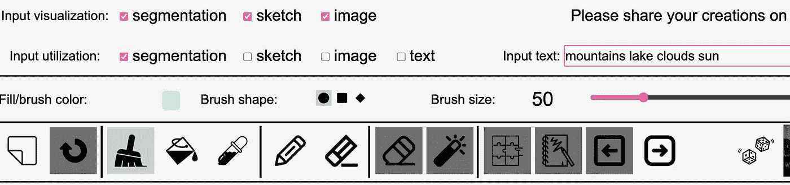
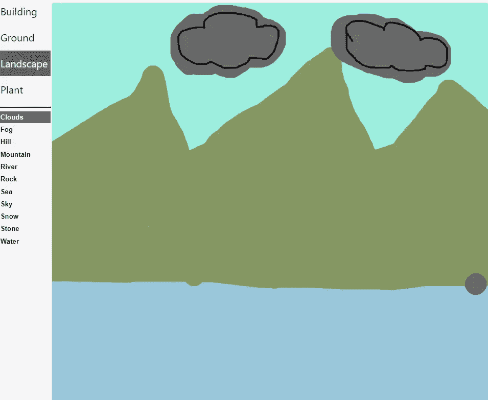
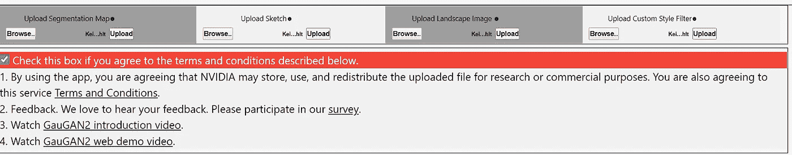
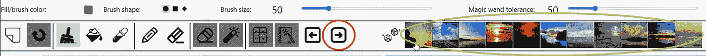
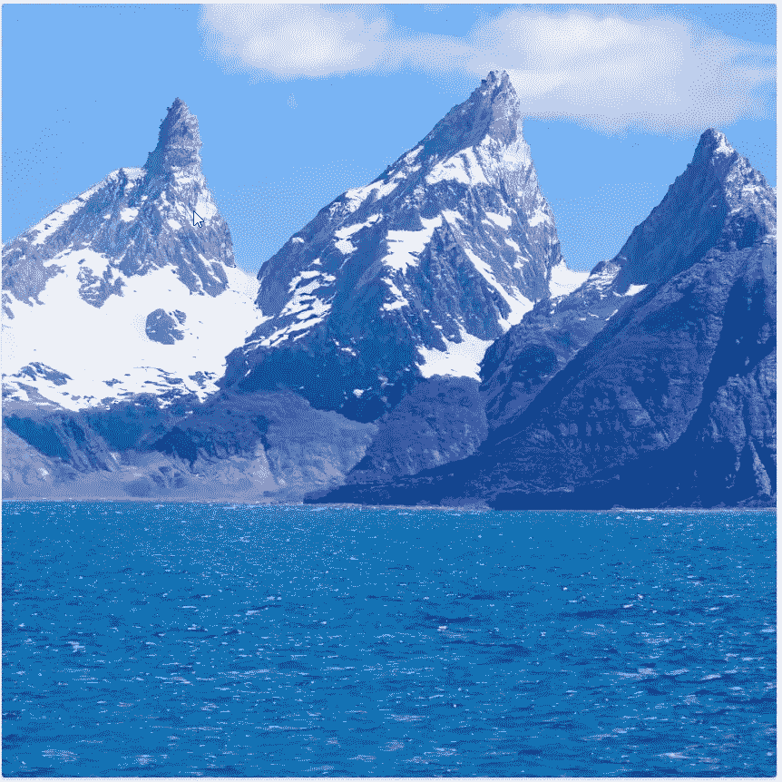
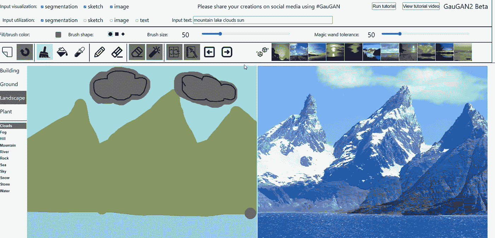
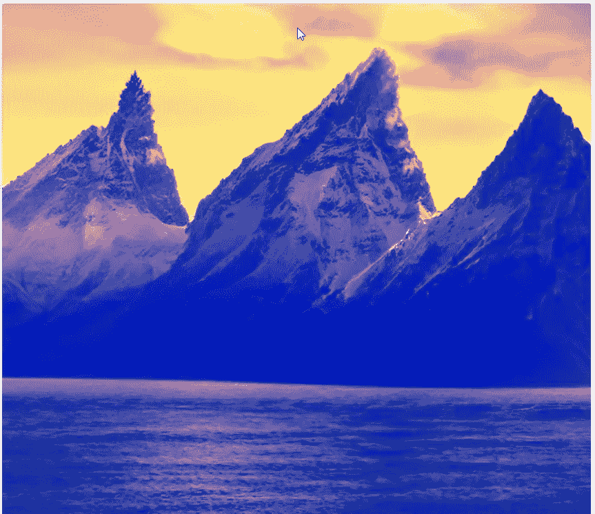
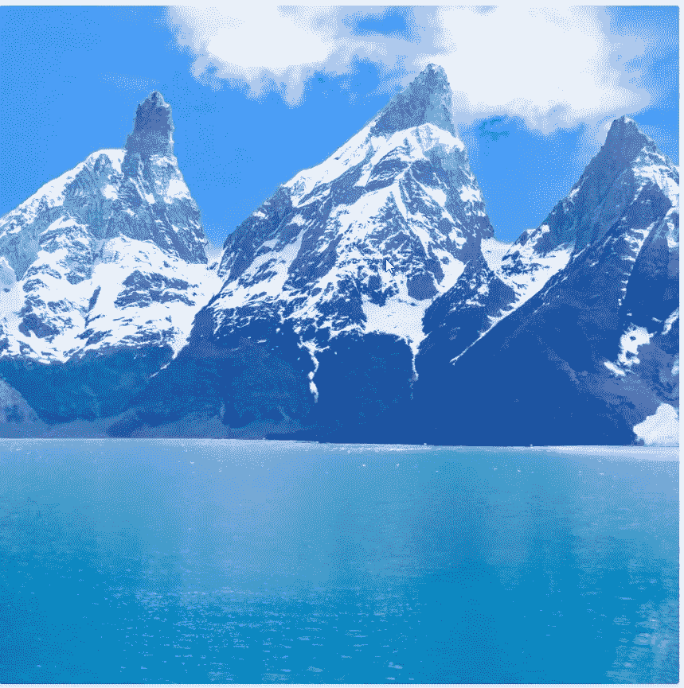
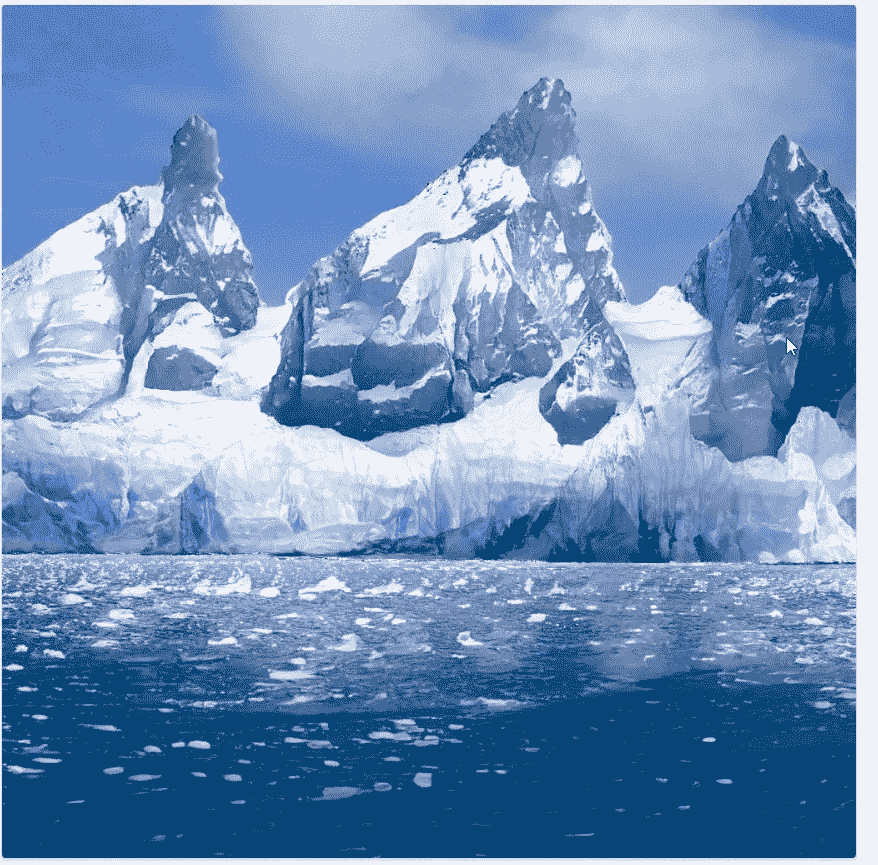

# 你听说过英伟达的 AI GauGAN2 吗？

> 原文：<https://towardsdatascience.com/have-you-ever-heard-of-nvidias-ai-gaugan2-e08a12c8c6b9?source=collection_archive---------23----------------------->

## 将图画和文字转换成照片/照片级图像的人工智能

英伟达凭借 GauGAN2 AI 再次展示了为什么他们是人工智能和数据科学领域的顶级公司之一。他们的深度学习模型 GauGAN 将单词和类似油漆的图画渲染成照片级的图像[2]。一个现在仍处于起步阶段的应用程序，但可能会在未来对不同的领域产生巨大的影响，例如设计师。

## GauGAN2 是关于什么的？

老实说，surface 让我想起了 windows 98，而不是 2021 年的 AI，但它仍然是一个演示，所以前端现在不是重点。在右上方，可以输入描述图像上场景的文字。在我的例子中，我输入了“山湖云太阳”。在输入字段旁边，您可以选择输入可视化的类型-分段、草图或图像。下面你可以选择画笔大小颜色，铅笔，橡皮，和其他类似绘画的工具。

GauGAN2 的选项和设置。来源:自己截图

## GauGAN2 不能正常工作？

您可以通过选择想要绘制的元素来开始绘制。在左侧，您可以找到一个下拉菜单，从中您可以选择您的图像应该包含什么。首先，我选择了云，这将自动导致你的铅笔的灰色。然后就可以开始画云彩了。重要的是，你不只是概述元素。你还需要用颜色填充它们。这可以通过手动填充或选择填充工具来完成。如果你不填充你的元素，人工智能创建的图像看起来会有点奇怪，人工智能不知道该做什么。因此，目前，填充所有元素很重要。完成湖光山色后，可以继续下一步。(由于下拉列表中没有太阳元素，因此不能直接描绘太阳本身。)

我的绘画和 GauGAN2 的输入。来源:自己的图像。

完成书写和绘图后，您需要向下滚动到演示工具的底部，选中“如果您同意下面描述的条款和条件，请选中此框”。

启动 GauGAN 所需的复选框。来源:自己的图像。

下一步也是最后一步是单击红色轮廓箭头。在右侧，您可以看到某些类别的图像。如果你选择其中之一，创建的图像将基于所显示图像的情绪/灯光。如果你不能决定，你也可以选择骰子随机选择一个。

开始 Gaugan 和不同的心情。来源:自己的图像。

## 你准备好结果了吗？

Tada，这就是我们由 AI GauGAN2 创建的图像。是的，这些山都不存在。它们是由人工智能自由创造的，我认为这非常令人印象深刻。尽管元素和选项的数量仍然受到限制，GauGAN2 和 Nvidia 表明，未来还会有更多的东西出现，这只是人工智能真实感创作的开始。

这是 GauGAN2 的图像。来源:自己的图像。

我的画和结果的比较。来源:自己的图像。

在这里，您可以看到相同绘图和输入的一些不同情绪:

高更的不同心情 2。来源:自己的图像。

不同的灯光，亮蓝色。来源:自己的图像。

冰和冰川，GauGAN2 创造。来源:自己的图像。

## AI GauGAN2 背后是什么模型？

正如我之前提到的，GauGAN2 是基于生成性对抗网络的。当然，GAN 模型已经存在一段时间了，但是这个模型的新之处在于它将文本、语义分段、草图和样式结合到一个 GAN 中。“GauGAN2 背后的人工智能模型使用英伟达塞勒涅超级计算机在 1000 万张高质量的风景图像上进行训练，该超级计算机是英伟达 DGX 超级计算机系统，是世界上 10 大最强大的超级计算机之一。研究人员使用一个神经网络来学习单词和它们对应的视觉效果之间的联系，如“冬天”、“有雾”或“彩虹”。" [1]

## 结论

凭借 GauGAN2，Nvidia 将其 2019 年发布的 GauGAN 推向了一个新的高度[2]。该系统现在更加准确，产生的逼真图像往往无法与真实照片区分开来。我尝试了许多不同的设置，只有在某些情况下，当输入绘制得不好时，人工智能很难创建一个好的图像。我敢肯定，这仅仅是人工智能创造的真实感图像的开始。在未来，这样的系统将帮助不同领域的设计师。看到几年后可能发生的事情令人兴奋。

你怎么想呢?你试过人工智能了吗？如果没有，我推荐去做。绝对令人着迷。[我们走吧](http://gaugan.org/gaugan2/)

http://gaugan.org/gaugan2/

 [## 通过我的推荐链接加入 Medium-Hucker Marius

### 作为一个媒体会员，你的会员费的一部分会给你阅读的作家，你可以完全接触到每一个故事…

medium.com](https://medium.com/@hucker.marius/membership) 

*来源*

[1]萨利安·伊莎(2021)。'给我画一幅画':英伟达研究显示 GauGAN 人工智能艺术演示现在可以对文字做出反应。[https://blogs . NVIDIA . com/blog/2021/11/22/gaugan 2-ai-art-demo/](https://blogs.nvidia.com/blog/2021/11/22/gaugan2-ai-art-demo/)

[2] Prathmaseh Ingle (2021)。NVIDIA 推出 GauGAN2:一种将文本转换为图像的人工智能模型。[https://www . marktechpost . com/2021/11/25/NVIDIA-introduces-gaugan 2-an-ai-model-that-converting-text-into-images/](https://www.marktechpost.com/2021/11/25/nvidia-introduces-gaugan2-an-ai-model-that-converts-text-into-images/)