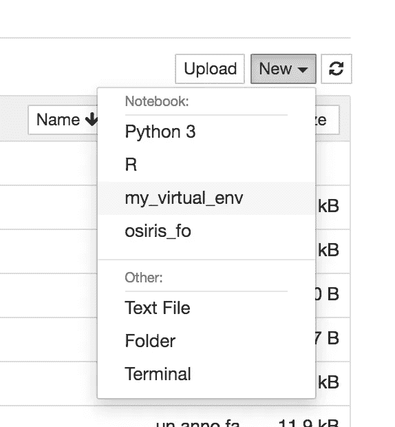

# 有没有想过用 Python virtualenv？

> 原文：<https://towardsdatascience.com/have-you-ever-thought-about-using-python-virtualenv-fc419d8b0785?source=collection_archive---------18----------------------->

## 环境设置

## 在终端和 Jupyter 笔记本上安装和使用 Python virtualenv 的实用指南。


图片来自 [Pixabay](https://pixabay.com/?utm_source=link-attribution&utm_medium=referral&utm_campaign=image&utm_content=995187) 的 [klimkin](https://pixabay.com/users/klimkin-1298145/?utm_source=link-attribution&utm_medium=referral&utm_campaign=image&utm_content=995187)

通常，一个初学者开始在主 Python 环境中安装所有需要的库。随着项目数量的增长，安装的库也在增长。在不同的项目中，可能会发生库冲突。

例如，可能会发生*两个不同的项目需要同一个库的两个不同版本*，所以在单个 Python 环境中，不能安装同一个库的两个版本。

**如何解决这个问题？Virtualenv 可能会有所帮助。**

Python virtualenv 是一个独立的 Python 环境，您可以在其中仅安装项目所需的包。

# 安装和运行虚拟环境

首先，你需要安装`virtualenv`包。例如，这可以通过以下命令在`pip`中完成:

```
pip install virtualenv
```

然后，**您可以创建一个目录，在那里您将存储所有的虚拟环境**。一旦创建了目录，您就可以访问它，并且只需运行以下命令就可以创建虚拟 env

```
virtualenv my_virtual_env
```

其中`my_virtual_env`可以是你想要的任何名字。通常，新的虚拟 env 是干净的，因为它不包含任何全局库。

您可以通过终端激活您的虚拟环境，只需进入虚拟环境目录并运行`source`命令:

```
cd my_virtual_env
source bin/activate
```

现在你的虚拟环境是活跃的。您可以在终端行的左侧看到虚拟环境名称，如下所示:

```
(my_virtual_env) my_pc:
```

一个非常有用的功能是列出虚拟环境的所有库:

```
pip list --local
```

所有已安装库的列表也允许快速**写下项目**所需的库。

要退出(停用)虚拟 env，只需运行以下命令:

```
deactivate
```

# 从 Jupyter 笔记本运行虚拟环境

虚拟 env 也可以在 Jupyter 中使用。首先，您需要在您的虚拟环境中安装`ipykernel`。因此，您激活您的虚拟 env，然后从您的虚拟 env 运行以下命令:

```
pip install ipykernel
```

现在您可以告诉 Jupyter 在哪里可以找到虚拟 env。通过指定要连接到 Jupyter 的虚拟 env 的名称，运行以下命令:

```
python -m ipykernel install --name=my_virtual_env 
```

您可以运行 Jupyter 服务器，当您选择 New 时，您会看到虚拟 env 的名称出现，如下图所示:



作者图片

如果你想从 Jupyter 单元安装一些库，你不能利用传统的方法`!pip install <library_name>`，因为这将运行全局软件包管理器。相反，您可以运行以下命令:

```
import sys
!{sys.executable} -m pip install <library_name>
```

无论如何，如果前面的代码看起来太复杂，您总是可以从命令行安装库。

# 移除虚拟环境

如果只想从 Jupyter 中删除虚拟 env，可以从终端运行以下命令:

```
jupyter kernelspec uninstall my_virtual_env
```

如果您想从全局系统中删除虚拟环境，首先您必须停用虚拟环境，然后您可以删除包含虚拟环境的文件夹。

或者，您可以通过以下命令删除所有已安装的包，并保持虚拟 env 活动

```
virtualenv --clear path_to_my_venv
```

# 摘要

在本教程中，我解释了如何安装和运行 Python 虚拟 env。显然，您可以创建任意多的虚拟 env。

我希望这篇文章能帮助你建立一个更有组织的编码策略:)

# 相关文章

[](/how-to-install-python-and-jupyter-notebook-onto-an-android-device-900009df743f) [## 如何在 Android 设备上安装 Python 和 Jupyter Notebook

towardsdatascience.com](/how-to-install-python-and-jupyter-notebook-onto-an-android-device-900009df743f) [](https://medium.com/analytics-vidhya/basic-statistics-with-python-pandas-ec7837438a62) [## python 熊猫的基本统计数据

### 入门指南

medium.com](https://medium.com/analytics-vidhya/basic-statistics-with-python-pandas-ec7837438a62) [](https://alod83.medium.com/how-to-design-a-data-journalism-story-b2e421673b6e) [## 如何设计一个数据新闻故事

### 如何设计一个数据新闻故事

如何设计一个数据新闻 Storyalod83.medium.com](https://alod83.medium.com/how-to-design-a-data-journalism-story-b2e421673b6e) 

# 参考

[](https://medium.com/@shivangisareen/for-anyone-using-jupyter-notebook-installing-packages-18a9468d0c1c) [## 对于任何使用 Jupyter 笔记本的人-安装软件包

### 全局和本地安装软件包

medium.com](https://medium.com/@shivangisareen/for-anyone-using-jupyter-notebook-installing-packages-18a9468d0c1c) [](https://stackoverflow.com/questions/42449814/running-jupyter-notebook-in-a-virtualenv-installed-sklearn-module-not-available) [## 在虚拟环境中运行 Jupyter 笔记本电脑 v:安装的 sklearn 模块不可用

### 我已经安装了一个创建了 virtualenv machinelearn 并且安装了几个 python 模块(pandas，scipy 和 sklearn)在…

stackoverflow.com](https://stackoverflow.com/questions/42449814/running-jupyter-notebook-in-a-virtualenv-installed-sklearn-module-not-available) [](https://janakiev.com/blog/jupyter-virtual-envs/) [## 在 Jupyter Notebook 和 Python 中使用虚拟环境

### 你在用 Jupyter Notebook 和 Python 吗？您是否也想从虚拟环境中获益？在这个…

janakiev.com](https://janakiev.com/blog/jupyter-virtual-envs/)