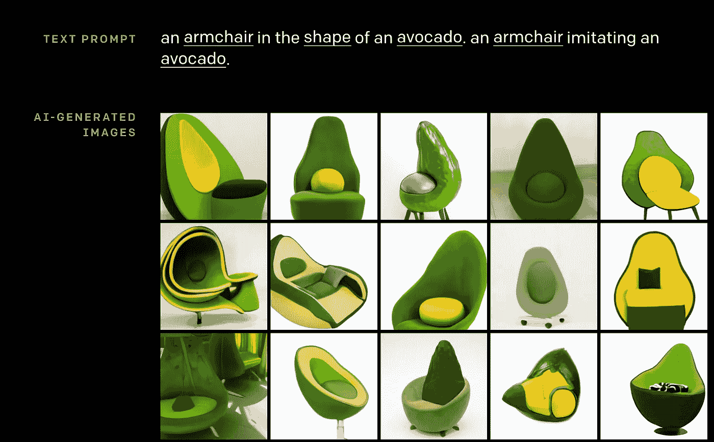
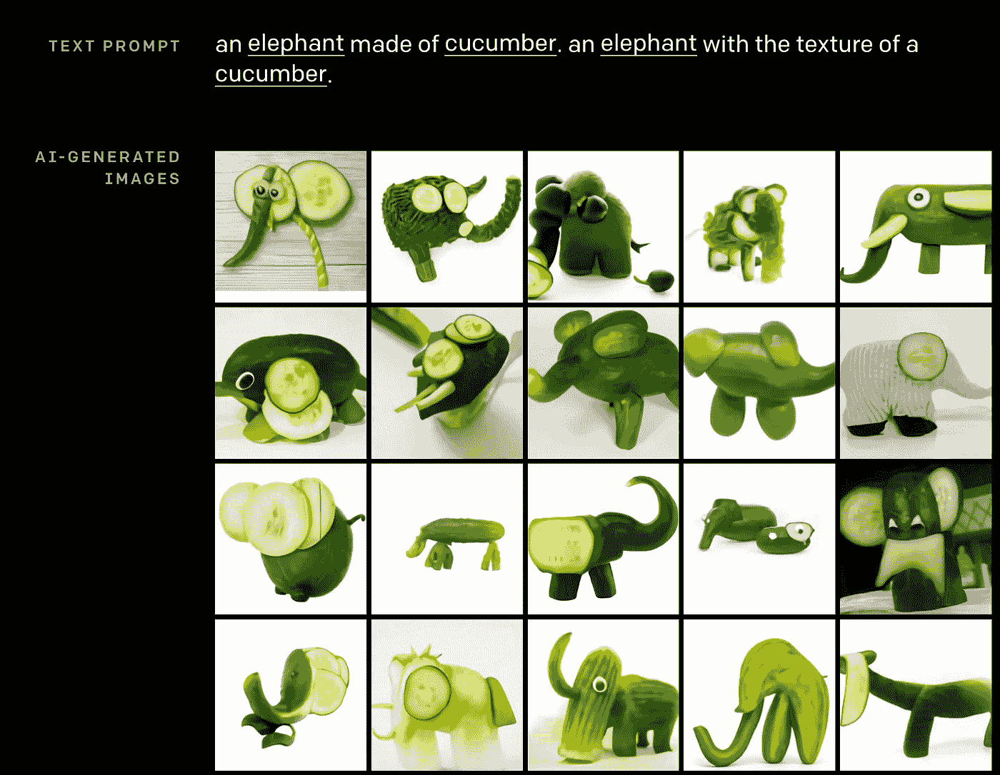
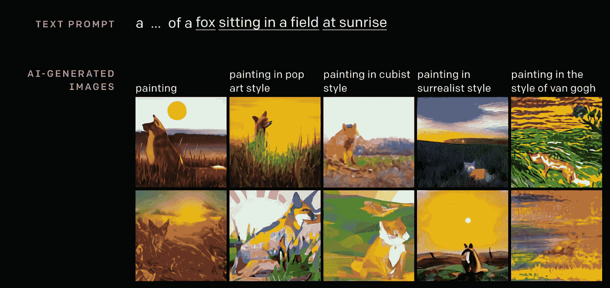
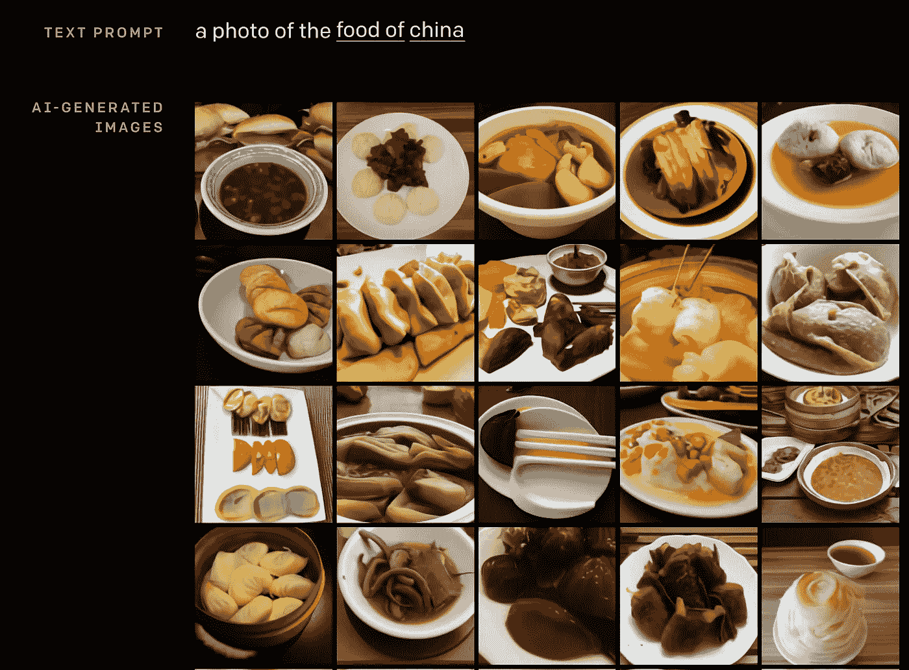
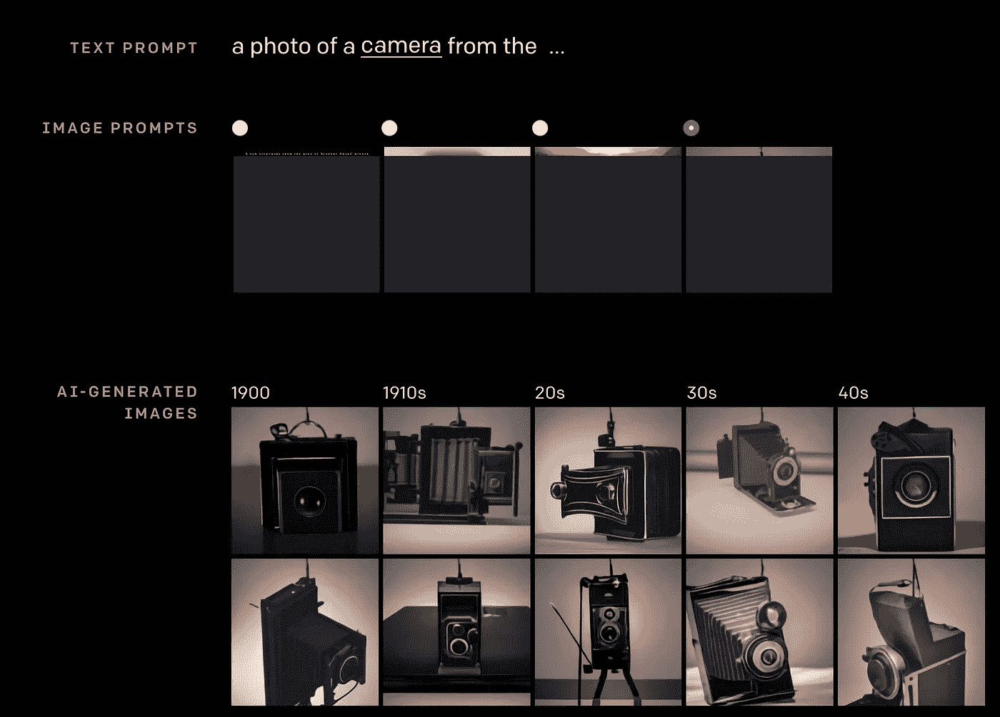

# 你见过这款 AI 牛油果椅吗？

> 原文：<https://towardsdatascience.com/have-you-seen-this-ai-avocado-chair-b8ee36b8aea?source=collection_archive---------12----------------------->

## DALL-E 可以从文本中生成几乎任何东西的图像

由 DALL-E 生成的鳄梨扶手椅。OpenAI 提供的图像[1]

# Dall-E 是什么？

DALL-E 从文本中创造图像。它是一个 transformer 语言模型，是 OpenAI 在 2020 年 1 月 5 日发布的成果。

DALL-E 结合了 GPT-3 执行文本生成任务的能力和图像 GPT 生成图像的能力，代表了这两个非常成功的神经网络进展的汇合。

# Dall-E 能做什么？

有趣的部分来了。

Dall-E 创造真实可信图像的能力是超现实的。Dall-E 理解语言并使用提示作为生成图像的指令。

## Dall-E 可以组合概念并生成新颖的图像

令人惊讶的是，它能够组合多个概念并修改一个对象的属性。现在，想象一把鳄梨形状的扶手椅。

正如人类可以将扶手椅和鳄梨的概念结合起来，并将这些概念串联成一个图像，DALL-E 也可以，尽管 DALL-E 可能从未见过八角形的紫色井盖。

鳄梨形状的扶手椅。图片由 OpenAI [1]提供

DALL-E 生成的黄瓜制成的大象。OpenAI 提供的图像[1]

## Dall-E 会画画

在模仿某些艺术家的风格方面，我们已经看到了像生成对抗网络(GAN)这样的深度神经网络的先前进展。DALL-E 更进一步，将文本命令转化为图像。

DALL-E 也懂艺术。图片由 OpenAI [1]提供

## Dall-E 可以说明

Dall-E 还能够生成拟人化的插图，甚至表情符号。

我们都需要这个表情符号。图片由 OpenAI [1]提供

达尔了解地理和历史

最有趣的是，Dall-E 似乎穿越了时空，了解了世界的地理和历史事实。

DALL-E 在太空中旅行得很好…图片由 OpenAI [1]提供

…还有时间。图片由 OpenAI [1]提供

# Dall-E 不能做什么？

现在，Dall-E 可能看起来很迷人，但它绝不是完美的。下面是 Dall-E 失败的三个具体例子。

## Dall-E 可能会在一些文本上失败。

Dall-E 可能在某些短语上工作得很好，但在语义等价的文本上可能会失败。这就是为什么 Dall-E 的作者有时需要在提示中重复自己，以提高图像生成任务的成功率。

## Dall-E 可能在不熟悉的物体上失败

Dall-E 有时无法渲染现实生活中不太可能出现的对象。例如，它不能呈现五边形停车标志的照片，而是显示传统的八角形停车标志的结果。

一个困惑的 Dall-E 不知道五边形停止标志看起来像什么。图片由 OpenAI [1]提供

## Dall-E 可能会走捷径

当提示合并对象时，Dall-E 可能会选择分别绘制图像。例如，当提示画一只由水龙头组成猫的图像时，它会将水龙头和猫并排画出来。

猫+水龙头=？图片由 OpenAI [1]提供

# 下一步是什么？

OpenAI 先前将 GPT 3 技术授权给微软。类似地，OpenAI 可能会将 DALL-E 授权给拥有资源来有效部署和管理 DALL-E 的科技巨头。

Dall-E 非常强大，可以想象它有着巨大的社会影响。如果生成性对抗网络(GANs)可以用来生成深度假货，那么想象一下 DALL-E 在生成假货图像和扩散假货新闻方面可能产生的负面反响。

我们需要一种方法来规范 DALL-E 在假新闻和照片的时代。由[马库斯·温克勒](https://unsplash.com/@markuswinkler?utm_source=medium&utm_medium=referral)在 [Unsplash](https://unsplash.com?utm_source=medium&utm_medium=referral) 上拍摄

Dall-E 需要解决的一些伦理问题既棘手又模棱两可。在我们期望这种人工智能技术在我们的日常生活中广泛采用之前，这些问题需要得到解决。这些复杂的问题包括

1.  模型输出中的潜在偏差(*如果 DALL-E 没有充分代表少数群体怎么办？*)
2.  模型安全和事故(*即，我们如何防止人工智能意外地做某事*
3.  人工智能校准(*即让模型做你想让它做的事情*)
4.  对某些职业的经济影响(*想想那些插画师，他们的工作可能会被这种技术取代。*)

除此之外，深度学习和机器学习领域现在是一个非常令人兴奋的地方。在他们的[页面](https://openai.com/)查看更多关于 OpenAI 的信息。

如果你喜欢这个帖子，你可以看看我的其他帖子，或者在 LinkedIn 上与我联系。

[https://www.linkedin.com/in/travistang/](https://www.linked.com/in/travistang/)

 [## Travis Tang -数据分析师

www.linkedin.com](https://www.linkedin.com/in/travistang/) 

# 引文

所有图片来自以下博客帖子。

[1]拉梅什、巴甫洛夫、戈和格雷。(2021 01 06)。DALL E:从文本中创建图像。检索于 2021 年 1 月 7 日，来自[https://openai.com/blog/dall-e/](https://openai.com/blog/dall-e/)