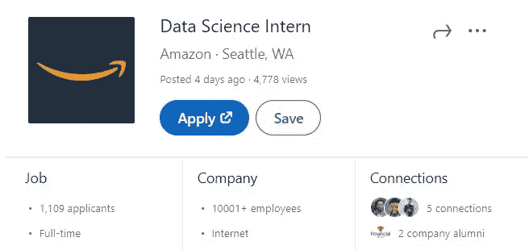

# 拥有学位已经不足以在数据科学领域找到工作了

> 原文：<https://towardsdatascience.com/having-a-degree-isnt-good-enough-to-get-a-job-in-data-science-anymore-a5705239174b?source=collection_archive---------8----------------------->

## 一个学位不会让你领先于其他 100 名申请者。你必须做得更多。

庞的照片

如果我们回到 5-10 年前，这种说法是错误的。当时，数据科学领域刚刚起步，几乎没有培养有抱负的数据科学家的项目。

如果你有幸获得这些有限项目的学位，那么世界就是你的了。低竞争加上数据驱动的决策激增的等式在很大程度上相当于一份工作。

**你认为现在还是这样吗？**

几天前，亚马逊在 LinkedIn 上发布了一个数据科学实习生的职位，看看在短短 4 天内有多少人申请。

图片来自 LinkedIn

## **如果你认为仅仅拥有一个学位就能让你超越 1100 名其他申请者，那你就大错特错了！**

# 学位到底能说明什么

我确信我们都听说过这样一句话，学位只是一张纸。现在你们中的许多人可能认为这是真的，许多人可能认为远不止如此。

我认为没有人会不同意的一个方面是，它显示了承诺。

那张纸表明你投入了 4 年的时间来学习获得那个学位。那 4 年也不是在公园散步，我的经历是含咖啡因的不眠之夜和每周 2-3 次放弃的想法。

那是地狱，但我们成功了。

这就是学位的问题。对雇主来说，你的学位表明你上过学，你学到的足够通过你的课程。

我说够了，因为我们都知道即使是 C 也能拿到学位。

那个学位没有显示的是**申请**。

你坐在教室里学习材料，但是如果你没有把它应用到任何地方，雇主怎么知道你是否真的了解你的材料。这就是为什么许多人很难在数据科学领域找到工作，因为他们除了学位什么也没有。

## 任何人都可以在数据科学领域找到工作

不要因为你有数据科学、计算机科学或统计学学位，就认为你是少数几个有资格做这些工作的人之一。

事实是许多著名的数据科学家**并没有**技术学位。事实上，许多人拥有与数据科学和/或计算机科学毫不相关的其他领域的学位。

*   Hadoop 框架的开发者 Doug Cutting 拥有**语言学**学位。
*   奥莱利媒体是最著名的编程和数据资源出版商之一，其所有者蒂姆·奥莱利拥有经典文学学位。

这些学位与他们在技术领域的资格相去甚远。

你需要摆脱这样的想法:你属于某个小众群体，是唯一有资格获得这些工作的人。

# 没有学位，你如何找到工作

说真的你会怎么做？

如果你很难在数据科学领域找到工作，请认真考虑这个问题。如果没有那张纸，你将如何向雇主表明你满足了他们的所有要求？

这不是不可能的，以前那些没有学位但仍能找到工作的人就这么做过。

那么他们是怎么做到的呢？

他们推销自己。

那些没有学位的人不能只拿着那张纸说

> 嘿，这证明了我有能力完成这份工作

不，他们需要做的是充分推销自己，让雇主相信他们拥有工作所需的适当技能。

如果你能很好地推销自己，你将在竞争激烈的市场中拥有更高的知名度和曝光率，并在竞争中占据优势。

# 推销自己的 4 种方式

市场营销随处可见，最有效的市场营销活动能为公司带来数亿美元的收入。每个人都可以通过营销被愚弄和影响。

正确地推销你自己，你会减少你收到的拒绝邮件的数量。

这里有 4 种方法可以帮助你推销自己。

## 1)创建一个投资组合

向雇主展示你具备必要技能的最佳方式是通过申请。这意味着将你学到的东西应用到你自己的个人项目中。

几个小型或中型的数据科学项目是一个好的投资组合。创建一些项目，向雇主展示你拥有他们所需要的知识和技能

如果你申请的数据科学职位有“*了解机器学习”*作为一项资格，向公司推销自己，做基于机器学习方法的项目，如回归、分类、聚类等。

投资组合可以有效地替代某人缺乏的工作经验，或者某人没有的学位。

## 2)加入基于数据科学的网络圈子

*认识合适的人比任何简历都更有力量。*

这么想吧。

如果我推销自己是一名专业的**空气吉他演奏者，**你可能不会相信我。但是如果其他领域的专业人士出来给我一个好的参考呢？现在我的名字更可信了。

关键是，试着建立一个强大的网络基础，在那里其他人可能会伸出援手帮助你。

您可以通过执行以下任一操作来实现这一点:

*   加入基于数据科学的小组。你可以在 LinkedIn 或脸书上找到这些团体。参与其中，展示你的专业知识，这可能会导致推荐，让你接触到招聘经理。
*   找一个你将来想做的导师。一位导师会在你的道路上帮助你，提供并指导你如何获得他们的职位。
*   通过参加围绕你想进入的领域的讲座、活动和谈话，建立一个由志同道合的人组成的专业网络。

## 3)参加比赛、峰会、参加招聘会

想象一下这些事件，就像一个推销员走到你的门前，试图向你推销下一个很棒的房屋清洁产品。

在他们说任何话之前，你都想当着他们的面把门关上，但是如果他们向你展示了这个设备到底是做什么的，并且你喜欢你所看到的，那该怎么办呢？你开始感兴趣，你知道他们刚刚做了一笔交易。

成为一名推销员，从事一切可能的职业活动。你永远不知道谁会参加这些活动，并且对你的产品也就是你的技能感兴趣。

以下是您应该参加的一些事件和活动:

*   招聘会让你很快接触到很多公司。四处走走，与招聘人员交流，把每次谈话都当成一次小型面试。我见过很多同事通过这种方式找到工作。
*   每年都有数以百计的黑客马拉松来展示未来的程序员、数据科学家和软件工程师的技能。参加这些活动，通过向赞助这些活动的科技公司展示你的技能和能力，你将获得更多的曝光率。
*   参加 Quora 或 Reddit 上的数据科学论坛。通过回答问题和熟悉社区来展示您的专业知识。

## 4)在媒体上写博客

我在这里可能有点偏见，因为这对我来说很好，但相信我，我在任何方面都不特别，所以这也可以为你工作。

在媒体上写博客的好处是任何人都可以偶然发现你的文章，你也可以把链接发给任何人。

这就是我今天所做的贡献，它让我得到了一份工作，作为一名体育分析师为加拿大奥运队工作。

在我得到那份工作之前，我没有经验。我知道我的简历有所欠缺，所以我想创造一些可以向雇主展示的东西。我决定做一些关于体育分析的项目，并在媒体上写下它们。

> 如果你回顾我最早的文章，你可以看到这些项目

当我写完这些文章后，我会把链接发给体育行业的一些雇主，你知道吗，我可以和加拿大队的人通电话…

**正如他们所说，剩下的就是历史了。**

Medium 是一个展示你技能的绝佳平台，你可以在这里建立一个投资组合。试试吧，因为你永远不知道谁会读你的文章。

# 感谢阅读！

我希望这能为您的数据科学事业提供一些指导和帮助。找工作并不容易，但如果你能在校外做一些能让你脱颖而出的事情，事情会变得容易一些。

[**与 1k+人一起加入我的电子邮件列表，免费获得完整的 Python for Data Science 备忘单小册子。**](http://pages.christopherzita.com/pythoncheatsheets)