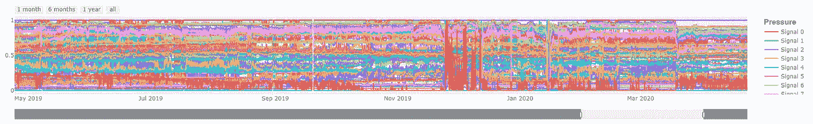

# 有数百个时间序列要探索，却不知道从哪里开始？

> 原文：<https://towardsdatascience.com/having-hundreds-of-time-series-to-explore-and-not-knowing-where-to-start-5e7873fd2028?source=collection_archive---------48----------------------->

## 在本文中，我将为致力于大规模时间序列探索的框架奠定基础。

安特·罗泽茨基在 [Unsplash](https://unsplash.com?utm_source=medium&utm_medium=referral) 上的照片

在本文中，我将继续探索多元工业时间序列。如果您需要重温一下在处理这些问题时可能会遇到的一些特殊挑战，您可以看看我以前的一篇关于这些挑战的文章:

</all-multivariate-time-series-are-not-born-equal-ba2d26e2528e>  

# 语境

假设你是一名流程工程师或数据科学家，在一家能源公司工作。您所使用的一些工业资产可能是压缩机、泵、燃气轮机、膨胀机……这些设备中的任何一个都可以收集数百个甚至数千个时间序列信号。

此外，这些都是重要的资产:任何计划外停机都可能造成数百万美元的损失(维护和维修工作、更换零件、罚款、收入损失……)。这种事件很少发生，如果你想改进你的预测性维护实践，你可能需要多年的数据来研究每一个分钟级(甚至是秒级)的信号采样。

有一天，我从一条电工钢生产线上以 10 毫秒的采样率收集了 5500 个时间序列。我有 3 年的历史数据，我知道在这个数据集中有数百个异常，但是当它们发生时，操作员没有办法轻松地捕捉它们，所以数据集到达我的桌子上(实际上，因为它是在硬盘中交付的……)**没有任何标签**。

不幸的是，这种情况在工业环境中是正常的:一个工厂的主要目标…是生产(洗发水瓶子，铝线圈，汽车，…你能想到的！)，而不是对生产过程中实时发生的任何异常进行精确的时间标记和分类…

在这篇文章中，我的目标是揭示如何探索类似的数据，假设你有一个云托管的笔记本电脑，有足够的马力来处理和可视化你的数据。我将把重点放在实现快速探索上，而不是创建一个内存高效的数据处理管道。

# 数据集概述

我正在玩的数据集是体育 4 亿个数据点，分布在 5 年的 100 个信号之间，最初以 1 分钟的速率采样。我收到的原始文件是一个 20 GB 的 CSV 文件，包含以下三列:

*   时间戳
*   标签名称
*   价值

每个信号都与一个测量单位相关联(例如，以摄氏度为单位的温度、以毫米为单位的位移、以 RPM 为单位的转速……):这在以后会很方便…

为了在 Jupyter 笔记本上轻松处理这个数据集，我使用了一个 Amazon SageMaker 笔记本实例，它有 16 个 vCPU 和 64 GB 内存。

# 为我想要的“舒适”程度建立一个基线

为了感受我们面对的是什么，我进行了以下基本操作:

*   加载熊猫的 20 GB CSV 文件:**大约 3 分钟**
*   提取数据帧中的一个信号并执行一些基本的预处理(应用时间索引并向下采样到 1 小时):**大约 20 秒**

如果我想要可视化所有 100 个信号，这将需要相当长的时间，并且它的交互性不足以遵循数据科学家的思维过程:

> 用 Matplotlib 绘制 100 个图将花费 30 分钟到一个小时的时间，并且这些图本身不是交互式的:如果我想放大某一年、月、周或天，我将不得不为我感兴趣的每个时间范围经历这个过程。

当然，我可以遍历不同时间范围内的所有信号并导出数百个 PNG 文件…只能说这看起来不是很有效…即使我继续这样做，我也不能说我有信心我的探索会足够彻底…

# 我的框架

## 预处理

出于探索目的，通常没有必要停留在 1 分钟采样。如果您想要利用这些时间序列来改进您的预测性维护或异常预测实践，将采样时间降低到 1 小时可以为您提供足够精细的数据集。

*   ***第一步*** *:加载原始 CSV 文件后，我分离出每个信号，并确保以 1 小时的速率对它们进行重新采样。*
*   ***第二步:*** *我还会将它们在 0 和 1 之间归一化，以允许在同一图上绘制信号，同时共享同一 y 轴。*

## 储存；储备

从 Pandas 加载和写入 CSV 文件太慢:有几种方法和文件格式可以使用，都比这快一个数量级(HDF5，Dask dataframe，利用 numpy)。为了保持使用熊猫数据框的舒适性，我对 HDF5 和拼花地板非常满意。根据您的管道，这两种格式都是不错的选择。

*   ***第三步:*** *我将每个信号都存储在本地或 Parquet 中的 S3 桶中。提取，调整采样率和保存每个信号一劳永逸地在大约 30 分钟内完成。现在装载全部需要* ***不到 5 秒*** *。*

## 形象化

我现在将使用 [plotly](https://plotly.com/) 来启用 Jupyter 笔记本的交互功能。

*   ***第四步*** *:我首先创建一个带有几个导航控件的布局。*

默认情况下，我希望显示前 6 个月的数据，并希望快速选择不同大小的时间窗口来浏览我的数据(1 个月、6 个月或 1 年):

*   ***第 5 步*** *:然后我为我想要绘制的每个时间序列添加一个轨迹*

在我的例子中，这是一个 100 时间序列:是的，这将是繁忙的，但你会发现这实际上是重点！).我使用 Plotly 散点图的 WebGL 版本( [Scattergl](https://plotly.com/python/reference/scattergl/) )，因为当使用这个可视化包的交互功能时，它快了几个数量级:在 5 年内有 100 个信号，使用标准散点图会使笔记本无法使用…

我还根据每个时间序列的测量单位对图例进行了重新分组:在不知道传感器在设备上的位置的情况下，我可以很容易地过滤出具有潜在相似趋势和行为的信号。如果您可以访问您的设备的 P&ID(管道和仪表图),您将能够根据信号所连接的子部件对信号进行重新分组。为了在`plotly`的图例中轻松识别我的组，我只创建了一个虚拟的空信号:

在 **3 分钟**之后，我有了一个交互式图表，我可以查看任何我想要的比例(1 天或 5 年)，我可以过滤掉信号以关注其中的一些信号，或者只是查看一下以确定值得关注的时间段。这是一年的数据:

按照杰森·布拉克的风格，将我所有的信号同时以相同的比例可视化，可以让我快速了解全局:

*   我可以看到 2019 年 12 月发生了一些事情，2020 年 4 月发生了突然的变化，因为多个信号受到了明显的影响。
*   我还可以分离出一些表现与其他信号非常不同的信号:在上图中，红色信号属于这一类别，需要进行更详细的调查:是质量差的传感器给我们的研究增加了噪声吗？或者实际上是潜在行为的一个很好的预测者？
*   在几秒钟内，我可以选择 1 个月的时间范围，并使用滑块浏览 5 年的数据，以找出我想进一步研究的任何感兴趣的时期。

# 结论和未来工作

在本文中，我展示了一个简单的框架，该框架支持快速探索高度多元的时间序列信号。让我知道您自己探索大型时间序列数据集的最佳实践:我只是触及了表面，并将继续探索如何将它变成一个更健壮的框架，包括一些自动时间序列分析功能。敬请期待！