# 使用 Neo4j 进行 HDBSCAN 聚类

> 原文：<https://towardsdatascience.com/hdbscan-clustering-with-neo4j-57e0cec57560?source=collection_archive---------16----------------------->

## [理解大数据](https://towardsdatascience.com/tagged/making-sense-of-big-data)

## HDBSCAN 是一种聚类算法，可在大量嘈杂的异常值中识别出密切相关的元素孤岛。

我最近偶然看到了利兰·麦金尼斯的文章“【HDBSCAN 如何工作”，我被他解释复杂的机器学习算法的信息丰富、易懂的方式所打动。

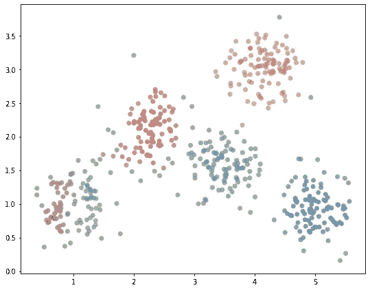

用 HDBSCAN 标识的集群

与像 [k-means](https://medium.com/neo4j/k-means-clustering-with-neo4j-b0ec54bf0103) 这样的聚类算法不同，使用 HDBSCAN，您不必预先决定您期望在数据中找到多少个聚类。在我看到 Maarten Grootendorst 在[从文本中提取主题的教程](/topic-modeling-with-bert-779f7db187e6)中使用 HDBSCAN 后，我想了解更多。

[](/topic-modeling-with-bert-779f7db187e6) [## 用 BERT 进行主题建模

### 利用 BERT 和 TF-IDF 创建易于解释的主题。

towardsdatascience.com](/topic-modeling-with-bert-779f7db187e6) 

麦金尼斯对 HDBSCAN 内部工作方式的描述会引起 Neo4j 用户的共鸣。他谈到了项目之间的关系图，以及作为过程的一部分，该算法如何找到最小生成树。

他的“graph ization”描述让我怀疑我是否可以用 Neo4j 实现 HDBSCAN。当我在工作中使用 HDBSCAN 时，我使用 Python 包[而不是在 Neo4j 中实现算法。我认为没有理由重新发明轮子，特别是当我可以轻松地将工件从 hdbscan 包](https://pypi.org/project/hdbscan/)[输出到 networkx](https://hdbscan.readthedocs.io/en/latest/api.html?highlight=networkx#hdbscan.plots.CondensedTree.to_networkx) ，然后[将 graphml 导入到 Neo4j](https://neo4j.com/labs/apoc/4.1/import/graphml/) 时。

[](https://pypi.org/project/hdbscan/) [## hdbscan

### HDBSCAN -带噪声的应用程序的基于层次密度的空间聚类。对变化的…执行 DBSCAN

pypi.org](https://pypi.org/project/hdbscan/) 

> 然而，试着向别人解释一个概念是加深你自己理解的好方法。向计算机“解释”一个概念可能比向人解释更难，而且可能会提供一些有趣的见解。

通过在 Neo4j 中构建 HDBSCAN，我们还可以练习使用有用的 Neo4j [图形数据科学](https://neo4j.com/product/graph-data-science-library/)算法和 [APOC 过程](https://neo4j.com/labs/apoc/)。让我们开始吧！

麦金尼斯将他对 HDBSCAN 的描述分为 5 个部分:

1.  [变换空间](https://hdbscan.readthedocs.io/en/latest/how_hdbscan_works.html#transform-the-space)
2.  [建立最小生成树](https://hdbscan.readthedocs.io/en/latest/how_hdbscan_works.html#build-the-minimum-spanning-tree)
3.  [构建集群层级](https://hdbscan.readthedocs.io/en/latest/how_hdbscan_works.html#build-the-cluster-hierarchy)
4.  [压缩聚类树](https://hdbscan.readthedocs.io/en/latest/how_hdbscan_works.html#condense-the-cluster-tree)
5.  [提取聚类](https://hdbscan.readthedocs.io/en/latest/how_hdbscan_works.html#extract-the-clusters)

这是一个有点冗长的过程，但每个部分都很简单。当我们在 Neo4j 中追溯他的脚步时，我们将跟随他的轮廓。

# 设置您的环境

为了完成这个练习，我推荐使用一个免费的 Neo4j 沙盒，它预装了一个《权力的游戏》数据集。登录 [Neo4j 沙盒](https://neo4j.com/sandbox/)，选择图形数据科学项目，启动。

[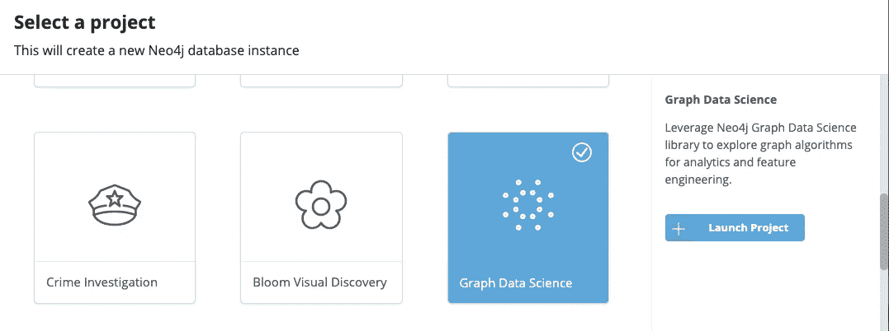](https://sandbox.neo4j.com)

启动 Neo4j 沙盒项目

当您的沙盒准备就绪时，选择“用浏览器打开”

# 改造空间

HDBSCAN 需要我们知道*在某种度量空间*中，我们数据集中的元素相互之间相距多远。HDBSCAN Python 包可以使用许多现成的距离度量。

对于我们的《权力的游戏》数据集，我们将使用图形数据科学库中的 [***节点相似度*** 算法](https://neo4j.com/docs/graph-data-science/current/algorithms/node-similarity/)创建一个自定义距离度量。节点相似性算法通常在二分图上工作得最好，但我认为它在这个应用程序中仍然有意义。

如果两个角色交互的字符集有明显的重叠，我们就说这两个角色是相似的。这将有助于我们的相似性分数反映人物的社会地位。例如，一个领导和一个下属可能彼此之间有频繁的互动，但是在他们更广泛的社交圈中几乎没有共同点。

在运行节点相似性算法之前，让我们创建一个包含`Person`节点和`:INTERACTS`关系的内存中图形投影。`:INTERACTS`关系的权重属性表示角色的交互次数。该图包含每本《权力的游戏》书的单独的`:INTERACTS`关系。我们将对内存图中所有书籍的权重求和。

```
CALL gds.graph.create(
'gotGraph',    
'Person',    
{INTERACTS: 
 {
     type: 'INTERACTS',
     orientation: 'UNDIRECTED',
     aggregation:'SUM',
     properties:{
            weight:{property:'weight'} 
        }    
 }    
}) YIELD graphName, nodeCount, relationshipCount
```

现在我们调用节点相似性算法，并将结果写回到我们的主图中，作为一个`:SIMILAR_TO`关系，其`similarity`得分在 0 到 1 的范围内。因为我们想要一个紧密连接的图，所以我们设置参数`topK`来为每个节点写多达 50 个`:SIMILAR_TO`关系。

```
CALL gds.nodeSimilarity.write('gotGraph', 
{
    writeRelationshipType: 'SIMILAR_TO',
    writeProperty: 'similarity',
    topK:50
})
YIELD nodesCompared, relationshipsWritten
```

HDBSCAN 需要距离的度量，其中较大的数字对应于关系较远的项目。我们的相似性得分是相反的，其中较高的数字对应于更密切相关的项目。我们可以通过从 1 中减去来将相似性转换为距离。

```
MATCH (:Person)-[rel:SIMILAR_TO]->(:Person)
SET rel.distance = 1 - rel.similarity
```

让我们来看看创建的**距离分数**的分布。

```
MATCH (p1:Person)-[s:SIMILAR_TO]-(p2:Person)
WHERE id(p1) < id(p2)
RETURN round(s.distance*10)/10.0 AS roundedDistance, 
count(*) as pairs
ORDER BY roundedDistance
```

这是结果的图表。

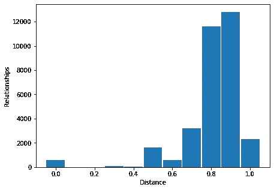

距离直方图

看起来我们有几对非常接近的字符，一个大约 0.5 的潜在有趣的组，以及 0.8-0.9 范围内的大量字符。

现在我们已经建立了一个度量空间，我们准备好**转换它**。我们想知道每个节点是生活在人口密集的还是人口稀少的邻居中。估计的一种方法是找到到第 k 个最近邻居的距离。我们称这个距离为 ***核心距离*** 。

您可以试验不同的 k 值。因为我们的许多`Person`节点的邻居数量相当少，所以我将 *k* 设置为 3。

```
:param k=> 3
```

现在我们可以计算每个`Person`节点的核心距离。如果一个`Person`的邻居少于 3 个，我们默认它们的核心距离为 2。

```
MATCH (p1:Person)-[s:SIMILAR_TO]-(p2:Person)
WITH p1, p2, min(s.distance) AS distance order by distance
WITH p1, collect(distance) AS neighbors
SET p1.coreDist = coalesce(neighbors[$k-1], 2)
```

空间转换的最后一步是计算每对`Person`节点的*相互可达性*。
相互可达性是三个值中最大的*:节点间的距离和两个节点的核心距离。*

```
*MATCH (m1:Person)-[s:SIMILAR_TO]->(m2:Person) 
SET s.mutualReachability =  apoc.coll.max([m1.coreDist, m2.coreDist, s.distance])*
```

*以这种方式转换空间强调了生活在图中人口稀少区域的节点的隔离。*

*让我们看看，对于图中密集部分的人，*瑟曦·兰尼斯特*，我们的相互可达性分数的分布结果如何。*

```
*MATCH (p:Person {name:"Cersei Lannister"})-[s:SIMILAR_TO]-(p2)
RETURN DISTINCT p2.name as character,
round(p2.coreDist * 1000)/1000.0 as p2CoreDist, 
round(s.distance*1000)/1000.0 as distance, 
round(s.mutualReachability*1000)/1000.0 as reachability
ORDER BY round(s.distance*1000)/1000.0
LIMIT 5╒═══════════════════╤════════════╤══════════╤══════════════╕
│"character"        │"p2CoreDist"│"distance"│"reachability"│
╞═══════════════════╪════════════╪══════════╪══════════════╡
│"Joffrey Baratheon"│0.636       │0.544     │0.64          │
├───────────────────┼────────────┼──────────┼──────────────┤
│"Sansa Stark"      │0.644       │0.613     │0.644         │
├───────────────────┼────────────┼──────────┼──────────────┤
│"Tyrion Lannister" │0.678       │0.64      │0.678         │
├───────────────────┼────────────┼──────────┼──────────────┤
│"Robert Baratheon" │0.683       │0.683     │0.683         │
├───────────────────┼────────────┼──────────┼──────────────┤
│"Jaime Lannister"  │0.692       │0.689     │0.692         │
└───────────────────┴────────────┴──────────┴──────────────┘*
```

*我们可以看到，虽然她的儿子*乔佛里·拜拉席恩*与*瑟曦*的距离最小，但他们的相互可达性得分却上升到了与*瑟曦*第三接近的人，她的哥哥*提利昂·兰尼斯特*。在与*珊莎·史塔克、提利昂·兰尼斯特、劳勃·拜拉席恩*和*詹姆·兰尼斯特*的关系中，相互的可达性是由 ***第二*** 人的核心距离决定的，而不是瑟曦的。*

```
*MATCH (p:Person {name:"Cersei Lannister"})-[s:SIMILAR_TO]-(p2)
WITH DISTINCT p2, s.mutualReachability - s.distance as difference
RETURN avg(difference)*
```

*对于*瑟曦的*关系，距离和相互可达性值之间的平均差值为 0.01*

*和*蓟*这样的次要角色反差太大了。*

```
*MATCH (p:Person {name:"Thistle"})-[s:SIMILAR_TO]-(p2)
RETURN DISTINCT p2.name as character,
round(p2.coreDist * 1000)/1000.0 as p2CoreDist, 
round(s.distance*1000)/1000.0 as distance, 
round(s.mutualReachability*1000)/1000.0 as reachability
ORDER BY round(s.distance*1000)/1000.0
LIMIT 5╒══════════════╤════════════╤══════════╤══════════════╕
│"character"   │"p2CoreDist"│"distance"│"reachability"│
╞══════════════╪════════════╪══════════╪══════════════╡
│"Bump"        │0.875       │0.0       │0.875         │
├──────────────┼────────────┼──────────┼──────────────┤
│"Haggon"      │0.875       │0.0       │0.875         │
├──────────────┼────────────┼──────────┼──────────────┤
│"Harma"       │0.6         │0.875     │0.875         │
├──────────────┼────────────┼──────────┼──────────────┤
│"Mance Rayder"│0.765       │0.97      │0.97          │
├──────────────┼────────────┼──────────┼──────────────┤
│"Jon Snow"    │0.807       │0.991     │0.991         │
└──────────────┴────────────┴──────────┴──────────────┘*
```

*他的几个邻居不是很近就是很远。k 值为 3 将所有邻居的相互可达性设置为高值。*

```
*MATCH (p:Person {name:"Thistle"})-[s:SIMILAR_TO]-(p2)
WITH DISTINCT p2, s.mutualReachability - s.distance as difference
RETURN avg(difference)*
```

*蓟的距离和相互可达性值之间的平均差值为 0.35*

```
*MATCH (p1:Person)-[s:SIMILAR_TO]-(p2:Person)
WHERE id(p1) < id(p2)
RETURN round(s.mutualReachability*10)/10.0 AS roundedMutualReachability, 
count(*) as pairs
ORDER BY roundedMutualReachability*
```

*这是转换数据的图表。*

*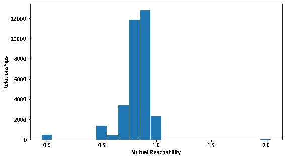*

*相互可达性直方图*

*我们看到，作为转换的结果，分布向范围的高端移动了一点。和一些次要角色的关系已经在 2.0 区域结束了。较高的 k 值会使分布偏移更多。*

# *构建最小生成树*

*“DBSCAN 如何工作”中的下一节描述了为我们转换的度量空间构建最小生成树。这是一组覆盖每个节点的关系，关系中没有循环，并且关系的总权重最小。图形数据科学库中的 [***最小权重生成树*** 算法](https://neo4j.com/docs/graph-data-science/current/alpha-algorithms/minimum-weight-spanning-tree/)会为我们找到这棵树。*

*我们将一个新的图表加载到图表目录中，该图表目录包括带有`mutualReachability`属性的`Person`节点和`:SIMILAR_TO`关系。*

```
*CALL gds.graph.create(
    'gotSimilarity',
    "Person",
    { 
     SIMILAR_TO: {
        type: 'SIMILAR_TO',
        properties: 'mutualReachability',
        orientation: 'UNDIRECTED'
     }
    }) YIELD graphName, nodeCount, relationshipCount*
```

*我们调用最小生成树算法，并将结果作为`:MST`关系写回到我们的图中。我们必须为算法的运行指定一个起始节点。我任意选择了**T5【珊莎·史塔克】T6**。你可以尝试一个不同的`Person`，基于 [Prim 的算法](https://en.wikipedia.org/wiki/Prim%27s_algorithm)的执行生成一个略有不同的树。起始节点的选择应该不会对最终的集群产生很大的影响，因为每个节点最终仍然会链接到最小生成树中其最近的邻居之一。*

```
*MATCH (m:Person {name:"Sansa Stark"})CALL gds.alpha.spanningTree.minimum.write('gotSimilarity', {startNodeId: id(m),
relationshipWeightProperty:'mutualReachability', writeProperty:'MST',
weightWriteProperty:'minTreeDistance'}) 
YIELD effectiveNodeCount, createMillis, computeMillis, writeMillis RETURN **
```

*在这一点上， [Neo4j Bloom](http://neo4j.com/developer/neo4j-bloom) 网络可视化提供了一种查看我们数据的好方法。从 Neo4j 沙盒项目页面，选择“*用 Bloom 打开。**

**

*点击“打开 Bloom”按钮附近的**按键图标**显示登录凭证。登录后，选择《权力的游戏》视角。*

*我们对`:MST`的关系感兴趣。在搜索框中单击，键入“MST”，然后选择 MST 关系。*

*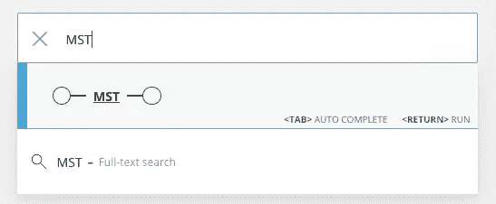*

*按“ *<返回>* ”，Bloom 将执行查询。点击可视化右下角的*激活分层布局*按钮，可以很好地查看我们的树。您可能需要使用“层次关系”按钮旁边的“旋转”按钮，使树的根出现在顶部。`Person`节点的颜色和大小已经用基于规则的格式进行了设置，这在我们的练习中是不需要的。如果愿意，您可以删除该格式。*

*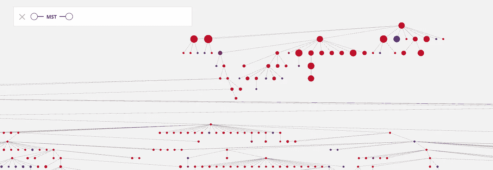*

*开花时可视化的最小重量生成树的一部分*

# *构建集群层次结构*

*算法的下一步是*基于最小生成树*创建集群。HDBSCAN 是一种分层(也称为凝聚)聚类算法。分层聚类用于多种聚类算法，包括图形数据科学库中的 [Louvain 社区检测算法](https://neo4j.com/docs/graph-data-science/current/algorithms/louvain/)。*

*基本的分层聚类算法如下:*

1.  *将数据集中的每一项都想象成一个大小为 1 的簇。*
2.  *找到彼此最接近的两个集群，并将它们合并成一个集群。*
3.  *重复步骤 2，直到将所有集群合并成一个大集群*
4.  *决定步骤 1 和步骤 3 之间的哪些中间聚类对您的分析有意义。*

*这里有一个集群关系树的可视化，称为*树状图*，它表示当我们向可视化顶部移动时，可视化底部的小集群合并成越来越大的集群。*

*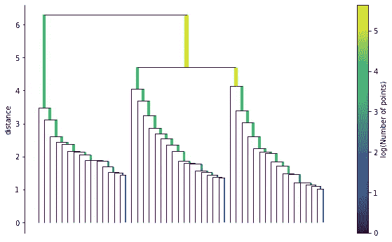*

*使用 HDBSCAN 生成的单个连接树树形图示例*

*在上面的层次聚类描述的第 2 步中，当我们说聚类彼此“*接近”时，定义我们的意思是很重要的。在 HDBSCAN 中，我们使用最小生成树中的*关系来定义“关闭”。***

**我们从树中具有最低**权重**的关系开始，并在该关系的**端**合并聚类。我们将移动到**下一个最低权重的**关系，并继续以这种方式合并，直到我们穷尽了树中的所有关系。**

**HDBSCAN 还有助于我们在层次聚类描述的第 4 步中确定哪些聚类“对我们的分析有意义”。我们将在本练习的最后部分 ***中看到这是如何发生的，提取集群*** 。**

**返回 Neo4j 浏览器执行以下命令。首先，我们将创建一个 [APOC 自定义函数](https://neo4j.com/labs/apoc/4.1/cypher-execution/cypher-based-procedures-functions/)来标识对于任何给定节点来说在层次结构中最远的集群。然后，我们可以使用该函数来构建我们的集群层次结构。**

```
**call apoc.custom.asFunction('getLastCluster',
"MATCH (n) where id(n) = id($n)
WITH n MATCH clustPath = (n)-[:IN_CLUSTER*0..]->(c)
WITH clustPath order by length(clustPath) desc
LIMIT 1
RETURN nodes(clustPath)[-1] as lastCluster",
"NODE",
[["n","NODE"]],
false,
"Starting from a given node, get the node at the end of the longest path of IN_CLUSTER relationships")**
```

**赛弗声明如下:**

1.  **查找最小生成树中尚未计算的最短边。**
2.  **然后，它为生成树边缘两端的节点找到最深的现有集群。**
3.  **它创建一个新的集群，并将节点连接到该集群。**
4.  **计算新群集的大小**
5.  **将生成树边标记为已评估。**

```
**MATCH (a)-[m:MST]->(b)
WHERE m.evaluated is null
WITH a, b, m
ORDER BY m.minTreeDistance
LIMIT 1
WITH custom.getLastCluster(a).lastCluster as cluster1, custom.getLastCluster(b).lastCluster as cluster2,
m
CREATE (cluster1)-[r1:IN_CLUSTER]->(c:Cluster)
                <-[r2:IN_CLUSTER]- (cluster2)
SET r1.splitDistance = m.minTreeDistance,
r2.splitDistance = m.minTreeDistance,
c.size = coalesce(cluster1.size, 1) + coalesce(cluster2.size, 1),
m.evaluated = True
RETURN ***
```

**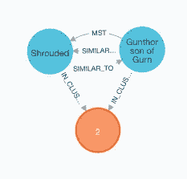**

**Gurn 的儿子 gun thor 和*被笼罩的领主*是第一个加入集群的两个角色。如果我们将鼠标悬停在`:MST`关系上，我们会看到`minTreeDistance`为 0.0。运行这个查询来查看 Gunthor 和 closed 与之交互的一组人。**

```
**MATCH (p1:Person {name:"Shrouded Lord"})-[:INTERACTS]->(p2)
RETURN p1, p2
UNION ALL
MATCH (p1:Person {name:"Gunthor son of Gurn"})-[:INTERACTS]->(p2)
RETURN p1, p2**
```

**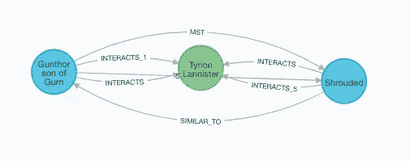**

**冈恩之子冈瑟和神秘领主的互动**

**他们都只和一个人互动，提利昂·兰尼斯特。这使得它们的相邻集之间有 100%的重叠，所以根据我们的距离测量，它们是尽可能接近的。至少还有另外两个角色也只和*提利昂*互动，所以*冈瑟*和*笼罩主的*相互可达性为 0.0。**

**您可以继续运行上面的集群查询，一次创建一个新的集群。这样做几次后，运行下面的语句，该语句使用 [apoc.periodic.commit](https://neo4j.com/labs/apoc/4.1/graph-updates/periodic-execution/) 过程来完成集群的创建。它一次处理一个最小关系，直到结果计数返回零。**

```
**call apoc.periodic.commit(
"MATCH (a)-[m:MST]->(b)
WHERE m.evaluated is null
WITH a, b, m
ORDER BY m.minTreeDistance
LIMIT 1WITH 
custom.getLastCluster(a).lastCluster as cluster1, custom.getLastCluster(b).lastCluster as cluster2, mCREATE (cluster1)-[r1:IN_CLUSTER]->(c:Cluster)
                <-[r2:IN_CLUSTER]- (cluster2)
SET r1.splitDistance = m.minTreeDistance,
r2.splitDistance = m.minTreeDistance,
c.size = coalesce(cluster1.size, 1) + coalesce(cluster2.size, 1),
m.evaluated = True
RETURN count(*)", {})**
```

**当你完成后，你可以回到 ***Neo4j Bloom*** 查看我们的聚类树。点击左上方侧边栏中的侧边栏图标来展开透视图编辑器，然后单击刷新透视图按钮来获取最新的数据。**

**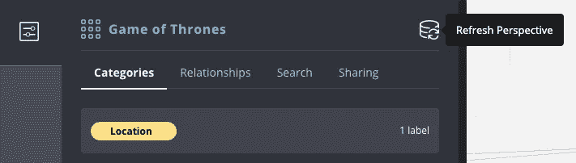**

**滚动到类别列表的底部，为“集群”添加一个类别**

**单击左侧的齿轮微件打开设置，并将节点查询限制增加到 2，000 以上。**

**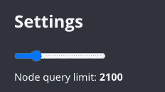**

**节点查询限制设置**

**再次点按齿轮 widget 以关闭“设置”边栏。右键单击画布并清除场景。现在，如果您在搜索框中搜索 IN_CLUSTER 关系，随着每个人的加入，您可以很好地看到我们的聚类树。**

**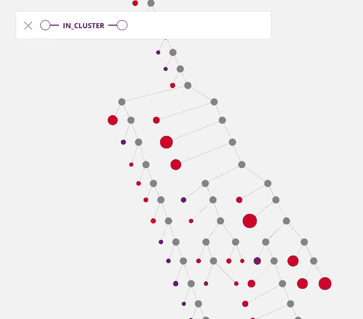**

**开花的丛树片段**

# **压缩聚类树**

**该过程的下一步是压缩聚类树。最小集群大小是运行 HDBSCAN 时可以控制的重要[参数之一。如果我们设置一个低的最小集群大小，我们将得到更多更小的集群。如果我们设置更高的最小集群大小，我们将得到更少、更大的集群。](https://hdbscan.readthedocs.io/en/latest/parameter_selection.html)**

**在 Neo4j 浏览器中执行该命令，将 *minClusterSize* 参数设置为 20。**

```
**:param minClusterSize => 20**
```

**下一个命令将把任何连接到 20 个或更少节点的集群的`Person`节点分配给它们的第一个大于最小大小的祖先集群。**

```
**MATCH (c1:Cluster)-[r:IN_CLUSTER]->(c2:Cluster)
WHERE c1.size < $minClusterSize and c2.size >= $minClusterSize
WITH c1, r, c2
MATCH (m:Person)-[:IN_CLUSTER*]->(c1)
CREATE (m)-[:IN_CLUSTER {splitDistance:r.splitDistance}]->(c2)**
```

**然后，我们可以删除规模过小的集群。**

```
**MATCH (c:Cluster) where c.size < $minClusterSize detach delete c**
```

**如果我们从树的顶部开始向下，我们会看到许多分支代表一个或两个脱离主集群的节点。**

**我们可以认为这是一个继续存在的主集群，只是减少了一些成员。其他分裂表示较大的集群分裂成两个可行的子集群。我们将这些可行的子集群的开始标记为“集群出生”。**

```
**MATCH (c1:Cluster)-[r:IN_CLUSTER]->(c)<-[:IN_CLUSTER]-(c2:Cluster)
WHERE c1.size >= $minClusterSize and c2.size >= $minClusterSize
AND id(c1) < id(c2)
WITH r.splitDistance as splitDistance, [c1, c2] as clusters
UNWIND clusters as cluster
WITH cluster, 1/splitDistance as lambda
SET cluster:ClusterBirth, cluster.birthLambda = lambda
RETURN ***
```

**我们还想把树根算作一个集群的诞生。**

```
**MATCH (c:Cluster) where not (c)-[:IN_CLUSTER]->()
SET c:ClusterBirth, c.birthLambda = 0
RETURN ***
```

**在上面的第一个`ClusterBirth`赋值查询中，我们将名为 *lambda* 的值设置为 1/splitDistance。**

**回想一下，我们的聚类树的根附近的节点对应于最小权重生成树中的最大距离，而聚类树的叶节点对应于最小权重生成树中的最小距离。**

**作为分割距离的*倒数，λ值在根部开始*变小，并向叶子方向*增加。稍后我们将使用 lambdas 来决定保留哪些聚类作为最终结果。***

*接下来，我们将在集群分裂成子集群或低于最小集群大小之前将节点标记为“集群死亡”*

```
*MATCH (c:Cluster) where not (c)<-[:IN_CLUSTER]-(:Cluster)
OR (c)<-[:IN_CLUSTER]-(:ClusterBirth)
SET c:ClusterDeath
RETURN c*
```

*我们在这一部分的最后一个任务是*将从集群诞生到集群死亡路径中的所有节点合并成一个集群*。*

*为此，我们将使用两个 APOC 过程。 [apoc.path.expand 过程](https://neo4j.com/labs/apoc/4.1/graph-querying/path-expander/)允许我们沿着`:IN_CLUSTER`关系搜索，直到到达`:ClusterDeath`节点。*

*[apoc.refactor.mergeNodes 过程](https://neo4j-contrib.github.io/neo4j-apoc-procedures/3.5/graph-refactoring/merge-nodes/)将多个节点合并成一个节点，同时保留节点的关系。*

```
*MATCH (cb:ClusterBirth)
CALL apoc.path.expand(cb, "<IN_CLUSTER", "/ClusterDeath", 1, 800) YIELD path
with nodes(path) as mergeList
CALL apoc.refactor.mergeNodes(mergeList, {properties: "discard", mergeRels:true}) YIELD node
RETURN node*
```

*因为我们合并了两个以上的节点来创建我们的一些压缩集群，所以我们以一些不必要的自我关系结束。使用此查询删除它们。*

```
*match (c:Cluster)-[r:IN_CLUSTER]->(c)
DELETE r*
```

# *提取聚类*

*现在我们有了一个压缩的集群层次结构。您可以返回到 Bloom，清除场景，并搜索簇-簇模式来查看结构。*

*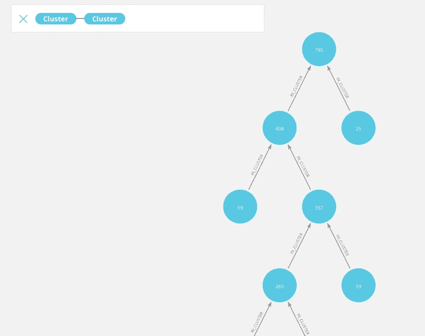*

*集群层次结构*

*剩余的每一个聚类都高于最小大小阈值，我们希望选择质量最高的*进行输出。我们使用***λ***，我们计算为 1/splitDistance 来指导我们的选择。**

**对于集群中的每个节点，我们计算集群诞生时的 lambda 与节点离开集群时的 lambda 之间的差异，这是因为节点脱离了集群，或者是因为集群已经分裂为可行的子集群。群集中所有节点的这些λ值的 ***之和称为 ***群的稳定性*** 。使用此查询来计算我们的集群的稳定性。*****

```
*MATCH (c:Cluster)<-[ic:IN_CLUSTER]-(n)
WITH c, sum((1/ic.splitDistance - c.birthLambda) * coalesce(n.size, 1)) as stability
SET c.stability = stability*
```

*我们暂时将所有的叶簇设置为“选中”*

```
*MATCH (c:Cluster)
WHERE NOT (c)<-[:IN_CLUSTER]-(:Cluster)
SET c:Selected
RETURN c*
```

*从离根最远的分裂开始，我们现在考虑每个集群分裂，以决定是选择分裂的子节点还是父节点。我们将对聚类分割进行编号，以跟踪评估顺序。*

```
*MATCH p = (:Cluster)-[:IN_CLUSTER]->(c:Cluster)-[:IN_CLUSTER*]->(:Cluster) 
WITH c, length(p) as pathLength
WITH c, max(pathLength) as distanceToRoot
ORDER BY distanceToRoot desc
WITH collect(c) as clusters
UNWIND range(1, size(clusters)) AS rank
WITH clusters[rank-1] as cluster, rank
SET cluster.evaluationOrder = rank*
```

*在每次集群分裂时，我们***比较父稳定性和子稳定性的总和*** 。如果子稳定性较大，我们将父稳定性设置为子稳定性的总和。
如果父类稳定性更大，我们将父类设置为选中，取消选择子类。*

*[***apoc . periodic . iterate***过程](https://neo4j.com/labs/apoc/4.1/graph-updates/periodic-execution/)让我们按照求值顺序遍历拆分。我们使用[***apoc . do . when***过程](https://neo4j.com/labs/apoc/4.1/overview/apoc.do/apoc.do.when/)来处理条件更新逻辑。*

```
*call apoc.periodic.iterate("
MATCH (c:Cluster) where c.evaluationOrder is not null 
RETURN c.evaluationOrder as evaluationOrder 
order by evaluationOrder",
"MATCH (c:Cluster  {evaluationOrder:evaluationOrder})<-[:IN_CLUSTER]-(child)
WITH c.stability as parentStability, sum(child.stability) as childStability, 
c AS parent, 
collect(child) as children
call apoc.do.when(parentStability < childStability,
'set parent.stability = childStability',
'set parent:Selected FOREACH(child in children | REMOVE child:Selected)',
{parent:parent, childStability:childStability, children:children}) YIELD value
RETURN value", 
{batchMode:"SINGLE"})*
```

*保留`Selected`标签的集群是 HDBSCAN 的最终输出。您可以使用该查询返回集群成员。*

```
*MATCH (s:Selected)<-[:IN_CLUSTER*]-(m:Person)
return id(s), s.size, collect(m.name) as names*
```

*我预计角色会倾向于与同一所房子里的人互动，因此一些房子会倾向于主导我们的输出集群。根据这个查询，似乎有几个集群是这种情况，而其他集群则更像是一个大杂烩。*

```
*MATCH (c:Selected)<-[:IN_CLUSTER*]-(p:Person)-[:BELONGS_TO]->(h:House)
WITH c, h, count(*) as houseCount ORDER BY houseCount DESC
RETURN id(c), c.size, 
  collect({name: h.name, count:houseCount, 
           percent:houseCount*100/c.size})[..5] as houses╒═══════╤════════╤════════════════════════════════════════════╕
│"id(c)"│"c.size"│"houses"                                    │
╞═══════╪════════╪════════════════════════════════════════════╡
│3062   │438     │[{"name":"None","count":74,"percent":16},{"n│
│       │        │ame":"Stark","count":55,"percent":12},{"name│
│       │        │":"Night's Watch","count":45,"percent":10},{│
│       │        │"name":"Lannister","count":35,"percent":7},{│
│       │        │"name":"Baratheon","count":31,"percent":7}] │
├───────┼────────┼────────────────────────────────────────────┤
│3137   │59      │[{"name":"Night's Watch","count":31,"percent│
│       │        │":52},{"name":"Wildling","count":10,"percent│
│       │        │":16},{"name":"None","count":3,"percent":5},│
│       │        │{"name":"Stark","count":2,"percent":3},{"nam│
│       │        │e":"Kingswood Brotherhood","count":1,"percen│
│       │        │t":1}]                                      │
├───────┼────────┼────────────────────────────────────────────┤
│2892   │114     │[{"name":"None","count":24,"percent":21},{"n│
│       │        │ame":"Stark","count":22,"percent":19},{"name│
│       │        │":"Baratheon","count":16,"percent":14},{"nam│
│       │        │e":"Tully","count":9,"percent":7},{"name":"L│
│       │        │annister","count":8,"percent":7}]           │
├───────┼────────┼────────────────────────────────────────────┤
│3008   │41      │[{"name":"Greyjoy","count":16,"percent":39},│
│       │        │{"name":"None","count":5,"percent":12},{"nam│
│       │        │e":"Bolton","count":5,"percent":12},{"name":│
│       │        │"Stark","count":5,"percent":12},{"name":"Goo│
│       │        │dbrother","count":3,"percent":7}]           │
├───────┼────────┼────────────────────────────────────────────┤
│2923   │43      │[{"name":"Lannister","count":14,"percent":32│
│       │        │},{"name":"Tyrell","count":5,"percent":11},{│
│       │        │"name":"None","count":5,"percent":11},{"name│
│       │        │":"Baratheon","count":3,"percent":6},{"name"│
│       │        │:"Redwyne","count":2,"percent":4}]          │
├───────┼────────┼────────────────────────────────────────────┤
│3063   │25      │[{"name":"Lannister","count":10,"percent":40│
│       │        │},{"name":"None","count":10,"percent":40},{"│
│       │        │name":"Clegane","count":6,"percent":24},{"na│
│       │        │me":"Brotherhood without banners","count":4,│
│       │        │"percent":16},{"name":"Stark","count":2,"per│
│       │        │cent":8}]                                   │
└───────┴────────┴────────────────────────────────────────────┘*
```

*我们运行的算法将 463 个字符放在一个簇中。然而，至少有一个`:INTERACTION`关系的 332 个字符仍然在所选的聚类之外，包括一些主要字符。*

```
*MATCH (p:Person) where not (p)-[:IN_CLUSTER*]->(:Selected)
AND (p)-[:INTERACTS]-()
RETURN p.name order by p.pageRank desc limit 10╒════════════════════╕
│"p.name"            │
╞════════════════════╡
│"Jon Snow"          │
├────────────────────┤
│"Stannis Baratheon" │
├────────────────────┤
│"Daenerys Targaryen"│
├────────────────────┤
│"Arya Stark"        │
├────────────────────┤
│"Robb Stark"        │
├────────────────────┤
│"Eddard Stark"      │
├────────────────────┤
│"Catelyn Stark"     │
├────────────────────┤
│"Theon Greyjoy"     │
├────────────────────┤
│"Tywin Lannister"   │
├────────────────────┤
│"Samwell Tarly"     │
└────────────────────┘*
```

****这是 HDBSCAN*** 的特性，不是 bug。我们在数据中发现了密集的星团。*

*之后，我们可以决定如何处理边缘案例。也许这些未分类的角色中的一些不适合普通的交互模式。*

*HDBSCAN 文档建议[调整参数以减少未聚类的数据元素的数量](https://hdbscan.readthedocs.io/en/latest/parameter_selection.html)，并建议[根据软聚类将未聚类的数据元素分配给聚类](https://hdbscan.readthedocs.io/en/latest/soft_clustering.html)。*

*我希望使用 Neo4j 学习 HDBSCAN 算法让您对该算法的工作原理有了更深入的了解。*

*您可以将这种方法与其他社区检测和聚类算法进行比较。我希望 HDBSCAN 证明是您的数据科学工具包中的一个有用工具。*