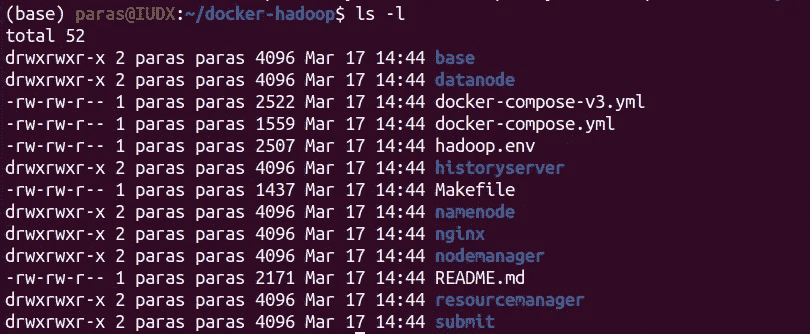
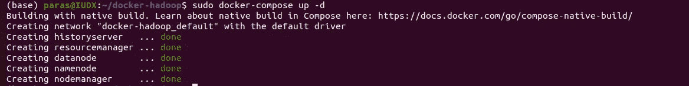
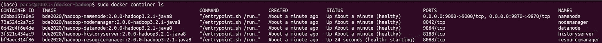
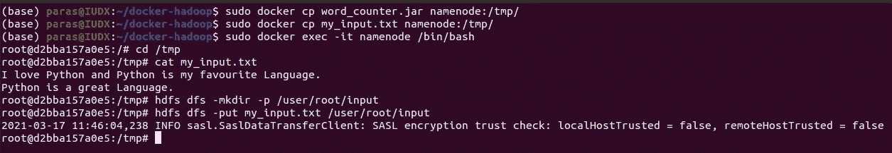
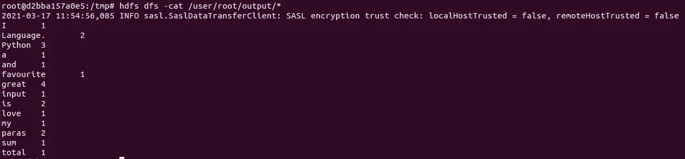
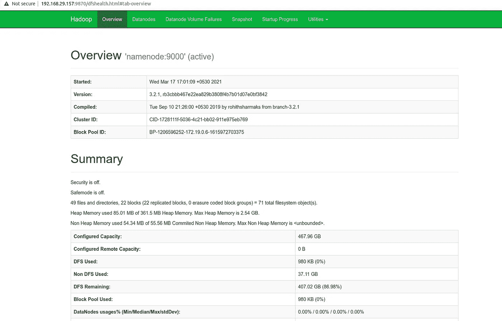

# 数据科学工作流程的 HDFS 简单 Docker 安装指南

> 原文：<https://towardsdatascience.com/hdfs-simple-docker-installation-guide-for-data-science-workflow-b3ca764fc94b?source=collection_archive---------4----------------------->

## 使用 Docker 映像，在您的系统上轻松逐步安装和使用 HDFS。


卢克·切瑟在 [Unsplash](/s/photos/big-data?utm_source=unsplash&utm_medium=referral&utm_content=creditCopyText) 上的照片

在这篇小文章中，我们将讨论如何在你的计算机上设置基于 Docker 的 Hadoop 分布式文件系统，并将讨论一个简单的例子来演示这个用例。此外，一旦安装准备就绪，您就可以开始构建自己的 map-reduce 作业来使用 Hadoop DFS。

## 从克隆 HDFS 项目开始

首先，你需要**克隆**下面的 [**Git 库**](https://github.com/big-data-europe/docker-hadoop) 到你系统中你想要的目录。我更喜欢把它克隆到家里，以便演示和方便使用。

```
git clone [https://github.com/big-data-europe/docker-hadoop](https://github.com/big-data-europe/docker-hadoop)
```

然后使用**更改目录**命令进入项目库:

```
cd docker-hadoop
```

现在执行一个" **ls -l** "命令，您可以看到这个存储库中的所有文件，如下所示。



命令“ **ls -l** 的输出

## 获取 Docker 图像并创建容器

之后，您需要启动在您的系统上设置 HDFS 所需的容器。为此，项目目录中有一个 docker-compose.yml 文件，您需要使用" **docker-compose up** "命令从 Docker hub 下载并安装所需的映像，并基于 **docker-compose.yml** 文件配置容器。“ **-d** ”标志以分离模式运行容器。如果在本地找不到图像，Docker 会从 DockerHub 下载它们，但是如果您想要手动下载它们，您可以使用“ **docker-compose pull** ”。

> 注意:如果出现权限错误，请使用“ **sudo** ”作为这些命令的前缀。

```
# download images required for setting up HDFS and spin up necessary # containers.
docker-compose up -d
```



命令" **sudo docker-compose up -d** 的输出

上面的命令将从 docker hub 下载设置 HDFS 容器所需的所有 Docker 映像。根据您的网速，下载图像可能需要一点时间。

现在，要查看当前正在运行的 Docker 容器，使用命令列出所有活动的容器。

```
# List all the available running docker containers.
docker container ls
```



命令" **sudo docker 容器 ls** "的输出

## 与 namenode 连接

一旦您将所有文件复制到 Hadoop 集群中的一个目录中(注意:在本例中，我已经将文件复制到了 **/tmp** )，现在您可以在 bash 模式下的交互式终端模式中使用以下命令进入 **namenode** 中。

```
# Enter inside namenode and open its bash
docker exec -it namenode /bin/bash
```

例:**sudo docker CP my _ input . txt NameNode:/tmp/**

## 复制必要的 JAR 和输入文件

现在我们需要复制包含我们的 **map-reduce 作业**的 jar 文件，并使用以下 Docker 命令将它们复制到 HDFS 的 namenode(将运行您的作业)中:

```
docker cp <file_name> namenode:/<path>
```

## 与 namenode 交互

在交互式终端中输入名称节点后，使用以下 HDFS 命令与**名称节点**进行交互。

```
# HDFS list commands to show all the directories in root "/"
hdfs dfs -ls /# Create a new directory inside HDFS using mkdir tag.
hdfs dfs -mkdir -p /user/root# Copy the files to the input path in HDFS.
hdfs dfs -put <file_name> <path># Have a look at the content of your input file.
hdfs dfs -cat <input_file>
```



上述命令的输出

## 运行 Hadoop Map Reduce 作业

现在，您可以使用以下命令运行地图缩减作业:

```
# Run map reduce job from the path where you have the jar file.
hadoop jar <jar_file_name> <class_name> input output
```

例:**Hadoop jar word _ counter . jar org . Apache . Hadoop . examples . word count 输入输出**

一旦该命令成功运行**，您会注意到 map-reduce 作业完成了它的执行，并在控制台上显示了关于该进程的一些信息。**

## **检查你的输出**

**作业成功执行后，您可以在 HDFS 使用 cat 命令检查输出:**

```
# Check the content of the output file after running the job
hdfs dfs -cat <output_file>
```

****

**命令"**HDFS DFS-cat output _ file/***的输出**

**您将看到您的单词计数器作业的词频应该打印在控制台上。**

****恭喜**！您已经成功配置并创建了您的第一个 Hadoop HDFS map-reduce 作业！**

## **额外小费**

**您可以在本地主机的端口 9870 上访问 HDFS namenode 的 **UI 仪表板**。使用以下链接:**

> ****http://<your _ IP _ address>:9870****

****

**NameNode UI:**http://<your _ IP _ address>:9870****

## **结论:**

**因此，基本上 HDFS 的设置对于简单的数据科学工作流来说很简单，并且您在阅读本文后已经了解到，设置一个基于本地 Docker 的 HDFS 设置并开始编写自己的 map-reduce 作业来执行各种任务是多么简单。如果你不是很熟悉地图减少工作，所以我附上了一些有用的链接。尽情享受吧！**

1.  **[https://en.wikipedia.org/wiki/MapReduce](https://en.wikipedia.org/wiki/MapReduce)**
2.  **[https://hadoop.apache.org/docs/r1.2.1/mapred_tutorial.html](https://hadoop.apache.org/docs/r1.2.1/mapred_tutorial.html)**
3.  **[https://hadoop.apache.org/docs/r1.2.1/hdfs_user_guide.html](https://hadoop.apache.org/docs/r1.2.1/hdfs_user_guide.html)**

**希望这篇文章对你有帮助！
**谢谢！****