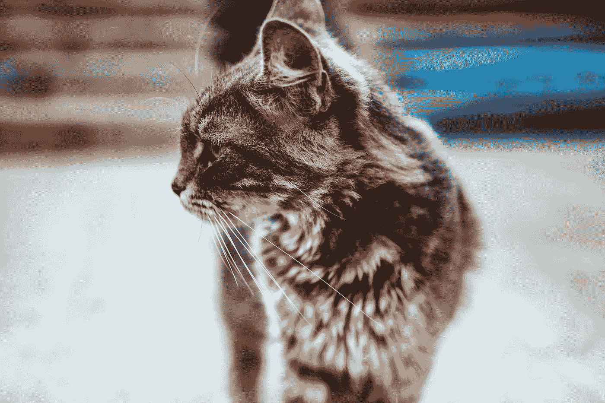
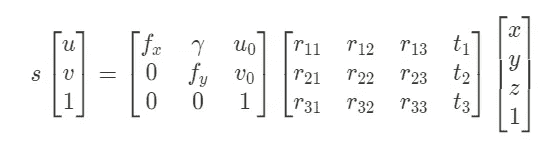
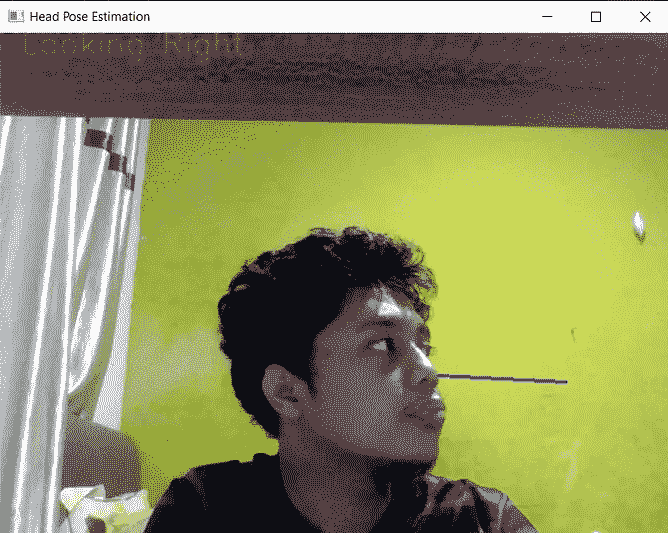
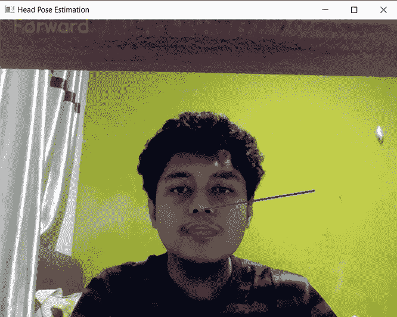
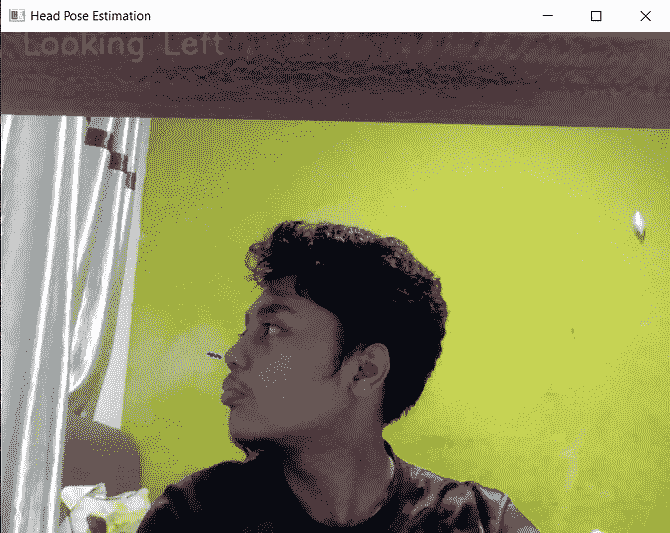
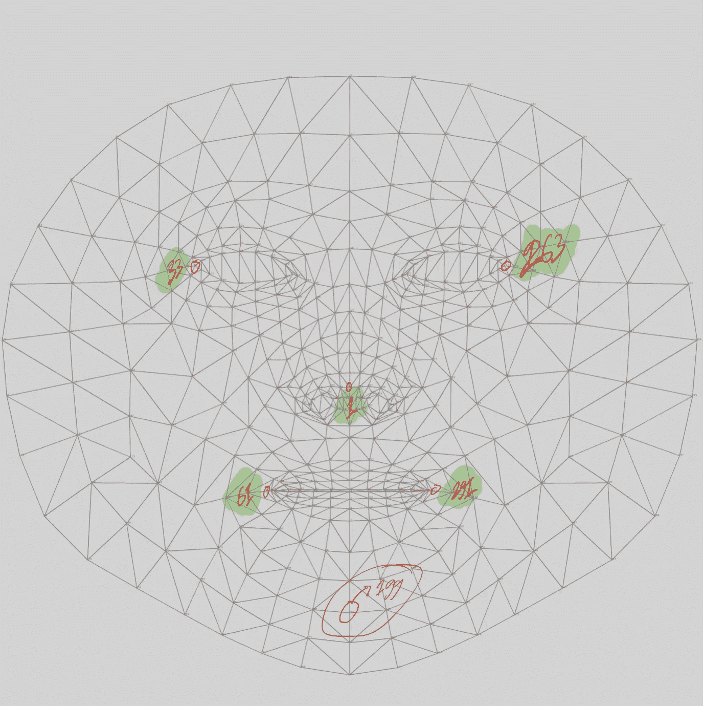
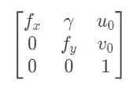
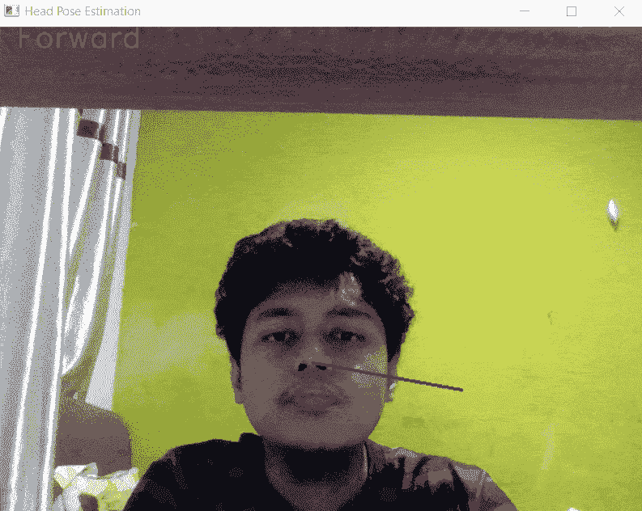

# 使用 Python 进行头部姿态估计

> 原文：<https://towardsdatascience.com/head-pose-estimation-using-python-d165d3541600?source=collection_archive---------3----------------------->

## 您所需要的只是 OpenCV 和 Mediapipe 库。



玛利亚·特内娃在 [Unsplash](https://unsplash.com/s/photos/distraction?utm_source=unsplash&utm_medium=referral&utm_content=creditCopyText) 上拍摄的照片

# 介绍

头部姿态估计是现有的计算机视觉任务之一。在这个任务中，我们想从物体的平移和旋转中知道物体的姿态。

这项任务有很多应用。例如，我们可以检测驾驶员是否在注意道路。第二个例子是，我们可以检查学生是否从学习中分心。我们可以用它做很多应用。

如你所知，我们只有二维图像。如何依靠图像本身来估计物体的姿态？我们可以使用一种称为 n 点透视(PnP)的解决方案。

PnP 问题方程看起来像这样:



从这个方程，我们可以检索旋转和平移矩阵。但是在我们得到这些矩阵之前，这个方程需要三个输入，例如:

*   图像空间中的 2D 坐标
*   世界空间中的 3D 坐标
*   相机参数，如焦点、中心坐标和倾斜参数

从这个等式中，我们得到两个主要问题:

*   我们如何获得这些输入？
*   我们如何根据这些输入来估计物体的姿态呢？

这篇文章将告诉你如何做。在本文中，我们将使用 Python 作为编程语言。此外，我们使用 mediapipe 库来检测面部关键点，使用 OpenCV 库来估计头部的姿态。

这是我们将创建的预览:



图片由作者捕捉。

**没有别的了，让我们开始吧！**

# 履行

## 安装库

在我们开始实现之前，第一步是安装库。在这种情况下，我们将使用 pip 安装 OpenCV 和 Mediapipe 库。在您的终端上，请编写以下命令:

```
**pip install opencv-python
pip install mediapipe**
```

## 加载库

安装完库之后，下一步是将库加载到我们的代码中。我们将导入 NumPy、OpenCV 和 Mediapipe 库。请添加这行代码:

## 初始化对象

加载完库之后，下一步是初始化几个对象。我们初始化了两个对象。它们是:

*   Mediapipe 库中的 FaceMesh 对象。该对象将检测人脸，也检测一个或多个人脸的关键点。
*   OpenCV 库中的 VideoCapture 对象。该对象将用于从网络摄像机中检索图像。我们将对象的参数设置为 0，用于从网络摄像头中检索图像。

请添加这几行代码:

## 捕捉图像

现在我们已经初始化了对象。下一步是从网络摄像头捕捉图像。为此，请添加以下代码行:

## 处理图像

在我们捕获图像之后，下一步是处理图像。供您参考，OpenCV 和 Mediapipe 库读取它们的图像是不同的。

在 OpenCV 库上，图像在 BGR 颜色空间中。同时，mediapipe 库需要一个具有 RGB 颜色空间的图像。

因此，我们需要首先将颜色空间转换为 RGB，应用人脸标志检测，然后将其转换回 BGR 颜色空间。

请添加以下代码行(注意缩进):

## 检索 2D 和三维坐标

处理完图像后，下一步是检索关键点坐标。供您参考，mediapipe 的面部标志检测算法可以从面部捕捉大约 468 个关键点。每个关键点都在三维坐标上。

对于头部姿态估计，我们不必使用所有的关键点。相反，我们选择至少能代表一张脸的 6 个点。这些点在眼睛的边缘，鼻子，下巴和嘴巴的边缘。

要访问这些点，我们可以参考 BlazeFace 模型中使用的索引。我已经标记了索引。这是它的照片:



这张图片是从 TensorFlow 的 GitHub 库中检索出来的，并由作者进行了编辑。

现在让我们提取这些关键点。对于 2D 坐标，我们将只取 x 和 y 轴坐标。对于三维坐标，我们检索所有的轴。

但是在我们提取这些关键点之前，我们必须用图像的宽度乘以 x 轴。此外，我们将 y 轴乘以图像的高度。

此外，我们将获得机头坐标。我们这样做是为了显示我们鼻子在图像空间的投影。

现在让我们添加这几行代码，注意缩进:

## 获取摄像机矩阵

现在我们有了面部关键点的 2D 和 3D 坐标。下一步是得到相机矩阵。让我们再次回忆一下相机矩阵。



正如你从上面看到的，我们需要几个参数。第一个是重点。我们可以通过获取图像的宽度来获得焦点(fx 和 fy)。

我们将采用的第二个参数是偏斜参数。该参数的符号为 gamma。对于这个参数，我们将值设置为 0。

第三个参数是我们图像的中心坐标。我们将用图像的宽度设置 u0，用图像的高度设置 v0。

现在让我们通过生成一个 NumPy 数组来创建矩阵。现在让我们添加这几行代码:

## 应用 PnP 问题

在应用 PnP 问题之前，我们需要添加另一个矩阵。这是一个距离矩阵。这个矩阵只包含零，它的形状是 4x1。现在，让我们通过添加这行代码来创建矩阵:

我们有所有的输入，从 2D 坐标，三维坐标，相机参数矩阵，和空距离矩阵。让我们通过添加这行代码将 PnP 应用于我们的问题:

## 将旋转向量转换成矩阵

从这个过程中，我们得到了平移向量和旋转向量。等等，旋转部分不是矩阵格式的。我们不能用它来恢复旋转角度。

别担心。我们可以用 cv2 把向量转换成矩阵。罗德里格斯函数。

现在让我们添加这行代码:

## 获取角度

现在我们有了旋转矩阵。现在让我们检索每个轴上的旋转角度。为此，我们可以使用 cv2。RQDecomp3x3 函数用于提取角度。

现在让我们添加这行代码:

## 捕捉头部的方向并显示结果

我们现在要做的最后一步是确定我们的方向。我们显示方向并创建一条线来查看我们的鼻子在图像空间上的投影。

现在让我们添加这几行代码:

通过组合所有这些代码行，结果将如下所示:



GIF 是作者捕获的。

# 结束语

干得好！我们已经使用 Python 实现了头部姿态估计。我希望它能帮助你建立你的计算机视觉解决方案，尤其是头部姿态估计问题。

如果你对我的文章感兴趣，可以在 Medium 上关注我。如果有任何问题，可以在 [**LinkedIn**](https://www.linkedin.com/in/alghaniirfan/) 上联系我。

如果您在编写代码时遇到了困惑，您可以在这里查看完整的代码来帮助您:

**感谢您阅读我的文章！**

## 参考

[1][https://medium . com/analytics-vid hya/real-time-head-pose-estimation-with-opencv-and-dlib-e8dc 10d 62078](https://medium.com/analytics-vidhya/real-time-head-pose-estimation-with-opencv-and-dlib-e8dc10d62078)
【2】[https://learnopencv . com/head-pose-estimation-using-opencv-and-dlib/](https://learnopencv.com/head-pose-estimation-using-opencv-and-dlib/)