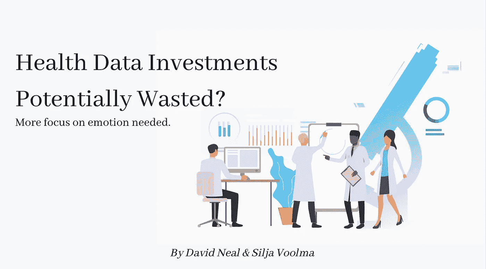

# 健康数据投资可能被浪费？

> 原文：<https://towardsdatascience.com/health-data-investments-potentially-wasted-32c33b4ec9f9?source=collection_archive---------53----------------------->

## 我们如何才能更好地实现投资数字健康研究和解决方案的潜力？

[图像信用](https://www.freepik.com/vectors/people'>People vector created by katemangostar - www.freepik.com)

在新冠肺炎疫情的推动下，[的数字医疗采用速度加快了三年](https://www.fiercehealthcare.com/tech/7-predictions-for-how-technology-will-shape-healthcare-2021)。从 2019 年到 2020 年，企业融资增加了 [103%，仅在美国就达到 219 亿美元。那么，为什么参与度指标——尤其是关于健康行为改变的指标——仍然如此令人失望呢？](https://www.fiercehealthcare.com/tech/covid-19-supercharged-digital-health-funding-2020-record-21-6b-invested-report#:~:text=Tech-,COVID%2D19%20supercharged%20digital%20health%20funding%20in,to%20reach%20record%20levels%3A%20report&text=It%20marks%20record%2Dbreaking%20investments,according%20to%20Mercom%20Capital's%20data.)

资源的涌入为数字健康研究和商业创造了大量的机会，但也暴露了其功效的局限性。

通过智能手表、手机和大量其他设备，我们似乎可以为一个人提供他们可能需要的所有测量，以全面了解他们当前的健康状况和未来的健康风险。但是当我们设计数字健康产品时，我们希望人们不仅仅是参与其中。我们还希望人们能够改变自己的行为，过上更幸福、更健康的生活。

许多数字健康和医疗保健数据科学文化基于这样一种假设，即个性化健康数据本身可以通知和激励或“推动”数字健康用户做出更健康的生活方式选择。然而，我们可能会经历一点点“发光物体综合症”，寄希望于个性化的健康数据带来现实生活中的行为改变。事实上，我们经常被低采用率和低参与率所困扰。只有一小部分的数字健康产品被用户以任何方式实现，给他们足够的输入来成功地改变行为。

事实上，在 2020 年疫情来袭之前，数字医疗的采用率实际上已经下降，从前一年的 48%下降到 35%。这似乎部分是由于用户所认为的“低质量的数字体验”。要改变人们的健康行为，我们必须首先让他们充分参与。让他们充分参与进来，采用数字健康工具。然后让他们更多地继续使用它以获得长期利益。

[形象信用](https://www.freepik.com/vectors/people'>People vector created by katemangostar - www.freepik.com)

# 数据够吗？

问题是，为什么数字健康创造者和用户可以获得的所有健康数据分析没有有效地吸引足够多的人？

答案可能在于我们经常对人类行为做出的另一个假设。

行为科学是从心理学和经济学发展而来的一门学科，致力于预测和解释人类行为。人们如何行动通常被认为是由他们是“理性”还是“非理性”决定的。例如，你可能听说过“系统 1 和系统 2”，这是诺贝尔奖获得者丹尼尔·卡内曼在他的开创性文章[“思考的快慢”](https://www.amazon.co.uk/Thinking-Fast-Slow-Daniel-Kahneman/dp/0141033576/ref=sr_1_1?crid=HYPQ3DZWTW7U&dchild=1&keywords=thinking+fast+and+slow&qid=1612472115&sprefix=thinking+fast%2Caps%2C389&sr=8-1)中带给我们的自动和有意识的思维过程？

健康的生活方式被认为是合理的，不健康的被认为是不合理的。几乎可以说，当人们不知何故失去了对自己和决策的控制时，就会做出不健康的选择。理性选择被视为明智的决策，最有可能基于可靠的数据。

如果我们应用这一行为科学框架，那么健康数据必然会帮助人们变得更加理性，从而做出更加健康的决定。还有什么比更多的数据更能提高理性，让理性的决策建立在更多的数据基础上呢？

但数字医疗解决方案的低采用率和参与率表明，这并不是全部情况。

# 房间里的情绪大象

准确和个性化健康数据的存在甚至承诺不足以让人们做出并保持健康的选择。对访问数字健康数据的人类行为的准确预测需要将该行为的更深层次的决定因素构建到我们的预测分析中。

比起认知问题的解决，情感更经常是人类行为的主导因素。情绪也是我们如何经历生活的特征，是我们生活故事中不可或缺的一部分。此外，情绪通常在人类功能的[潜意识或无意识层面](https://time.com/3937351/consciousness-unconsciousness-brain/)运作，并在我们没有意识到的情况下指导我们的行动、决定和行为模式。

也许我们在数字健康中的预测数据模型中缺少的是情感指标，这可能有助于我们解释更大比例的人类行为驱动因素，更有效地预测行为，并更可持续地让用户参与数字健康体验。

所以，让我们把情绪写进我们的预测模型。这是怎么回事？

# 情绪的度量

将情绪整合到我们的健康行为预测模型中可能会让我们更接近实现数字健康的潜力，但我们如何测量情绪并大规模进行大数据分析呢？

[在数字健康](https://sloanreview.mit.edu/article/measuring-emotions-in-the-digital-age/)中，情绪大多被概念化，并以面部表情来衡量。这源于发展心理学的[通用面部表情](https://www.paulekman.com/wp-content/uploads/2013/07/Universal-Facial-Expressions-of-Emotions1.pdf)理论，从中我们可以推断出其他人的感受。这种情绪指标的伟大用例是像临床决策支持系统这样的工具，在这些工具中，健康专家可以根据患者的面部表情更准确地识别他们的感受。有时，我们觉得我们不能安全地表达情感，有时我们可能不知道自己的感受，尤其是当我们处于病人这一脆弱的角色时。

然而，旨在帮助人们改变健康行为模式的数字健康技术，不会从其用户识别他人情绪的过程中获得同样多的价值。将情绪融入数字健康工具的一种通用方法是尝试预测人们使用该工具时的情绪反应。有助于个人层面行为改变的是将自己的情绪带入有意识的意识中。

在数字健康产品中创造隐含的积极情感体验会更好，我们可以通过以用户为中心的技术设计中的深度情感设计，借鉴品牌创建和用户参与中的[客户忠诚度](https://s3.amazonaws.com/media.mediapost.com/uploads/EmotionDrivenEngagement.pdf)构建技术来做到这一点。

# 谷歌心脏框架

[图像信用](https://www.freepik.com/vectors/clouds'>Clouds vector created by vectorjuice - www.freepik.com)

如果你正在考虑在预测人类行为变化的数字健康数据模型中包含情绪，你可能想使用[谷歌心脏框架](https://research.google/pubs/pub36299/)作为起点。

开发该框架是为了增加用户对基于网络的产品的参与，它也可以适用于其他类型的技术。HEART 框架构建了我们对用户参与度的思考，将用户“快乐”放在首位。首字母缩写代表:快乐、参与、采纳、保持和任务成功。

对于每个度量类别，该框架还要求您确定与该度量一致的目标、信号和度量。

当考虑如何将情绪纳入预测模型时，使用框架中的快乐类别，但扩展用户满意度的定义，超出通常的 5 点李克特量表问题“您对该功能/产品的满意度如何？”。

相反，确定你的用户认同的价值观，他们信任的信息类型，并以此为基础建立你的幸福指数。

你已经离增加用户参与度更近了一步，创造积极的情感体验和对你产品的忠诚度，这将帮助人们实现长期健康行为的改变。

[形象信用](https://www.freepik.com/vectors/business'>Business vector created by jcomp - www.freepik.com)

# 推荐

你不需要知道所有的答案。

这可能是一个难以接受的说法。作为科学家、数据分析师或技术设计师，我们很好奇，我们想要答案。

我们写这篇文章是为了帮助数据科学家创建更有效的人类行为模型，并帮助他们提高新数据驱动技术的采用潜力。但是我们也没有所有的答案。我们确实相信，通过提出正确的问题，我们可以让事情变得更好。

我们建议您从问自己以下问题开始:

*   你的模型的预测是否依赖于人们做出严格理性的——合乎逻辑的、明智的、理性的——决定？(如果是这样，你目前还没有一个准确的行为模型。你需要带着整个模型回到绘图板)
*   在实践中，您的模型的采用或实现是否依赖于人们做出严格理性的——合乎逻辑的、明智的、理性的——决策？(如果是这样的话，你目前还没有一个有潜力改变任何事情或帮助人们的模型。您需要带着您的采纳和实施计划回到绘图板。)
*   你的用户/研究人群经历了什么样的情感体验，你如何在数据中表达出来？
*   哪些同事，也许是跨学科和国际合作者，可能能够帮助你进一步将情感体验整合到你的模型中？
*   在你的下一次资金申请中，你将如何展示你对情感体验在决定行为中的重要性的理解？
*   在您的资助申请中，您如何强调用户/参与者的参与，以强调功效/效果潜力？

不管你现在是否能肯定地回答这些问题，这都可以成为你改善情绪在数据科学中的作用的框架。

鉴于疫情所创造的势头，对数字健康工具的学术和商业研发的投资可能会以前所未有的速度持续增长。个性化健康数据分析和健康行为改变仍然是数字革命的重要目标。如果我们想避免浪费投资的失望，现在是时候更多地关注情绪在参与和行为改变中的作用了。