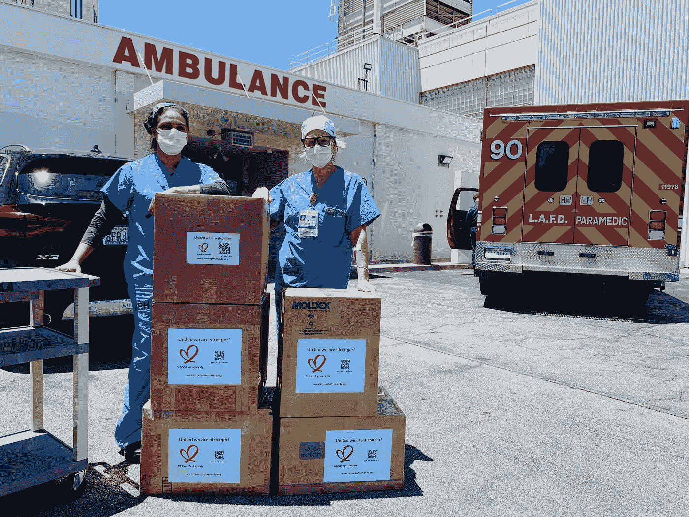
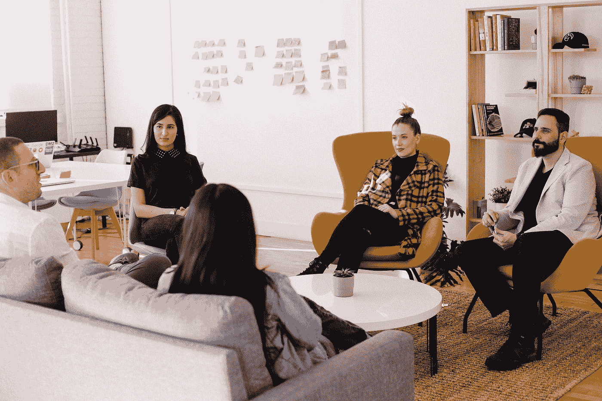

# 医疗保健的人工智能未来——与和费的对话

> 原文：<https://towardsdatascience.com/healthcares-ai-future-conversation-with-andrew-ng-and-fei-fei-li-a6eacb6aaaf1?source=collection_archive---------19----------------------->

## 与两位领先的人工智能专家在数据科学和医疗保健的交叉领域进行炉边交谈，获得了四个关键收获

卡米洛·希门尼斯在 [Unsplash](https://unsplash.com?utm_source=medium&utm_medium=referral) 上拍摄的照片

[深度学习。AI](https://www.deeplearning.ai/) 和[斯坦福海](http://hai.stanford.edu)最近组织了一次与两位世界上最杰出的计算机科学家和费的虚拟炉边聊天。

在对**医疗保健的** **社会使命和对人类的重要性**的强烈信念的驱动下，他们近年来将努力和专业知识集中在医疗保健行业。

这篇文章从人工智能和医疗保健交叉的角度和观点来看**四个关键要点**。

# 关于扬声器

费-李非 是斯坦福大学计算机科学系的首任红杉教授，也是斯坦福大学以人为中心的人工智能研究所的联合主任。她在 2013 年至 2018 年担任斯坦福大学人工智能实验室的主任。

[**Andrew NG**](https://en.wikipedia.org/wiki/Andrew_Ng)**是 deeplearning.ai 的创始人，Coursera 的联合创始人，目前是斯坦福大学的兼职教授。他也是百度公司的首席科学家和谷歌大脑项目的创始人。**

****

**照片由[艾伦·龚](https://unsplash.com/@mrgongxue?utm_source=unsplash&utm_medium=referral&utm_content=creditCopyText)在 [Unsplash](https://unsplash.com/s/photos/stanford?utm_source=unsplash&utm_medium=referral&utm_content=creditCopyText) 上拍摄**

# **四个关键的信息**

## **(1)在医疗保健领域采用人工智能的最大障碍**

**尽管医疗保健领域对人工智能进行了大肆宣传，但这种人工智能解决方案的现实实施比预期要慢得多，只有少数孤立的成功。**

**Andrew 认为，技术和非技术方面的变革管理仍然是一个严峻的挑战。从技术角度来看，团队需要学习如何**更好地管理机器学习项目的整个生命周期**。**

**飞飞强调，医疗保健领域的人工智能仍然缺乏“人类胜利”，无法创造行业的分水岭时刻。她提到，仍然缺乏经过验证的故事和产品来展示人工智能解决方案如何给患者或医疗保健提供商带来根本性的变化。**

****

**照片由[张诗钟乔吉亚迪斯](https://unsplash.com/@johnyg?utm_source=medium&utm_medium=referral)在 [Unsplash](https://unsplash.com?utm_source=medium&utm_medium=referral) 上拍摄**

## **(2)最重要的未解决的医疗保健问题**

**数据科学的目标是利用数据和高级技术来解决业务问题。因此，听听小组成员认为哪些是值得应对的重大挑战会很有意思。**

**飞飞分享了一个惊人的统计数据，吸引了观众的注意力——据估计，美国每年有 25 万人死于医疗事故。**

**虽然医疗创新为开发新药和程序以更有效地治疗患者铺平了道路，但**人为错误、疲劳和系统资源不足**等问题仍然是医疗保健系统中伤亡事故的重要原因。**

**Andrew 强调了这一点，他提到虽然医疗保健中的人工智能通常与诊断和治疗相关联，但对**运营方面的关注和研究相对较少**。**

**他认为，在医疗保健的运营优化方面，有一些被忽视的重大问题，如为有限的资源(如核磁共振成像设备)安排患者和医疗保健人员的配备。**

****

**Alex Mecl 在 [Unsplash](https://unsplash.com?utm_source=medium&utm_medium=referral) 上拍摄的照片**

## **(3)同理心和协作的重要性**

**数据科学是一项团队运动，需要紧密的合作和一致的目标才能取得成功。**

**飞飞认为，数据科学家(技术成员)和医疗从业者(非技术成员)都必须培养一种理解对方语言的移情意愿。**

**例如，飞飞会让她的学生在医院跟随斯坦福医生几天，通过见证病人和医疗服务提供者的脆弱、同情和尊严来了解医疗保健领域的人性。**

**Andrew 分享了他在构建姑息护理推荐系统方面的经验。他很好奇这个系统是如何激励更多的提供者**开始对话**推荐某些患者进行姑息咨询，而在其他情况下可能不会讨论。**

**这种机器学习应用程序打开了以前的层级结构，为医院中的一种方法铺平了道路，这种方法**更具多利益主体、互动性和同理心**。**

****

**照片由[蒂姆·马歇尔](https://unsplash.com/@timmarshall?utm_source=medium&utm_medium=referral)在 [Unsplash](https://unsplash.com?utm_source=medium&utm_medium=referral) 拍摄**

## **(4)避免偏见的永久化**

**近年来，偏见进入人工智能系统并导致有害结果的问题受到了关注。**

**Andrew 建议多学科团队应该聚在一起**集思广益，找出机器学习应用中可能出错的所有事情**，并围绕它们设计**指标**以实现透明监控。**

**此外，**数据应相应地** **切片**以分析机器学习模型对不同组的影响，作为系统审计的一部分。**

**飞飞强调，在编写任何代码之前，伦理应该是设计人工智能解决方案的核心考虑因素。在她管理的团队中，她让伦理学家、法律专业人士、患者和医疗保健提供者参与讨论这些潜在的偏见，作为解决方案设计过程的一部分。**

**机器学习系统中包含的偏见是**最终成为** **人类的责任**。因此，认识到我们人类对任何形式的系统偏差都负有责任是至关重要的，我们需要设置护栏来尽可能减轻偏差。**

****

**[杰森·古德曼](https://unsplash.com/@jasongoodman_youxventures?utm_source=medium&utm_medium=referral)在 [Unsplash](https://unsplash.com?utm_source=medium&utm_medium=referral) 上的照片**

# **完整的对话**

**你可以在这里观看整个对话的视频:**

# **在你走之前**

**欢迎您**加入我的数据科学学习之旅！**点击此[媒体](https://kennethleungty.medium.com/)页面，查看我的 [GitHub](https://github.com/kennethleungty) ，了解更多精彩的数据科学内容。同时，尽情探索医疗保健和数据科学的交集吧！**