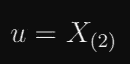

# 听我说完:我发现了一个更好的估计中位数的方法

> 原文：<https://towardsdatascience.com/hear-me-out-i-found-a-better-way-to-estimate-the-median-5c4971be4278?source=collection_archive---------10----------------------->

人们经常使用百分位数来汇总数据。中位数是第 50 个百分位数，众所周知，它对数据中的异常值非常稳健(与平均值相反)。此外，它代表了一个“典型样本”,平均值并不一定如此。有时，人们觉得他们需要追求分布的极端，并开始使用高百分位数(如第 95 和第 99)。与较低的百分位数相比，这些具有一些不期望的特性。此外，人们从一组数据中计算百分位数的简单方法并不完美，如果我们愿意增加一点复杂性，还可以改进。关于这个主题有一篇 arxiv 论文，在结论部分有很多数学内容。

# I)中间值和其他百分位数

照片由 Josh Harper 在 Flickr 上拍摄

中位数是一个非常简单的概念。将数据集或分布从中间分开的值。分布的一半概率质量(或数据中的一半样本)低于中位数，一半高于中位数。这个可以一概而论。我们也可以问一个点，30%的数据在它下面。一般来说，数据中 x%的数据低于它的点被称为第 *x* 百分位(因此第 *50* 百分位是中间值)。

# II)有限样本和形式理论

形式的[理论](https://en.wikipedia.org/wiki/Theory_of_forms)是一个来自柏拉图的想法，柏拉图认为物质世界不像永恒的、绝对的、不变的[想法](https://en.wikipedia.org/wiki/Idea)或形式那样真实或真实。我们在物质世界中看到的任何东西都不过是对这些形式的不完美的模仿。在统计学中，这些形式是潜在的概率分布，永远无法触及。我们能看到的只是这些分布产生的数据。我们从有限的真实世界样本中推断出的任何东西都只是对产生样本的分布的真实性质的估计。

分布有许多特性，百分位数是其中的一部分。我们如何估计分布的百分位数(或其他属性)？从分布中抽取一个样本(我们假设这是可能的)，并将其压缩成一个单一的描述性统计。描述性统计是将观察样本转换成单个数字的函数(详细处理见[此处](/bias-consistency-and-designing-kpis-for-data-driven-endeavors-e643e09a945d))。百分位数就是一个例子；样本均值是另一个。那么，什么样的描述性统计对于百分位数是最好的呢？

## **II-A)估算百分位数**

先说中位数。同样，它是这样一个点，一半分布在它的下面，一半在它的上面。如果我们知道分布，它就是在 *0.5* 计算的反 CDF。这是因为分布的 CDF(或累积分布函数)将该分布可以接受的任何值作为输入，并返回该分布低于该值的概率质量。所以，这个函数的反函数将把概率质量作为输入，把我们得到的低于它的概率质量作为输出。在 0.5 处的反向 CDF 将是分布的点，使得一半的概率质量低于它，或中值。

但这是在我们知道分布的反向 CDF，或者可以得到分布本身的情况下。实际上，我们只是从分布(比如说*x1，x2，…，xn*)中得到几个样本(比如说 *n* )。为了估计样本的 x 百分位数，一个合理的做法是找到一个点，使得其中的 x %在该点以下，其余的在该点以上。

为此，我们可以对样本进行分类。

1.  这个排序列表中的第一个样本(称之为 *X_(1)* )或者是 *X_1，X_2，…* 的最小值，没有比它更小的了。因此，它应该是第 *0* 百分位或最小值的一个很好的估计器。
2.  排序列表中的第二个样本(称之为 *X_(2)* )恰好具有比它小的( *n-1)* 个样本中的一个。换句话说， *100/(n-1)* 百分比的样本低于它，因此它应该对第 *100/(n-1)* 百分位数进行很好的估计。
3.  第三个样本的 *200/(n-1)* 百分比低于它，依此类推。
4.  第 *i* 个样本( *X_(i)* )具有其下样本的(*I-1)* 100/(n-1)*%。

> 脚注-1:如果你真的在乎效率，可以避免排序，使用[快速选择算法](https://en.wikipedia.org/wiki/Quickselect)在 *O(log(n))* 时间内找到所需的订单统计。

*X_(1)，X_(2)，…X_(n)* 被称为顺序统计量，它们都是一种描述性统计量(因为它们取整个样本并给出一个数字)。

它们代表的顺序统计量和百分位数。

问题是，这些顺序统计量将只给出( *i-1)*100/(n-1)* 形式的百分位数。如果 *n=11* 例如， *X_(1)* 是第 0 百分位， *X_(2)* 是第 10 百分位， *X_(3)* 是第 20 百分位，以此类推。所以我们只能得到 10 的倍数的百分点。如果我们想要 75%呢？我们知道 *X_(8)* 是第 70 百分位， *X_(9)* 是第 80 百分位。用他们的中点来估计 75 度是有道理的。

我们在这里做的是在已知的两个百分点之间进行线性插值。这是 python-numpy 中的 percentile 等所有库方法对不能很好地映射到顺序统计数据的百分点所做的事情(大多数情况下都是这样)。

一般来说，这种线性插值用于计算*q*-百分点(比如说*u；*此处 *q* 是 *0* 和 *1* 之间的分数，而不是百分比)结果在下面的公式(1)中。这里我们用 *x* 的小数部分来表示 *{x}* (所以 *{1.2}=0.2* ， *{2.9}=0.9* 等等)。这一点的证明(很容易理解)在附录 A 中给出。

等式(1-a):当我们进行线性插值时，q 百分位的一般表达式。

其中:

等式(1-b):等式 1-a 中 I 的定义。

让我们考虑一些简单的例子来看看这个公式的作用。当 *q=.5* 时，我们要中值。现在，如果 *n* 是奇数， *{q(n-1)}* 将为零，因为 *q(n-1)* 将变成整数。因此，只有等式(1)中的*X(I)*项将保留。对于 *n=3* ，并且 *q=.5* ，我们得到:

和

代入等式 1-a，得出:

这是有意义的，因为在一个由三个元素组成的有序数组中，第二个元素将是中间的一个元素，前后各有一个元素，将数组一分为二。

类似地，对于 *n=4* 和 *q=0.5* ，我们将得到:

## II-B)用指数模型研究偏差

我们在等式(1)中描述的是从某个分布的有限样本中计算*q*-百分点的方法。这是我们真实世界的描述性统计数据。当计算任何有限样本量时，这个描述性统计量本身具有某种分布， *n* 。也就是说如果我们做多次抽取 *n* 个样本并计算的实验，每次都会得到不同的答案。这个描述性统计的分布会有一些平均值，一些中位数等等。然后是我们从中抽取的 *n* 个样本的基础分布中值的实际值。描述性统计分布的平均值(此处为样本百分位数)和实际百分位数之间的差异被定义为描述性统计的偏差。在其他条件相同的情况下，我们希望这个偏差为 *0* 。不幸的是，对于大多数百分位数来说，情况并非如此。

让我们用一个简单的分布来演示这一点。因为百分位数通常用于延迟之类的东西，所以让我们使用一个只能取正值的分布。最简单的这种分布是指数分布。它只有一个参数(rate 参数)，但是让我们通过将它设置为 *1* (标准指数分布)来进一步简化事情。

事实上，我们有一个很好的表达式来描述它的顺序统计量。在[维基百科关于顺序统计](https://en.wikipedia.org/wiki/Order_statistic)的文章中，我们得到了 Renyi 提供的关于[指数分布](https://en.wikipedia.org/wiki/Exponential_distribution)的第 *i* 次顺序统计的公式(来自于 *n* 的样本量):

在这里， *Z_j* 是独立同分布指数本身，速率为 *1。*取两边的期望值，当基础分布为指数分布时，我们得到基于 *n* 个样本的顺序统计量的分布的期望值。

等式(2)指数分布的顺序统计量的期望值。

使用这个和等式(1)，我们可以找到任何顺序统计量的分布的期望值，从而找到任何百分位。

为了找到*q*-百分位数，首先将等式 1-b 中的 *i* 代入等式(2)中，得到我们需要的两个有序统计量:

并且根据等式 1-a 将它们组合，除了 *E(X_(i+1))* 中的最后一项不常见，意味着它仍然存在之外， *{q(n-1)}* 因子抵消了两者的所有常见项。

现在，我们可以用百分位数的真实值减去它，我们也知道标准指数分布的真实值:

并通过以下方式获得指数分布的 q 百分位中的偏差( *b_q* )(当使用线性插值策略时):

等式(3)当使用大多数软件包中使用的流行线性插值策略时，指数分布的 q 百分位偏差。

当抽取等式(3)中描述的大小为 *n* 的样本时，指数分布的 *q* 百分点的偏差在以下 python 函数中实现:

代码片段(1)测量指数分布的百分比偏差

除了测量偏差，上面的代码片段还可以帮助我们比较从有限样本中估计百分位数的各种策略的偏差。

例如，我们甚至需要线性插值吗？如果我们不做呢？当我们的*q*-百分位数落在 *X_(i)* 和 *X_(i+1)* 顺序统计量之间时，简单地使用 *X_(i)* 作为例子。它会不会对大样本量不再有影响？让我们绘制偏差作为线性插值和无插值策略的样本大小的函数，用于各种百分位数( *q* )和样本大小( *n=15* )。

图 1:指数分布的不同百分位数的偏差

图 1 中的关键要点:

1.  偏差在低百分位开始为负，逐渐增加到 *0* (在中位数仍然为负)。在大约第 67 百分位时，它变为零。从那里开始，它急剧增加，在最右边大约为 *1.5* (第 99 百分位)。请注意，指数分布的第 100 个百分位数(最大值)的偏差总是∞。这表明我们应该避免高百分位数，因为那里有很大的偏差。
2.  对于线性插值策略，存在偏差变为零的百分点。这不是第 50 个百分位数(或中位数),那里仍然有一些负面的偏见。非常接近 66.67 百分位。
3.  除了在不需要线性插值的百分点处，无插值策略比线性插值策略具有更差的偏差。

现在，让我们研究样本大小( *n* )增长时的行为，如下图 2 所示。

图 2:与图 1 相同，但是我们改变了样本大小(n)。

从图 2 的电影情节中可以得到的关键信息:

1.  随着样本量的增加，两种策略的偏差都减小。然而，线性插值策略总是比无插值策略有优势。
2.  随着样本量 *n* 的增加，偏差达到零的百分位数向 66.66%(或三分之二)收敛。但是即使对于小样本量，它也非常接近这个值。
3.  随着样本大小的增加，线性插值和无插值策略之间的偏差差异存在周期性。不知道是什么引起的。如果你有想法，也许可以留下评论？

从上面两张图可以清楚地看出，线性插值策略总是比无插值策略好。但是，在减少偏见方面，有没有其他更好的策略呢？事实上，至少对于指数分布来说，有一个完美的策略。

**线性插值的替代方法**

注意线性插值没有什么特别的，只是简单直观而已。我们可以同样容易地在 *X_(i)* 和 *X_(i+1)* 之间进行另一种插值。

我们可以使用等式(3)来提出消除偏差的策略，而不是简单地测量偏差。负责线性插值的项是 *{q(n-1)}。让我们用其他的因子来代替它，然后，我们可以明确地选择 f，以消除指数分布任何百分位的偏差。*

等式(4)插值因子 f，用于消除指数分布任何百分位的偏差。

这个想法在下面的 python 方法中实现，该方法给出了给定百分位、 *q* 和样本大小、 *n* 的插值因子 *f* :

代码片段(2):实现“低偏差插值”策略。这是流行的线性插值策略的竞争对手。

让我们称这个策略为“低偏差插值”策略。在图 1 和图 2 的曲线图中描绘这种策略并没有多大意义，因为根据其定义，它只是紧挨着 x 轴。

只有当我们从指数分布中抽取样本时，这个零偏差结论才是正确的，但如果该分布是其他分布，则不是正确的(因为在推导它时使用的所有数学都假设了指数分布)。然后将这种“低偏差插值策略”与针对其他底层分布的无处不在的标准“线性插值策略”进行比较将会很有趣(我们可以放弃“无插值策略”，因为它明显不如标准线性插值策略)。

我们将在下一节中这样做，但我们没有其他分布的顺序统计的封闭形式(指数分布是少数存在封闭形式的分布之一)。所以，我们不得不求助于模拟。

# III)代码和视觉模拟

詹姆斯·哈里逊在 [Unsplash](https://unsplash.com/s/photos/programming?utm_source=unsplash&utm_medium=referral&utm_content=creditCopyText) 上拍摄的照片

## III-A)平行宇宙的无限矩阵

从有限的样本量(比如说 *n* )进行估计的问题是，你的估计是有噪声的。如果你重复这个实验，你会得到不同的估计。这是一个问题，因为科学的基本租户是，结论应该是可重复实验验证的。

处理不确定性的方法是研究与不确定性相关的基本分布。我们可以想象平行宇宙，其中生成底层数据的过程完全相同，并且基于 *n* 个样本(独立且同分布)的实验在每个宇宙中进行。所有的数据都存储在一个巨大的矩阵中。来自第一个宇宙的数据位于矩阵第一行的数组中，来自第二个宇宙的数据位于第二行的数组中，依此类推，如下图所示。

然后，我们可以计算每个宇宙中的百分位数或其他描述性统计数据，并沿着列折叠矩阵。我们将留下一个由 m 个数据点组成的数组，代表我们的汇总统计在宇宙中的分布。我们可以让 *m* 尽可能大，这样我们就可以研究从小样本( *n* )计算的汇总统计分布的行为。例如，我们从 100，000 个平行宇宙中的各种样本大小中找到 Lomax 分布的估计中值( *m* )，并将这些中值绘制在下图 3 的直方图中。我们还有一条黄线，描绘了这个洛马克斯分布的中间值的真实值。我们可以看到跨越平行宇宙的估计值的平均值远离真实的中值(但是随着我们增加 *n* 而变得更接近)，但是跨越中间值的平行宇宙的中值总是在实际中值的正上方。稍后我们将对此进行更深入的探讨。

图 3:不同样本量的 Lomax 分布的计算中间值分布。

对于一些汇总统计数据，某些结论是显而易见的。例如，考虑样本均值。首先对每一列取平均值，然后对得到的数组的行取平均值，这与对所有的 *m×n* 条目取平均值是一样的。由于 *m→∞* ，我们可以调用大数定律，该定律认为这个平均值将与所有这些数字产生的分布的真实平均值相同。因为这正是无偏的定义，我们已经证明了样本均值总是无偏的，无论基础分布如何(只要分布的均值存在)。

对于百分位数，事情并不那么明显。例如，与样本均值不同，如果我们首先取每个 *m* 数组的中值，然后取所有 *m* 结果条目的中值或均值，这与一次取所有 *m×n* 数的中值是不同的。所以，是时候使用核选项了，模拟。我们将模拟本节中描述的 *m×n* 数(其中 *m* 非常大),然后通过图表得出关于百分点的各种结论。

## III-B)模拟矩阵

马库斯·斯皮斯克在 [Unsplash](https://unsplash.com/s/photos/the-matrix?utm_source=unsplash&utm_medium=referral&utm_content=creditCopyText) 上拍摄的照片

我在下面提供了 python 模拟器的基本版本(以及详细的注释),以演示我们描述的模拟是如何工作的。

代码片段(3)模拟一个非常大的平行宇宙矩阵。

在第二节中，我们得到了广泛使用的线性插值策略下指数分布的偏差的封闭形式。为了热身，让我们从指数模拟，看看我们的模拟器是否工作。

但是为什么仅仅停留在偏差上，我们还可以绘制一系列其他的度量标准。我们将为每个百分点(以及各种基本分布)绘制图表:

1.  两种策略的偏差。
2.  标准偏差:了解我们的估计在平行宇宙中有多大差异。我们不希望这个价格太高。
3.  中位数的差异:我们描述了样本均值是真实均值的无偏估计量(根据大数定律)。另一方面，样本中位数是真实中位数的有偏估计量。也就是说，如果我们取平行宇宙的中间值的平均值，我们会得到与真实中间值不同的结果。有人会说这对中间值不公平。为什么要取平行宇宙的平均值？为什么不是中间值呢？当我们这样做的时候，中位数(在平行宇宙中)就变成了真正的中位数。我们将为中位数证实这一点，但也为其他百分位数看看它。我们称这种差异为“DelMedian”。
4.  均方差:在偏差和方差之间经常有一个权衡，一个策略可能有较高的偏差，但方差较小。一个流行的做法是将它们合并成一个称为均方误差的单一指标。我们也会策划这个。

在下面的图 3 中，我们展示了这四个指数分布图。

图 4:从指数分布生成数据时，线性插值策略和低偏置策略的比较。

图 4 中的关键要点:

1.  两种插值策略的偏差在顶部图中。当数据从指数分布生成时，低偏差策略具有零偏差，因为这正是它的设计目的。因此，黄线环绕 x 轴。另一方面，线性插值策略的偏差仅在第 66 百分位附近为零，并且对于高百分位来说非常高(我们在下图中上升到第 95 百分位)。
2.  在第二个图中，我们取平行宇宙中计算出的百分位数的中间值，并取该百分位数真实值的差值。该图的行为类似于偏差图(是平行宇宙平均值的差异，而不是中值)。除了第 50 百分位附近的窄带(用两条红线标记)之外，低偏差策略的性能优于线性插值策略。
3.  第三个图显示了两种策略的标准偏差。对于高百分位数(大约从第 85 位开始)，低偏差策略的标准偏差高于线性插值策略的标准偏差。在此之前，两者颇为相似。
4.  第四个也是最后一个图比较了两种策略的均方误差(MSE)。对于高百分位数(80+)，这是由方差决定的，因此看起来非常像标准差图(第二个)。对于从低值到大约 60 的百分位数，MSE 由偏倚决定。因此，在这个指标上，低偏差策略比标准线性插值策略稍好。

这都是针对指数分布的，但这对于线性插值策略是不公平的，因为低偏差策略是在此基础上训练的。现在让我们为不同的分布绘制相同的图。我选择了对数正态分布，因为它也模拟了从 *0* 到 *∞* 的延迟。它比指数分布有更重的尾部。大多数结论仍然有效，并继续适用于各种其他分布(我没有包括这里的所有实验)，包括均值爆炸的重尾分布(例如:Lomax 分布)。你可以自己玩代码。具有所有附加功能的完整版本是[这里](https://gist.github.com/ryu577/ae1141873cda6a33ca56f31f9883f038)(首先查看代码片段-3 以了解发生了什么)。

图 5:与图 3 相同，但是分布从指数分布切换到对数正态分布。

图 5 中的关键要点:

1.  “低偏差策略”的偏差现在对于所有百分位数(尤其是高百分位数)都不为零。然而，就偏差而言，对于大多数百分位数，它仍然比标准线性插值策略好得多。因此，低偏置策略名副其实。另一个观察结果是低偏置策略的偏置与线性插值策略的偏置具有相反的符号。
2.  正如指数分布一样，对于高百分位数(也是 80+)，低偏差策略比线性插值策略具有更高的方差。

对于标准差和 MSE，其行为与我们对指数分布的行为非常相似。

总之，“低偏差策略”具有更好的特性(偏差、MSE 等。)对于我测试的所有分布，只要你计算的百分位数低于 60(包括最常用的中位数)。对于更高的百分位数，它继续是更好的偏差标准。

在所有这些模拟中观察到，第二个图显示了中位数的跨宇宙的中位数始终是真实的中位数(对于线性插值策略，第二个图似乎总是通过 *(0，0)* ，也参见图 3)。这是普遍适用的吗？关于这一利用测试版的优雅证明，见[本帖](https://stats.stackexchange.com/questions/551326/is-the-median-of-a-very-large-number-of-medians-always-equal-to-the-true-median)(Stats stack exchange；“大量中位数的中位数是否总是等于真中位数”)。

# 四)结论

这篇文章的要点是:

1.  对于取正值的分布(如延迟、收入等。)避免使用高百分位数(90+)。它们有很大的方差和很大的偏差，这使得它们几乎没有用，除非你有一个非常大的样本量。
2.  就像均值取决于真均值一样，中值取决于真中值。因此，虽然样本中值是真实中值的有偏估计，那只是因为我们取了平均值(根据偏差的定义)。
3.  用于估计不适合顺序统计的百分位数的线性插值策略不一定是我们能做到的最好的。在本文中，我们提出了一个替代策略，消除了指数分布简单情况下的偏差。在偏差和均方误差方面，对于各种百分位数和分布，所得到的插值策略优于线性插值策略。当你计算第 60 个或更低的百分位数时，尤其如此。

下面是一篇有更多细节的论文:[【2201.01421】用指数模型(arxiv.org)](https://arxiv.org/abs/2201.01421)减少分位数估计中的偏差和方差。

_______________________________________________________

如果你喜欢这个故事，成为推荐会员:)

https://medium.com/@rohitpandey576/membership

# 附录

## a)对精确的百分位数估计进行线性插值

在大小为 *n* 的样本中，*q*-百分位是顺序统计量 *X_(i)* ，如果:

如果我们幸运的话， *q(n-1)* 将是一个整数，那么 *q-* 百分位将很好地位于顺序统计量( *X_(i)* )上，并且等式成立。但是一般来说，我们总是可以选择两边的发言权，这将允许我们为任何 *q* 找到一个 *i* 。

但是，对应于 *i* 的顺序统计量不会对应于我们想要的精确百分位数。不过没关系，我们知道百分位数 *X_(i)* 对应的和 *X_(i+1)* 对应的比*高 1/(n-1)。*

我们现在可以通过使斜率相等来进行线性插值(如果百分位数 q 是 T30 u T31):

重新排列术语，

如果我们用 *x* 的小数部分来表示 *{x}* (所以 *{1.2}=0.2* ， *{2.9}=0.9* 等等)，并注意到:

我们可以写:

这与等式(1)相同。