# 心脏病分类—第二部分

> 原文：<https://towardsdatascience.com/heart-disease-classification-part-ii-9271af7c05af?source=collection_archive---------44----------------------->

*分类加上使用集成方法实现约 92%的总体准确度得分*


由[马库斯·斯皮斯克](https://unsplash.com/@markusspiske?utm_source=unsplash&utm_medium=referral&utm_content=creditCopyText)在 [Unsplash](https://unsplash.com/?utm_source=unsplash&utm_medium=referral&utm_content=creditCopyText) 上拍摄的照片

作为我上一篇文章的后续(在这里找到)，我将在这里展示我使用 UCI 的[心脏病数据集](https://archive.ics.uci.edu/ml/datasets/Heart+Disease)建立分类模型的步骤，以及利用集成方法实现更好的准确性评分。

通过创建能够更准确地对心脏病进行分类的合适的机器学习算法，将对卫生组织以及患者非常有益。

我们开始吧！

首先，我导入必要的库，并读入清理过的库。csv 文件:

```
import pandas as pd
import matplotlib.pyplot as plt
import numpy as np
from collections import Counter
from sklearn.preprocessing import StandardScaler
# data splitting
from sklearn.model_selection import train_test_split, cross_val_score, GridSearchCV
# data modeling
from sklearn.metrics import confusion_matrix,accuracy_score,roc_curve,roc_auc_score,classification_report,f1_score
from sklearn.linear_model import LogisticRegression
from sklearn.naive_bayes import GaussianNB
from xgboost import XGBClassifier
from sklearn.ensemble import RandomForestClassifier
from sklearn.tree import DecisionTreeClassifier
from sklearn.neighbors import KNeighborsClassifier
from sklearn.naive_bayes import GaussianNB
from sklearn.svm import SVC
#ensembling
from mlxtend.classifier import StackingCVClassifier
import xgboost as xgb
import itertools
from sklearn.dummy import DummyClassifier
from sklearn import metricsdf=pd.read_csv('Data/cleaned_df.csv',index_col=0)
```

接下来，我执行了训练测试分割，并对我们的数据进行了缩放。回顾一下，我们必须训练-测试-分割我们的数据，以评估我们的模型，缩放我们的数据使我们的自变量的值的范围正常化。

```
y = df["target"]
X = df.drop('target',axis=1)
X_train, X_test, y_train, y_test = train_test_split(X, y, test_size=0.20, random_state = 0)
scaler = StandardScaler()
X_train = scaler.fit_transform(X_train)
X_test = scaler.transform(X_test)
```

然后，我使用 sklearn 的 DummyClassifier 来确定我们的基线准确性——即使只是猜测，也应该达到的成功率。

```
dummy_clf = DummyClassifier(strategy="stratified")
dummy_clf.fit(X_train, y_train)
DummyClassifier(strategy='stratified')
dummy_clf.predict(X_test)
dummy_clf.score(X_test, y_test)
```

这给了我们 49.18%的准确性，这是一个有用的衡量比较我们的模型。

接下来，我采用了不同的机器学习模型，以找出哪种算法的准确度最高。

1.  逻辑回归
2.  k-最近邻
3.  朴素贝叶斯
4.  随机森林分类器
5.  极端梯度增强
6.  决策图表
7.  支持向量分类器

## 逻辑回归

```
#INSTANTIATE LOGISTIC REGRESSION
logreg = LogisticRegression()
logreg.fit(X_train, y_train)
y_pred_log = logreg.predict(X_test)
lr_acc_score=metrics.accuracy_score(y_test, y_pred_log)
lr_f1_score=metrics.f1_score(y_test, y_pred_log)
lr_conf_matrix = confusion_matrix(y_test, y_pred_log)
# checking accuracy
print('Test Accuracy score: ', lr_acc_score)
print('Test F1 score: ', lr_f1_score)
print("confusion matrix")
print(lr_conf_matrix)
print("\n")
print(classification_report(y_test,y_pred_log))
```

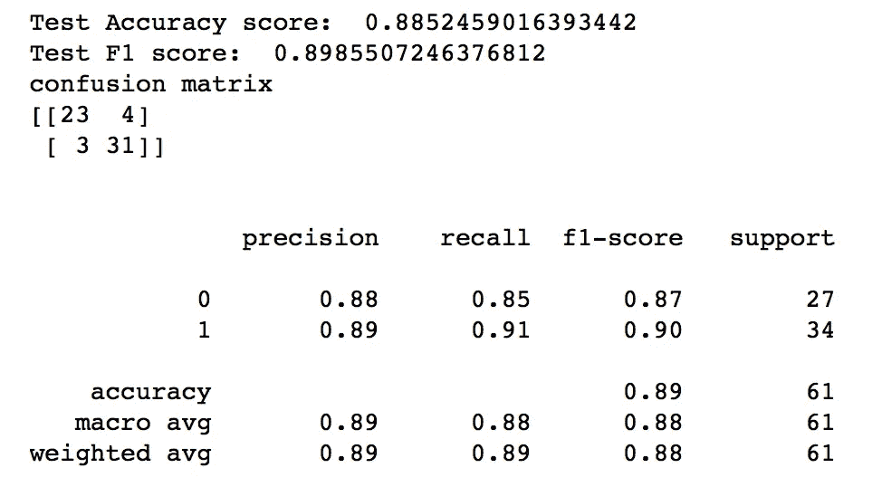

作者图片

## k-最近邻

```
#INSTANTIATE KNN MODEL
knn = KNeighborsClassifier()
knn.fit(X_train, y_train)
# make class predictions for the testing set
y_pred_knn = knn.predict(X_test)
knn_acc_score=metrics.accuracy_score(y_test, y_pred_knn)
knn_f1_score=metrics.f1_score(y_test, y_pred_knn)
knn_conf_matrix = confusion_matrix(y_test, y_pred_knn)
# checking accuracy
print('Test Accuracy score: ', knn_acc_score)
print('Test F1 score: ',knn_f1_score )
print("confusion matrix")
print(knn_conf_matrix)
print("\n")
print(classification_report(y_test,y_pred_knn))
```

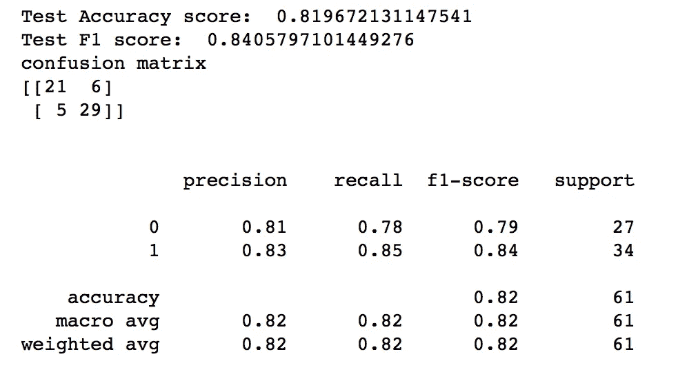

作者图片

## 决策图表

```
# INSATNTIATE DECISION TREE MODEL
tree = DecisionTreeClassifier()
tree.fit(X_train, y_train)
y_pred_tree = tree.predict(X_test)
tree_acc_score=metrics.accuracy_score(y_test, y_pred_tree)
tree_f1_score=metrics.f1_score(y_test, y_pred_tree)
tree_conf_matrix=confusion_matrix(y_test,y_pred_tree)
# checking accuracy
print('Test Accuracy score: ', tree_acc_score)
print('Test F1 score: ', tree_f1_score)
print("confusion matrix")
print(tree_conf_matrix)
print("\n")
print(classification_report(y_test,y_pred_tree))
```

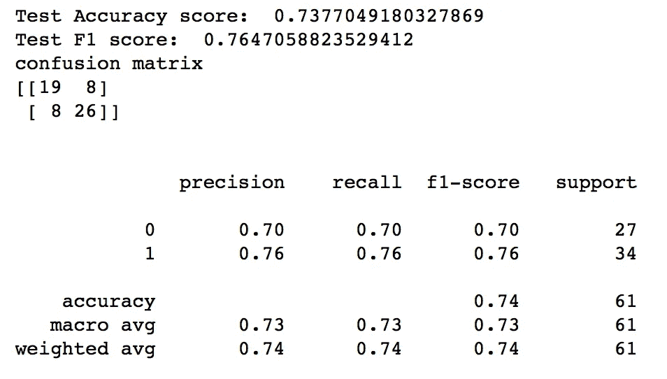

作者图片

## 随机森林

```
#INSTANTIATE RANDOM FOREST MODEL
rfc = RandomForestClassifier()
rfc.fit(X_train, y_train)
y_pred_forest = rfc.predict(X_test)
rfc_acc_score=metrics.accuracy_score(y_test, y_pred_forest)
rfc_f1_score = metrics.f1_score(y_test, y_pred_forest)
rfc_conf_matrix=confusion_matrix(y_test,y_pred_forest)
# checking accuracy
print('Test Accuracy score: ', rfc_acc_score)
print('Test F1 score: ', rfc_f1_score)
print("confusion matrix")
print(rfc_conf_matrix)
print("\n")
print(classification_report(y_test,y_pred_forest))
```

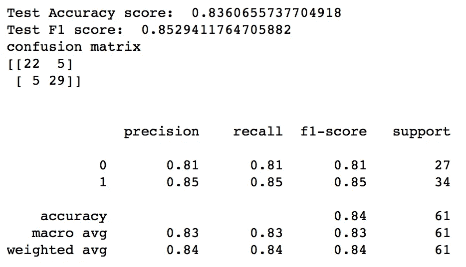

作者图片

## 极端梯度推进

```
# Instantiate the XGBClassifier: xg_cl
xg_cl = xgb.XGBClassifier(learning_rate=0.01, n_estimators=10, seed=25)
# Fit the classifier to the training set
xg_cl.fit(X_train,y_train)
# Predict the labels of the test set: preds
y_pred_xgb = xg_cl.predict(X_test)
xgb_acc_score=metrics.accuracy_score(y_test, y_pred_xgb)
xgb_f1_score = metrics.f1_score(y_test, y_pred_xgb)
xgb_conf_matrix=confusion_matrix(y_test,y_pred_xgb)
# Compute the accuracy: accuracy
# checking accuracy
print('Test Accuracy score: ',xgb_acc_score)
print('Test F1 score: ', xgb_f1_score)
print("confusion matrix")
print(xgb_conf_matrix)
print("\n")
print(classification_report(y_test,y_pred_xgb))
```

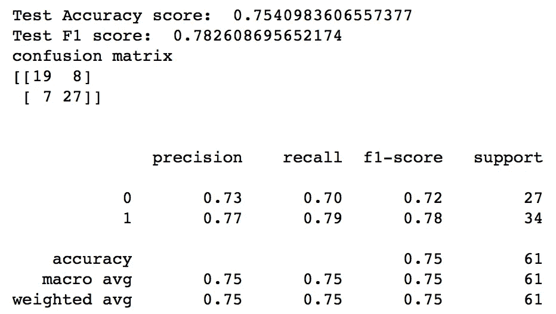

作者图片

## 朴素贝叶斯

```
nb = GaussianNB()
nb.fit(X_train,y_train)
y_pred_nb = nb.predict(X_test)
nb_conf_matrix = confusion_matrix(y_test,y_pred_nb)
nb_acc_score = metrics.accuracy_score(y_test, y_pred_nb)
nb_f1_score=metrics.f1_score(y_test, y_pred_nb)
print('Test Accuracy score: ',nb_acc_score)
print('Test F1 score: ', nb_f1_score)
print("confusion matrix")
print(nb_conf_matrix)
print("\n")
print(classification_report(y_test,y_pred_nb))
```

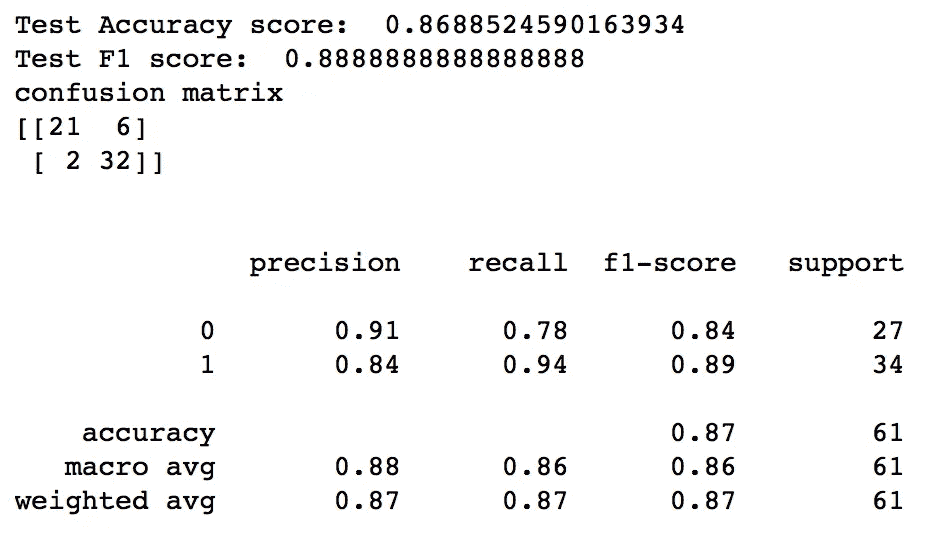

作者图片

## 支持向量分类器

```
svc =  SVC(kernel='rbf', C=2)
svc.fit(X_train, y_train)
y_pred_svc = svc.predict(X_test)
svc_conf_matrix = confusion_matrix(y_test, y_pred_svc)
svc_acc_score = metrics.accuracy_score(y_test, y_pred_svc)
svc_f1_score = metrics.f1_score(y_test, y_pred_svc)
print('Test Accuracy score: ',svc_acc_score)
print('Test F1 score: ', svc_f1_score)
print("confusion matrix")
print(svc_conf_matrix)
print("\n")
print("Accuracy of Support Vector Classifier:",svc_acc_score,'\n')
print(classification_report(y_test,y_pred_svc))
```

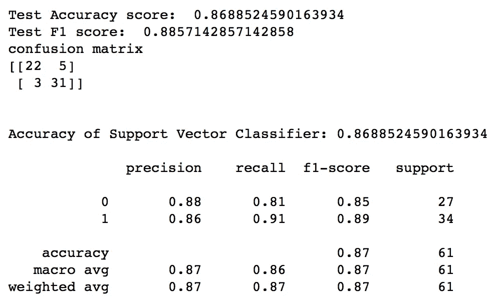

作者图片

正如你在上面看到的，我打印了每个模型的准确度分数和 F1 分数。这是因为我不确定哪个指标最适合我的业务案例。在阅读了 Purva 的这篇伟大的[文章](https://medium.com/analytics-vidhya/accuracy-vs-f1-score-6258237beca2)后，我决定使用准确性作为我的分类标准，因为在类别分布上没有很大的差异，并且因为在确定谁有或没有心脏病时，真正的积极和真正的消极很重要。

此外，我们看到上面的准确度分数在 70-80 之间，我们如何提高这个准确度分数？我们可以用合奏法！集成方法是创建多个模型并组合它们以产生改进结果的技术。与单一模型相比，集成方法通常表现更好。有不同类型的集合方法可以被利用，关于集合方法的更多信息请参见这篇文章。

</ensemble-methods-bagging-boosting-and-stacking-c9214a10a205>  

对于当前的项目，我使用了一个堆叠 cv 分类器，它通过一个元分类器组合了多个分类模型，并使用交叉验证来为二级分类器准备输入数据。对于分类器，我检查了每个模型的准确度分数:

```
model_ev = pd.DataFrame({'Model': ['Logistic Regression','Random Forest','Extreme Gradient Boost',
                    'K-Nearest Neighbour','Decision Tree','Naive Bayes', 'Support Vector Classifier'], 'Accuracy': [lr_acc_score,
                    rfc_acc_score,xgb_acc_score,knn_acc_score,tree_acc_score,nb_acc_score, svc_acc_score]})
model_ev
```

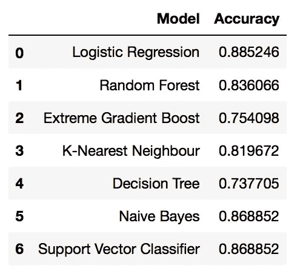

作者图片

然后，我选择了表现最好的 3 个模型，并将它们输入到堆叠 cv 分类器中:

```
scv=StackingCVClassifier(classifiers=[logreg,nb,svc],meta_classifier=nb,random_state=22)
scv.fit(X_train,y_train)
scv_predicted = scv.predict(X_test)
scv_conf_matrix = confusion_matrix(y_test, scv_predicted)
scv_acc_score = accuracy_score(y_test, scv_predicted)
scv_f1_score = f1_score(y_test, scv_predicted)print("confusion matrix")
print(scv_conf_matrix)
print("\n")
print("Accuracy of StackingCVClassifier:",scv_acc_score*100,'\n')
print(classification_report(y_test,scv_predicted))
```

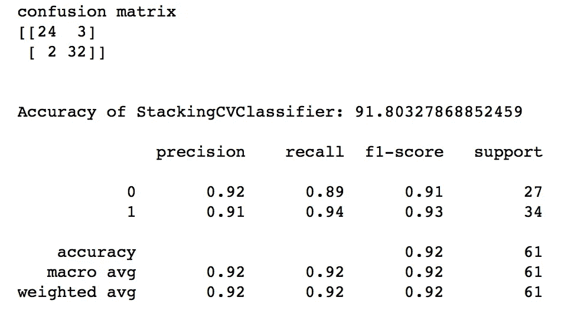

作者图片

如上所述，我们使用堆叠 cv 分类器获得了大约 92%的准确率。

让我们对系综模型的混淆矩阵有一个更好的了解

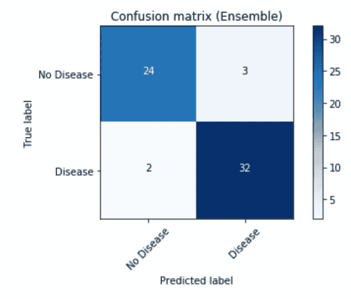

作者图片

正如我们所看到的，集合模型稍微超出了非主导类的预测。

接下来，让我们绘制所有模型的 ROC 曲线。

```
# Generate ROC curve values: fpr, tpr, thresholds
fpr_log, tpr_log, thresholds_log = roc_curve(y_test, y_pred_log)
fpr_knn, tpr_knn, thresholds_knn = roc_curve(y_test, y_pred_knn)
fpr_tree, tpr_tree, thresholds_tree = roc_curve(y_test, y_pred_tree)
fpr_rfc, tpr_rfc, thresholds_rfc = roc_curve(y_test, y_pred_forest)
fpr_xgb, tpr_xgb, thresholds_log = roc_curve(y_test, y_pred_xgb)
fpr_nb, tpr_nb, thresholds_log = roc_curve(y_test, y_pred_nb)
fpr_svc, tpr_svc, thresholds_log = roc_curve(y_test, y_pred_svc)
fpr_ens, tpr_ens, thresholds_ens = roc_curve(y_test, scv_predicted)# Plot ROC curve
plt.plot([0, 1], [0, 1], 'k--')
plt.plot(fpr_log, tpr_log,label = 'Logistic')
plt.plot(fpr_knn, tpr_knn,label = 'KNN')
plt.plot(fpr_tree, tpr_tree,label = 'Decision Tree')
plt.plot(fpr_rfc, tpr_rfc,label = 'Random Forest')
plt.plot(fpr_xgb,tpr_xgb,label= 'XGB')
plt.plot(fpr_nb,tpr_nb,label= 'Naive Bayes')
plt.plot(fpr_svc,tpr_svc,label= 'Support Vector Classifier')
plt.plot(fpr_ens, tpr_ens,label = 'Ensemble')
plt.xlabel('False Positive Rate')
plt.ylabel('True Positive Rate')
plt.legend()
plt.title('ROC Curve no GridSearch')
plt.show()
```

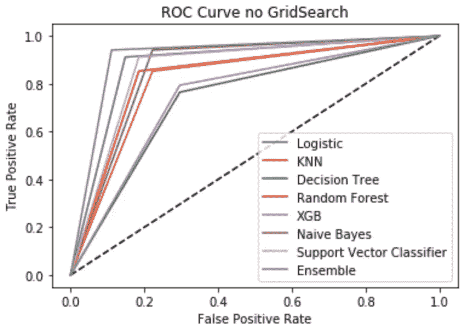

作者图片

从我们的可视化中，我们可以清楚地看到集合模型在我们测试的所有模型中表现最好。

最后，我计算了特征重要性，这是根据独立变量在预测目标变量时的有用程度给它们打分。

```
feature_importance = abs(logreg.coef_[0])
feature_importance = 100.0 * (feature_importance / feature_importance.max())
sorted_idx = np.argsort(feature_importance)
pos = np.arange(sorted_idx.shape[0]) + .5featfig = plt.figure()
featax = featfig.add_subplot(1, 1, 1)
featax.barh(pos, feature_importance[sorted_idx], align='center')
featax.set_yticks(pos)
featax.set_yticklabels(np.array(X.columns)[sorted_idx], fontsize=10)
featax.set_xlabel('Relative Feature Importance')plt.tight_layout()   
plt.show()
```

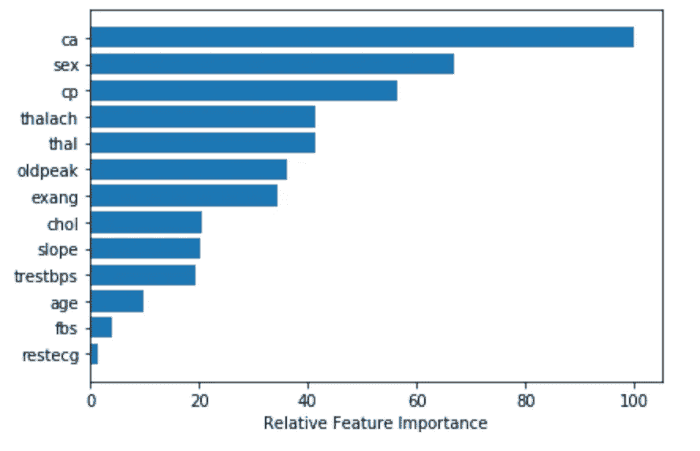

作者图片

从上图可以看出，变量 **ca** 对预测一个人是否患有心脏病最有影响。变量 **ca** 指荧光镜着色的主要血管数(0-3)。主要血管的数量越少，流向心脏的血液量就越少，增加了心脏病的发病率。

# 摘要

从这个分类项目中，我们可以看到，与使用单独的分类模型相比，使用堆叠 cv 分类器提高了整体准确性。我们的基本模型表现为大约 49%,而我们的集合模型表现为大约 92%的准确性。我还试图使用网格搜索方法来改进单个模型，并使用堆叠 cv 分类器，但只能达到与当前集成模型相同的精度。

感谢您的阅读:)所有代码都在我的 [GitHub](https://github.com/mkosaka1/HeartDisease_Classification) 上！