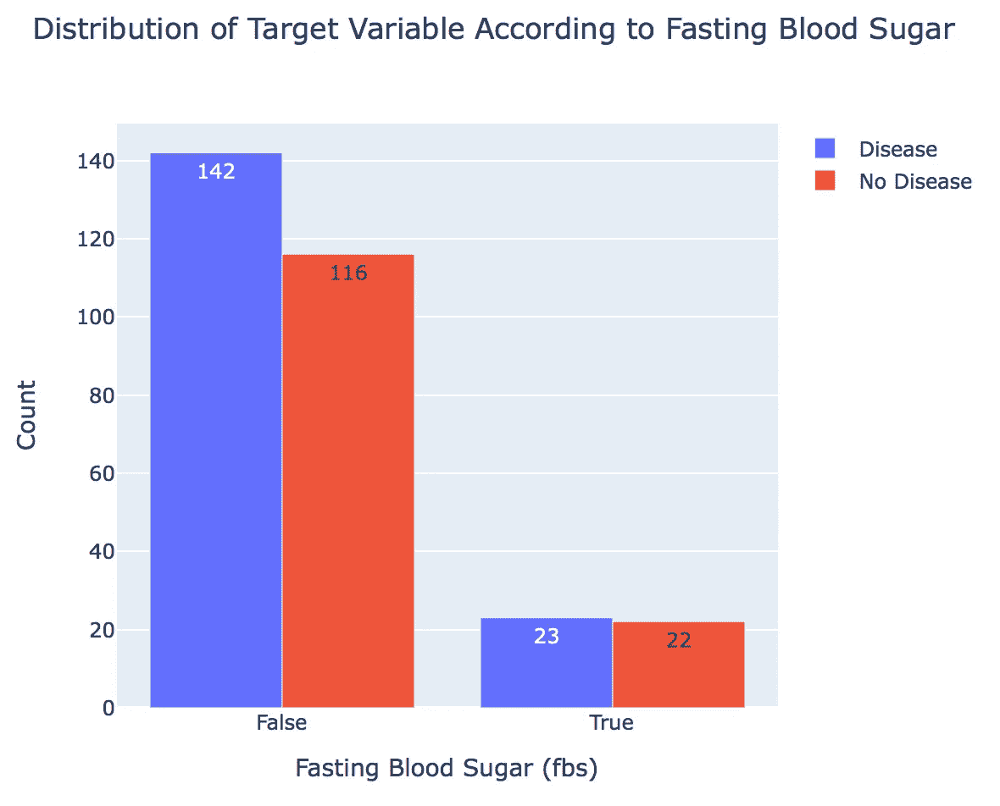

# 心脏病分类项目—第一部分

> 原文：<https://towardsdatascience.com/heart-disease-classification-project-part-i-eee6301121bf?source=collection_archive---------43----------------------->

## *对 UCI 心脏病数据集的探索性数据分析*


比尔·牛津在 [Unsplash](https://unsplash.com/s/photos/hospital?utm_source=unsplash&utm_medium=referral&utm_content=creditCopyText) 上的照片

在美国，心血管疾病或心脏病是女性和男性以及大多数种族/民族的主要死亡原因。心脏病描述了一系列影响心脏的情况。心脏病范围内的疾病包括血管疾病，如冠状动脉疾病。根据疾病预防控制中心的数据，每年大约有四分之一的死亡是由于心脏病。世卫组织指出，人类的生活方式是这种心脏问题背后的主要原因。除此之外，还有许多关键因素提醒人们，这个人可能有患心脏病的机会，也可能没有。

我们将使用在这里[发现的 UCI 心脏病数据集](https://archive.ics.uci.edu/ml/datasets/Heart+Disease)进行探索性数据分析(EDA)，在第二部分中，我们将构建分类模型，并使用集成方法来产生高度精确的模型。在目前的数据集中，这项研究的出版物包括 303 名患者，并从 76 个与预测心脏病相关的特征中选择了 14 个。

## 变量描述

1.  年龄:以年为单位的年龄
2.  性别:性别(1 =男性；0 =女性)
3.  cp:胸痛类型—值 1:典型心绞痛，值 2:非典型心绞痛，值 3:非心绞痛性疼痛，值 4:无症状
4.  trestbps:静息血压(入院时单位为毫米汞柱)
5.  chol:血清胆固醇，单位为毫克/分升
6.  fbs:(空腹血糖> 120 mg/dl) (1 =真；0 =假)
7.  restecg:静息心电图结果-值 0:正常，值 1:ST-T 波异常(T 波倒置和/或 ST 抬高或压低> 0.05 mV)，值 2:根据 Estes 标准显示可能或明确的左心室肥大
8.  thalach:达到最大心率
9.  exang:运动诱发的心绞痛(1 =是；0 =否)
10.  oldpeak =运动相对于休息诱发的 ST 段压低
11.  斜率:峰值运动 ST 段的斜率-值 1:上坡，值 2:平，值 3:下坡
12.  ca:荧光镜染色的主要血管数(0-3)
13.  thal: 3 =正常；6 =修复缺陷；7 =可逆转缺陷
14.  目标:1 =疾病，0 =无疾病

## 变量类型

1.  连续-年龄，trestbps，chol，thalach，oldpeak
2.  二进制—性别、fbs、exang、目标
3.  分类— cp、restecg、斜率、ca、thal

让我们从 EDA 开始吧！

首先，我们导入必要的库并读入数据集

```
import pandas as pd
import numpy as np
import matplotlib.pyplot as plt
import seaborn as sns
import plotly.graph_objects as go # To Generate Graphs
import plotly.express as px # To Generate box plot for statistical representation
%matplotlib inline
import plotly.express as pxdf=pd.read_csv('heart.csv')
df.head()
```


作者图片

上面提供了变量的描述，只是为了重申，**目标**是我们的因变量，其中 0 =无心脏病，1 =心脏病。

让我们检查是否有任何错误数据值，以便分类变量具有正确的类别数，如上所述。检查完所有变量后，我们发现 **thal** 和 **ca** 各有一个额外的类别。我们将用 NaN 值替换这些值，然后用中值替换这些值

```
df.thal.value_counts()
#3 = normal; 6 = fixed defect; 7 = reversable defect# OUTPUT
2    166
3    117
1     18
0      2
Name: thal, dtype: int64# Replace 0 with NaN
df.loc[df['thal']==0, 'thal'] = np.NaNdf.ca.value_counts()
# number of major vessels (0-3) colored by flourosopy# OUTPUT
0    175
1     65
2     38
3     20
4      5
Name: ca, dtype: int64# Replace 4 with NaN
df.loc[df['ca']==4, 'ca'] = np.NaN# Replace NaN with median values
df=df.fillna(df.median())
```

接下来，让我们通过可视化箱线图来检查异常值


作者图片

从这个图像中我们可以看到， **chol** 有一个极值，我们将用它的中值来代替。

现在，我们将使用 plotly 创建更多的可视化来更好地理解数据。首先让我们看看我们的**目标**变量的分布:

```
y=df.target.value_counts()
x=['Disease','No Disease']fig=go.Figure(
    data=[go.Bar(x=x,y=y,text=y, textposition='auto',)],
                    layout=go.Layout(title=go.layout.Title(text='Target Variable (Heart Disease) Distribution')))
fig.update_xaxes(title_text='Target')
fig.update_yaxes(title_text='Number of Individuals')
fig.show()
```


作者图片

存在轻微的类不平衡，但没有严重到需要上采样/下采样方法。

让我们看看数据集中**年龄**的分布:

```
fig = px.histogram(df, x='age',color_discrete_sequence=['coral'])
fig.update_xaxes(title_text='Age')
fig.update_yaxes(title_text='Count')
fig.update_layout(title_text='Distribution of Age')fig.show()
```


作者图片

从上图中，我们可以看到当前数据集中的大多数患者年龄在 50-60 岁之间。

让我们看看**性别**在**目标**变量中的分布:

```
female=df.loc[df['sex']==0]
female_values=female.target.value_counts()
male=df.loc[df['sex']==1]
male_values=male.target.value_counts()
target=['No Disease','Disease']fig = go.Figure(data=[
    go.Bar(name='female', x=female_values.index, y=female_values, text=female_values, textposition='auto'),
    go.Bar(name='male', x=male_values.index, y=male_values, text=male_values, textposition='auto'),
])
fig.update_xaxes(title_text='Target')
fig.update_yaxes(title_text='Count')
fig.update_layout(title_text='Distribution of Sex According to Target Variable')
fig.update_layout(barmode='group')
fig.show()
```


作者图片

从上图我们可以看出，在心脏病组(1)中，男性患者多于女性患者。

接下来，让我们看看胸痛或心绞痛( **cps** )在我们的**目标**变量中是如何变化的。当心肌没有获得足够的富氧血液时，就会发生心绞痛，导致胸部不适，通常还会蔓延到肩部、手臂和颈部。

```
cp=['Typical Angina','Atypical Angina','Non-Anginal Pain','Asymptomatic']
y1=df.loc[df['target']==0].cp.value_counts()
y2=df.loc[df['target']==1].cp.value_counts()fig = go.Figure(data=[
    go.Bar(name='Disease', x=cp, y=y2),
    go.Bar(name='No Disease', x=cp, y=y1)
])
fig.update_layout(barmode='group')
fig.update_xaxes(title_text='Chest Pain Type')
fig.update_yaxes(title_text='Count')
fig.update_layout(title_text='Distribution of Target Variable According to Chest Pain Type')fig.show()
```


作者图片

从上图中可以看出，大多数非疾病患者经历了典型的心绞痛，与疾病患者相比，心绞痛被描述为胸闷。在经历过非典型心绞痛和非心绞痛的患者中，似乎也有一种平衡。

现在让我们看看空腹血糖( **fbs** )在**目标**变量中是如何变化的。空腹血糖是一项糖尿病指标，空腹血糖> 120 毫克/天被视为糖尿病(正确):

```
dis=df.loc[df['target']==1]
dis_values=dis.fbs.value_counts()
nodis=df.loc[df['target']==0]
nodis_values=nodis.fbs.value_counts()
target=['No Disease','Disease']
d=['False','True']fig = go.Figure(data=[
    go.Bar(name='Disease', x=d, y=dis_values, text=dis_values, textposition='auto'),
    go.Bar(name='No Disease', x=d, y=nodis_values, text=nodis_values, textposition='auto'),
])
fig.update_layout(barmode='group')
fig.update_xaxes(title_text='Fasting Blood Sugar (fbs)')
fig.update_yaxes(title_text='Count')
fig.update_layout(title_text='Distribution of Target Variable According to Fasting Blood Sugar')fig.show()
```



作者图片

在这里，我们看到，与类 false 相比，类 true 的数量更低。这表明 **fbs** 可能不是区分心脏病患者和非疾病患者的强有力特征。

# 摘要

在本文中，我们展示了一些 EDA 技术，可以在 UCI 的心脏病数据集上进行，为建立分类模型做准备。我们还创建了一些可视化工具来进一步理解数据，并确定哪些变量可能对区分疾病和非疾病患者有影响。在第二部分，我将建立一个分类模型，并使用集成方法来创建一个更准确的模型。

感谢阅读:)所有代码都在我的 [Github](https://github.com/mkosaka1/HeartDisease_Classification) 上提供。