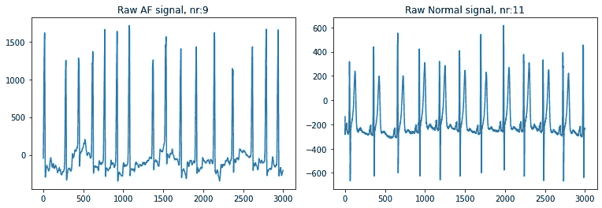
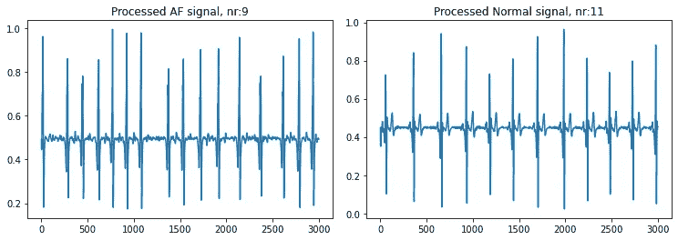
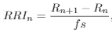
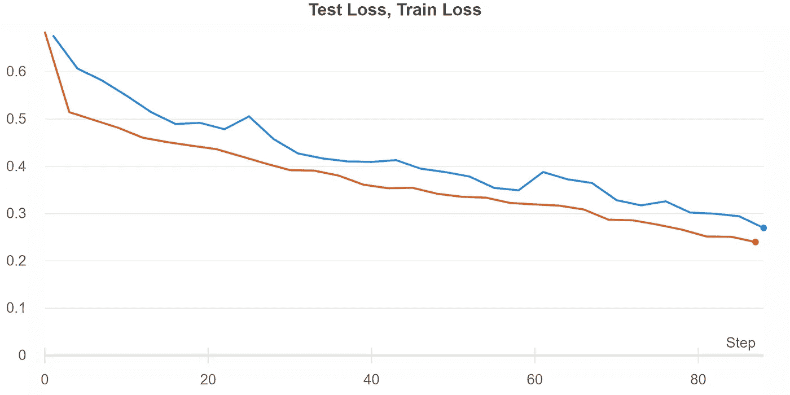
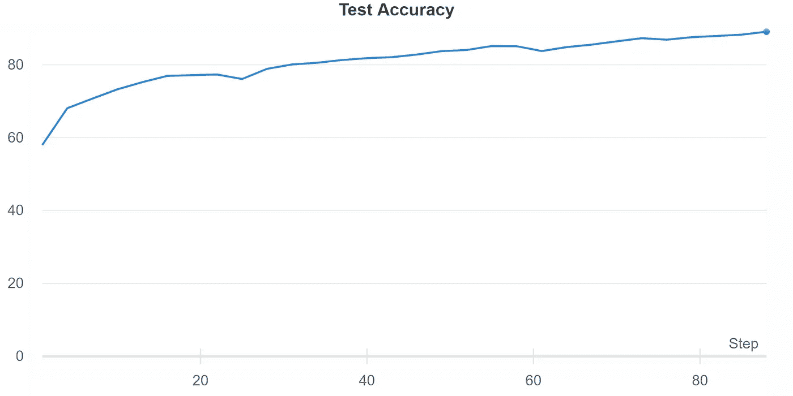
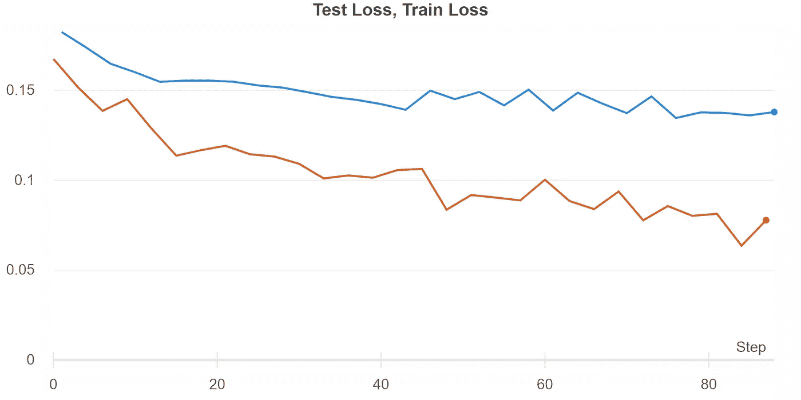
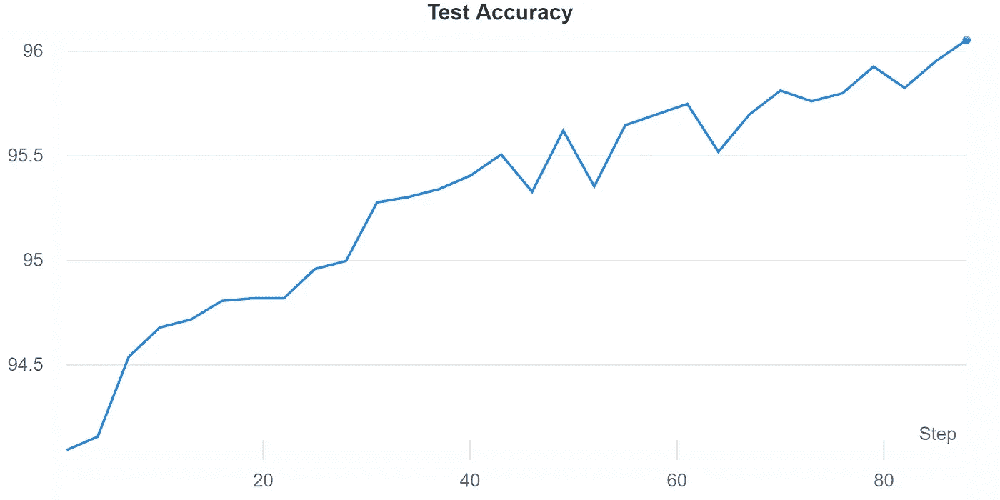

# PyTorch 中使用变压器的心脏病分类

> 原文：<https://towardsdatascience.com/heart-disease-classification-using-transformers-in-pytorch-8dbd277e079?source=collection_archive---------20----------------------->

## 心脏病是一个重要的问题，深度学习可以解决问题。变形金刚是未来:当我们把一切结合起来会发生什么？

在本文中，将实现并讨论使用心电图(ECG/ EKG)数据的心房颤动(AF)分类系统。分类系统将是二元的(正常窦性心律，AF ),并将基于使用 PyTorch 框架的变压器网络。本文的结构如下:首先，将介绍手头的问题以及所用的数据；其次，将介绍网络的技术细节；第三，将介绍网络的实施和培训；最后，将介绍结果和讨论。这个项目的资源库可以在这里找到:[https://github.com/bh1995/AF-classification](https://github.com/bh1995/AF-classification)。

# 心房颤动分类问题

心脏病是全球死亡的主要原因之一[1]。心脏病通常会导致心脏行为的不规则，称为心律不齐。在所有类型的心律失常中，心房纤维性颤动(AF)是最常见的心律失常，估计其在 2%至 4%的人群中流行；随着人口平均年龄的增加，预计将来流行率将线性增加。根据目前的统计数据，任何一个欧洲血统的人一生中患房颤的概率约为 37%[2]。标准的心脏监测技术是心电图(ECG/ EKG)，它监测心脏中的电信号，因此对于临床医生诊断心律失常非常有用。这个项目的目的是利用真实的、公开可用的、已经被临床医生标记的心电图数据来训练深度学习模型。

本项目中使用的数据来自多个来源，即 2018 年中国生理信号挑战赛(CPSC2018)[3]、圣彼得堡英卡特 12 导联心律失常数据库[4]、佐治亚州 12 导联心电图挑战赛数据库(CinC2020)[5]、2017 年心脏病挑战赛生理网络计算(CinC2017)数据集[5]、背景心律失常数据库(CACHET-CADB)[6]。

所使用的数据源以不同的采样率收集他们的 ECG 数据，并且使用不同的设备(有些使用 Holter 监护仪，有些使用医院级 12 导联 ECG)，这导致每个数据源的性质略有不同。为了增加深度学习模型的学习能力，明智的做法是以规范化的方式处理所有数据。在这个项目中，所有信号都使用了带通滤波器(FIR 滤波器),因此只保留了[0.5，40]范围内的频率。信号还以 300 Hz 的速率被重新采样，并被分成长度为 10 秒的单个片段(因此模型的每个输入是长度为 3000 个数据点的一维数组)。然后对每 10 秒的片段进行归一化，使得所有值都在 0 和 1 之间。下图显示了两个原始(raw)信号(一个 AF 和一个 normal)以及预处理后的两个相同信号。

显示房颤(左)和健康正常窦性心律(右)原始信号的图。

显示房颤(左)和健康正常窦性心律(右)的预处理信号的图。

第一幅图像中的信号图显示了标准、清晰的 10 秒长 ECG 记录。图中的 y 轴代表电压差，x 轴代表采样速率，本例中为 300 Hz。从图中可以看出，一个人的心脏电压与另一个人的不同。对于我们人类来说，显然是在 x 轴上寻找一种模式，而不是在 y 轴上看振幅。然而，深度学习模型以无偏见的方式计算特征，因此会天真地使用所有给定的信息(即使幅度通常与心律失常分类无关)。这就是为什么将数据标准化到给定的时间间隔(例如[-1，1]或[0，1])。上图显示了一个房颤的例子，这可以从一些心跳之间的不规则间隔中看出。这种情况是一个“简单”的例子，因为即使是业余爱好者也能清楚地看到 AF 信号的异常。

本项目使用的完整数据集可通过 [**链接**](https://drive.google.com/drive/folders/1PONXv-dtV26nqTFz_EBEhEufLQiETycF?usp=sharing) 下载。数据全部经过预处理，以数组的形式保存在 **.h5** 文件格式中。下面的代码片段显示了如何加载数据集的示例。

为此项目加载数据集。

# **型号描述**

本项目测试了两个模型，它们都遵循相同的基本架构，但使用不同的输入。第一种模型使用预处理的 ECG 信号作为其唯一的输入，而第二种模型使用预处理的 ECG 信号以及该信号的所谓 RRI (RR-interval)。RRI 是一个心跳和连续心跳之间的估计时间，以秒为单位。通过使用泛汤普金斯算法[10]估计信号中的 R 峰(每个心跳的中间位置),然后使用以下等式来计算 RRI。

其中 *Rn* 为给定峰值， *fs* 为频率(采样率)。为了保持模型的输入 RRI 序列的固定长度，使用总 RRI 的前 10 个，并且如果发现少于 10 个，则补零。

项目中使用的模型受到了[8]工作的启发。该模型由以下模块组成:1)由一系列卷积层组成的嵌入网络，2)变换器编码器层的堆叠，3)由一系列全连接层组成的分类头。模型架构和模型训练的代码可以在[这里](https://github.com/bh1995/AF-classification)找到。

**嵌入**:嵌入网络将一维卷积应用于原始 ECG 信号，这导致一系列嵌入表示( *x[0]，…，x[n]* )。这些嵌入的表示与位置编码( *p[0]，…，p[n]* )相加，以表示每个序列的顺序，如原始 transformer 论文中所做的那样[7]。结果是位置编码嵌入， *e =* ( *x[0]+p[0]，…，x[n]+p[n]* )，然后用作堆叠变换器编码器层模块的输入。

**转换器编码器层:**转换器模块由堆叠的转换器编码器层组成，其中每个编码器由多头自关注机制子层组成，经过反复试验，发现四个编码器层和头产生了良好的结果。同样，经过反复试验，编码器内的嵌入维数被选择为 *64* ，编码器层内的前馈网络的维数被选择为 *512* 。转换器模块的输出是具有形状、[序列长度、批量大小、嵌入]的注意力权重的张量。必须以某种方式转换输出，以便将其输入分类头模块，即需要将其转换为形状[批量大小，嵌入]。尝试了两种方法，第一种是简单地取序列维度上张量的平均值，第二种是使用自我注意力集中层，如[9]的工作中所建议的。两种方法都表现出良好的性能，然而，利用自我注意池层产生了最好的结果。自我注意力集中层被应用于变换器模块的输出，该变换器模块产生嵌入，该嵌入是编码器序列中特征的学习平均。

**分类头:**自我注意力池的输出被用作最终分类头的输入，以产生用于预测的逻辑。最终的分类头是两个完全连接的层，中间有一个分离层。

# 培养

使用二进制交叉熵作为损失函数，AdamW 算法作为优化器来训练该模型( *β1=0.9，β2=0.98，ε=10^(-9)* )。10^(-3 的初始学习速率),并且使用学习调度器来在前 30 个时期之后开始每五个时期将学习速率降低 5%。该数据集总共有 52 370 个 10 秒长的 ECG 信号，其中正常与房颤标记的比例大致相等。随机选择数据集的 85% (44 514)用于训练，剩余的 15% (7 855)用于测试。使用的批量大小为 10，并且在云计算环境中使用特斯拉 P100 GPU 进行训练。

# **结果**

两种模型的结果将在下面给出，首先是仅使用原始 ECG 信号的模型，然后是使用原始 ECG 信号以及该信号的 RRI 的模型。

**使用原始 ECG 信号:**

如下图所示，该模型显示了各时期的一致学习，没有任何相当大的过度拟合。测试准确度也持续增长。由于这项任务是对疾病的二元分类，敏感性和特异性可以说是一个更好的性能指标。训练结束时测试数据上的**灵敏度**和**特异性**分别为 **85.6** 和 **92.7** 。训练时间大约是每个时期 178 秒。

各时期的训练(橙色)和测试(蓝色)数据的损失曲线。

跨时期测试数据模型的准确性。

**使用原始 ECG 信号和 RRI:**

当在训练/推断期间使用 RRI 特征时，模型性能提高。下图显示，模型显示出明显的过度拟合迹象，但是，这种过度拟合不会对各时期测试数据的模型准确性产生负面影响。训练结束时测试数据的**灵敏度**和**特异性**分别为， **96.9** 和 **95.6** 。训练时间大约是每个纪元 1550 秒。

各时期的训练(橙色)和测试(蓝色)数据的损失曲线。

跨时期测试数据模型的准确性。

# 结论

从结果可以清楚地看出，基于变换器编码器的网络在对 10 秒长的 ECG 信号中的 AF 进行分类方面工作良好。同样清楚的是，使用 RRI 特征以训练和推理时间增加近九倍为代价，提供了模型性能的巨大改进。这种时间增加归因于用于执行 R 峰检测的泛汤普金斯算法很慢的事实。

# 参考

[1]心脏病和中风统计 2018 年更新:来自美国心脏协会的报告。美国心脏协会，1，2018。

[2]与欧洲心胸外科协会(EACTS)合作制定的 2020 年欧洲心脏病学会房颤诊断和管理指南:欧洲心脏病学会(ESC)房颤诊断和管理特别工作组在 ESC 欧洲心律协会(EHRA)的特殊贡献下制定。欧洲心脏杂志，2020 年 8 月。ehaa612。

[3]刘芳芳、刘春燕、赵良英、张晓燕、吴晓林、徐晓燕、刘延林、马春燕、魏胜生、何志清、李俊卿和郭念英。一个用于评估心电图节律和形态学异常检测算法的开放式数据库。医学影像与健康信息学杂志，2018，8(7):1368–1373。

[4] Goldberger，a .，Amaral，l .，Glass，l .，Hausdorff，j .，Ivanov，P. C .，Mark，r .，& Stanley，H. E. (2000 年)。生理银行、生理工具包和生理网:复杂生理信号新研究资源的组成部分。循环[在线]。101 (23)，第 e215–e220 页。

[5]佩雷斯·阿尔代·埃、古·阿、沙阿·阿吉、罗比肖·阿吉、黄艾、刘·阿吉、刘·阿吉、拉德·阿吉、埃罗拉·阿吉、塞耶迪·阿吉、李 q、沙尔马·阿吉、克利福德 GD *、雷纳·马*。12 导联心电图的分类:2020 年心脏病学挑战中的生理网络/计算。生理测量。41 (2020).

[6] Devender Kumar、Sadasivan Puthusserypady 和 Jakob Eyvind Bardram。CADB 纪念印。2021 年 5 月 5 日。[https://doi.org/10.](https://doi.org/10.)11583/dtu . 14547264 . v1

[7]瓦斯瓦尼，a .，布雷恩，g .，沙泽尔，n .，帕尔马，n .，乌兹科雷特，j .，琼斯，l .，戈麦斯，A. N .，凯泽，l .，&波洛苏欣，I .注意力是你所需要的一切，。arXiv:1706.03762v5。

[8] A .纳塔拉扬，*等*..用于 12 导联心电图分类的宽深度变压器神经网络。 *2020 年心脏病学计算*，2020 年，第 1–4 页，doi: 10.22489/CinC.2020.107

[9]萨法里出版社，印度，m .，&赫尔南多，J..说话人识别的自我注意编码和汇集。arXiv:2008.01077v1

10 潘杰和汤普金斯。一种实时 QRS 检测算法。IEEE 生物医学工程汇刊，BME-32 卷，第 3 期，第 230-236 页，1985 年 3 月，doi: 10.1109/TBME.1985.325532