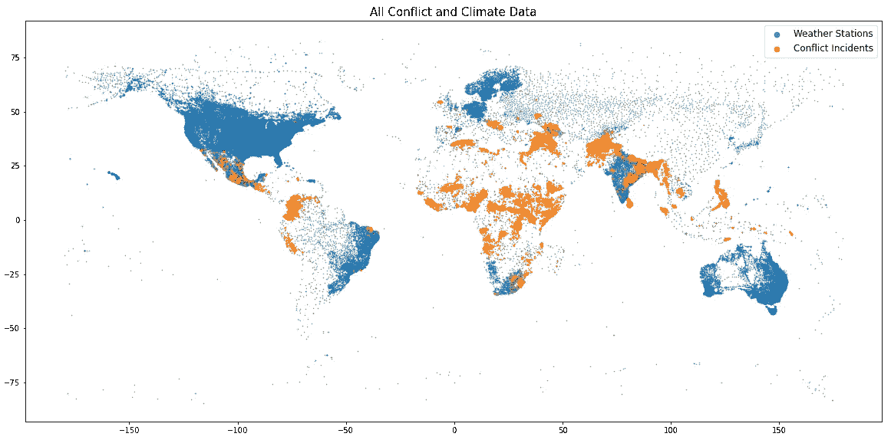
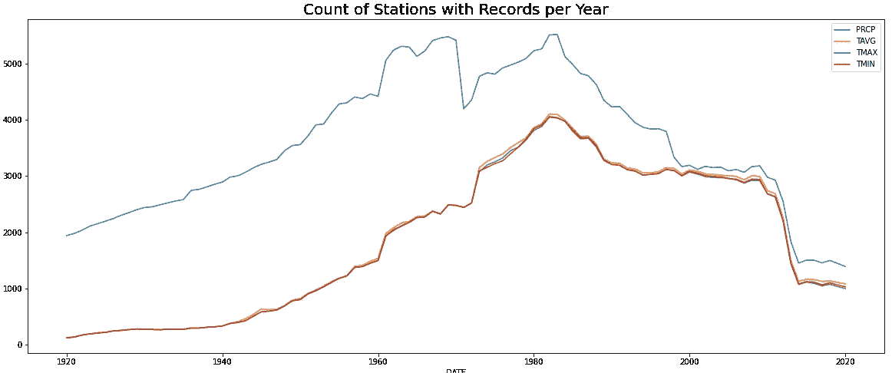
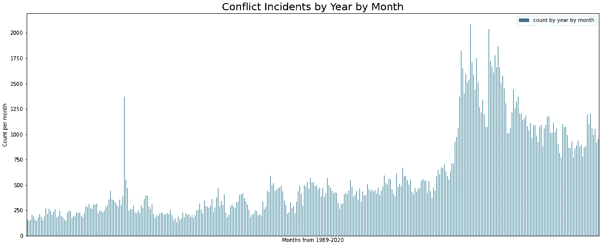
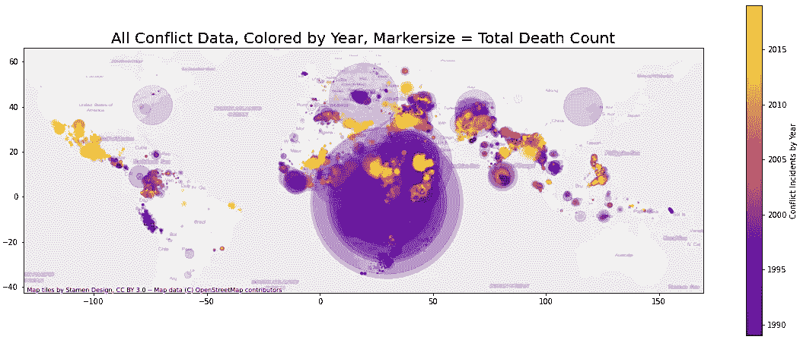
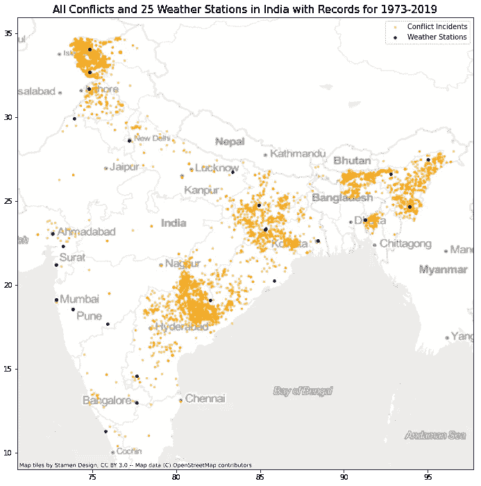

# 激烈的讨论:使用气候数据预测冲突强度

> 原文：<https://towardsdatascience.com/heated-discussions-predicting-conflict-intensity-using-climate-data-7084d623f8d2?source=collection_archive---------35----------------------->

## [变更数据](https://towardsdatascience.com/tagged/data-for-change)

## 使用一个世纪的气候变化数据建立一个机器学习模型来预测冲突的强度

图片来自 iStock，授权给 Richard Pelgrim

*这个故事是追踪我第一个独立数据科学项目进展的系列报道的一部分。找到上一篇* [*这里*](https://medium.com/swlh/the-one-thing-ive-learned-after-my-first-300-hours-of-data-science-eddecbb2c98c) *和 Jupyter 笔记本* [*这里*](https://github.com/rrpelgrim/portfolio) *。*

# TL；博士；医生

一些研究人员推测，气候变化正在导致政治紧张局势加剧，因此正在推动世界各地武装冲突的增加。该项目试图建立一个机器学习模型，根据周围地区的可用降水和温度数据预测印度的冲突强度(以每天死亡人数衡量)(< 300km). The project concludes that **使用当地气候数据**不可能准确预测冲突强度)。尽管如此，它还是偶然发现了一些有趣的信息。

# 问题是

气候变化越来越多地导致全球极端天气模式。这些极端天气情况，如高温、干旱、洪水等。在世界的一些地方，正导致大规模的人口流动和对土地和其他自然资源的竞争加剧。这种竞争可能导致政治紧张，并可能以武装冲突的形式出现。

这一领域的现有研究暗示了气候变化和武装冲突增加之间的可能关系；比如这里的和这里的。然而，大多数专家指出，这种关系在很大程度上仍然是推测性的，很难证明，因为还有许多其他因素推动冲突，如地缘政治和/或社会经济因素。

在这种背景下，我决定使用我的第一个顶点项目(作为跳板数据科学职业跟踪的一部分完成)来研究是否可以在气候测量和冲突强度测量之间建立直接关系。建立这种关系对以下方面很有价值:

1.  说明了另一个尽快努力减缓气候变化原因，
2.  预期人道主义援助和/或军事干预，以应对预期的冲突事态发展。

# 数据

该项目结合了来自两个独立数据集的数据:

1.  [乌普萨拉冲突数据计划全球武装冲突](https://ucdp.uu.se/downloads/index.html#ged_global)数据集，包含 1989 年至 2019 年间 220，000 多起冲突事件的信息，以及
2.  [全球历史气候网络](https://www.ncei.noaa.gov/access/metadata/landing-page/bin/iso?id=gov.noaa.ncdc:C00861)数据集包含 1889 年至 2020 年间全球 115，000 多个站点的天气测量数据。

仅仅是绘制冲突事件和气象站就已经构成了一幅迷人的地图:

作者生成的图像

很明显，总的来说，**有很多冲突事件的国家只有很少的气象站，**除了像印度、南非和土耳其这样的少数国家。

# 浑身脏兮兮的

现在我们进入了项目中真正有肉和最令人满意的部分(记住:我喜欢肉丸——尤其是当它们出现在正确的地方时[)。我在项目的探索性数据分析阶段花了 70 多个小时；掌握大型数据集，掌握用于处理空间数据的 *geopandas* 包，并找出哪些肉丸真正值得关注。指数学习曲线。](https://medium.com/swlh/the-one-thing-ive-learned-after-my-first-300-hours-of-data-science-eddecbb2c98c)

我将分享项目这一部分的三个很酷(也很重要)的发现:

## 肉丸# 1——气候数据的可用性

这是一个难以接受的事实，但对接下来的事情非常重要:不是所有的气象站都有全年的气候数据。一个气象站可能只记录了 20 年的降雨量，然后只记录了几年的平均温度，然后一段时间什么都没有…你明白了。

特别是 1950 年之前和 2012 年之后的几年显示覆盖面很差，这将影响我们能够对 1989 年至 2019 年之间发生的冲突事件进行的比较。

作者生成的图像

## 肉丸# 2——季节性高峰

第二个肉丸更有趣:绘制整个观察期(1989 年至 2019 年)内每月武装冲突事件的数量显示:

1.  冲突事件数量的总体增加——这可能是由于实际冲突的增加或(更有可能)报道和记录的增加，以及
2.  持续的季节性高峰

季节性天气模式会增加冲突事件的可能性吗？

作者生成的图像

## 肉丸# 3——地图的力量

这最后的肉丸特别给力。下面的地图显示了所有的冲突事件，按照事件发生的年份进行着色，标记的大小根据事件的总死亡人数而增加。图像中心巨大的紫色斑点是构成卢旺达种族灭绝事件的叠加。其他暴行，如斯雷布雷尼察大屠杀和 911 袭击也跳了出来。

作者生成的图像

我必须承认，当这个情节在凌晨 2 点出现在我的屏幕上时，我真的哽咽了。这尖锐地提醒我们地图传达信息的力量 ***和*** 事实上，我们用来指我们电脑上的大量信息的非个人化、枯燥的四个字母的单词总是与实际的人类生活(或死亡)联系在一起——换句话说:它很重要。

# Hocus Pocus by Focus(歌唱印度)

如果你没有得到那个史诗般的亚文化参考，那么请暂停一下，进入[这个链接](https://www.youtube.com/watch?v=MV0F_XiR48Q&ab_channel=RedBullet)，欣赏 6 分 42 秒改变人生的音乐插曲。

你回来了？

不用谢我。

当然，所有这些全球模式都很迷人，但在项目的这一点上，我被大量的意大利面条和可能的路线所困扰(事实证明，并非所有的意大利面条都通向罗马)。所以我决定将项目范围缩小到一个国家和一个焦点。是时候去印度了。

我选择印度作为案例研究，因为它有*冲突和*气候数据的必要重叠:15000 多起冲突事件和 3800 多个气象站。巨大的潜力……

….不是！事实证明，在 3800 多个气象站中，只有 25 个有足够的冲突事件发生年份的气候数据。幸运的是，这 25 个监测站均匀分布在全国各地，在每个可识别的冲突事件群附近至少有一个监测站。

作者生成的图像

我运行了一个 [*CkdTree 分类器*](https://docs.scipy.org/doc/scipy/reference/generated/scipy.spatial.cKDTree.html) 将每个冲突事件与这 25 个气象站中最近的气象站进行匹配。然后，我可以计算出一系列新的气候特征，让我们了解每个冲突事件周围地区的气候变化模式。

# 我们来关联一下。

需要另一个插曲吗？我明白你的意思，嘘——你知道三角形也是我最喜欢的形状。

深入研究我们的原始功能和新功能之间的关联揭示了三件重要的事情:

1.  总死亡人数和任何气候特征(新的或旧的)之间没有明显的关联**。这意味着很难建立一个预测模型…**
2.  在冲突事件的总死亡人数和持续时间(以天为单位)之间有一些关联**。这是有道理的——更长的冲突更有可能导致更多的死亡。**
3.  气候特征几乎都是高度相关的。

作者生成的图像

死亡总数和持续天数都可以作为冲突强度的指标，这也是我们试图预测的。为了将这两者合并成一个变量，同时考虑到它们之间的相关性，我决定将我们的目标特征重新表述为*死亡率*:冲突事件每天的死亡人数。

我们的最终数据框架有 14364 个观察值和 33 个特征(1 个目标，32 个预测值)。

# 超级名模

我们现在准备开始构建我们的预测模型。我构建了 6 个不同的模型来比较性能:

1.  一个虚拟回归变量，简单地预测每个冲突事件的平均死亡率——这将是我们用来比较实际模型性能的基线模型，
2.  现成的线性回归模型
3.  使用选择最佳特征优化的线性回归模型
4.  现成的随机森林回归模型
5.  使用超参数调谐优化的 RF 回归模型，以及
6.  使用超参数调整优化的 Lasso 回归模型。

下图包含了一大串数字，基本上告诉我们，我还不如在第一步就停止了。出于所有实际目的，5 个机器学习模型中没有一个比基线模型做得更好，基线模型基本上只是一个有根据的猜测。

因此，该项目的结论是

> **使用选定的气候特征不可能准确预测印度的冲突强度。**

# 关键要点

令人失望？一点点。出乎意料？不完全是。该领域的现有研究已经警告我们，这种关系将很难确定，在项目的 EDA 阶段生成的相关性热图基本上已经证实了这一点。

所以…浪费时间？肯定不是。这个项目给我们留下了一些重要的收获:

首先，气候数据本身可能不足以预测冲突强度，但可能证明是包含其他特征(社会经济、政治等)的冲突预测模型的有用补充。).与基线模型相比，预测能力略有提高；

其次，我认为最重要的发现之一是在这篇文章的顶部，在气象站和冲突事件的地图上。显而易见的是，武装冲突发生的地方和气候数据主要收集的地方不匹配。这是主张在世界上持续经历武装冲突的地区开展更多研究工作的有力理由。

# 下一步是什么？

当然，工作永远不会结束。

图片来自 https://giphy.com/memecandy/

我要说的是，这种当前模式有三种主要的改进方式:

首先是**扩大项目**的范围，不仅将印度的案例研究扩展到其他国家，也不仅仅使用气候数据来包括社会经济和政治因素。其他国家的模式可能更强，包括除气候数据之外的数据肯定会提高性能。

第二是**获取额外的气候数据**。我们看到，在印度的例子中，虽然我们一开始有近 4000 个气象站，但其中只有 25 个有我们感兴趣的年份的足够的气候记录。额外的数据将使气候模式的模型更加精细，这将大大提高模型的预测能力。

最后，重新构建分析并**将有冲突的区域*与没有*冲突的区域*进行比较将会很有趣。在目前的模型中，我们将冲突事件相互比较，但很可能在发生武装冲突的地区和没有发生武装冲突的地区之间存在更明显的差异。这意味着将我们的观察单位从“冲突事件”改为“国家”或其他单位区域。然后我们可以建立一个模型来预测每单位面积的事故数量。这将允许我们调查我们上面呈现的季节性峰值(如肉丸#1)，这些峰值在 ***冲突事件计数*** 中，而不在死亡计数中。我的直觉是，如果我们以这种方式重新构建问题，可能会有更强的信号。***

伙计们，就这样吧。如果您有任何问题或反馈，请联系我们，尤其是如果您是一位对该主题充满热情的数据科学家(或一般的研究人员)，我很乐意与您联系！

下面是一个链接，链接到我对这个项目的介绍，请随时与任何人分享，它可能是有用的或有启发性的。

最后但同样重要的是，我要大声感谢我的导师[盖伊·马斯卡尔](https://medium.com/u/eae033cf2e0b?source=post_page-----7084d623f8d2--------------------------------)一路走来给予我的宝贵支持和积极反馈！