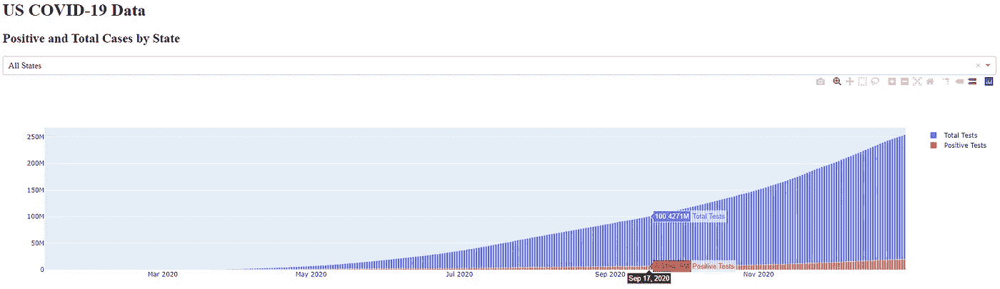
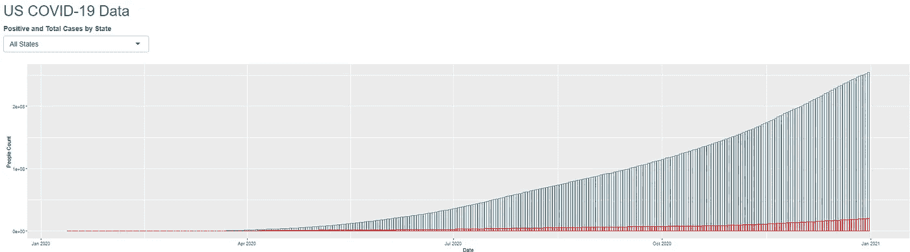
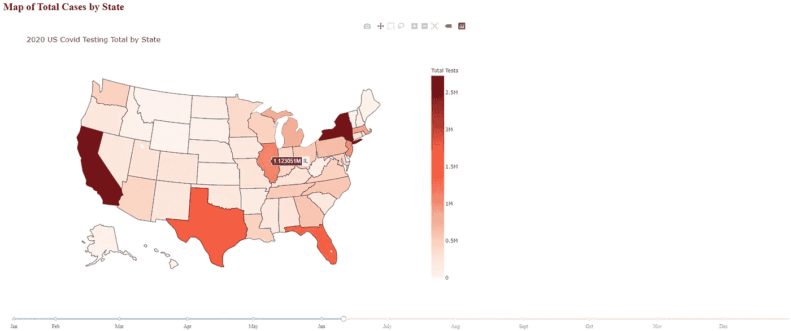
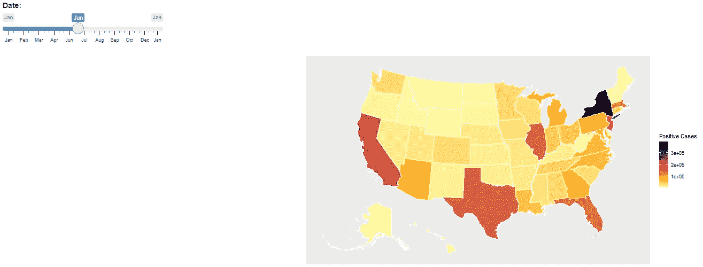

# 你好，“Covid”世界:Python Dash 和 R Shiny 对比

> 原文：<https://towardsdatascience.com/hello-covid-world-python-dash-and-r-shiny-comparison-cc97afef9d82?source=collection_archive---------11----------------------->

## 比较 Dash 和 Shiny 在最简单但交互的仪表板实现中的差异

在数据科学领域，项目的最终目标通常是以某种仪表板或 web 应用程序来可视化您的结果。Python 和 R 这两种广泛使用的数据科学语言都有自己的包来解决这个问题。

r 有一个名为 Shiny 的主包，它使得直接从 r 构建交互式 web 应用程序变得容易。另一方面，Python 有几个根据项目强度而广泛使用的包。

Python web 应用程序的三个主要包是 Django、Flask 和 Dash。Django 是一个高级 Python Web 框架，它鼓励快速开发和干净、实用的设计。Flask 是一个轻量级的 web 应用程序框架。它旨在快速轻松地开始使用，并能够扩展到复杂的应用程序。

根据 Dash 网站的介绍:

> Dash 基于 Flask、Plotly.js 和 React.js 编写，非常适合用纯 Python 构建具有高度自定义用户界面的数据可视化应用程序。它特别适合任何使用 Python 处理数据的人。
> 
> 通过几个简单的模式，Dash 抽象出了构建基于 web 的交互式应用程序所需的所有技术和协议。Dash 非常简单，您可以在一个下午的时间里围绕您的 Python 代码绑定一个用户界面。

Shiny 和 Dash 都有一个共同的目标，那就是用最少甚至不需要像 JavaScript 这样的 web 开发技能来制作一个 web 应用仪表板。尽管两者都允许使用 JavaScript、HTML、CSS 栈进行更好的定制。

正如许多开发人员所知，每当你开始学习一门新的编程语言或工具时，你要做的第一件事就是尝试编写一个“Hello，World”程序。这只是简单地展示了语法的最简单形式和新语言的内部工作方式。

本文通过 Python Dash 和 R Shiny 之间的比较来比较这种想法，比较两种语言中非常简单的 dashboard web 应用程序。当然，它也是以新冠肺炎数据为中心的，就像过去一年世界其他地区一样。

免责声明:我对 Python 和 R 都有经验，但是我想在我相对公正地学习 Dash 和 Shiny 的同时写这篇文章，以便进行公平的比较。

# Dash 和 Shiny 的交互式应用程序的准系统

Dash 和 Shiny 使用类似的结构，首先在组件的层次树中定义整体界面和页面布局。接下来是根据动作改变布局的函数。

我选择展示最基本的交互应用程序，因为没有交互就很难描述结构。

## 破折号

这是一个几乎一行一行找到的例子[这里](https://dash.plotly.com/basic-callbacks)。值得注意的是，Dash 在该网站上发现了惊人的文档。

在这个例子中，我们可以看到第一步是如何声明`app.layout`的，其中 HTML 部分是按照 web 应用程序从上到下的顺序定义的。有一个破折号核心组件(`dcc`)接收文本，然后最后的`html.Div`是输出文本。为了将这两者联系在一起，有一个`@app.callback`，这就是 Dash 如何创建一个动作和反应。回调将组件 ID 和属性/值作为输入，并将其传递给函数，然后将结果返回给已定义的`html.Div`组件。

## 发光的

这是一个同样简单，互动闪亮的应用程序。我们马上注意到一些相似之处。首先，如前所述，这两个程序都继承了相似的结构，首先定义 UI，然后定义反应性元素。一个不同之处是，对于这个闪亮的应用程序，所有输入都被传递给通用函数，每个输入都由`input$input_value`调用。

作为一个快速的比较，我们可以看到 Shiny 可以用更少的代码和更简单的代码交付相同的功能。部分原因是 Dash 是在 Flask 上构建的，Flask 是无终结的，这意味着它更加开放，并且没有标准的构建方式，因为这是开发人员的决定。此外，从上面的例子可以看出，Dash 集成了更多的 HTML。

让我们通过添加一些数据来显示常用的元素，如图表、下拉菜单、地图和滑块，从而进一步深入这种比较。

# 元素比较

所有的代码都可以在我的 GitHub [**这里**](https://github.com/Nathanlang14/HelloCovidWorld) 中找到，但是为了节省本文的篇幅，我将主要关注这些元素的具体代码。

## 条形图和下拉菜单

Dash 附带了一个核心组件库，允许轻松声明常见的 HTML 组件，如`Dropdowns`或`Graphs`。由于 Plotly 和 Dash 非常紧密地交织在一起，几乎所有的图表和图形都是用 Plotly 的`graph_objects`完成的。因此，一旦选择了一个下拉值，数据集就会变成一个条形图，将阳性新冠肺炎病例叠加到测试总量上，以显示两者在 2020 年底之前如何随时间变化。

Plotly 的`graph_objects`与 Dash 连接的一个便利之处是，你无需额外代码就能自动获得 Plotly 的特性。这包括缩放，悬停功能，悬停比较，下载选项等。

这个代码块描述了如何实例化一个下拉菜单，并使用 Python 和 Dash 显示一个条形图。

此代码生成下面的条形图，该条形图由下拉菜单值决定，用于描述单个特定状态或所有状态的合计。

仪表板下拉菜单和条形图仪表板示例

Shiny 也有一个简单的 UI 元素声明，但是在使用输入时，你必须将它存储在一个新的变量中，以便能够与其他元素进行比较。这是因为输入是电抗元素，不能与非电抗变量(如字符串)进行比较。

Shiny 的好处是大多数用 R 编写代码的人已经使用了`ggplot2`包进行所有的绘图，所以很容易在 Shiny 应用程序中实现相同的绘图。

下面是一个类似程序的 R 实现，用于下拉菜单和条形图。

这段代码生成了闪亮的下拉菜单和条形图，以显示一段时间内的总数和阳性病例。

闪亮的下拉菜单和条形图仪表板示例

总的来说，下拉菜单在外观和功能上几乎是一样的。另一方面，我不得不给 Dash 一个现成的条形图，因为它附带了很多 Plotly 的有吸引力的特性。

旁白:有一个 [Plotly R 库](https://plotly.com/r/)，但它不像 Dash 和 Plotly 那样自然地交织在一起。

## 地图和滑块

在本节中，我们将创建一个滑块，显示从新冠肺炎首次出现到 12 月 31 日的 2020 年的日期。然后，一旦选择了日期，我们将在美国地图上显示总病例汇总数据。Plotly 再次将 choropleth 地图作为其 graph objects 包的一部分。

滑块是另一个标准的`dcc`元素，但是一个巨大的抱怨和不便是它不允许输入日期。因此，我们必须有点创意，将滑块用作从 0 开始的数字输入。然后，使用选择的值和`datetime` Python 包，我们将这些天数添加到开始日期。也就是说，需要花更多的时间来确定哪些标记代表新的一个月的开始。

此代码块描述了如何实例化一个滑块，并使用 Dash 在选定的日期显示地图。

这将生成下面的图，该图显示了 choropleth US 图中按滑块选择的日期显示的所有测试用例。

Shiny 也有类似的实现，但是我找不到任何超级简单的方法来绘制美国地图。有几个不同的例子，他们使用了[传单](https://rstudio.github.io/leaflet/choropleths.html)，但这似乎比我想要的简单地图有更多的定制。因此，我使用了来自[城市研究所名为 urbnmapr](https://github.com/UrbanInstitute/urbnmapr) 的 GitHub 包。

对于这个用例，我更喜欢 Shiny 的 slider，而不是 Dash 的，特别是因为它允许将日期作为值传入。因此，将选择的值传递给映射不需要预处理。此外，有一个动画选项，使地图可以逐步改变一天。

这个代码块描述了如何实例化一个滑块，并在选定的日期用 Shiny 显示一幅地图。

这将生成以下地图，该地图按滑块选择的日期显示 choropleth US 地图中各州的阳性病例总数。

# 结论

总的来说，我希望作为读者的你已经大致了解了如何为 Python Dash 和 R Shiny 制作简单的组件和反应式 web 应用程序。这是我的第一个正式项目，所以对我来说也是一个学习的过程。对于我最初的想法，我看到了两者在数据科学领域是如何有用的，并且从我目前的观点来看，它们可以互换，足以选择您喜欢的。也就是说，如果你更习惯使用 R，坚持使用它，Python 也是一样。我认为学习这两门课程会很有用。

也就是说，如果我必须选择一个继续，我可能会选择 Dash，原因如下。贯穿本文的第一个原因是，与 Plotly 交织在一起有很多优点，比如缩放、平移、悬停等。其次，Python 仍然是一种更受欢迎的语言，因此对于项目生命周期来说，用同一种语言继续仪表板阶段可能更容易。最后，Dash 是建立在 Flask 之上的，所以如果你想进一步扩展你的 web 应用来解决一个更大、更复杂的问题，你不必重启。

感谢大家的阅读！如果有什么让你惊讶或感兴趣的，请随时在评论中告诉我。:)