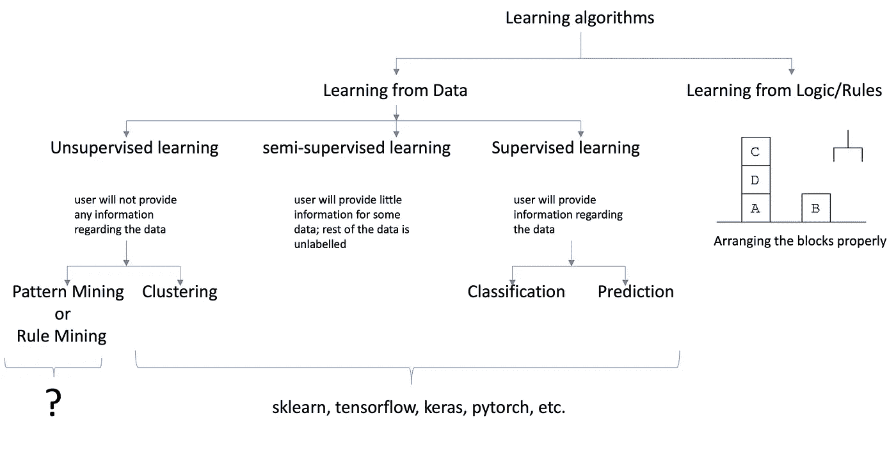

# 你好！我是 PAMI

> 原文：<https://towardsdatascience.com/hello-i-am-pami-937439c7984d?source=collection_archive---------11----------------------->

## 面向数据科学的新模式挖掘 Python 库



图 1:跨越人工智能、数据挖掘、机器学习和深度学习的学习算法的广泛分类

大数据分析代表了一套发现隐藏在大型数据库中的知识的技术。这些技术可以大致分为四种类型:

*   模式挖掘—旨在发现数据中隐藏的模式
*   聚类—旨在对数据进行分组，使得组内的对象具有高的类内相似性和低的类间相似性。
*   分类——旨在从学习的模型中为测试实例找到合适的类别标签
*   预测—旨在从学习的模型中预测测试实例的值

如图 1 所示，模式挖掘和聚类是无监督学习技术，而分类和预测是监督学习技术。

一些 Python 库(例如，Sklearn、PyTorch、TensorFlow 和 Keras)已在文献中描述用于执行大数据分析。这些库主要关注聚类、分类和预测。据我们所知，不存在旨在发现隐藏在数据中的模式的 Python 库。有了这个动机，我们开发了一个新的 Python 库，叫做 PAMI。在这篇博客中，我们涵盖了以下主题:

1.  什么是 PAMI？它的执照是什么？以及如何安装？
2.  PAMI 的组织结构是怎样的？
3.  如何利用 PAMI 来发现频繁模式？
4.  位置了解更多信息。

# 什么是 PAMI？它的执照是什么？如何安装？

PAMI 代表模式挖掘。这个库包含几个模式挖掘算法来发现隐藏在大量数据集中的知识。目前，PAMI 有 50 多种算法来寻找不同类型的基于用户兴趣的模式。示例包括频繁模式、相关模式、周期模式、频繁邻域模式和模糊周期模式。

PAMI 目前是在 GNU V3 许可下提供的。这个库的源代码可以在[GitHub](https://github.com/udayRage/PAMI)[【3】](https://github.com/udayRage/PAMI)获得。通过发出以下命令，可以从 PyPI 存储库直接安装 PAMI 库:

```
pip install -y pami
```

# PAMI 的组织结构是怎样的？

PAMI 的算法是以分层的方式组织的。这个层次结构的格式是，

pami . pattern mining model . type of pattern . algorithm

*   patternMiningModel —表示需要发现的模式类型，如频繁模式、相关模式、模糊频繁模式等。
*   typeOfPattern 表示模式的分类。目前，PAMI 实施四种模式。(I)基本-查找数据中的所有模式，(ii)封闭-仅查找数据中的封闭模式，(iii)最大-仅查找数据中的最大模式，以及(iv)topK-查找数据中的前 k 个模式。
*   算法—表示用于发现模式的技术。

一个例子是

```
PAMI.frequentPattern.basic.FPGrowth
```

其中*frequency pattern*是模型， *basic* 是模式类型， *FPGrowth* 是挖掘算法。

# 如何利用 PAMI 来发现频繁模式？

频繁模式挖掘是大数据分析中一种重要的知识发现技术。它包括识别数据中频繁出现的所有项目集(或模式)。一个典型的应用是购物篮分析。它包括识别客户经常购买的项目集。频繁模式的一个例子是:

```
{Beer, Cheese}     [support=10%]
```

上面的模式表明，10%的客户一起购买了商品“啤酒”和“奶酪”。这种信息对于用户放置产品和库存管理非常有用。关于频繁模式挖掘的更多信息可以在[5，6]找到。

我们现在使用 PAMI 图书馆和 Jupyter 笔记本一步一步地进行频繁模式挖掘。

1.  [**点击此处**](https://www.u-aizu.ac.jp/~udayrage/datasets/transactionalDatabases/transactional_retail.csv)【7】下载交易零售数据集。
2.  FP-growth 是一种著名的频繁模式挖掘算法。让我们首先通过在 Jupyter 中执行以下命令来导入这个算法:

```
from PAMI.frequentPattern.basic import FPGrowth as alg
```

3.通过提供文件、最小支持(minSup)和分隔符作为输入参数来初始化 FP-growth 算法。

```
obj = alg.FPGrowth('[transactional_retail.csv',100,'\t'](https://www.u-aizu.ac.jp/~udayrage/datasets/transactionalDatabases/transactional_retail.csv',100,'\t'))# '[transactional_retail.csv'](https://www.u-aizu.ac.jp/~udayrage/datasets/transactionalDatabases/transactional_retail.csv',100,'\t') is the input file downloaded from the URL
#100 is the minimum support count. 
#\t is the separetor that exist between the items in a transaction
```

4.开始采矿过程

```
obj.startMine()
```

5.通过执行以下代码将模式保存在文件中:

```
obj.savePatterns('frequentPatters_100.txt')
# 100 is the minSup count
```

在输出文件中，比如 frequentPatters_100.txt，第一列是模式，第二列是支持。

6.用户可以通过执行以下代码将发现的模式作为数据帧读取:

```
df = obj.getPatternsAsDataFrame()
```

7.挖掘算法的运行时和内存要求可以通过执行以下代码得出:

```
print('Runtime: ' + str(obj.getRuntime()))
print('Memory: ' + str(obj.getMemoryRSS()))
```

上述步骤的完整代码如下所示:

```
from PAMI.frequentPattern.basic import FPGrowth as algobj = alg.FPGrowth('[transactional_retail.csv',100,'\t'](https://www.u-aizu.ac.jp/~udayrage/datasets/transactionalDatabases/transactional_retail.csv',100,'\t'))
obj.startMine()obj.savePatterns('frequentPatters_100.txt')
df = obj.getPatternsAsDataFrame()print('Runtime: ' + str(obj.getRuntime()))
print('Memory: ' + str(obj.getMemoryRSS()))
```

# 我在哪里可以找到更多关于 PAMI 的信息？

访问 https://udayrage.github.io/PAMI/index.html[了解更多信息。](https://udayrage.github.io/PAMI/index.html)

# **结论**

在这篇博客中，我们讨论了不同类型的学习算法，并讨论了现有的 python 库如何无法为用户提供发现数据中隐藏模式的工具。接下来，我们介绍了我们的 PAMI Python 库，它旨在填补现有库留下的空白。接下来，我们讨论了 PAMI 算法的组织结构。最后，我们展示了如何利用 PAMI 发现隐藏在零售数据中的频繁模式。

# **参考文献:**

[1]https://plato.stanford.edu/entries/logic-ai/

[2]人工智能中的逻辑:[https://www . researchgate . net/publication/46666490 _ Logic _ in _ AI](https://www.researchgate.net/publication/46666490_Logic_in_AI)

[3]https://github.com/udayRage/PAMI 源代码:[PAMI](https://github.com/udayRage/PAMI)

[4]https://udayrage.github.io/PAMI/index.html[PAMI 用户手册](https://udayrage.github.io/PAMI/index.html)

[5]频繁模式挖掘:当前状况和未来方向，作者 J. Han、H. Cheng、D. Xin 和 X. Yan，2007 年数据挖掘和知识发现档案，第 15 卷第 1 期，第 55-86 页，2007 年

[6]频繁模式挖掘，编辑。Charu Aggarwal 和 Jiawei Han，Springer，2014 年。

[7]交易零售数据集:[https://www . u-aizu . AC . jp/~ udayrage/datasets/Transactional databases/Transactional _ Retail . CSV](https://www.u-aizu.ac.jp/~udayrage/datasets/transactionalDatabases/transactional_retail.csv)