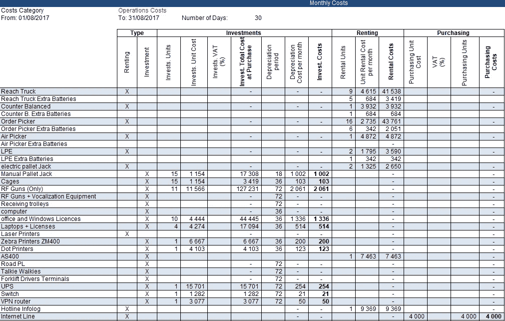
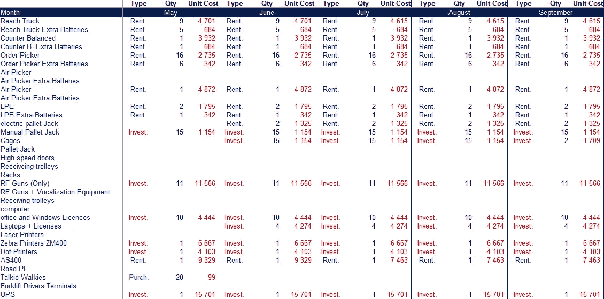

# 使用 Python 自动执行会计任务

> 原文：<https://towardsdatascience.com/help-your-finance-team-to-automate-accounting-tasks-using-python-68bcefe7524c?source=collection_archive---------6----------------------->

## 构建解决方案来自动化财务审计的重复性任务，并与您的财务同事分享，以提高他们的工作效率

Excel 自动化—(图片由作者提供)

如果你是数据分析师，想要访问大量的非结构化数据，你有影响的愿望，并且你痴迷于自动化重复的任务:去你的财务部门。

我将在本文中分享一个解决方案，它基于我从非常不结构化的 Excel 文件中提取数据来执行运营和财务审计的经验。

💌新文章直接免费放入您的收件箱:[时事通讯](https://www.samirsaci.com/#/portal/signup)

# 1.如何用 python 实现会计任务的自动化？

## 问题陈述

你是一家大型物流公司的**数据分析师，你的财务团队同事请求你帮助建立一个模型来预测仓库运营的损益。**

2017 年 5 月月度成本报告示例—(图片由作者提供)

您需要从会计团队构建的月度报告中提取信息，这些报告按类别列出了所有详细的成本

*   **您的研究中包含的 20 个仓库**
*   最近 **36 个月**的审计
*   **共 720 个 Excel 文件**
*   **60 项费用**跟踪
*   3 类成本:投资、租赁、采购

## 目标

您的目标是构建一个工具，自动从这 720 个 Excel 文件中提取数据，对其进行格式化，并将所有内容合并到一个报告中。

审计报告示例—(图片由作者提供)

财务部门将使用此报告来分析过去 3 年的成本，并了解趋势。您的工具将有助于在单个报告中获得可见性，而无需使用额外的资源来手动执行。

 [## 萨米尔·萨奇

### 数据科学博客，专注于仓储，运输，数据可视化和机器人流程自动化…

samirsaci.com](http://samirsaci.com) 

# 2.你的解决方案

您将设计一个简单的 python 脚本，该脚本将执行:

1.  打开文件夹中的每个 Excel 报表
2.  处理和清理数据
3.  按照上述格式建立月度报告
4.  将月度报告与全球数据框合并
5.  将最终结果保存在 Excel 文件中

## 导入每月 Excel 报告并处理数据

这里有几个要点:

*   **表头**熊猫的参数只取第 5 位(对 excel 文件非常有用)
*   **用 0 填充 nan**以对数值进行计算
*   **修剪列名称:**在人们进行手工输入的情况下非常有用(‘单位成本’和‘单位成本’对用户来说看起来是一样的)

## 格式化列并执行计算

这部分和我处理的报表非常链接，我在这里分享代码供参考([链接](https://gist.github.com/samirsaci/919be1cf5f68b8272565dbb8126de66a))。

# 3.共享此工具

*关注我，了解更多与供应链数据科学相关的见解。*

现在您已经构建了工具，您想与财务团队分享它。供您参考，在我以前的公司，花了 2 周的时间(1 人)来完成这些任务。

如果您能实现这个简单的工具，您能想象会有什么影响吗？

如果你感兴趣，我写了一篇关于如何分享你的 python 脚本的文章，供没有任何 Python 经验的同事使用。

 [## 用 Python 构建 Excel 自动化工具

### 用于销售分析的 Excel 自动化工具的自动化和报告设计可供您的同事使用，无需…

www.samirsaci.com](https://www.samirsaci.com/build-excel-automation-tools-with-python/) 

如果您遵循本文中解释的不同步骤，您将获得一个可执行文件(。exe)准备好与将运行该脚本的同事共享(即使他们没有安装 python)。

## 超越:自动化数据提取

在开始构建报告之前，您需要从 ERP 中收集数据。如果您正在使用 SAP，您可能会对这一系列关于 ERP 自动化的文章感兴趣

 [## SAP 零售订单创建自动化

### 函数 PO_Function() '(1)声明变量 Dim W_BPNumber，W_SearchTerm，PONDim line items As long Dim Sht _ Name As…

www.samirsaci.com](https://www.samirsaci.com/sap-automation-of-orders-creation-for-retail/)  [## 零售产品列表的 SAP 自动化

### 自动化和报告使用 Visual Basic 自动化产品，通过 SAP GUI 脚本工具在 SAP 中自动列出产品…

www.samirsaci.com](https://www.samirsaci.com/sap-automation-of-product-listing-for-retail/)  [## 面向零售业的 SAP 自动化

### 自动化和报告设计 RPA 解决方案使用通过 SAP GUI 脚本工具构建的 Visual Basic 脚本设计 RPA…

www.samirsaci.com](https://www.samirsaci.com/sap-automation-for-retail/) 

# 关于我

让我们在 [Linkedin](https://www.linkedin.com/in/samir-saci/) 和 [Twitter](https://twitter.com/Samir_Saci_) 上连线，我是一名供应链工程师，正在使用数据分析来改善物流运作和降低成本。

如果你对数据分析和供应链感兴趣，可以看看我的网站

 [## Samir Saci |数据科学与生产力

### 专注于数据科学、个人生产力、自动化、运筹学和可持续发展的技术博客

samirsaci.com](https://samirsaci.com)