# 利用深度学习帮助非洲农民提高产量

> 原文：<https://towardsdatascience.com/helping-african-farmers-increase-their-yields-using-deep-learning-93a8d70dff36?source=collection_archive---------31----------------------->

## 利用迁移学习识别木薯叶部病害

一棵健康的木薯，由 [malmanxx](https://unsplash.com/@malmanxx?utm_source=unsplash&utm_medium=referral&utm_content=creditCopyText) 在 [Unsplash](https://unsplash.com/s/photos/cassava?utm_source=unsplash&utm_medium=referral&utm_content=creditCopyText) 上拍摄

如果你和我一样，那么大部分时间你都记不起自己做了什么梦。今天早上，我想起了一切。我梦见我收到一封电子邮件，宣布我赢得了木薯叶疾病比赛。除此之外，我在 Kaggle 网站上的状态显示我已经成为了 Kaggle 大师。

Kaggle 是一个由数据科学家和机器学习实践者组成的在线社区。根据你赢得的比赛数量，Kaggle 会给你分配一定的排名。

当我醒来时，仍然有点困惑，我登录了 Kaggle 网站。我还是一个卡格尔新手。我在木薯叶疾病竞赛的公共排行榜上的排名是 2343。到目前为止，梦想成真…

在我通过了[开发者认证考试](https://levelup.gitconnected.com/want-to-get-tensorflow-certified-6c32229792bd)后，我才开始参加木薯叶病竞赛。我想看看我是否可以通过参加这个比赛来提高我的深度学习技能。

在之前的文章中，我使用迁移学习为狗和猫的比赛创建了一个模型。建立这个模型很有趣，但是它在现实世界中没有直接的用途。

和我参加的这个 Kaggle 比赛不一样。Kaggle 将这场比赛命名为木薯叶疾病分类。目标是从图像中识别木薯叶上的疾病类型。

木薯是非洲的主要食物，由小农种植。他们种植木薯是因为它能承受恶劣的环境。但是病毒性疾病是低产的主要原因。

为了对抗这些疾病，农民需要昂贵的农业专家的帮助。这些专家首先诊断病情。然后他们和农民一起制定了一个控制疾病的计划。

我们可以通过创造一种可以检测疾病的解决方案来帮助农民。例如，使用用他们的移动照相机拍摄的照片。该解决方案应该能够处理低质量图像和低带宽。

使用图像识别和深度学习的解决方案将是理想的候选方案。

在本文中，我们将使用 TensorFlow 2.4.1 和 Python 3.8 开发一个模型。我们将从一个**卷积神经网络**开始，让我们登上排行榜。然后，我们将使用 **DenseNet201** 和 **EfficientNetB3** 预训练模型来改进我们的模型。最后，我们将使用**测试时间增加** (TTA)来改进我们的预测。

如果你对代码感兴趣，请看[这个 Github 库](https://github.com/PatrickKalkman/leave-disease)。

# 培训用数据

训练数据由 21.397 张木薯叶的 jpeg 图像组成。专家们在乌干达进行定期调查时收集了这些照片。这种格式真实地表现了农民在现实生活中需要诊断的内容。

来自比赛的图像分为以下五类。

*   0 **→** 一片显示木薯白叶枯病的叶子(CBB)
*   1 **→** 一片显示木薯褐条病的叶子(CBSD)
*   2 **→** 一片呈现木薯绿色斑点(CGM)的叶子
*   3 **→** 一片显示木薯花叶病(CMD)的叶子
*   4 **→** 一片健康的叶子

从左至右， **CBB** 、 **CBSD** 、 **CGM** 、 **CMD** 和一片**健康的**叶子。训练图像，由 Kaggle 提供

## 组织培训数据

Kaggle 将所有训练数据存储在一个文件夹中。每个图像的名称代表它的 id。id 和标签之间的映射存储在单独的 CSV 中。下面你可以看到一个 CSV 文件的例子。

train.csv 包含图像和标签之间的映射

我们需要重组图像，因为我想使用`ImageDataGenerator`类。我们还需要保留一部分训练图像进行验证。你可以在下面看到`ImageDataGenerator`需要的文件夹结构。

适用于 ImageDataGenerator 的文件夹结构

我们必须读取 CSV 文件，并将图像复制到正确的文件夹中。此外，我们必须在训练集和验证集之间划分图片。函数`distribute_images`接受单个参数。该参数定义了训练图像和验证图像之间的比率。值 0.7 选择 70%的图像用于训练，30%用于验证。

函数来重新组织适合 ImageDataGenerator 的图像

我们读取第 4 行的 CSV，然后使用`train_df`数据帧的`unique()`方法遍历标签。

# 创建和训练模型

我们将从一个小的卷积神经网络开始，而不是像我们在[猫对狗比赛](/storming-the-kaggle-leaderboard-3ed5b31bc28e)中那样使用迁移学习。虽然 TL 可能会让我们在排行榜上排名更高，但让我们在排行榜上获得第一个分数，以确保一切正常。

## 创建图像数据生成器

ImageDataGenerators 用于将训练和验证图像发送到深度学习管道。用于提供训练数据的 ImageDataGenerator 使用图像增强来增加图像的多样性。验证数据的 ImageDataGenerator 仅重新缩放图像。

创建 ImageDataGenerator

猫和狗竞争的区别在于 class_mode 是绝对的，因为我们有两个以上的输出标签。

## 构建和编译 CNN 模型

我们要训练的第一个模型是一个小型卷积神经网络。该模型使用四个卷积层、一个下降层和一个 512 个单元的隐藏密集层。

CNN 的定义

为了能够预测五个不同的类，输出层有五个单元。

## 训练模型

我们设定训练 50 个纪元，尽管使用的回调可能会更早停止。

训练模型

你看到我们使用`create_callbacks()`方法设置回调参数了吗？`create_callbacks()`方法返回三个不同回调的数组。见下文。在每个时期之后，TensorFlow 都会调用这些回调。

TensorFlow 在每个时期后调用三个回调

如果验证精度不再提高，则`EarlyStopping`回调停止训练。当 TensorFlow 看不到任何进展时，我们耐心地设置停止之前等待的纪元数。

`ReduceLROnPlateau`回调如果看不到任何提升，会自动降低学习率。

`ModelCheckpoint`如果验证损失小于前一个时期，则在一个时期后自动保存模型。有时，训练结束时的模型不如一个或两个时期前的模型准确。如果你使用这个回调，它将总是保存最好的一个。

## 可视化培训结果

在我的机器上，这个模型实现了 0.71 的最大验证精度和 0.79 的验证损失。

模型上的 fit 方法返回一个历史对象。TensorFlow 将每个历元的结果保存在这个历史对象中。我们可以使用 Matplotlib 库来可视化训练。

我们看到，训练和验证的准确性是相辅相成的。验证精度有一点波动，但是没关系。

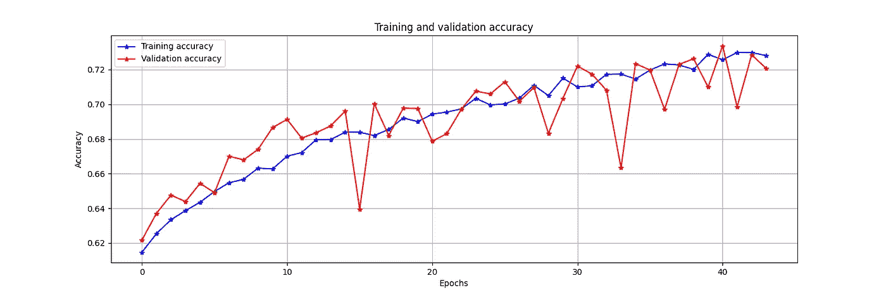

训练和验证的准确性与我们的 CNN 时代，由作者的图像

训练和验证损失也是如此。一个优秀的第一基线，我们可以提交给竞争。

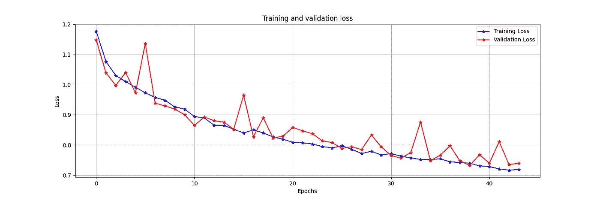

训练和验证损失 vs 我们 CNN 的时代，图片由作者提供

# 提交模型以获得分数

这就是这次比赛与以往不同的地方。你没有提交你的预测，而是提交了一个笔记本。

这个笔记本应该创建和训练您的模型，并创建预测。然后 Kaggle 在一个隔离的环境中运行笔记本。在这种环境下，笔记本可以访问所有的测试图像。

额外的限制是笔记本不能上网。此外，笔记本必须在不到 9 个小时内完成训练和预测。

## 创建和保存预测

在训练过程中，我们使用`ModelCheckPoint`来保存表现最好的模型。为了创建预测，我们使用`load_model`加载这个模型。然后，为了向模型提供图像，我们使用 ImageDataGenerator。我们只调整图像的大小。

计算预测

最后一步是使用熊猫将预测保存到一个名为`submission.csv`的文件中。这个文件的格式由 Kaggle 规定。Kaggle 将阅读该文件，并使用它来评分您的提交。

使用 pandas 保存 submission.csv 文件

我在让 Kaggle 拿起提交文件时遇到了一些麻烦。我发现我把文件放错了文件夹。

## 结果

提交笔记本一小时后，Kaggle 显示了分数，果然是 0.703。

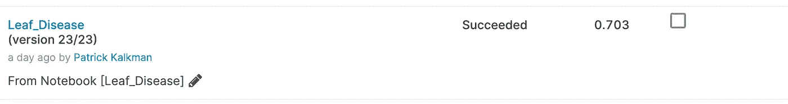

笔记本的结果，图片由作者提供

这个分数让我在公共排行榜上名列第 2996 位——这是我们第一次尝试的良好开端。

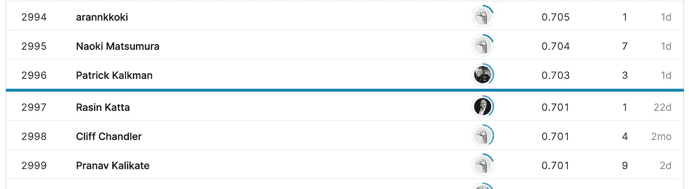

放置在 Kaggle 排行榜上，图片由作者提供

如果你想知道公共排行榜的第一名是什么？这时是 **0.911** ，所以我们还有很长的路要走:)

一个木薯根，由安妮·斯普拉特在[Unsplash](https://unsplash.com/s/photos/cassava?utm_source=unsplash&utm_medium=referral&utm_content=creditCopyText)上拍摄

# 使用迁移学习改进我们的模型

之前，在猫和狗的比赛中，我们使用迁移学习改进了我们的模型。我们将尝试在这里做同样的事情。

然而，还有一个额外的复杂性。如果您使用默认的 Keras 应用程序，它会从互联网下载权重文件。在这个比赛中，我们的笔记本不能上网，所以那不行。稍后我们将看到如何解决这个限制。让我们首先尝试增加我们模型的准确性。

我们唯一要改变的是模型的架构。`create_cnn_model`函数看起来是这样的。

使用预训练的 DenseNet201 模型来改进我们的模型

我们创建了一个`DenseNet201`的实例，并将其作为模型的第一部分。然后我们`Flatten`结果，添加一个有 512 个单位的`Dense`层。输出层仍然是同一个有五个单元的`Dense`层。每个类别一个。

当我们训练模型时，精确度增加了 23 个时期。训练和验证准确性很好地相互跟随，这显示了一个健康的模型。训练和验证损失也是如此。验证准确度攀升至约 0.76，而验证损失在 0.70 处变平。

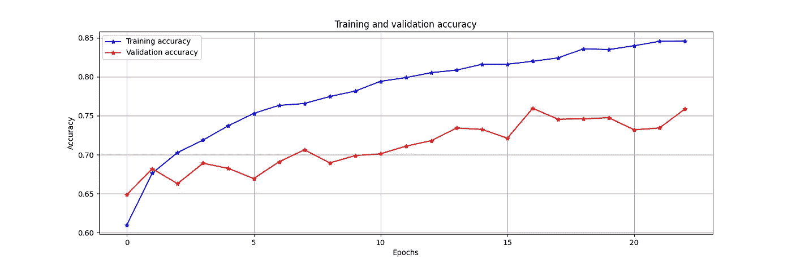

使用 DenseNet201 训练和验证我们的 TL 模型的准确度与时间，图片由作者提供

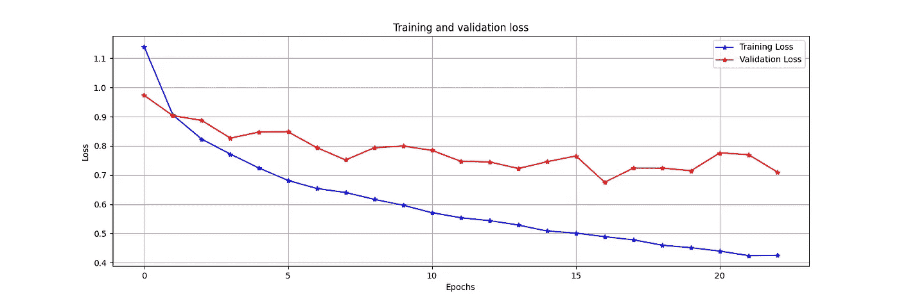

使用 DenseNet201 的 TL 模型的训练和验证损失与时期，图片由作者提供

当我们将这个模型提交给 Kaggle 时，它的得分是 0.772，这使我们在公共排行榜上上升到 2927 名。向上的一大步。

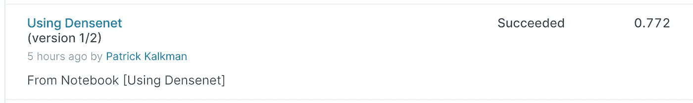

投稿结果，图片由作者提供

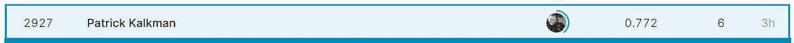

排行榜上的位置，作者图片

## 将模型提交给 Kaggle

当你想提交一个使用迁移学习的笔记本时，你必须拆分你的笔记本。第一部分训练并保存模型。这个笔记本可以上网检索重量。这样做的结果是保存的模型。使用此模型创建 Kaggle 数据集。

第二部分是你提交的笔记本。该笔记本从 Kaggle 数据集中加载保存的模型。然后，该模型用于创建预测。

# 使用不同的预训练模型 EfficientNet 进行优化

目前，表现最好的模型之一是 EfficientNet。EfficientNet，顾名思义，是最高效的模型之一。它需要最少的计算能力来进行推理。下图显示了 EfficientNet 与其他预训练模型的比较。

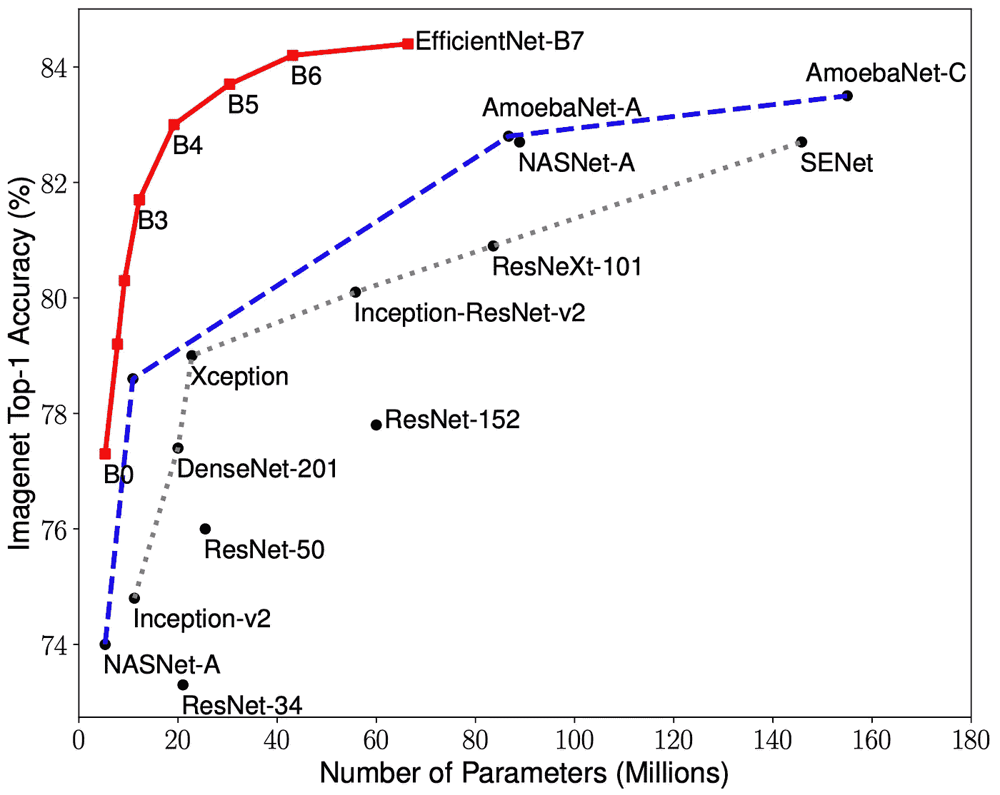

EfficientNet:反思卷积神经网络的模型缩放(Tan 等人，2019 年)

从 B0 到 B7，EfficientNet 有八种不同的变体。每个变体都更精确，使用更多的参数，见上图。

我们使用 EfficientB3 模型，这是精度和参数数量之间的一个很好的平衡。

我们创建了一个`EfficientNetB3`的实例，并将其作为模型的第一部分。然后我们使用一个`GlobalAveragePooling2D`层来调整结果的大小，并添加一个有 256 个单元的`Dense`层。一个`Dropout`层防止过度拟合。输出层仍然是同一个`Dense`层，有五个单元——每个类别一个。

使用 EfficientNetB3 创建模型

我们改进模型的另一件事是增加输入图像的尺寸。以前我们使用 150x150，但对于 EffientNet，我们使用 512x512。

当我们训练模型时，精确度增加了 25 个时期。训练和验证准确性很好地相互跟随，这显示了一个健康的模型。训练和验证损失也是如此。验证准确度攀升至约 0.87，而验证损失在 0.33 处变平。

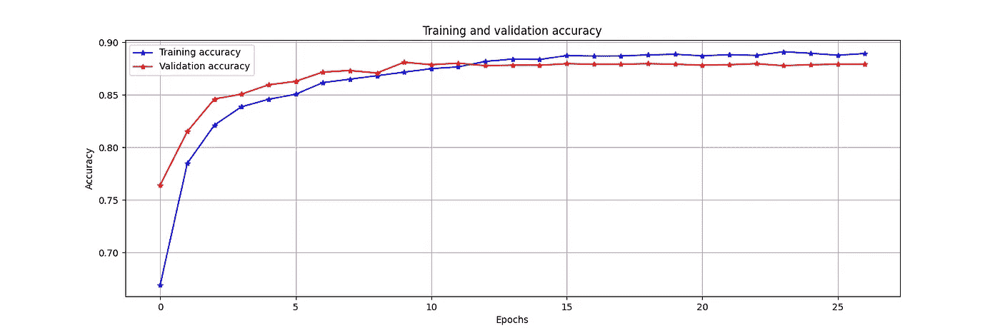

使用 EfficientNetB3(图片由作者提供)训练和验证我们的 TL 模型的准确度与时间

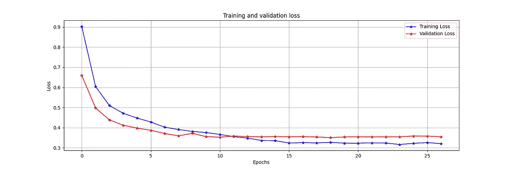

使用 EfficientNetB3 的 TL 模型的训练和验证损失与时期，图片由作者提供

提交该模型后，我们将 2343 放在了公共排行榜上。又向前迈进了一大步。

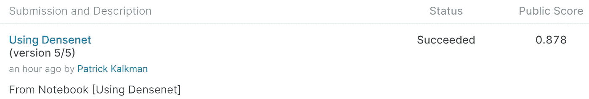

投稿结果，图片由作者提供

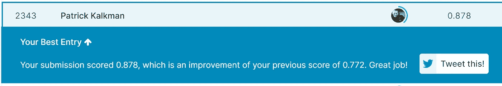

我在排行榜上的位置，图片由作者提供

# 使用测试时间增加进行优化(TTA)

我们在训练过程中用来将图像输入网络的`ImageDataGenerator`随机转换照片，以增加训练图像的数量和变化。当我们创建预测时，我们也使用一个`ImageDataGenerator`，但是不增加图像。如果我们改变这个会发生什么？

测试时间增加(TTA)是一种提高预测准确性的技术。我们不再直接使用测试图像。首先，我们对图片进行不同的变换，如旋转裁剪、翻转、增强对比度等。然后我们得到了每一个被改变的图像的预测。

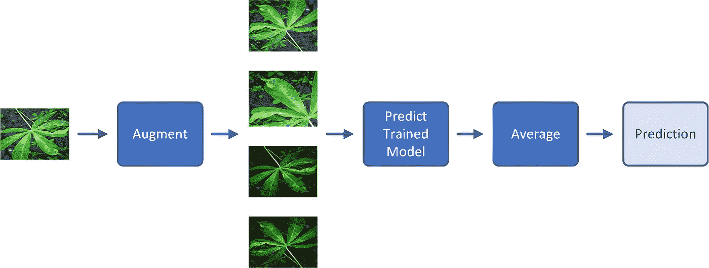

测试时间增加解释，图片由作者提供

然后我们对预测进行平均。这将为我们提供图像的预测。大多数情况下，这将提高你预测的准确性。

## 在我们的笔记本中实现 TTA

因为我们已经在使用 ImageDataGenerator 向模型提供测试图像以进行预测，所以我们只需向生成器添加增强选项，并通过测试集进行多次迭代。

在我们的笔记本上实现测试时间增加

从第十六行开始，我们在所有测试图像中迭代十次并保存预测。我们计算第 33 行预测的平均值。

我重用了评分 0.880 的模型。通过使用 TTA，预测的准确度达到了 0.889，如下图所示。

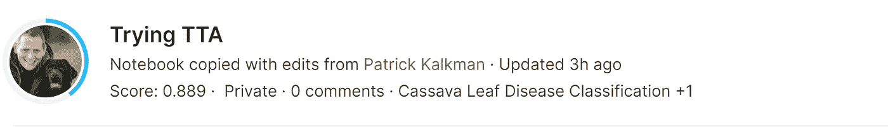

将 TTA 加入我们的笔记本的结果，图片由作者提供

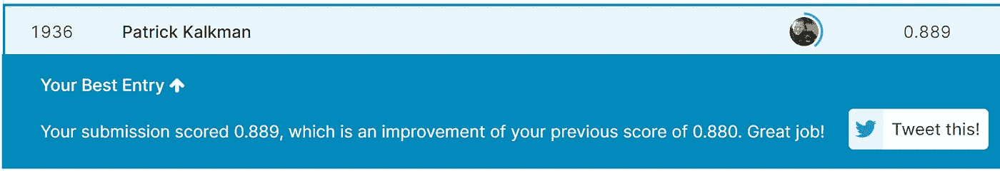

使用 TTA 后我在排行榜上的位置，图片由作者提供

# 结论和进一步优化

我们从一个简单的卷积网络开始，这个网络的准确率为 71%。在我们改用使用 DenseNet201 和 EfficientNet 的迁移学习后，准确率提高到了 88%。通过使用测试时间增加，我们几乎将它提高了一个百分点，达到 88.9%。源代码可以在[这个 Github 资源库](https://github.com/PatrickKalkman/leave-disease)中找到。

如果把我们的分数和排行榜的第一名 91.1%相比，还是有 2.2%的差距。通过阅读 Kaggle 社区共享的笔记本，我看到了一些提高准确性的附加技术。下面我就提一下，简单解释一下。

使用更大、更准确的预训练模型，如 **EfficientNetB7** 。更大意味着你将需要更大的 GPU 或更大内存的 TPU，训练将需要更长的时间。

使用 **K 倍交叉验证**。这是将你的数据拆分成训练集和验证集的不同方法。您将图像集合分成 K 个大小相等的部分。然后训练 K 个模型，每次都使用不同的训练和验证集。若要创建预测，请组合每个模型的预测。

使用 **CutMix** 进行图像放大。这是一种在训练图像之间剪切和粘贴随机补丁的新策略。它还调整图片的标签。通过这种方式，它迫使模型关注木薯叶中不太容易区分的部分。

使用 **Mixup** 进行图像放大。使用 Mixup，您可以使用线性插值来组合两个图像及其标签。[研究](https://arxiv.org/abs/1710.09412)表明，Mixup 提高了神经网络架构的泛化能力。

多模型预测或**集合模型**结合来自多个模型的预测，以提高整体性能。

这些东西大部分对我来说都是新的。但是由于我喜欢学习，我将尝试这些技术来提高我的模型的准确性。我将在下一篇文章中告诉你进展如何。

感谢你的阅读，记住永远不要停止学习！

# 已用资源

[谭明星和郭诉乐。EfficientNet:反思卷积神经网络的模型缩放](https://research.google/pubs/pub48187/)。《机器学习国际会议论文集》(ICML)，2019 年。

黄高、刘庄和基利安·q·温伯格。密集连接的卷积网络。arXiv 预印本 arXiv:1608.06993，2016a。

克里热夫斯基、苏茨基弗和辛顿。用深度卷积神经网络进行 Imagenet 分类。在 NIPS，2012 年