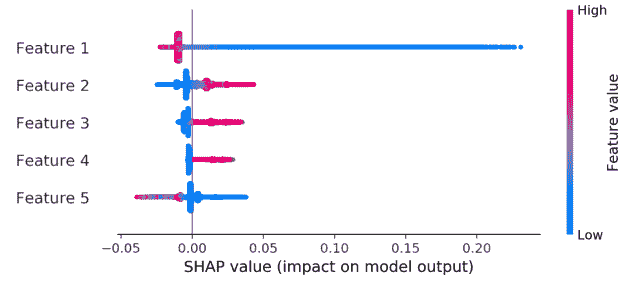
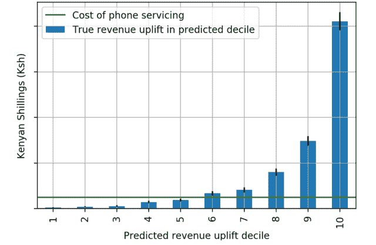

# 通过 Tala 的提升建模帮助逾期借款人还款

> 原文：<https://towardsdatascience.com/helping-late-borrowers-repay-with-uplift-modeling-at-tala-a1541aceffe4?source=collection_archive---------32----------------------->

## Tala 的数据科学团队如何通过提升建模改善借款人体验和业务 KPI

图片来自[塔拉](https://tala.co/)

这篇文章是对[我关于隆起建模力学的深入研究的后续，有一个成功的例子](/supercharging-customer-touchpoints-with-uplift-modeling-9913ddf62c1)。在这里，我描述了我们在 [Tala](https://tala.co/) 的数据科学团队如何应用提升模型来帮助逾期借款人偿还贷款。Tala 提供世界上最容易获得的消费信贷产品，通过一个智能手机应用程序，立即为从未有过正式信用记录的人承保，然后发放贷款。

# 介绍

在机器学习可以为企业创造价值的许多方式中，提升建模是鲜为人知的一种。但是对于许多用例来说，它可能是最有效的建模技术。在任何情况下，如果企业可以针对不同的客户有选择地采取代价高昂的行动，希望影响他们的行为，那么提升建模应该是找到受该行动影响最大的客户子集的有力候选。这对于在商业策略中最大化投资回报是很重要的。

在本帖中，我将概述我们在 Tala 通过抬升建模解决的业务问题、抬升模型的基础以及我们如何构建抬升模型、如何解释抬升模型的预测、如何扩展抬升概念以提供直接的财务见解，以及在生产中监控抬升模型性能的注意事项。

# Tala 的用例:逾期借款人

当借款人贷款逾期时，他们会将自己的财务健康以及向他们放贷的企业的健康置于风险之中。Tala 联系逾期借款人并鼓励他们偿还贷款的主要手段之一是通过电话。然而，这是一个昂贵的过程，必须与电话呼叫将带来的预期收入增长相平衡:如果我们打电话给借款人，他们付款的可能性有多大？

从数学上来说，我们感兴趣的是由于打电话给借款人而提高的支付概率。这被定义为如果借款人被要求偿还和如果他们没有被要求偿还的可能性的差异。

作者图片

隆起建模的前提是，它可以帮助我们确定借款人谁将有最大的还款概率增加，如果给一个电话。换句话说，那些更有说服力的人。如果我们能够确定这些借款人，我们就可以更有效地优先考虑我们的资源，以最大限度地提高借款人和 Tala 的财务健康。

# 关注机会

现在我们知道了隆起建模的目标，我们如何实现它呢？提升模型依赖于随机、受控的实验:我们需要一个有代表性的样本，包括所有不同类型的借款人，一个是接到电话的治疗组，另一个是没有接到电话的对照组。

图片来自[塔拉](https://tala.co/)

一旦我们获得了这个数据集，我们观察到治疗组的借款人还款比例明显高于对照组。这提供了证据，证明电话是“起作用的”,因为平均而言，电话有效地鼓励了所有借款人的还款。这就是所谓的*平均治疗效果* (ATE)。量化 ATE 是 A/B 测试的典型结果。

然而，可能只有治疗组中的一部分借款人对我们观察到的大部分 ATE 负责。举个极端的例子，也许治疗组中一半的借款人负责整个 ATE。如果我们有办法提前确定这部分借款人，他们会更容易对治疗做出反应，那么我们就能够将我们的电话资源集中在他们身上，而不是浪费时间在那些电话对他们几乎没有影响的人身上。我们可能需要找到其他方法来吸引不响应者。确定因人而异的治疗效果的过程取决于这些人的不同特质，这意味着我们在寻找*条件平均治疗效果* (CATE)。这就是机器学习和预测建模发挥作用的地方。

# 构建和解释提升模型

在机器学习中，我们可以通过*特征*描述借款人之间的差异，这些特征是特定于一个借款人的各种数量。我们设计了与借款人付款历史相关的功能，以及过去电话通话和与 Tala 应用程序交互的结果。这些特征试图描述借款人还款的*意愿和能力*，以及他们对*与 Tala* 建立和维持关系的承诺。借款人*会听取并向*我们学习，并给我们机会向他们学习吗？

有了上面描述的特性和建模框架，我们就可以构建我们的提升模型了。我们使用了一种叫做 S-Learner 的方法。有关这方面的详细信息，请参见[我之前关于隆起建模的博文](/supercharging-customer-touchpoints-with-uplift-modeling-9913ddf62c1)。一旦构建并测试了 S-Learner，我们就在训练集上训练一个单独的回归模型，其目标变量为提升(给予治疗和不给予治疗的预测概率的差异)，并且使用相同的特征来训练 S-Learner(除了治疗标志，它被认为是 S-Learner 方法中的一个特征)。使用该回归模型的测试集 SHAP 值，我们能够深入了解哪些模型特征对隆起预测的影响最大。

虽然这里的功能名称是匿名的，但对最具预测性的功能的解释都是有意义的，因为那些表现出支付意愿、有借款经验并可能想再次借款、愿意接受电话联系的借款人是值得鼓励通过电话还款的借款人。

*隆起模型的 SHAP 值，表示影响预测的前五个匿名因素。特征是基于借款人的支付和通话记录。图片作者。*

# 设计使用和监控模型的策略

知道预测的概率上升是我们模型导向策略的第一步。然而，我们感兴趣的不仅仅是某人付款的可能性有多大，还包括由于电话推广而可能增加的付款额。为了确定这一点，我们将概率的提高与借款人所欠金额和可能支付金额的信息结合起来。这将预测的概率上升转化为对由于电话呼叫而导致的*收入上升*的估计，使我们能够根据给借款人打电话的价值对借款人进行排名。

通过计算实际收入增长，可以看出根据预测收入增长对借款人进行排名所代表的机会，实际收入增长是不同预测收入增长箱的治疗组和对照组之间平均收入的差异。这种分析类似于此处[详述的上升十分位数图表的想法](/supercharging-customer-touchpoints-with-uplift-modeling-9913ddf62c1)。我们为此使用了模型测试集。

收入增长十分位数图:根据预测收入增长对账户进行排序时，治疗组和对照组之间平均收入的差异。图片作者。

结果表明，预测的收入增长有效地识别了电话呼叫更有价值的客户。通过呼叫所有借款人可获得的增量收入的一半以上可以通过仅呼叫以这种方式排名的前 10%的借款人来获得，而增量收入的 90%可以通过呼叫前一半的借款人来获得。事实上，当考虑每个借款人的平均电话联系成本时，显示为绿线，很明显只有前 50%的借款人打电话是有利可图的。

考虑到使用预测收入增长来指导电话拓展的明显机会，我们部署了该模型来指导我们的战略。为了监控部署后的模型性能，我们创建了两个小组，使我们能够在预测增长的整个范围内检查电话呼叫的真实增长。我们这样做是通过给随机选择的 5%的借款人打电话，不管他们的预期增长是多少，并且不给另外的 5%打电话。基于这些测试的结果，我们能够得出结论，使用这里和我的[同伴博客文章](/supercharging-customer-touchpoints-with-uplift-modeling-9913ddf62c1)中显示的相同类型的模型评估指标，模型在生产中按预期运行。

总之，提升建模允许 Tala 将还款工作集中在最容易接受这些工作的借款人身上，从而节省时间和金钱。我希望 Tala 关于隆起建模的经验对你的工作有所帮助。

*原载于 2021 年 1 月 14 日*[*【https://tala.co】*](https://tala.co/blog/2021/01/14/helping-late-borrowers-repay-with-uplift-modeling/)*。*