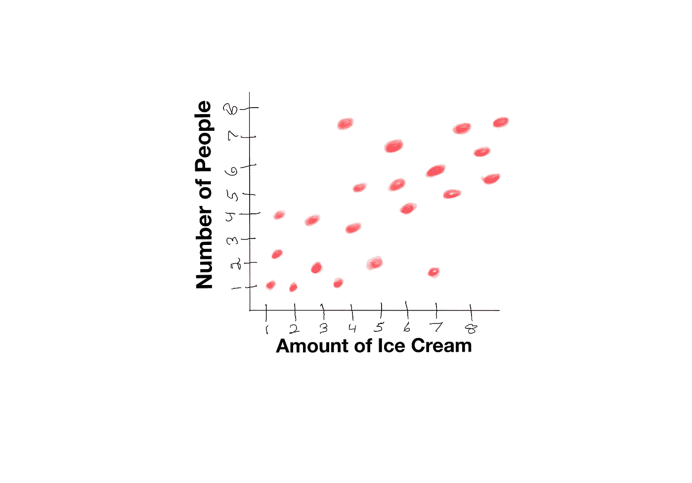
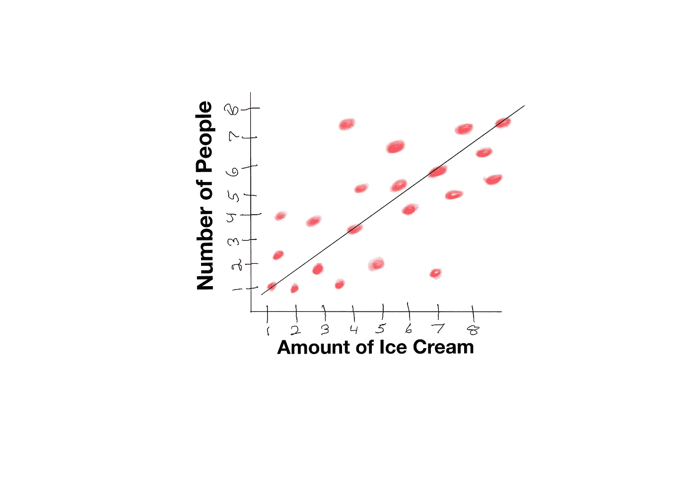
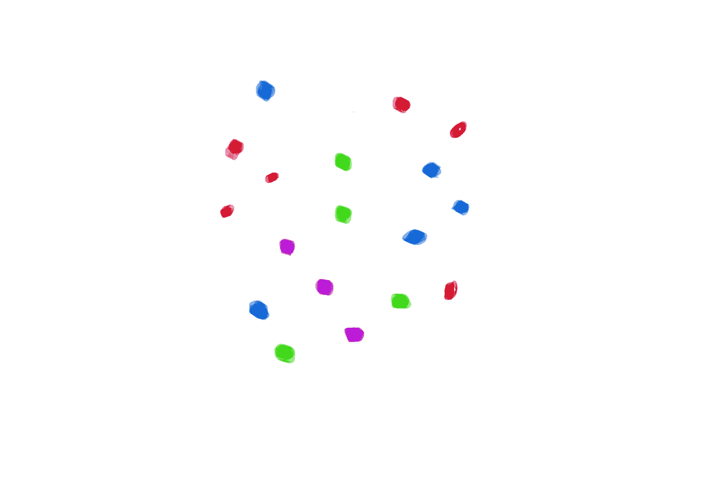
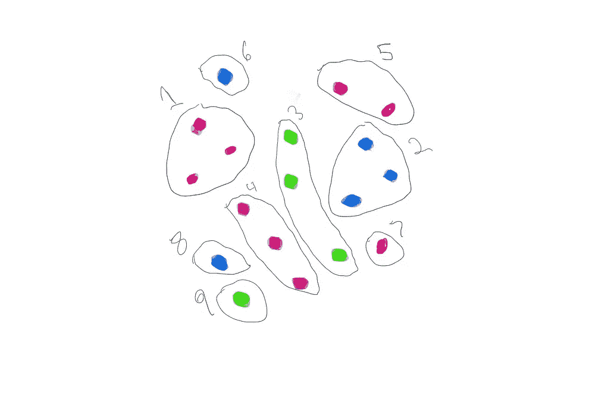
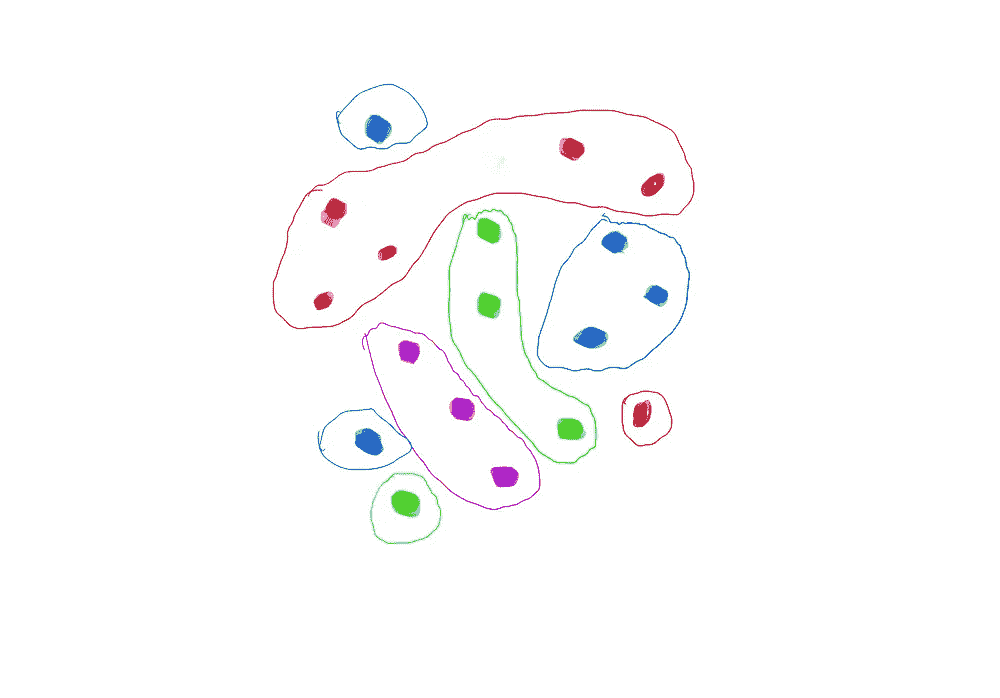
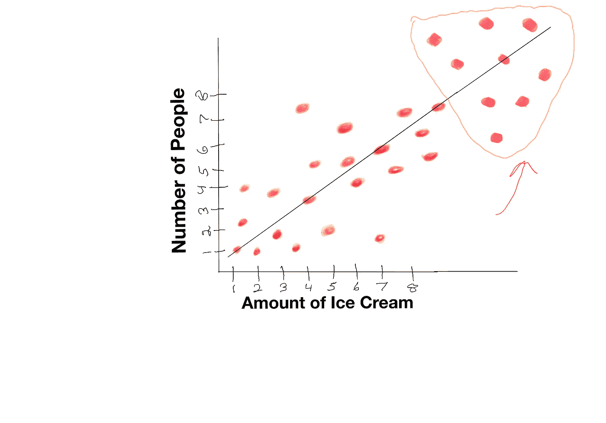

# 帮助您的孩子像数据科学家一样思考

> 原文：<https://towardsdatascience.com/helping-your-kids-think-like-data-scientists-f218e7c24631?source=collection_archive---------39----------------------->

## 使用这些简单的活动来促进年轻学生的数据科学思维。

数据科学的未来取决于下一代。虽然数据科学工具箱中的许多工具非常复杂，远远超出了大多数儿童的理解能力，但我们可以通过一些方式开始在当今的年轻人中巩固数据科学思维、方法和实践。这是有利的，因为它有助于儿童在早期发展批判性思维技能。然而，这样做的困难在于，许多孩子不喜欢整天看数字，更重要的是，试图灌输对数学或哲学意义上的线性回归或聚类的理解是完全不可能的。只要有一点创意，就有可能减轻教授数据科学原理的困难，我决定在下面分享一些我自己的方法。

# 线性回归变得简单

线性回归是一种用于模拟两个变量之间关系的技术。它既简单又复杂。简单是因为它的应用和数学公式很容易表达。复杂是因为有许多规则决定了您是否正确地应用了线性回归。

Y = a + bX

其中 a 是截距(x = 0 时 Y 的值)，b 是指直线的斜率(或直线的一步中预期的变化量)，X 是你的自变量(也叫“解释变量”)，Y 是你的因变量(你所测量的)。用通俗的话来说，这最好描述为:“给定我们对一个特定事件的全部知识，Y 与 X 的关系是什么？”回归对于估计未来值也很有用。如果你们的关系非常好，你可以在你的已知数据之外继续建立你的生产线。虽然这种方法看似简单，但上述信息对孩子来说并不容易消化。

然而，这里有一种非定量的解释线性回归的方法，这是我自己设计的，步骤如下:

1.  拿一张纸和三到四种不同颜色的笔、蜡笔或马克笔(如果你想增加难度，可以添加更多颜色)。
2.  在那张纸上画一个 X 和 Y 轴(你可以把它们标成我在图 1 中的样子)。

图一。活动设置示例显示 XY 线，并指向其上的图形(图片由作者制作)。

1.  现在，您可以要求您的数据科学学生从图形的一端到另一端绘制一条线，同时在一条线上捕捉相同颜色的大多数点(参见图 2 中的示例)。
2.  让他们描述变化(关系)是积极的还是消极的，然后你可以让他们计算在这些点上发生了多少变化。为了好玩，你可以让他们数出不在线上的点的数量，以及每个点在图上有多远。

图二。通过点绘制的线的例子说明了我们的两个变量之间的关系(图片由作者制作)。

对于非常年轻的学习者来说，这项技术可能需要相当长的时间才能掌握正确，但这是一种有趣的学习方式。毕竟，他们仅仅是在一堆点上画线而已！为了把事情搞混，你可以让它们从直线变成曲线(曲线回归)。本练习的要点应该是识别点内的模式、准确绘制线和捕捉最多的点，以及了解不在线附近的其他点如何影响整体结果。

# 集群变得简单

现在来看集群。有几种聚类方法。K-means 聚类，ward 的层次凝聚聚类，基于密度的聚类方法，最近邻，等等。虽然这些方法看起来很复杂，但它们都有一个目标，那就是根据给定数据集中的相似特征对信息进行分组。我个人认为最容易教的是最近邻聚类，因为它假设附近的值比那些相距较远的值更可能相似。K-means 聚类可能是我第二喜欢教的，因为它强调根据均值的相似性进行聚类(因此 5 个组每个都有自己的“质心”或分组值，所有相似的值都放在该组中)。

这里有一个简单的活动来帮助教授最近邻聚类和 k-means 聚类。最好使用一个写字板或者一个带手写笔的电子平板，但是纸和笔也可以。

1.  用 4 或 5 种不同的颜色在一张纸上画尽可能多的点。您应该尽量保持每种颜色的点数相同，或者分成两组，每组多一个或两个点数(例如，6 个红色点数、5 个蓝色点数、4 个绿色点数、3 个紫色点数；参见图 3)。

图 3。举例说明你如何考虑在一张纸上随机分配你的分数(图片由作者制作)。

1.  一些颜色相同的点应该彼此靠近。
2.  指导您的数据科学学生用相同的颜色圈出彼此距离最近的点(表示最近的邻居；图 4a)，并在具有相同颜色的组周围形成更大的圆(对于 k-均值；图 4b)。

图 4。在左边(4a ),我们可以看到在最近邻聚类技术下这些点是如何绘制的。在右边(4b ),我们看到如何使用 k-means 聚类技术绘制点(图片由作者制作)。

在此活动中，您不仅让学生了解了如何识别相似且彼此接近的点，还让他们了解了如何根据这些点的共同相似性对它们进行分组。你可以通过添加更多的颜色，增加点的数量，使点更密集(这将使组之间更难区分)来混合东西。

# 建模变得简单

在线性回归部分，我们讨论了一点建模，但是还有更多。建模的核心是构建现实生活事件的数学表示。这可能类似于监测温度的变化。由于我们已经使用了线性回归，我们也将使用它来练习建模。

1.  使用您在线性回归活动中所做的相同设置。
2.  让您的数据科学学生画线后，让他们评估线的终点当前位于何处(高值或低值)。
3.  根据他们对直线和两个变量之间关系的了解，让他们画出直线下一步应该移动的点，然后让他们朝着新的点画直线(见图 5)。

图 5。一个事件建模的例子。在这种情况下，我们看到，随着冰淇淋数量的不断增加，需要吃冰淇淋的人数也在增加(图片由作者制作)。

1.  为了使活动更加困难，你可以使一些点更加分散。

这项活动需要在年轻时就有敏锐的批判性思维，因为它需要对 X 轴和 Y 轴之间的关系有牢固的理解，以及在给定先验信息的情况下对线下一步应该移动到哪里的即时估计。通过以更随机和分散的模式绘制点，可以增加这一练习的难度，您也可以合并变量，例如全年的温度，这将需要曲线来拟合数据。此外，通过将点放置在远离预期位置的位置，然后仍然要求一条线(例如，由于点在图表上的分散性较大，因此很难确定线应该位于何处)，也可能会在此练习中引入误差。

虽然上述练习不会使个人成为数据科学专家，但它有助于在早期增强数据科学技术知识，并增强批判性思维。人类擅长识别模式，人们越早开始运用这种技能，一旦他们接触到更难的概念、术语和方法，这种技能就会越强。