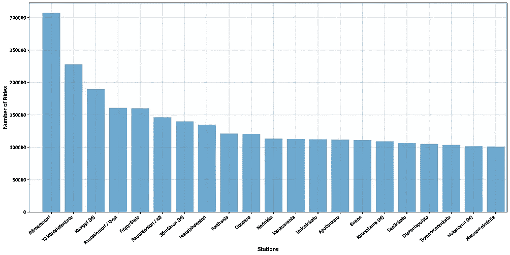

# 赫尔辛基城市自行车:探索性数据分析

> 原文：<https://towardsdatascience.com/helsinki-city-bikes-exploratory-data-analysis-e241ce5096db?source=collection_archive---------24----------------------->

## 第一部分

# 介绍

插图由: [pch.vector](https://www.freepik.com/pch-vector) 上的 [Freepik](https://www.freepik.com/pch-vector)

## **什么是赫尔辛基城市自行车？**

[赫尔辛基城市自行车](https://www.hsl.fi/en/citybikes)是赫尔辛基和埃斯波大都会地区向公众提供的共享自行车。赫尔辛基城市自行车系统的主要目标是解决所有分销网络中存在的所谓的最后一英里问题。城市自行车于 2016 年作为试点项目推出，赫尔辛基只有 46 个自行车站。在受到市民欢迎后，赫尔辛基市决定逐步扩大自行车网络。在 2017 年至 2019 年期间，每年约有一百个台站加入网络。到 2019 年，自行车网络达到完整状态，2020 年仅增加 7 个站点。截至 2020 年，赫尔辛基和埃斯波共有 3510 辆自行车和 350 个站点。

> **自 2016 年以来，已经进行了超过 10，000，000 次乘坐。行程总距离为 25.291.523 公里。客观地说，2530 万公里是到月球距离的 65 倍。所有居民骑自行车的总时间约为 280 年零 4 个月。**

为了使用城市自行车，市民购买一天、一周或从 4 月到 11 月的整个自行车季节的使用权。所有通行证包括不限次数的 30 分钟自行车骑行。额外支付 1€/小时的费用，您可以使用自行车更长时间。自行车被取走并送回位于赫尔辛基和埃斯波周围的站点。

# **探索性数据分析**

## 数据集结构

基础数据集具有以下结构。

底层数据集可以在 [**这里**](https://www.kaggle.com/geometrein/helsinki-city-bikes) 下载。

## 一般的游乐设施是什么样的？

自 2016 年以来，城市自行车系统有了显著增长，然而，城市自行车的使用方式没有发生实质性变化。如果我们看看过去 5 年中的个人出行，我们会发现平均乘车时间约为 **13 分钟**，而平均行驶距离约为 **2242 米** (1.4 英里)。鉴于数据的右偏分布，平均值略有偏差，大多数行程实际上持续 4-8 分钟，距离为 1700 米(约 1 英里)。

**左:**2016-2020 年出行距离分布。**右图:**2016-2020 年间的乘坐时长分布。图片由作者提供。

正如我们在上面看到的，绝大多数游乐设施都不到 30 分钟。然而，3.2%的用户最终超过了半小时的限制。那些超过 30 分钟限制但没有超过 60 分钟限制的用户集体付费是 **€261.715** 自 2016 年城市自行车推出以来。

## 城市自行车什么时候使用？

2016 年至 2020 年间的每日自行车出行次数。图片由作者提供。

上面你可以看到自城市自行车系统推出以来的每日自行车出行次数。正如我们所见，扩大网络覆盖范围对市民出行数量有着巨大的影响。也可以看出，2020 年是自行车使用率下降的第一年。有多种可能的解释。这种下降可能是由于新冠肺炎疫情或因为城市自行车网络达到了其增长阶段的结束。

如果我们看下面的热图，我们可以看到一个很好的日常使用模式。最密集的自行车使用发生在工作日的 6:00 至 8:00 和 16:00 至 18:00。这表明自行车在工作日的开始和结束时被通勤者积极地使用。

该热图显示了 2016 年至 2020 年期间工作日和一天中的小时数。图片由作者提供。

然而，在周末，使用模式是不同的。看起来赫尔辛基斯的市民更喜欢晚一点开始周末。最活跃的时段是 15:00-17:00。有趣的是，周末午夜时分，城市自行车的使用率更高。这可能意味着在周末，当其他形式的公共交通不再可用时，城市自行车被用作替代品。

由于通勤者积极使用城市自行车，很自然地认为 Covid 疫情和向远程工作的过渡对城市自行车的使用产生了一些影响。下图显示了过去三年(2018 年至 2020 年)的自行车使用模式。

2018-2020 年自行车使用热图。图片由作者提供。

这些图表已经说明了 2020 年自行车使用模式的一些差异。除了自行车总使用量的减少，高峰时间的出行次数也减少了。

## 哪个站最受欢迎？

左:2016 年以来出发最受欢迎的前 20 个车站右:2016 年以来返回最受欢迎的前 20 个车站。图片由作者提供。

可以预料，并非所有的站都被同等地使用。2016 年，紧邻 [Kamppi](https://en.wikipedia.org/wiki/Kamppi) 地铁站(赫尔辛基市中心)的车站是最受欢迎的。然而，自 2017 年以来，itmerentori 已成为无可争议的使用冠军。将 itmerentori 和 nlahdenkatu 视为最受欢迎的车站可能会令人惊讶，但是，这种受欢迎程度是由它们在城市自行车网络中的位置来解释的。虽然这些车站并不在赫尔辛基的中心，但它们都聚集在自行车网络的“中心”周围。2016 年，当有不到 50 个站时，Kamppi 处于网络的结构中心。然而，随着网络向赫尔辛基北部扩展，自行车网络的中心也向北移动。因此，itmerentori 和 nlahdenkatu 站在整个网络中发挥了更“重要”的作用。

可能影响该列表的一个边界条件是给定站点中的自行车可用性。如果没有自行车可用，那么数据集将不会反映自行车的需求，而是反映自行车的可用性。itmerentori 和 nlahdenkatu 站之所以热闹，是因为它们是出发和返回的热门车站。这确保了自行车随时可用，并增加了车站的使用率。

2020 年热门始发站热图。互动版可以在 [**这里找到**](https://www.kaggle.com/geometrein/helsinki-city-bikes-eda) 。图片由作者提供。

另一个有趣的观察是，自行车站的受欢迎程度在一年中没有实质性的变化。这种趋势在上面的动画热图中得到了说明。

# 哪些旅行最受欢迎？

下表显示了前 6 个最常见的始发地-目的地对。前两行说明了城市自行车在阿尔托大学校园中的重要作用。自从阿尔托大学旁边的地铁站开放以来，城市自行车成为连接校园住宅和交通枢纽的重要交通流。

2016 年以来的热门出发地-目的地对。图片由作者提供。

下面的热图显示了 2016 年和 2020 年的始发地-目的地配对及其出现频率。如前所述，扩大城市自行车网络对整体使用模式有巨大影响。

**左:【2016 年始发地-目的地热图**右:【2020 年赫尔辛基城市自行车网络始发地-目的地热图。图片由作者提供。****

与芬兰国旗的任何相似之处纯属巧合。

## 天气会影响城市自行车的使用吗？

一个直观的假设表明，气温和城市自行车的使用之间应该有联系。下图说明了大多数游乐设施发生在气温在 10 到 21 度之间的时候。

乘坐次数与平均温度。图片由作者提供。

然而，没有足够的证据可以肯定地得出骑自行车与气温有关的结论。鉴于可能影响游乐设施的潜在因素众多，无法确定这些测量值之间的具体因果关系。例如，在赫尔辛基，气温可能很高，但可能伴随着降雨或高风速。图表中显示的趋势可能是其他外部因素的结果。不幸的是，底层数据集不包含关于其他环境因素的信息。

此外，重要的是要注意，城市自行车是从四月到十月，而不是全年。这意味着自行车的使用，一般来说，总是会发生在大致相同的温度范围内。较冷的温度将与自行车使用量通常较低的骑行季节的开始和结束相一致。另一方面，夏季和七月假期的气温将会变暖。有趣的是，在这个时间段内的所有假期中，只有**<https://fi.wikipedia.org/wiki/Juhannus>****(仲夏)对城市自行车的使用有明显的影响(如下图)。******

************

******2017–2020 年的每周乘坐次数。图片由作者提供。******

# ******结论******

******在这篇文章中，我们通过描述性统计的视角来观察赫尔辛基的城市自行车系统。本文仅仅触及了可以在底层数据集上执行的所有可能分析的表面。那些对自己的探索感兴趣的人可以在 [Kaggle **上找到数据集。**](https://www.kaggle.com/geometrein/helsinki-city-bikes)[**文章的第二部分**](/helsinki-city-bikes-network-analysis-512cc7f121cd) 将赫尔辛基城市自行车系统作为一个复杂的交通网络进行分析。******

********

## ****Jupyter 笔记本****

****这篇文章背后的代码可以在这里找到:****

*   ****[**GitHub**](https://github.com/Geometrein/helsinki-city-bikes)****
*   ****[**摇摇晃晃**](https://www.kaggle.com/geometrein/helsinki-city-bikes-eda)****