# 赫尔辛基城市自行车:网络分析

> 原文：<https://towardsdatascience.com/helsinki-city-bikes-network-analysis-512cc7f121cd?source=collection_archive---------26----------------------->

第二部分

本文的 [**第一部分**](/helsinki-city-bikes-exploratory-data-analysis-e241ce5096db) 从描述性统计的角度看赫尔辛基城市自行车系统。在本文中，城市自行车系统将作为一个复杂网络来分析[。](https://en.wikipedia.org/wiki/Complex_network#:~:text=In%20the%20context%20of%20network,in%20networks%20representing%20real%20systems.)

## 介绍

在过去的几十年里，运输系统通常被作为网络来分析。这种抽象允许减少可用的信息量，并主要关注底层系统的内部结构。

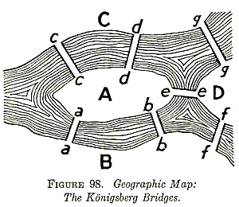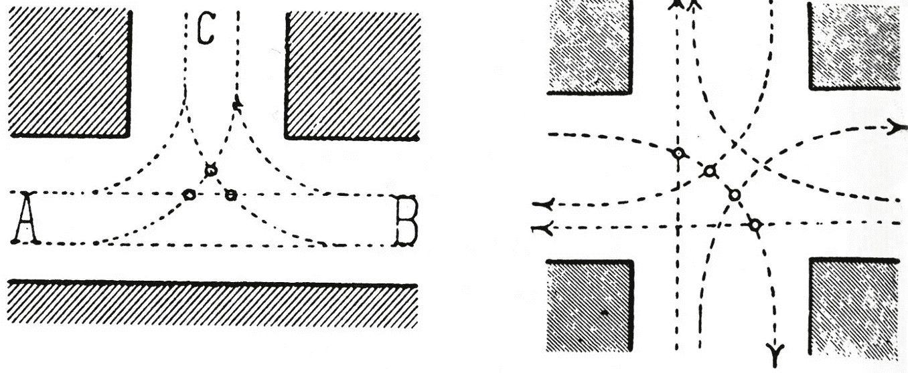

左图:柯尼斯堡地理地图。右图:卡米洛·西特，现代城市规划的诞生(1986)

这个想法当然不是 [**数学**](https://en.wikipedia.org/wiki/Seven_Bridges_of_K%C3%B6nigsberg) 或者 [**城市规划**](https://tigran-khachatryan.medium.com/architectural-context-in-the-age-of-big-data-camillo-sitte-a0d9ff377b5c) 中的。然而，计算技术和 GIS 框架的最新进展使得图论思想在地理移动性领域的新的实际应用成为可能。

> 在交通运输的背景下，术语网络指的是位置系统内的路线框架，被识别为节点。路由是两个节点之间的单个链接，这两个节点是更大网络的一部分，该网络可以指有形的路由(如公路和铁路)或不太有形的路由(如空中和海上走廊)。

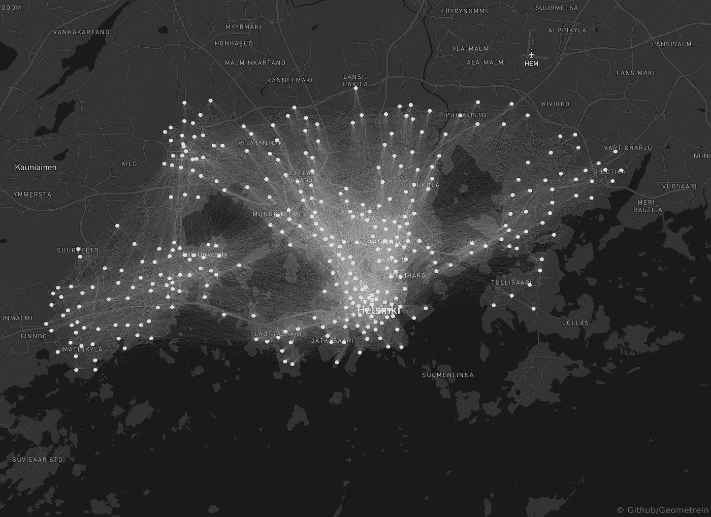

赫尔辛基城市自行车网络 2020。图片由作者提供。

运输网络通常表示永久性的物理轨道，如公路和铁路，或者定期服务。与集体交通(定期巴士和火车)不同，个人交通(步行、自行车共享)按需发生，在空间上更加灵活。由于这一点，共享移动系统拥有巨大的自我组织<https://en.wikipedia.org/wiki/Self-organization#:~:text=Self%2Dorganization%2C%20also%20called%20(,control%20by%20any%20external%20agent.>**的潜力。需要强调的是，城市自行车网络的边缘不是预先确定的，**它们是由用户生成的。于是，网络的结构** [**从穿过城市的人流中浮现**](https://en.wikipedia.org/wiki/Emergence) **。**居民的重复出行逐渐形成了使用模式，并形成了自行车共享网络的结构。反过来，该信息可以用于网络发展的反馈回路中。自行车需求的上升或下降可以提供对某些地区更广泛的社会、经济和地理因素的洞察。下图显示了 2020 年赫尔辛基不同地区的自行车使用情况。**

**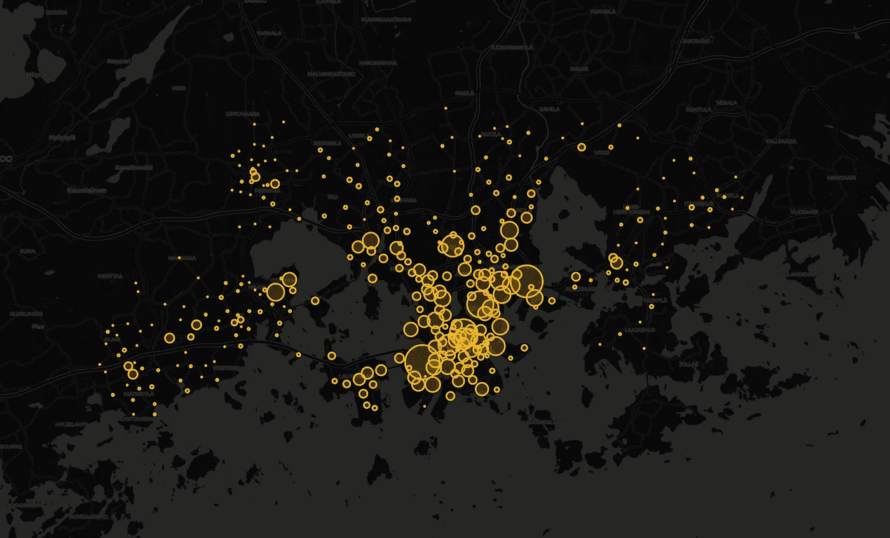**

**2020 年按用途划分的始发站。**互动版可以在** [**这里找到**](https://www.kaggle.com/geometrein/helsinki-city-bikes-eda) 。图片由作者提供。**

**正如所料，赫尔辛基市中心是地理流动性最活跃的地区。然而，正如本文第一部分所指出的，赫尔辛基的地理中心和赫尔辛基自行车网络的中心并不相同。**

# **赫尔辛基城市自行车网络的中心在哪里？**

## **网络中心性度量**

**根据定义，复杂网络是高度异构的结构。这通常导致网络的某些部分比其他部分信息更丰富。例如，在社交网络中，一些人可能有大量的联系，可以比其他人更快地传播信息。因此，在[社交网络分析](https://en.wikipedia.org/wiki/Social_network_analysis#:~:text=Social%20network%20analysis%20(SNA)%20is,or%20interactions)%20that%20connect%20them.)的上下文中，代表它们的节点被认为更重要(中心)。在交通网络的背景下，人口流入量高于其他地区的城市区域可被视为中心区域。然而，给定网络的中心性可能会随着时间的推移而改变，这是底层系统增长和演变的结果。因此，中心性的定义不是绝对的，而是取决于特定的上下文和抽象的目的。考虑到这种相关性，已经提出了几种集中于节点之间不同类型关系的中心性度量。**

## **程度中心性**

**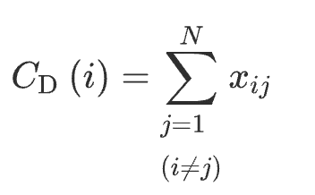**

**节点 I 的 *C* D( *i* )度中心性**

**[*度中心性*](https://en.wikipedia.org/wiki/Centrality) 是理解和计算最简单的中心性度量。节点的“度”是指给定节点所连接的节点的数量。在城市自行车的上下文中，这指的是用户从目标站点前往的自行车站点的数量。正如我们在下图中看到的，位于赫尔辛基市中心的车站有更多的连接。越靠近网络的外围，节点的度数逐渐减小。**

**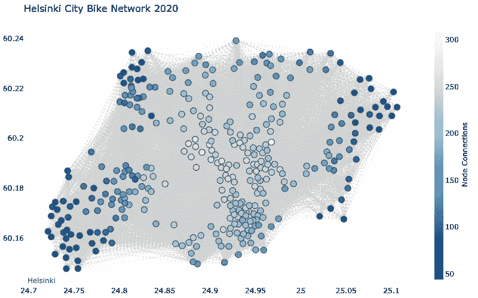****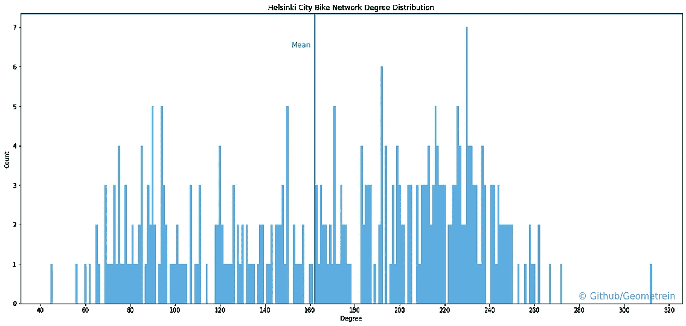**

**图片由作者提供。**

**赫尔辛基城市自行车网络中一个节点的**平均度**为 **162** 。这意味着一个自行车站平均连接到 162 个不同的站点。中心度最高的站是:**

```
**Haukilahdenkatu:**    312 connections
**Paciuksenkaari**:     272 connections
**Huopalahdentie**:     267 connections 
**Laajalahden aukio**:  262 connections
**Munkkiniemen aukio**: 262 connections
**Töölöntulli**:        260 connections
**Tilkanvierto**:       259 connections
**Paciuksenkatu**:      258 connections
**Pasilan asema**:      258 connections 
**Esterinportti**:      256 connections 
```

**Haukilahdenkatu 站在这个名单的首位，这一事实表明来自不同地区的大量市民定期往返于这个车站。**

**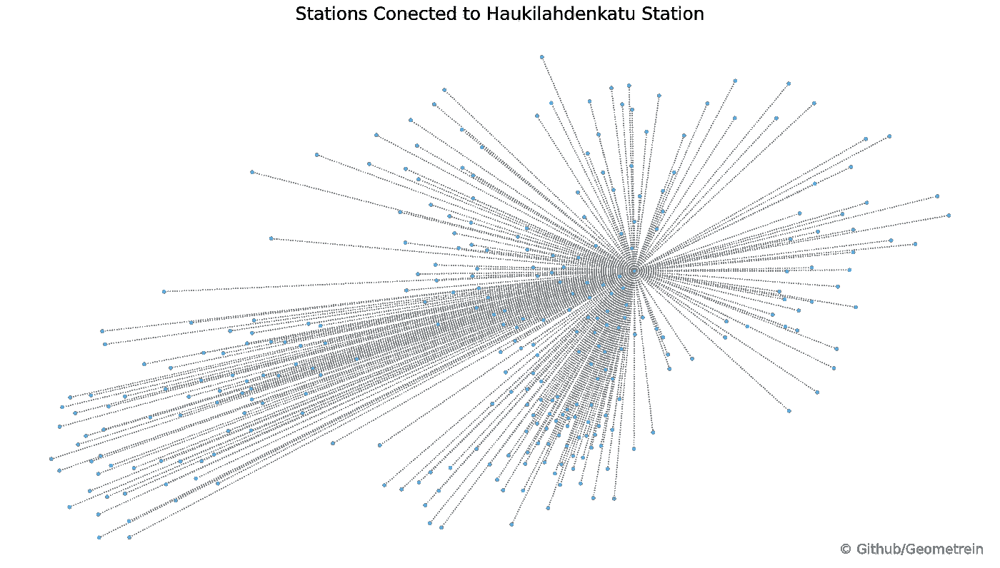**

**图片由作者提供。**

**这可能意味着该车站要么靠近大型交通枢纽，要么靠近重要的兴趣点。快速谷歌搜索会发现它位于一个大型教育机构和一个劳动改造中心的街对面。这解释了旅行的规律性和来自不同郊区的人口流入。**

## **中间中心性**

**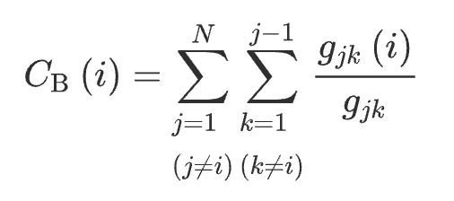**

**其中 *gjk* 是连接单元 *j* 和 *k* 的测地线的数目， *gjk* ( *i* )是单元 *i* 占据中间位置的那些测地线的数目。**

**中间中心性捕获了给定节点有多少处于其他节点之间。该度量计算网络中所有节点之间的最短路径，并根据经过目标节点的最短路径数为每个节点分配一个度量。下图通过中间中心性展示了城市自行车站点。**

**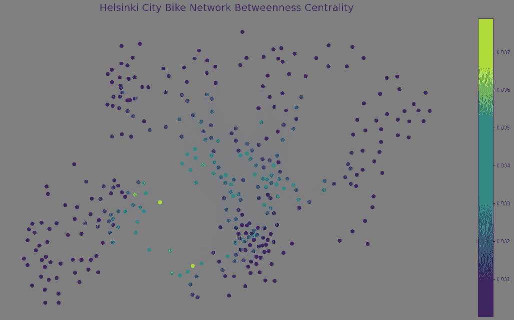**

**图片由作者提供。**

**具有最高介数中心性的节点代表 **Lehtisaarentie** 站。这是地理限制影响空间网络结构的一个典型例子。该站位于 Lehtisaari 岛上，将阿尔托大学校园与 Munkkiniemi 和赫尔辛基连接起来。由于赫尔辛基群岛的特殊性，从一个城市到另一个城市的交通流量主要通过位于两者之间的岛桥系统。这使得 Lehtisaari 岛和 Lautasarri 岛成为连接埃斯波市和赫尔辛基的重要交通枢纽。**

## **接近中心性**

**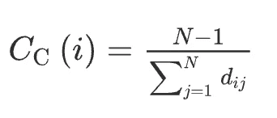**

**接近中心性是一种检测能够在网络中有效分配流的节点的方法。接近中心性计算为其所有 [**测地线距离**](https://en.wikipedia.org/wiki/Distance_(graph_theory)) 的归一化平均值。在城市自行车的上下文中，具有高接近中心性的节点将指示可能充当网络内的多功能中间站的站。**

**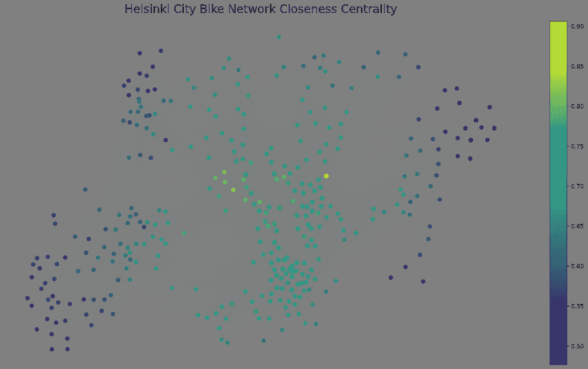**

**图片由作者提供。**

**如上图所示，大量车站直接连接到 **Haukilahdenkatu** 车站。这导致 Haukilahdenkatu 站在网络中具有最高的接近中心度。具有高接近中心性的其他节点位于托洛和帕西拉地区。对于网络优化，特别是对于较大的网络，接近中心性可能是有趣的度量。在更大的自行车共享网络中，用户可能会在中间自行车站停车，以避免额外的费用。然而，正如我们在本文前面所看到的，长途旅行在赫尔辛基并不常见。**

## **特征向量中心性和 PageRank**

**特征向量中心性度量节点在网络中的重要性，同时考虑其邻居的重要性。与到低得分节点的同等连接相比，到高得分特征向量中心性节点的连接对得分的贡献更大。换句话说，如果具有大量连接的节点的所有连接都是低得分节点，则该节点可能具有低特征向量得分。特征向量中心性的一个流行变体是 [**Google 的 PageRank**](https://en.wikipedia.org/wiki/PageRank) 。从本质上讲，PageRank 是归一化特征向量中心性与[随机跳跃](https://en.wikipedia.org/wiki/Random_walk) s 相结合的变体。因此，Pagerank 产生与特征向量相当的结果也就不足为奇了(下图)。使用这种方法，中央火车站、Pasila、Lehtisaarentie 和 Haukilahdenkatu 等车站将作为网络的中心节点出现。**

**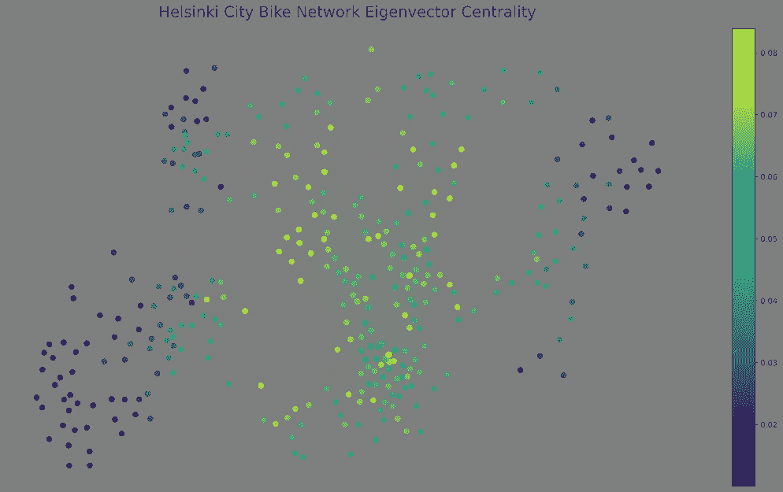****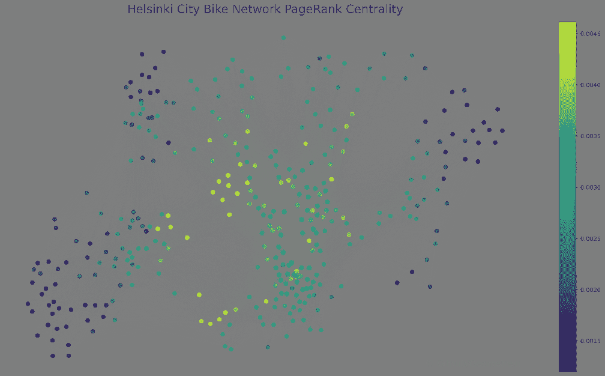**

**图片由作者提供。**

**特征向量和 PageRank 在城市环境中的应用是一个持续争论的主题。有人提出，这些在城市环境中应用的指标往往会导致误导性的结果，因为它们忽略了许多可能有助于城市内节点重要性的城市品质。虽然这些限制在服务路线是预先确定的集体运输系统中可能是一个问题，但这肯定不是个体运输的情况。如前所述，个人交通网络的结构是由用户生成的，因此其中已经嵌入了一些关于城市质量的信息。事实上，用户有选择权，选择走一条路而不是另一条路，这就产生了一种琐碎的投票机制，对城市的不同区域进行评级。因此，在这种网络中，对网络结构的研究也是对用户行为及其更好的城市品质的研究。此外，单个交通网络中的特征向量中心性不仅可以突出显示重要的单个节点，还可以突出显示城市中地理位置重要的区域。这是可能的，因为它不仅承认单个站的重要性，而且承认与其相邻的站的重要性。特征向量中心性表明，城市自行车站点(节点)的重要性与其说来自它们的固有属性(位置、站点大小)，不如说来自它们与网络中其他节点 的 [**关系。中心站和与其相邻的节点一起形成小的活动飞地。复杂网络环境中这种节点分组的识别通常被称为社区检测。**](https://tigran-khachatryan.medium.com/architectural-context-part-10-digital-context-greg-lynn-stan-allen-f912f524017a)**

# ****社区检测****

**网络中的社区指的是内部紧密连接的节点组。社区发现通常是理解复杂网络结构的关键过程。在城市自行车网络的情况下，社区检测可以帮助更好地了解自行车使用模式，并确定适当的定价模型。有许多算法可用于社区检测。**

## **组合方法**

**大多数现有的社区检测策略迭代地执行以下操作之一:合并两个小社区(凝聚的)，将一个大社区分成两个(分裂的)，在两个不同的社区之间移动节点。在 [**麻省理工学院明智城市实验室**](https://senseable.mit.edu/) 开发的 [**组合**](https://senseable.mit.edu/community_detection/) 算法将所有三种策略组合成一个序列。创建初始单个社区后，对于每个源社区，计算所有源节点的最佳可能重新分布，然后应用最佳分组。这些步骤反复重复，直到达到给定的适合度标准。下图说明了应用于赫尔辛基城市自行车网络的组合方法。**

**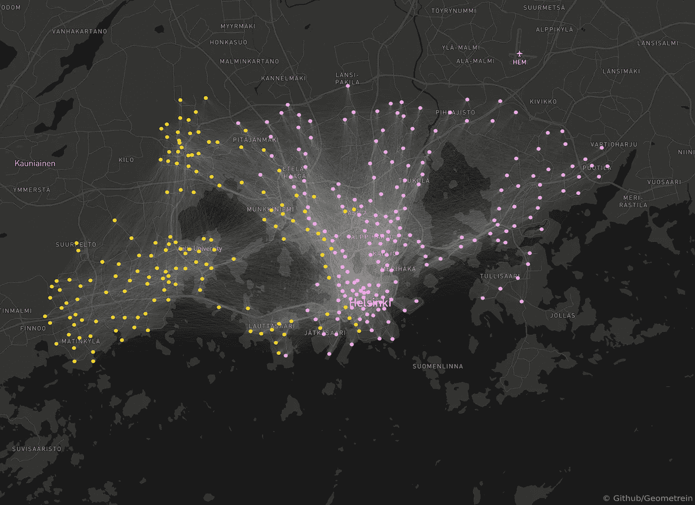**

**应用于赫尔辛基城市自行车网络的社区检测组合方法。图片由作者提供。**

**这一分组揭示了两个截然不同的社区，它们大致按照现有的市政区划分开。这可能不是非常有用的信息，因为这种划分仅仅通过看地图就可以假定。基于本文的第一部分，直观的理解表明，自行车更有可能在短距离的城市内使用。因此，如果存在其他社区，它们应该在更局部的范围内被发现。**

## **卢万法**

**由于先前的社区检测方法没有产生深刻的结果，我们可以应用专门关注网络的 [**模块性**](https://en.wikipedia.org/wiki/Modularity_(networks)) 的不同方法。 [**Louvain**](https://en.wikipedia.org/wiki/Louvain_method) 社区检测由于其漂亮的简单性和计算效率而成为很好的候选。它有效地处理了所有社区检测任务中存在的图 的 [**最大割的 NP 完全可计算性问题。将 Louvain 方法应用于赫尔辛基城市自行车网络揭示了四个不同的社区。**](https://en.wikipedia.org/wiki/Cut_(graph_theory)#:~:text=In%20graph%20theory%2C%20a%20cut,said%20to%20cross%20the%20cut.)**

**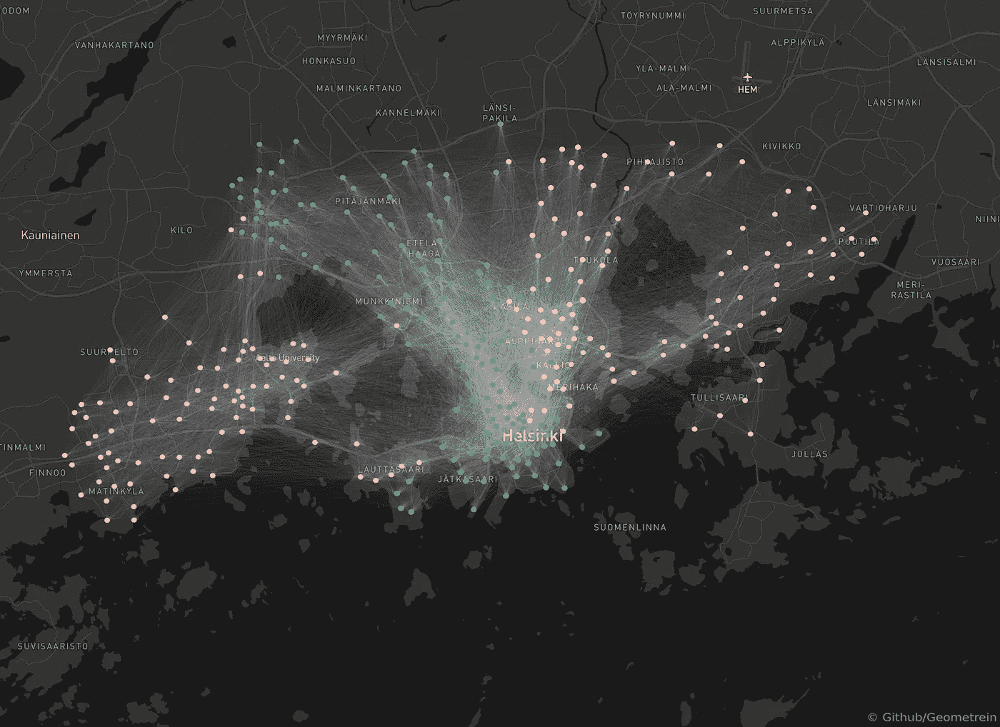**

**卢万社区检测方法在赫尔辛基城市自行车网络中的应用。图片由作者提供。**

**这意味着这四个社区内的自行车使用率高于这四个社区之间的自行车使用率。具有高介数中心性的节点通常是社区可能被分成模块的地方。如果我们回到我们的中间中心图，这种关系将变得更加明显。社区的边界大致通过具有高介数中心性的节点。此外，考虑到赫尔辛基群岛的地理特征，这种划分并不令人惊讶。大块陆地和它们被大片水域分割开来，对群落的形成有重大影响。必须强调的是，所有交通网络都是空间网络，其结构和演变与物理限制密切相关。一个有趣的发现是，Leppavara 地区尽管是 Espoo 市的一部分，但它与 Munkiniemi 和 pitjnmaki 的联系比与 Otniemi 或 Tapiola 地区的联系更紧密。类似的趋势也可以在索宁附近的一些站点看到，这些站点与 Herttoniemi 区域的连接更加紧密。**

## ****流体群落**法**

**流体群落算法是一种基于在非均匀环境中引入多种流体的思想的群落检测算法，在非均匀环境中，流体将在环境拓扑的影响下膨胀并相互推动，直到达到稳定状态。该算法执行以下操作。首先，它定义了图中随机节点的每个起始社区。然后，该算法以随机顺序在所有节点上迭代，基于每个节点自己的社区及其邻居的社区来更新每个节点的社区。这个过程反复执行，直到收敛。**

**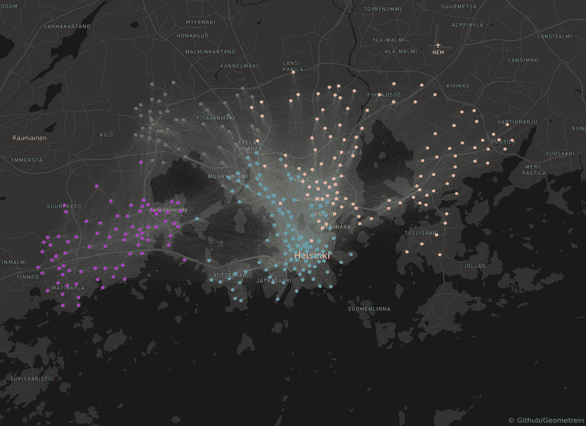**

**应用于赫尔辛基城市自行车网络的社区检测的流体方法。图片由作者提供。**

**我们可以看到，流体群落检测方法确认了用 Louvain 方法识别的群落，并识别了一个额外的群落。**

*   **Eastern Espoo(Magenta 社区)是一个独特的社区，受地理条件的限制，沿着地铁线向西延伸。**
*   **leppvaara、pitjanmaki、Munkiniemi 和 Etelä Haaga(绿色社区)形成了另一个自行车社区，尽管市政分区将这些地区分开。**
*   **瓦利拉、Kapyla 和 Oulunkyl 地区形成了另一个群体(粉色社区),通过中央公园与绿色社区隔开。这个社区沿着赫尔辛基北部的铁路延伸。**
*   **赫尔辛基南部(蓝色社区)包括赫尔辛基的地理中心和主要车站，如 Kammpi、中央火车站，并向南部海岸线延伸。**
*   **与此同时，Herttoniemi 位于另一个飞地(黄色社区)的中心，该飞地沿着地铁线从 Sornainen 延伸到 Vuosaari。**

# **结论**

**在文章的这一部分，赫尔辛基城市自行车网络作为一个复杂网络进行了简要分析。对网络应用了多种中心性测量，并确定了重要的中心。树社区检测算法揭示了网络中节点的不同可能分组。文章的下一部分将着眼于如何应用机器学习方法来进一步增强对网络内关系的理解。**

# **Jupyter 笔记本**

**这篇文章背后的代码可以在这里找到:**

**<https://github.com/Geometrein/helsinki-city-bikes>  

*   <https://www.kaggle.com/geometrein/helsinki-city-bike-network-analysis>

# **参考**

*   **[复杂网络中高质量社区发现的通用优化技术](https://journals.aps.org/pre/abstract/10.1103/PhysRevE.90.012811) (Combo 方法)**
*   **[Python 的组合](https://github.com/Casyfill/pyCombo)**
*   **[Fluid Communities:一个有竞争力的、可扩展的、多样化的社区检测算法](https://arxiv.org/abs/1703.09307)。****