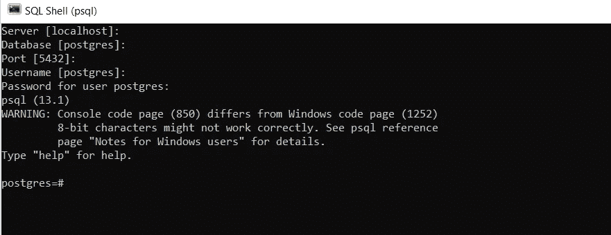
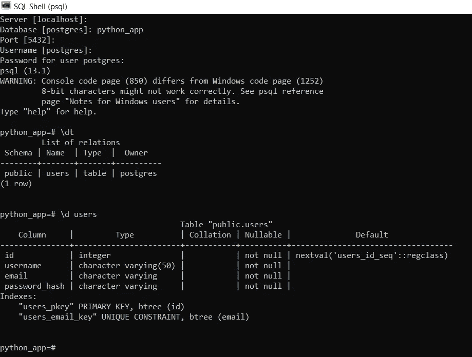
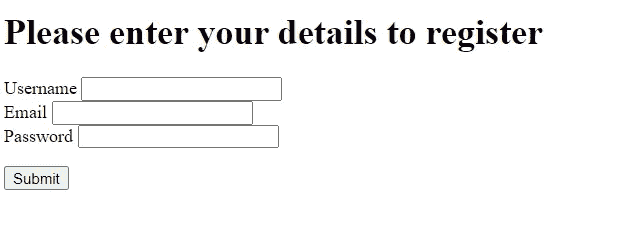
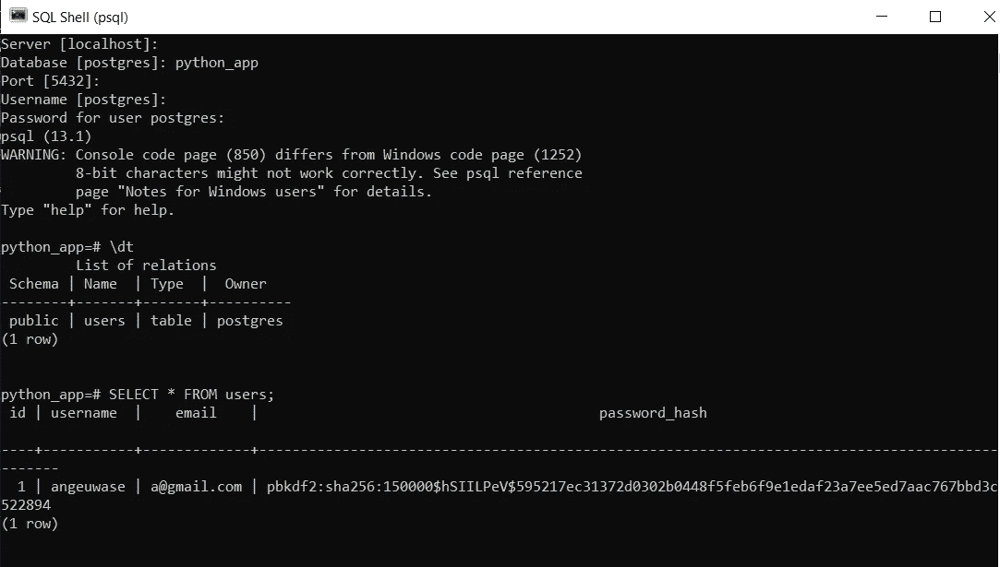

# 这就是 SQLAlchemy 如此受欢迎的原因

> 原文：<https://towardsdatascience.com/here-is-the-reason-why-sqlalchemy-is-so-popular-43b489d3fb00?source=collection_archive---------8----------------------->

## 将 flask 应用程序直接连接到 postgresql 数据库的权威指南，它将帮助您理解为什么 SQLAlchemy 是将 python 应用程序连接到关系数据库的首选方式


卡斯帕·卡米尔·鲁宾在 [Unsplash](https://unsplash.com/s/photos/sql?utm_source=unsplash&utm_medium=referral&utm_content=creditCopyText) 上的照片

# 介绍

有两种方法可以将 python 应用程序连接到关系数据库:低级方法和高级方法。低级方法包括在本地机器上安装和设置关系数据库管理系统，并编写实际的 SQL 命令来执行数据库操作。另一种方法是使用对象关系映射器(简称 ORM)。ORM 是一个数据库抽象层，是您和数据库引擎之间的中介。它允许您定义常规的 Python 对象和方法，并将其翻译成低级 SQL 数据库指令。SQLAlchemy 是 python 中处理关系数据库的 ORM 选择。

SQLAlchemy 如此受欢迎的原因是因为它实现起来非常简单，可以帮助您更快地开发代码，并且不需要 SQL 知识就可以开始。这也是为什么网上几乎所有的编程教程和课程都在教授高级方法。大多数执业软件工程师似乎也更喜欢使用 SQLAlchemy。

本文是一篇教程，介绍如何在不使用 SQLAlchemy 的情况下将一个简单的 flask 应用程序连接到 postgresql 数据库。是的，你没看错，所以我来告诉你:一旦你理解了如何使用数据库这种低级方法，你不仅会对 SQLAlchemy 有更深的理解，而且会真正理解在你使用它时幕后发生了什么！

我们的研究将涉及构建一个 web 应用程序，它通过一个表单接收用户输入，并将其存储在 postgresql 数据库中。我们开始吧！

# 步骤 1:项目设置

创建一个项目目录，在终端中导航到该目录，然后为项目创建一个虚拟环境。激活虚拟环境后，安装 flask 和 psycopg2。psycopg2 是 python 中最流行的 PostgreSQL 适配器。它允许您直接从 python 代码访问本地机器上的 postgresql 数据库。确保将您在虚拟环境中安装的所有 python 包写入 requirements.txt 文件。

```
$ py -3 -m venv venv
$ venv/Scripts/activate
$ pip install flask
$ pip install psycopg2
$ pip freeze > requirements.txt
```

你也可以继续创建一个名为 **app.py** 的空 python 脚本，一个名为 **templates** 的文件夹，以及一个名为**index.html**的空白 html 文档。项目文件夹的结构应该如下所示:

```
|- app.py
|- requirements.txt
|- templates
   -index.html
|- env
```

# 步骤 2:创建数据库

您需要在本地机器上安装 postgres。你可以从 https://www.postgresql.org/download/.[下载适合你操作系统的版本](https://www.postgresql.org/download/.)

安装完成后，运行 postgres 的 SQL Shell(psql)并进入数据库服务器。如果您使用默认设置安装 postgres，您可以将所有字段留空(每次只需按 enter 键，以便选择器移动到下一个字段)，并且只需输入您选择的密码。当 SQL Shell 终端在前面加上数据库名称(默认情况下应该是默认的 postgresql 数据库，`postgres=#`)时，您将知道您在数据库服务器中。



SQL Shell (psql)截图(作者自己的)。

如果你愿意，你可以使用默认的“postgres”数据库作为你项目的数据库，但是我更喜欢创建我自己的数据库。要在服务器上创建数据库，请在 SQL shell 中运行下面显示的命令。这个命令指示服务器创建一个名为 **python_app** 的数据库。确保不要忘记命令末尾的分号，否则命令不会执行。

```
postgres=# CREATE DATABASE python_app;
```

服务器将用一条确认消息作出响应，表明它创建了一个数据库。要查看服务器上的所有数据库，请运行下面显示的命令。您应该看到 python_app 被列为存储在服务器上的数据库之一。

```
postgres=#\l
```

这就是我们将在 SQL Shell 中完成的所有工作。其余的数据库操作(创建表和添加条目等)将在我们的 python 应用程序中执行。

# 步骤 3:从 python 应用程序连接到数据库，并创建一个用户表

在您的 **app.py** 文件中，导入 psycopg2 模块。您还希望从 psycopg2 导入 Error 对象，以便可以直接在 python 代码中处理任何数据库错误。

psycopg2 模块公开了一个 connect()方法，该方法将用于在 SQL Shell 中登录 postgres 数据库服务器的参数的键值对作为参数:主机、数据库、端口、用户、密码。connect()方法的输出是一个 connection 对象，它允许您创建到 postgres 数据库的连接。一旦建立了连接，您需要某种方式来告诉数据库要执行哪些 SQL 命令。这就是光标对象的用武之地。connection 对象公开了一个 cursor()方法，该方法可用于创建一个 cursor 对象，该对象的任务是执行您希望数据库执行的任何 SQL 命令。

使用 python 代码连接到 postgres 数据库的工作流如下:

1.  创建连接对象
2.  使用 connection 对象创建一个游标对象
3.  使用游标对象执行 SQL 命令
4.  关闭游标对象和数据库连接

由于此工作流涉及到与外部系统的连接，因此一个好的做法是在 try-catch-finally 块中实现此工作流，以便您可以处理由于连接问题或代码中的错误而引起的任何异常。

在数据库上执行 SQL 命令是一个两步过程:首先通过 cursor 对象的 execute()方法将查询字符串传递给它。然后，您必须使用连接对象的 commit()方法将 SQL 命令提交给数据库，以使更改反映到数据库中。您可以将“cursor.execute()”理解为“git add x ”,将“connection.commit()”理解为“git push”。

我发现首先将查询字符串定义为一个变量，然后将其作为一个参数传递给 execute 方法更容易，但是如果您愿意，也可以将完整的查询作为一个参数来编写。

在数据库中创建一个**用户**表的代码如下所示。要告诉数据库创建一个表，您可以使用命令关键字“CREATE TABLE ”,后跟表的名称，然后在参数中输入组成表的列的名称。每一列都有定义其预期数据类型和约束的关键字。

如果代码运行成功，postgres 服务器上的 python_app 数据库现在应该包含一个 users 表。要确认这一点，您可以打开 SQL shell 并访问 python_app 数据库，然后运行`\dt`命令来查看该数据库中的所有表。如果您想查看您定义的所有列及其约束，您可以运行`\d users`命令。同样，如果出于某种原因，你想从数据库中删除这个表，你可以运行`DROP TABLE users;`命令。最后，如果您发现自己在默认的 postgres 数据库中，您可以通过运行`\c python_app``命令轻松切换到 python_app 数据库。



SQL Shell 的屏幕截图，确认已经创建了 users 表(作者自己的)。

# 步骤 4:创建一个简单的 flask 应用程序来呈现注册 web 表单

首先实例化一个 flask 应用程序对象。接下来，定义一个路由和视图函数，该函数将处理对 webform 的 url”的请求。当用户提交表单时，这个视图函数应该在收到 GET 请求时呈现表单，在收到 POST 请求时处理表单。处理部分暂时留为空白，因为我们将在下一步中定义它。

您的 **app.py** 文件代码应该如下所示:

您的**index.html**文件应该包含以下代码:

在终端中运行命令`$ python app.py`以调试模式打开 flask development server。在您的浏览器中访问网址` [http://127.0.0.1:5000/](http://127.0.0.1:5000/) `应该会打开注册表。



报名表截图(作者本人)

我们现在有了一个在浏览器中呈现的表单，它允许用户向服务器提交输入，但是在用户按下 submit 按钮后什么也没有发生。让我们改变这一点。

# 步骤 5:将用户输入存储在数据库中

首先定义一个名为“add_new_user”的函数，它接收一组用户数据(姓名、电子邮件、散列密码)并将其写入数据库。

然后修改视图函数，以便当接收到“POST”请求时，它调用“add_new_user”函数，以便将数据保存到数据库中。

当您填写注册表单并按 submit 时，该信息应该被写入您本地机器上的 postgres 数据库！为了确认这一点，打开 SQL shell 并访问 **python_app** 数据库。要查看给定数据库表中的数据，您需要运行查询。因为我们想要查看存储在 users 表中的所有数据，所以我们将运行`SELECT * FROM users;`。

您应该看到您在表单中输入的详细信息被捕获为 users 表中的一个新条目。



数据库中新条目的截图(作者自己的)

# 完整代码

为了方便起见，完整的 app.py 代码如下所示:

# 与 SQLAlchemy 的比较

这是使用 SQLAlchemy 的相同应用程序的外观:

# 结论

现在你知道了。一个简单的 flask 应用程序，它直接连接到 postgres 数据库来存储用户信息。如您所见，使用这种方法写入数据库是一个非常繁琐的过程。尽管非常可行，但它并不十分 pythonic 化。

SQLAlchemy 允许您继续以您习惯的方式编写代码，即使是在使用数据库时。您定义了一个表示特定实体类型的类，并直接映射到数据库中的一个表。您定义的所有类属性都映射到表中的列，然后该类的任何实例都作为表中的新条目存储在数据库中。使用 SQLAlchemy 会产生更简单、更清晰的代码，编写起来会更快。现在您知道为什么 SQLAlchemy 是 python 中处理数据库的实际方式了吧！