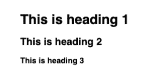
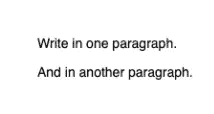
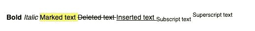
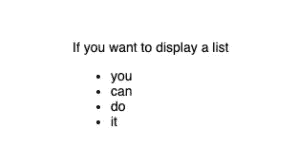
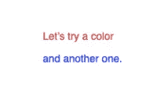
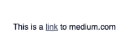
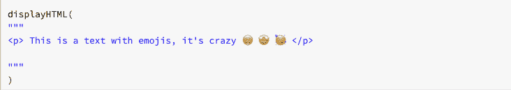
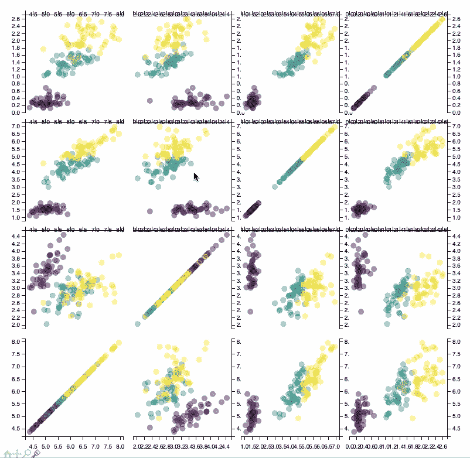

# 以下是如何在数据块中显示 HTML

> 原文：<https://towardsdatascience.com/heres-how-to-display-html-in-databricks-c36d9cb47607?source=collection_archive---------20----------------------->


阿列克谢·图伦科夫在 [Unsplash](https://unsplash.com?utm_source=medium&utm_medium=referral) 上的照片

## 以及它如何增强你的分析

当我在一个 Python/R 项目上工作并希望交付输出时，我希望它非常闪亮。然而，有时分析的交付支持将是笔记本本身，或者是出于时间限制，或者是为了方便。

我一直认为我必须使用静态降价和一些图表来说明我的结果。但是，如果你像我一样使用数据块，有一个简单的解决方案，DisplayHTML 函数。这个函数将允许你在笔记本上显示比简单的代码行和图形更多的东西。

对于那些不知道它的人来说，Databricks 是一个统一的数据和分析平台，由 Apache Spark 的创始人创建。免责声明，我与这家公司没有任何关系，我只是为他们的产品工作。

在这篇文章中，我将详细说明使用这个功能可以显示什么，并给出几个例子。

你可以随时参考 Databricks [可视化文档](https://docs.databricks.com/notebooks/visualizations/index.html)来获得基础知识。

displayHTML 的第一个也是最常见的用途是显示文本。指出指导方针、你的结果的摘录或引导读者通过你的发现可能是有用的。

要做到这一点，您可能已经猜到了函数的名称，您只需要使用众所周知的 HTML 语言。我们将在下一部分看到你需要的最有用的 HTML 标签。

# HTML 基本标签

**1。标题和段落**

使用标题将你的文本分成带有标题和副标题的小节。这将使你看起来像一个真正的文本，而不仅仅是一连串的句子。

标题的标签是<hxxx>，xxx 是一个数字，数字越小，文本越大。</hxxx>

```
displayHTML("""
<h1>This is heading 1</h1>
<h2>This is heading 2</h2>
<h3>This is heading 3</h3>
""")
```



查询输出。作者截图

HTML 标签

允许你写不同的段落

```
displayHTML("""
<p>Write in one paragraph.</p>
<p>And in another paragraph.</p>
""")
```



查询输出。作者截图

**2。内嵌标签**

你也可以使用内嵌标签，如粗体、斜体和其他标签。

```
displayHTML("""
<b> Bold </b> 
<i> Italic </i>
<mark> Marked text </mark> 
<del> Deleted text </del> 
<ins> Inserted text </ins> 
<sub> Subscript text </sub> 
<sup> Superscript text </sup>
""")
```



查询输出。作者截图

**3。列表**

当然，您可以使用

*   标签在列表中显示项目，如下所示:

```
displayHTML("""<p>If you want to display a list</p>
<ul>
  <li> You </li>
  <li> can </li>
  <li> do </li>
  <li> it </li>
</ul>
""")
```



查询输出。作者截图

## 4.颜色；色彩；色调

使用段落和样式标签以几种不同的颜色显示文本。

```
displayHTML("""<p style=”color:red”>Let’s try a color</p>
<p style=”color:blue”>and another one.</p>""")
```



查询输出。作者截图

## 5.外部资源

你不必局限于纯文本，因为你也可以引用外部资源，可以是纯 URL，甚至是图片。

正如在官方文档中提到的，如果你引用一个外部资源，你应该总是使用 https://而不是 http://来避免呈现错误。

```
displayHTML("""
<p> This is a <a href=”https://www.medium.com"> link</a> to medium.com </p>
""")
```



查询输出。作者截图

## 6.形象

您还可以显示图像，但前提是这些图像存储在与数据块相连的数据库中，例如之前分析的图形保存为 jpg 格式。

```
displayHTML("""""")
```

## 奖励:表情符号

最后但同样重要的是，如果你想让你的测试更精彩一点，可以添加表情符号:)



作者图片


查询输出。作者截图

# If 语句和参数

现在我们已经完成了基本命令，不要忘记我们仍然处于 python 环境中，这意味着我们可以有条件地显示文本。

假设您想要显示一个基于计算结果的建议，那么您可以使用一个 if 语句并向 displayHTML 函数传递一个参数。在 Python 中，可以使用{}和将变量传递给函数。最后格式化。

以下函数允许您根据结果值显示不同的消息。

```
if my_result>50:
  sentence = "the result passed the condition with a value of"
  +   str(my_result)else:
  sentence = "Unfortunately a result of <b>" + str(my_result) +   
  "</b>is too low"displayHTML( """{} """.format(sentence))
```


查询输出。作者截图

## 动态内容

能够以闪亮的方式编写测试是很好的，但是如果我们想要一些更动态的东西呢？幸运的是，displayHTML 并不局限于您可以使用来自 [D3.js](https://d3js.org/) 的 D3 可视化来创建数据或模型结果的动态图形。

D3.js 是一个 JavaScript 库，用于在 web 浏览器中生成动态的、交互式的数据可视化

下面是一个使用 python 库 mpld 3(Matplotlib 和 D3.js 的组合)可以做什么的示例。这可以帮助您创建动态和非常好看的图表来增强您的报告。



查询输出。作者截图

# 限制

目前存在的一个限制是每个单元格只能使用一个 displayHTML 函数。这意味着如果你想显示各种图像或文本，这个函数会变得非常拥挤。然而，这不应该限制你太多，一个笔记本电池(输入和输出)的最大大小是 16MB，远远不够。

在一些包中，正如我们在 mpld3 中看到的，你可以显示动态图形来呈现函数的输出。这在数据块中有时会变得有点复杂，因为根据格式的不同，它可能不会自动工作，并且您可能必须使用 JS 代码，如果您对它不是很熟悉，这可能会有点棘手。

也就是说，正如您在本文中看到的，这个 displayHTML 工作得非常好，并且显著地修饰了您可以交付的工作。

我希望这篇文章对您有所帮助，并且您能够在将来应用它。如果您有任何反馈，请随时联系我们。