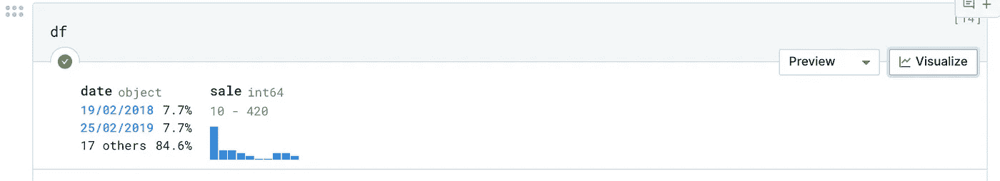

# 以下是如何在 Deepnote 上使用 Jupyter 笔记本的方法

> 原文：<https://towardsdatascience.com/heres-how-to-use-jupyter-notebooks-on-steroids-with-deepnote-c35251222358?source=collection_archive---------22----------------------->

## 在本教程中，了解 Google Colab 的完美替代品


照片由[石页·康让](https://unsplash.com/@omgitsyeshi?utm_source=medium&utm_medium=referral)在 [Unsplash](https://unsplash.com?utm_source=medium&utm_medium=referral)

# 这个想法

你可能知道并经常使用的最好的数据科学工具可能是 Google Colab。你有什么不喜欢 Colab 的——轻松访问 Google Drive 和文件系统以获得数据，免费访问 GPU 以完成更繁重的深度学习任务，以及像在 Google Docs 和其他类似应用程序中一样与他人协作的能力。

问题出在更小但却被极大忽视的事情上，比如当实时协作成为你和你的团队的一个需求时——你和你的队友面对面协作的方式。使用 Colab，不幸的是，您无法实时看到彼此的变化。

你需要的是刷新你的浏览器标签。然后需要再次加载笔记本，之后你们就可以看到彼此的变化了。如果一个队友在一个单元格上给你留言，你也需要这样做。

另一个要问自己的问题是——您是否曾经想要添加一个数据源用于您的项目，而使用 API 或将其上传到您的驱动器会带来额外的麻烦？还是每次合上笔记本都不重新安装 google drive？

我来说说 [**Deepnote**](https://deepnote.com) 的便利吧。

# Deepnote 作为一个替代品表现如何？

就像 Colab 一样，Deepnote 是一个运行在浏览器中的 Jupyter 笔记本，具有一些附加功能。

其中一些包括:

*   与 GitHub、谷歌云平台、亚马逊 S3、谷歌驱动等平台的简单集成。
*   熊猫数据帧的一键可视化
*   易于共享和实时协作
*   从笔记本构建报告的更好方法

最好的特点是—

*   能够保持单个项目在整个月、每个月不间断运行

够兴奋了吧？让我们来发现运行一个新的 Deepnote 项目的基本原理！👇

# 创建新项目

登录后，只需导航至您的控制面板，然后单击“新建项目”按钮:


作者图片——如何在 Deepnote 中创建新项目

你将被带到一个屏幕，询问你是否想要连接到一个现有的 GitHub 库并从那里导入你的代码，或者只是从你的本地机器上传一个你选择的笔记本。选择任何一个立即开始。为了这个教程，我用我在[这个教程](/11-essential-tricks-to-demystify-dates-in-pandas-8644ec591cf1?source=your_stories_page----------------------------------------)中的 Jupyter 笔记本来描述在熊猫中使用许多日期时间函数的基本技巧。

在侧面板中，有用于上传数据文件和其他文件的文件视图:


作者图片——如何在 Deepnote 中上传文件

您还可以选择在一个地方查看所有的全局变量，因此当您稍后想要清理项目以共享或发布报告时，可以从侧面板轻松完成。

# 安装依赖项并制作需求文件

如果你在笔记本上输入一行代码，比如:

```
!pip install <dependency-name>
```

它会自动将它安装到您当前的环境中。

现在，如果您想将这个包移动到您的 **requirements.txt** 文件中，您通常会这样做:

```
pip freeze > requirements.txt
```

或者如果你像我一样使用`pipenv`，你会这样做:

```
pipenv run pip freeze > requirements.txt 
```

但是 Deepnote 让它变得更容易，并为你提供了一个更快捷的方法来做到这一点。此外，在安装任何新的包之后，您还可以选择将它添加到您的**需求**文件中，而不需要上述额外的步骤。


作者图片—安装新的软件包

真的就这么简单！

# 在代码中使用环境变量

环境变量(有时也称为秘密)可以用来存储 API 密钥、数据库秘密、bot 令牌等信息。

这些通常只在环境变量的帮助下在代码中使用，而不是硬编码，以避免像 GitHub 那样的版本控制。你通常会以**的形式知道。env** 文件。

> 我还有一篇完整的博客文章，专门描述如何在代码中有效地利用环境变量。
> 
> 在此找到它们:

</the-quick-guide-to-using-environment-variables-in-python-d4ec9291619e>  

使用 Deepnote，只需点击侧面板中的 **Integrations** 选项卡，然后点击**环境变量**，即可插入环境变量。


按作者分类的图像—添加环境变量

然后，您将获得在项目中包含环境变量的选项，然后可以从项目中包含的任何脚本或笔记本中访问这些变量。

# 实现项目共享和实时协作

我在上面的介绍中描述了在 Deepnote 笔记本中使用实时协作是多么容易。您在任何单元格旁边所做的评论都会立即显示给与您共享该笔记本的所有人。

添加新的合作者就像输入队友的 Deepnote 电子邮件并将权限更改为“编辑”或“完全访问”一样简单


按作者分类的图片-共享您的项目

# 配置共享数据集

借助 Deepnote 中的“共享数据集”,可以很容易地在一个团队中就一个共享数据源的单个项目开展工作。

这是 Integrations 选项卡中的另一个有用功能，您可以上传自己的数据集，项目中的所有协作者都可以访问它。


按作者分类的影像-创建共享数据集

# 从 Google Drive 轻松访问文件

当试图访问文件时，您必须非常熟悉将 Google Drive 安装到您的 Colab 项目中的过程。这个过程很简单，如果当你没有任何选择，只能再次安装 Google Drive 来运行你的笔记本时，当运行时被搁置一段时间后断开连接，这有点不方便。

在 Deepnote 中，您只需通过集成连接您的驱动器。这样，每次你打开硬件时，你所有的文件都可以被访问**。**

以下是将 Google Drive 连接到项目的方法:


按作者分类的图片—连接驱动器

一旦你做到了这一点，从驱动器中访问文件和数据集就是用几行简单的代码完成的。


现在，您只需通过屏幕截图中显示的文件夹结构连接数据集即可使用。它的路径总是“datasets/your-integration-name/”,您可以从那里简单地访问您的共享文件。

使用:

```
!ls /datasets/drive-integration
```

给出输出:

```
‘Arxiv Text Summarization’
```

因为我们用共享数据创建了一个文件夹。

最后，让我们讨论两个最有趣的特性…

# 只需一次点击即可可视化数据框:

简单地打印`df.head()`或`df`就可以得到数据帧中简单的熊猫信息。



作者图片——可视化熊猫数据框架

为了以 Deepnote 提供的方式可视化它，只需点击这个带有`df`语句的单元格上的小 visualize 按钮。

之后，您将看到代码单元格下方的一个完整的可视化子窗口:


按作者分类的图像-数据框的可视化单元格

# 用你的笔记本写一份报告

向您的经理演示或进行强调演示时，您的 Jupyter 笔记本在展示您的辛勤工作时具有无限的功能。Deepnote 让你更容易用两种方式以报告的形式展示你的笔记本:

1.  文章方式—以 PDF 格式分享，
2.  仪表板方式——像使用一块空白画布一样使用您的报告，然后用它制作一个漂亮的仪表板。

从侧边栏中，只需选择**发布编辑器**，你将被带到一个页面，以获得一篇文章或一个仪表板布局。

例如，下面是我的熊猫约会探索笔记本的文章布局:


按作者排序的图像-笔记本中的文章报告预览

对于不需要它的代码单元格，您还可以选择在报表中隐藏代码或单元格的输出。


按作者分类的图像—文章布局选项

只需重命名您的文章，然后点击发布，使其对任何人都是可共享和可见的。

# 几句临别赠言…

是时候表扬一下你自己了，因为你一路陪着我！

我希望这是一个有用的教程，可以帮助你开始更好地在云上运行笔记本电脑。对于未来，我希望这能启发你创建一些精彩的数据探索项目，并通过 Deepnote 笔记本和报告进行分享。

感谢您的阅读！[我们下次再见](https://ipom.medium.com)在我的另一篇文章里！

*如果你想留在圈子里，阅读我的更多数据科学文章，我恳请你考虑成为一名中等会员。只需每月 5 美元，你就可以获得我所有的文章，同时支持我的写作。:) 👇*

<https://ipom.medium.com/membership>  

也在[推特](https://twitter.com/csandyash)上找我。