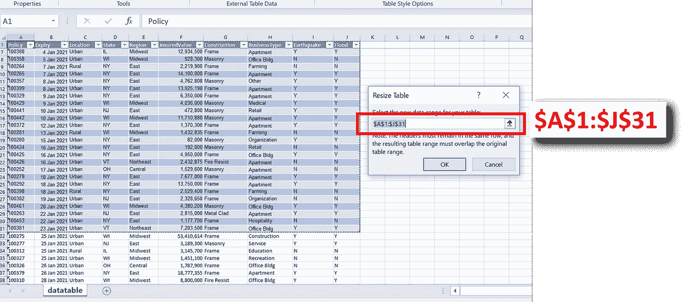
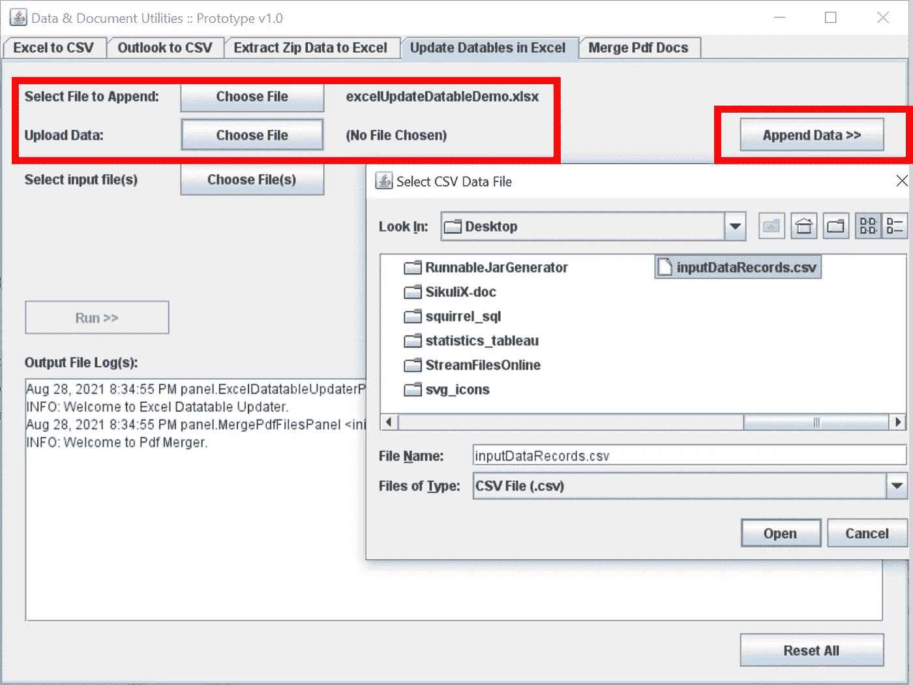
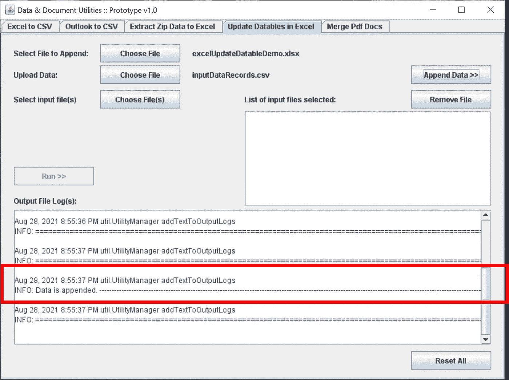

# 下面是如何用 Java 在 Excel 中自动调整数据表的范围

> 原文：<https://towardsdatascience.com/heres-how-you-can-auto-adjust-your-datatable-range-in-excel-with-java-d00502d336d?source=collection_archive---------35----------------------->

## 使用 Apache Poi 3.15 JAR lib 的分步说明

由于一些国家正处于向❝Endemic❞国家过渡的过程中，过去两年应对疫情冠状病毒的工作不可避免地在公共医疗保健部门的信息传输和当前低效率的数据流方面留下了很大的改进空间。因此，当❝Pandemic❞的事情在我居住的地方安定下来后，公司领导的大量请求几乎立即淹没了我的电子邮件收件箱时，我并不感到惊讶。**长话短说，我的任务是在当前定期手动更新&编辑 Excel 报告的工作流程中改进和引入自动化。**

考虑到这一点，与其他许多致力于不断创新和强化技术文化的公司不同，*另一方面，我的工作场所目前没有运行过于复杂的技术解决方案所需的设置。*因此，由于编程语言的平台无关性，这最终导致我本能地选择以 Java 应用程序的形式实现我的最终交付成果。

**虽然我之前的文章主要关注的是 Java 编程语言中的 Excel & Outlook 数据提取(考虑到前面提到的完全相同的约束):**

 [## 用 Java 从 Excel 和 Outlook 文件中提取数据

### 代码实现+用例&情境约束

towardsdatascience.com](/extracting-data-from-excel-and-outlook-files-with-java-7979eb64edff) 

相反，本文旨在展示 [Apache POI](https://poi.apache.org/) 的另一项功能——这是一个操作 Microsoft Office 文档的开源 Java 库。更具体地说，我计划演示它的一个鲜为人知的功能**，即嵌入在 Microsoft Excel 电子表格中的数据表范围的自动调整。**

## **注意事项:**

*   该功能针对扩展名为**的 excel 文件。xlsx)仅**。这与第一部分不同，第一部分的功能对两者都适用**。xlsx 和。xls** 扩展。
*   使用的 Java 库依赖项列表*与第一部分没有什么不同(即所有 JAR 依赖项的版本也是一致的)*:

作者图片|用于读写 Microsoft Excel 文件的 Java 库列表|请注意，所使用的 [apache poi](https://poi.apache.org/) 的具体版本是 3.15。不同版本的 apache poi 有不同的依赖版本。

## 用例解释:

> 为了最大限度地减少繁琐的 excel 报表手动更新，我从工作场所的用户那里收到的一个常见请求是定期将输入的记录追加并输入到同一个 Excel 数据表中。

Image by Author |说明 Excel 中呈现的数据表的示例|请注意，表格范围为 **$A$1:$J$31** 。因此，在第 31 行之后追加的新记录**不会输入到数据表中。**

## 第一部分.追加新的传入数据行

在我的特定用例中，由于传入的数据记录是以 CSV 格式指定的，所以我实现的 Java 代码读入一个 CSV 文件，并附加到在所选 excel 文件中检测到的第一个电子表格中:

为了使用户能够轻松地运行它，它已经被合并到一个 Java Swing 应用程序**(该应用程序与上一篇文章** **中构建和说明的应用程序相同)。我强烈建议其他人查看它，因为这篇文章是对**的直接跟进，如下图所示:

作者截图|在**【更新 excel 中的数据表】**选项卡中，应用模块的第一部分允许用户选择一个要更新的 Excel 文件和另一个包含最新数据记录的 CSV 文件

作者截图|选择**【追加数据>>】**后，应用程序读入 2 个文件输入。CSV 中的数据记录成功附加到 excel 文件中。如上所述，文件日志输出消息**“附加数据”。**

## 第二部分。更新数据表范围

虽然新的数据记录已经包含在第一部分的 excel 表中，**excel 表读取的数据范围保持不变。**因此，数据透视表、图表等。它们基于相同的数据表呈现数据，也保持不变。

为了反映最新的数据范围，下面的代码片段继续读入 excel 文件的数据表范围。如果 excel 表格的最后一个行号大于数据表的当前范围，该表应扩展其范围，以包括电子表格的最后一个行号。

与之前类似，这个功能被整合到 Java Swing 应用程序中，可在 [my GitHub](https://github.com/incubated-geek-cc/data-extraction-with-Java) 获得。用户可以一次输入多个 excel 文件来更新所有数据表:

作者截图|请注意，应用程序的输出有一个表 datatable 范围，其中包含先前附加到文件中的记录

以下是运行 Java 应用程序的步骤说明:

作者截图|选择带有附加数据记录的 excel 文件。更新表格范围后，应用程序会提示用户保存一个输出 ZIP 存档，其中包含所有相应的更新 excel 文件。

如果您想要该应用程序的副本，目前可从 [my GitHub](https://github.com/incubated-geek-cc/data-extraction-with-Java) 获得。先前的可运行 JAR 应用程序现在被重命名为**"**[**DataDocUtility _ v1**](https://github.com/incubated-geek-cc/data-extraction-with-Java/blob/main/DataDocUtility_v1.jar)**"**，而本文中引用的 JAR 应用程序被声明为**"**[**DataDocUtility _ v2**](https://github.com/incubated-geek-cc/data-extraction-with-Java/blob/main/DataDocUtility_v2.jar)**"**。只要双击它，Java Swing GUI 就会自动显示出来。*以防您忘记，第一篇文章可从*获得😛：

 [## 用 Java 从 Excel 和 Outlook 文件中提取数据

### 代码实现+用例&情境约束

towardsdatascience.com](/extracting-data-from-excel-and-outlook-files-with-java-7979eb64edff) 

**此外，本演示中使用的所有示例** [**数据文件**](https://github.com/incubated-geek-cc/data-extraction-with-Java/tree/main/data) **和** [**输出文件**](https://github.com/incubated-geek-cc/data-extraction-with-Java/tree/main/outputs) **以及** [**源代码**](https://github.com/incubated-geek-cc/data-extraction-with-Java/tree/main/src) **都可以在我的 GitHub 资源库中找到。请随意为您自己的用例分叉/调整代码☺**

**非常感谢您的阅读，如果您发现此内容有用，请在 Medium **上** [关注我。会非常感激的！😃](https://medium.com/@geek-cc)**

 [## 通过我的推荐链接加入灵媒——李思欣·崔

### 获得李思欣·崔和其他作家在媒体上的所有帖子！😃您的会员费直接…

geek-cc.medium.com](https://geek-cc.medium.com/membership)