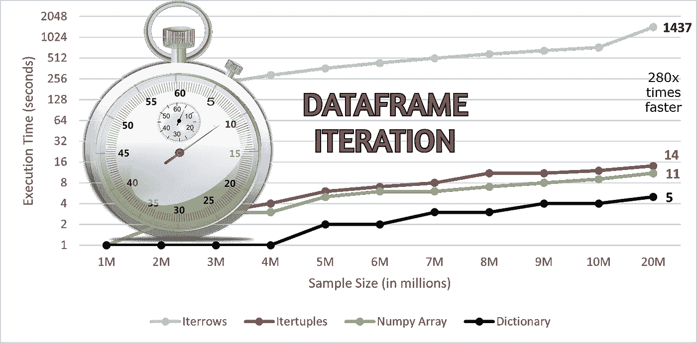
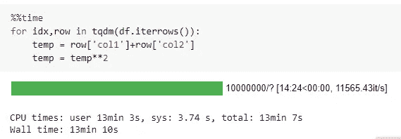
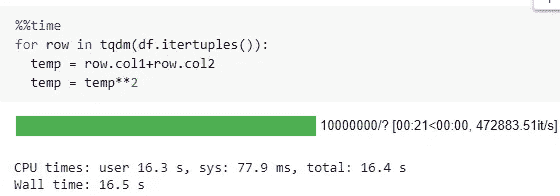
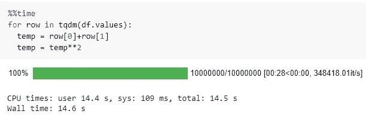
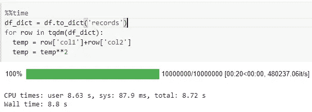
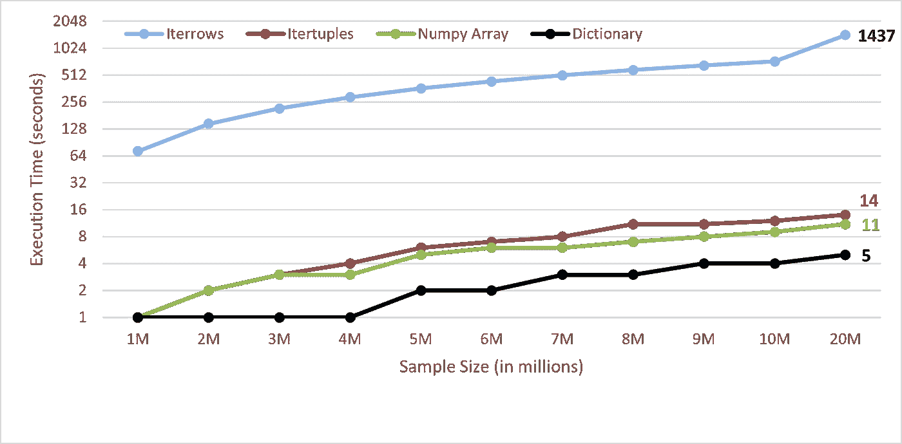

# 这是遍历熊猫数据框架的最有效的方法

> 原文：<https://towardsdatascience.com/heres-the-most-efficient-way-to-iterate-through-your-pandas-dataframe-4dad88ac92ee?source=collection_archive---------0----------------------->

## 数据帧迭代速度提高 280 倍

(图片由作者提供)

Pandas 是数据科学社区中最受欢迎的 Python 库之一，因为它为数据探索和可视化提供了大量具有灵活数据结构的 API。Pandas 是清理、转换、操作和分析数据的首选库。

庞大 API 的存在使 Pandas 易于使用，但当处理大规模数据集时，它无法在所有 CPU 核心上扩展计算。Dask、Vaex 是开源库，它们可以缩放计算以加快工作流程。

要素工程和要素探索需要遍历数据框。有多种方法可以遍历数据框，`**iterrows()**`是其中之一。使用`**iterrows()**`遍历数据帧的计算时间较慢。

有时候，仅仅为了加快迭代过程，从 Pandas 转移到其他可扩展的库是一项单调乏味的任务。在本文中，我们将讨论各种数据帧迭代技术，并对它们的时间数进行基准测试。

# Iterrows():

Iterrows()是 Pandas 的内置函数，用于遍历数据框。应该完全避免使用它，因为与其他迭代技术相比，它的性能非常慢。Iterrows()在迭代时进行多次函数调用，并且迭代的每一行都具有数据框的属性，这使得它更慢。

(图片由作者提供)，Iterrows()用法

iterrows()花费 **790 秒**遍历一个有**1000 万**条记录的数据帧。

有各种各样的技术(将在下面讨论)比 iterrows()表现得更好。

# Itertuples():

Itertuples() 是 Pandas 的内置函数，用于遍历数据框。与 iterrows()相比，Itertuples()调用函数的次数相对较少，并且开销也小得多。Itertuples()通过将每一行数据转换为元组列表来遍历数据帧。

(图片由作者提供)，Itertuples()用法

itertuples()花费 **16 秒**遍历一个包含 1000 万条记录的数据帧，比 iterrows()大约快**50 倍**。

> 阅读下面提到的文章，深入理解为什么 iterrows()比 itertuples()慢

 [## 为什么 Pandas itertuples()比 iterrows()快，以及如何使它更快

### 面向数据科学家的代码剖析教程

medium.com](https://medium.com/swlh/why-pandas-itertuples-is-faster-than-iterrows-and-how-to-make-it-even-faster-bc50c0edd30d) 

# Numpy 数组迭代:

迭代打败了使用熊猫的整个目的。矢量化永远是最佳选择。熊猫自带的`**df.values()**`功能可以将数据帧转换成列表格式的列表。

(图片由作者提供)，Numpy 数组迭代

**花了 14 秒**遍历一个包含 1000 万条记录的数据帧，比**的 iterrows()快了 56 倍**。

# 字典迭代:

现在，让我们来看看遍历数据框的最有效的方法。熊猫自带`**df.to_dict('records')**`函数，将数据帧转换成字典键值格式。

(图片由作者提供)，字典迭代

遍历一个包含 1000 万条记录的数据帧花费了 **8.8 秒**，比 iterrows()快了大约**90 倍**。

# 基准:

我比较了使用上述技术遍历数据帧的基准时间数。

> 这一表演被记录在谷歌的一个实验室里。

(图片由作者提供)，基准迭代时间

# 结论:

不建议使用`**itertools()**`来遍历数据帧，因为它会带来很大的开销并进行大量的函数调用。Itertuples 将数据帧转换为元组列表，然后遍历它，这使得它相对更快。

矢量化永远是首选和最佳选择。您可以将数据框转换为 NumPy 数组或字典格式，以加快迭代工作流。遍历字典的键-值对是最快的方法，对于 2000 万条记录，速度提高了大约 280 倍。

> 参考我关于加速 Python 工作流的其他文章:

*   [用几行代码将 Python 函数执行速度提高 30 倍](/25x-times-faster-python-function-execution-in-a-few-lines-of-code-4c82bdd0f64c)
*   [速度快 10 倍的熊猫应用程序只需更改一行代码](/10x-times-faster-pandas-apply-in-a-single-line-change-of-code-c42cb5e82f6d)

# 参考资料:

[1][https://medium . com/swlh/why-pandas-ITER tuples-is-fast-than-ITER rows-and-how-to-make-it-even-fast-BC 50 c 0 edd 30d](https://medium.com/swlh/why-pandas-itertuples-is-faster-than-iterrows-and-how-to-make-it-even-faster-bc50c0edd30d)

喜欢这篇文章吗？成为 [*中等会员*](https://satyam-kumar.medium.com/membership) *继续无限制学习。如果你使用下面的链接，我会收到你的一小部分会员费，不需要你额外付费。*

 [## 加入我的推荐链接-萨蒂扬库马尔媒体

### 作为一个媒体会员，你的会员费的一部分会给你阅读的作家，你可以完全接触到每一个故事…

satyam-kumar.medium.com](https://satyam-kumar.medium.com/membership) 

> 感谢您的阅读