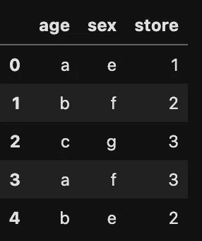
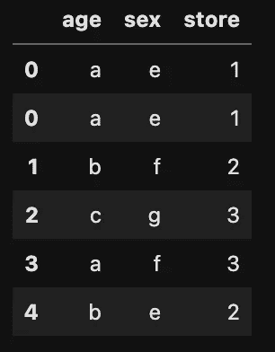
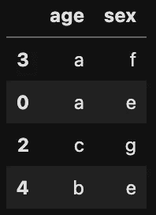
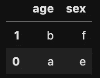

# 以下是我对 Sklearn.resample 的了解

> 原文：<https://towardsdatascience.com/heres-what-i-ve-learnt-about-sklearn-resample-ab735ae1abc4?source=collection_archive---------8----------------------->

## 解释上采样、下采样和一些要避免的错误


安德里亚斯·布鲁恩在 [Unsplash](https://unsplash.com?utm_source=medium&utm_medium=referral) 上拍摄的照片

对于数据科学家来说，处理不平衡的数据集可能是一个棘手的问题。处理不平衡数据集的方法之一是使用 *sklearn.resample* 进行重采样，即向上采样少数类或向下采样多数类。

> *Sklearn.resample* 是 Scikit learn 用于上采样/下采样的函数。

根据 sklearn 文档，函数 sklearn.resample，r *以一致的方式对数组或稀疏矩阵进行采样，默认策略实现引导程序*的一个步骤。简单来说， *sklearn.resample* 不仅仅是神奇地为数据集生成额外的数据点，它基本上是为你的数据集创建一个*随机重采样(有/无替换)。这种均衡过程防止机器学习模型倾向于数据集中的多数类。*

接下来，我在一个例子中展示了上采样。在下面的例子中，我们创建了一个包含 3 列的数据框架:**年龄、性别和商店。**

```
#import libraries
import pandas as pd
from sklearn.utils import resample,shuffle#create a dataframe
df = {'age':['a','b','c','a','b'],'sex':['e','f','g','f','e'],'store':[1,2,3,3,2]}df = pd.DataFrame(df)df.head()
```



df.head()

我们首先分离少数民族阶层，然后对少数民族阶层进行抽样。少数民族班级的人数被上采样到其他班级的人数。

```
#set the minority class to a seperate dataframedf_1 = df[df['store'] == 1]#set other classes to another dataframeother_df = df[df['store'] != 1] #upsample the minority class
df_1_upsampled = resample(df_1,random_state=42,n_samples=2,replace=True)#concatenate the upsampled dataframe
df_upsampled = pd.concat([df_1_upsampled,other_df])
df_upsampled
```



df _ 上采样

多酷啊！😉 😊现在我们有更多的数据来训练我们的模型。此外，当我们训练模型时，可以观察到数据中的 ***3 个商店类别(1、2 和 3)*** 中的每个类别的数量相等。

然而，当您进行上采样或下采样时，请避免这些错误！

1.  在机器学习问题中，确保只有在分成训练、测试(如果你愿意，还可以验证)之后，才进行上采样/下采样**。如果您在拆分为定型和测试之前对数据集进行了向上采样，那么您的模型很有可能会出现数据泄漏。参见下面的示例。**

```
from sklearn.model_selection import train_test_splitX = df_upsampled.drop('store',axis=1)
y = df_upsampled.storeX_train, X_test, y_train, y_test = train_test_split(X, y, test_size=0.2, random_state=1,shuffle=True)X_train.head()
```



x _ 火车

```
X_test.head()
```



x _ 测试

*注意数据泄露！*我们在 **X_train** 和 **X_test** 中有完全相同的数据点。这样做可能会让我们对我们的 ***机器学习*** 模型的实际表现产生错误的认识。


Claudio Schwarz | @purzlbaum 在 [Unsplash](https://unsplash.com?utm_source=medium&utm_medium=referral) 上的照片

2.在您的机器学习模型建立之后，建议在您的**非上采样**训练数据集上测试您的指标。在**非上采样**数据集上测试你的指标，比在**上采样**数据集上测试它，给你一个更真实的模型评估。就我个人而言，我总是喜欢保留一个未经上采样的训练数据集版本。

**结论:
上采样/下采样**是处理不平衡数据的非常好的方法。然而，重要的是要了解它们是如何工作的，以便能够正确使用它们。还要注意，由于额外的信息，上采样机制会在系统中引入偏差。

还可以了解一下 imbean 库的 ***SMOTE*** 操作符。它基于***knarestneighbors***算法工作，综合生成落在已经存在的寡不敌众的组附近的数据点。点击阅读更多信息[。](https://www.analyticsvidhya.com/blog/2020/11/handling-imbalanced-data-machine-learning-computer-vision-and-nlp/#:~:text=Upsampling%20is%20a%20procedure%20where,inclining%20towards%20the%20majority%20class.)

我希望这对你有帮助。期待您的评论，同时您也可以在 [twitter](https://twitter.com/samsonafo) 和 [Linkedin](https://www.linkedin.com/in/samson-afolabi/) 上关注我。

如果你喜欢这篇文章，你可以考虑给我买杯☕️.咖啡

谢谢😊