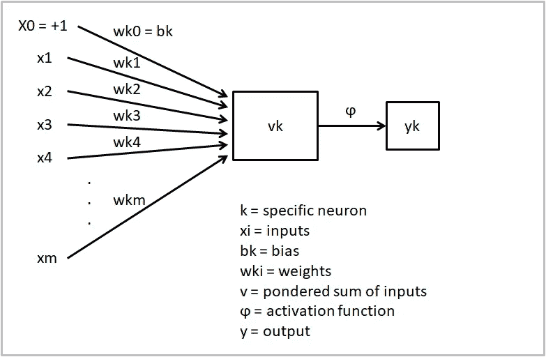

# 这就是为什么我们可能需要重新思考人工神经网络

> 原文：<https://towardsdatascience.com/heres-why-we-may-need-to-rethink-artificial-neural-networks-c7492f51b7bc?source=collection_archive---------4----------------------->

## 人工智能|新闻|评论

## 一项新的研究证明人工神经元过于简单

Jr Korpa 在 [Unsplash](https://unsplash.com?utm_source=medium&utm_medium=referral) 上拍摄的照片

如果我告诉你一个生物神经元用一个完整的人工神经网络来表示比用单个人工神经元来表示更好呢？

在大规模训练数据集和巨大计算资源的帮助下，深度学习在 2010 年代初取得了前所未有的成功。很快，人工智能、机器学习和深度学习成为了一场技术革命的中心。与它们一起的是另一个概念:人工神经网络(ann)。

大多数人不知道的是，这两个概念一点都不新。艾未未出生于 [1956 年](http://jmc.stanford.edu/articles/dartmouth/dartmouth.pdf)。ML 和 DL 分别在 [1959](https://ieeexplore.ieee.org/document/5392560) 和 [1986](https://www.researchgate.net/publication/221605378_Learning_While_Searching_in_Constraint-Satisfaction-Problems) 推出。人工神经网络——一个从当时不成熟的神经科学领域借用的术语——出现在 1943 年，伴随着沃伦·s·麦卡洛克和沃尔特·皮茨的开创性工作。

他们的工作现在被认为是有史以来第一个关于人工智能的研究。作为人工智能的一个子领域，人工神经网络经历了不感兴趣和默默无闻的时代，直到深度学习革命将它们提升到人工智能历史上的最高峰。

# 第一个人工神经网络

正是在计算机科学的早期——人工智能甚至还没有名字——第一个人工神经网络诞生了。神经科学家几十年前就已经在模拟生物神经元，但麦卡洛克和皮茨的工作是第一次用命题逻辑来描述生物神经元。

熟悉人工神经网络的人会认出这张照片:

MCP 神经元。作者图片

这是大约 80 年前构思的麦卡洛克和皮茨神经元模型(MCP)。在很大程度上，这是每个现代入门课程或深度学习书籍中教授的相同模型。这不是因为 MCP 是一个不需要细化的精确模型，而是因为自 1943 年以来，深度学习在这个元素级别上没有发生一点变化。

MCP 神经元旨在仅代表生物神经元的简化神经生理学版本:一系列输入进入神经元进行处理，然后产生输出或不产生输出。它有一个阈值激活功能——如果输入的和为负，输出为 0。否则就是 1。

当前的人工神经网络具有加权输入和更复杂的非线性激活函数，以允许有意义的学习和更精确的 I/O 映射。但它们只是 MCP 模型的略微改进版本。基础是一样的；一些深思熟虑的输入被转换成输出。神经元学习得好不好与这些模型不像——甚至不太像——真实的生物神经元这一事实无关。

当前人工神经网络神经元模型。作者图片

主要的简化，也是最伤害 MCP 模型的一个简化是，人工神经网络中的每个神经元都被折叠成空间中的一个点。这足以模拟一些神经元的行为，但其他更复杂的神经元的生物物理性质过于微妙和复杂。

电流通过树突、胞体，并通过空间和时间流向轴突。并非所有树突的功能都一样。并非所有的输入都参与产生输出，电压沿树突下降。树突树形态、突触模式和不同类型的受体都会影响神经元的行为。还有许多更基本的机制和过程构成了最终提升我们智慧的基础。

这些特征在 MCP 或当前的 ANN 模型中都没有描述。

当 MCP 神经元被构思出来的时候，神经科学已经知道神经元具有不可简化为空间点神经元的特性。麦卡洛克和皮茨简化了复杂性，以便建立一个基于逻辑的模型。

在这个过程中，他们奠定了整个领域的基础，这个领域再也不会屈尊去审视自己的前提，并将它们与神经科学的相关发现进行对比。

# 生物神经元的复杂性

MCP 模式创建于近 80 年前。从那时起，神经科学得到了巨大的发展，我们对神经元的理解已经到了不能再继续称人工神经元为“神经元”的地步。让我们回顾一些关于这个主题的最相关的研究，以说明人工智能与认知科学的分歧有多大。

## 神经元和树突——处理器中的处理器

在 80 年代，Christof Koch 和其他人[发现](https://royalsocietypublishing.org/doi/abs/10.1098/rstb.1982.0084)树突形态和突触模式可以影响神经元内部处理输入的方式。长期以来，[科学家认为](https://www.sciencedirect.com/science/article/abs/pii/0014488659900469)树突表现一致，被动地汇总输入。科赫的实验得出的结论是，神经元远比这复杂。

最近，神经科学家[研究了](https://www.sciencedirect.com/science/article/pii/S0896627300800914)单个树突的作用，发现它们本身也充当处理单元:树突有自己的阈值来产生尖峰(称为树突尖峰)，这与整个神经元的阈值不同。

也就是说，神经元并不像 MCP 模型所暗示的那样是简单的“逻辑门”。树突本身似乎能够充当逻辑门。因此，生物神经元是一个处理系统，而处理系统又由独立的处理系统组成。

为了在人工神经网络中表现这一点，神经元之间的连接需要有不同的形态，这将影响神经元每次产生输出时的作用。这些连接会在内部充当处理系统:到达神经元的每个输入连接都会在内部产生或不产生尖峰信号，从而彻底改变神经元的整体输出。

这意味着人工神经元可以更好地理解为一个分层网络，其中的层(树突)起到非线性*中间* I/O 映射的作用。然后，根据“连接树”的形态对所得到的中间输出求和，以产生最终输出。

基于这些惊人的发现，艾伯特·吉登和他的同事去年在《科学》杂志上发表了一篇突破性的论文。他们在人类锥体神经元中发现了一种新的 I/O 特征，这种特征是目前的模型无法描述的。来自这些神经元的树突产生一种类型的尖峰，其中强度在阈值水平的刺激下最高，当输入电流增加时最低。

他们的发现证明了一些树突可以充当 XOR 逻辑门——当且仅当其中一个输入为真时，输出为真。1969 年[明斯基和 Papert](https://mitpress.mit.edu/books/perceptrons) 证明了单层感知器——人工神经网络的基本早期类型——不能进行这种类型的计算。现在，很明显单个生物树突可以。复杂程度高了两级。从单个树突到单个神经元，再到简单的人工神经网络。

如果树突可以在人工神经网络水平上工作，那么生物神经元比人工神经元复杂多少？

## 模拟一个生物神经元需要 1000 个人工神经元

几天前，大卫·贝尼格夫和他的同事在[Neuron](https://www.sciencedirect.com/science/article/abs/pii/S0896627321005018)杂志上发表了一篇论文，证明了这些年来一直提出的观点:人工神经元根本不能准确地代表生物神经元。

为了证明这一点，他们决定使用现代机器学习技术来模拟人类金字塔神经元的 I/O 行为。他们想要测试两件事:当在真实 I/O 对上训练时，人工神经网络是否可以精确预测神经元输出，以及人工神经网络需要多大才能准确捕捉生物神经元的整体复杂性。

他们发现，至少需要一个 5 层 128 单元的 TCN——时间卷积网络——来模拟毫秒分辨率(单个尖峰精度)的金字塔神经元的 I/O 模式。他们修改了深度和宽度，发现 8 层 256 个单元的 TCN 可以实现最佳性能。

做一个粗略的比较:这意味着单个生物神经元需要 640 到 2048 个人工神经元才能被充分模拟。这并不意味着一个生物神经元有这么多的计算能力或复杂性。然而，这是一个明显的迹象，表明这两种类型的神经元在形式和实质上比以前认为的更加分离。

研究人员能够确定生物神经元如此难以模拟的确切机制:树突形态和一种称为 NMDA 的特定类型突触受体的存在。两者都是长期以来在神经科学中众所周知的神经元的结构和功能方面，但在现代人工智能和人工神经网络中完全被忽略。

这些结果引发了一些问题:为什么人工智能社区没有试图重塑其基础，以更好地适应他们试图模拟的现实？在那些基础被推翻并从头开始重建之前，AI 在实现 AGI 的探索中注定要失败吗？在这样一个元素级别改变 AI 会有什么后果？

让我们看看这一切是如何展开的。

# 人工智能和神经科学——分叉路径

我们大脑中的神经元——尽管不是全部——比它们的人造对应物要复杂得多。尽管最近在神经科学领域有所发现，但通过检查人工智能和深度学习建立的假设是否仍然成立，来处理这个问题是合理的。

可能的情况是，人工智能仍然可以在不改变任何东西的情况下完美地工作。尽管数字神经结构和生物神经结构之间存在明显差异，但它将继续朝着 AGI 前进。然而，在人工智能领域，似乎几乎没有人会在意甚至去检查它。

原因是，从很早的时候起，神经科学和人工智能就分道扬镳了——尽管这两个领域都在试图回答紧密相关的问题。神经科学与智力、大脑和思维有关。神经科学家决定向内看，看我们所知的唯一智能实例；我们。相比之下，人工智能关注的是使用人工手段复制智能。他们关心设计和建造能够感知世界并据此行动的智能代理。

神经科学是一门旨在发现真理的纯科学。它是由好奇心和求知欲驱动的。人工智能——至少是短期人工智能——在很大程度上是由金钱和有用性驱动的。业内人士并不担心，如果我们仔细分析，所有深度学习的基础可能会崩溃。他们关心人工智能不断吸引资金，他们的模型似乎以某种方式工作，即使不合理。

神经科学不断审查其基础，但人工智能选择了另一种方式:他们做出假设，然后头也不回地往前走。

这两个领域的工作和发展水平是不一样的，但说人工智能中的每个人都从技术和金钱驱动的角度看待它是不公平的。人们非常努力地工作，以推动该领域成为一门科学。那些仍然将领域视为解决智能和完成 AI 创始人最初使命的手段的人:人工通用智能。

他们承认有用的人工智能和具有挑战性的人工智能之间的区别，前者适用于简单、狭窄的任务，并被部署在任何地方，而后者需要重大突破才能达到下一个水平。在后一种情况下，有一个关于什么是最佳路径的持续辩论。虽然[一些](https://bdtechtalks.com/2020/03/23/yann-lecun-self-supervised-learning/)认为深度学习是一种方式——它可能需要一些调整，但最终会奏效——,[其他](https://arxiv.org/abs/2002.06177)认为它本身永远不够。

但这是他们应该争论的吗？

# AI 社区关注的是错误的问题吗？

当且仅当所有较低级别的辩论结束并达成一致时，才应该进行这种辩论。然而，事实并非如此。深度学习被认为是人工智能未来之路的最低可能基石仍然存在疑问:人工神经元可能与生物神经元太不相似，永远不会产生复杂的认知过程和类似人类的智能。

我们可以通过更大的模型、巨大的计算能力和庞大的数据集来弥补人工神经元的复杂性不足，但这种效率太低，无法成为这一探索的最终步骤。

然而，这些是人工智能行业的优先事项。他们如何在保持效率的同时，做出不损失带宽的芯片？他们要么堆积 GPU，要么制造/购买[专门的](https://www.cnbc.com/2021/08/19/tesla-unveils-dojo-d1-chip-at-ai-day.html) [芯片](https://www.wired.com/story/cerebras-chip-cluster-neural-networks-ai/)(只有最有钱的人才买得起)。他们如何提取和管理越来越多的数据集？无监督学习和[自动标注](https://seekingalpha.com/article/4310339-tesla-automatic-labeling-for-computer-vision)。他们如何创建和训练更大的模型？他们要么是一家大型科技公司，要么需要[向一家公司申请资金](https://openai.com/blog/microsoft/)。

他们一直在寻找解决方案，但这种趋势是可持续的吗？[好像不是吧](https://hai.stanford.edu/news/ais-carbon-footprint-problem)。我们可能需要回到基础。不仅因为我们无法像这样建设 AGI，还因为我们开始感受到否认当今人工智能低效的间接负担。

但是这里有一个问题:如果他们发现他们真的需要做出改变，我们所知的整个人工智能领域将需要一个完全的恢复。他们就是不愿意接受这一点。人工智能行业的领导者甚至可能知道人工智能的瓶颈是不可逾越的。但他们可能只是喜欢表现得好像这无关紧要，这样他们就不必面对在错误假设的基础上建立这一切的成本。

不过，这里有一个重要的澄清。一些人工智能系统工作得很好，不会污染那么多。人工智能仍然是一个非常有用的技术学科，为许多行业带来了大量创新。我不否认。但这是规则的例外。创造更强大的人工智能的竞赛正在进行，每个主要的参与者都在那里，为分一杯羹而战。

正如我之前所说的，进步不应该以任何代价来获得。

人工神经网络应该更多地基于神经科学，原因有两个，一个着眼于未来，一个着眼于现在:首先，生物和人工神经元之间的复杂性差异将导致结果的差异——AGI 不会没有改革——其次，我们追求这一目标的低效率正在损害我们的社会和地球。

值得吗？

# 后果——对人工智能和世界

即使人工智能社区不考虑我在这里概述的事实，人工智能作为一个肥沃的产业，仍然会每年带来大量新的研究项目和有用的应用。

尽管人工智能没有更接近神经科学，但狭义人工智能系统仍将成功完成它们为之而生的简单任务。无论人工智能社区是否接受生物神经元比人工神经元复杂得多，人工神经网络仍将受到欢迎。无论最终是否实现，人工智能行业仍将从追求 AGI 中受益匪浅——接近 AGI 的人工智能也可以改变世界，不管是好是坏。继续提高发达国家特权阶层生活水平的愿望也将继续存在。

但是代价是什么呢？

人工智能中的伦理问题正处于鼎盛时期，模型似乎没有变得更好。就在几天前，纽约时报[报道](https://www.nytimes.com/2021/09/03/technology/facebook-ai-race-primates.html?referringSource=articleShare)脸书的人工智能系统将一群黑人标记为灵长类动物。谷歌[制造的另一个人工智能在 2015 年显示了](https://bits.blogs.nytimes.com/2015/07/01/google-photos-mistakenly-labels-black-people-gorillas/)同样的有害偏见。难道我们要忽略这一切，像谷歌从训练数据集中删除大猩猩那样，给问题贴上创可贴吗？

让人工智能变得可解释、可诠释、可问责是解决这些问题的关键。这些都是人工智能的热门领域，但他们的目标是解决问题*后验*。如果人工神经网络背后没有强有力的理论支撑，我们怎么能做到呢？没有任何神经模型可以解释神经网络的行为。我们用它们来预测和预报，因为它们有效，但我们不知道为什么。

随着地球的一半被烧毁，另一半淹没在 T2 意想不到的洪水中，气候灾难即将来临。而人工智能也帮不上忙。它的总体碳足迹[站不住脚](https://www.nature.com/articles/s42256-020-0219-9)。

2019 年，来自马萨诸塞大学阿姆赫斯特[的研究人员研究了](https://arxiv.org/abs/1906.02243v1)大型语言模型(LLM)的环境影响——如今以 [GPT-3](/gpt-3-a-complete-overview-190232eb25fd) 为先锋越来越受欢迎——发现训练这些大型模型之一会产生约 30 万公斤的二氧化碳排放；同样是 125 个纽约-北京的往返航班，[Payal Dhar](https://www.nature.com/articles/s42256-020-0219-9#:~:text=the%20carbon%20footprint%20of%20training%20a%20single%20big%20language%20model%20is%20equal%20to%20around%20300%2C000%20kg%20of%20carbon%20dioxide%20emissions.%20This%20is%20of%20the%20order%20of%20125%20round-trip%20flights%20between%20New%20York%20and%20Beijing)为自然而言。一些大型科技公司([谷歌](https://www.google.com/about/datacenters/efficiency/)、[脸书](https://www.utilitydive.com/news/facebook-meets-100-renewable-energy-goal-with-over-6-gw-of-wind-solar/598453/#:~:text=In%202018%2C%20Facebook%20announced,value%20chain%20in%202030.))正在努力减少这个问题，并逐渐转向可再生能源。

与这个问题相关的是人工神经网络效率极低。为了学习最简单的任务，他们需要巨大的计算能力。这就是这些系统产生如此大的碳足迹的原因。低效率导致更高的资源开发，从而产生更多的污染。

人类大脑只污染了其中的一小部分，而且在学习或做同样的事情时消耗的能量也不尽相同。大脑是一个极其高效的器官。当大脑使用如此少的能量时，我们怎么能做如此复杂的事情呢——更不用说它比计算机还慢。这种极端差异的原因可能是亚神经元结构的复杂性比人工神经网络高很多倍吗？[是的，可能是](https://www.quantamagazine.org/neural-dendrites-reveal-their-computational-power-20200114/#:~:text=Very%20few%20people%20have%20taken%20seriously%20the%20notion%20that%20a%20single%20neuron%20could%20be%20a%20complex%20computational%20device)。

LLM 是为最大的玩家保留的，是那些吸引投资者和大众媒体注意的人。原因是这些模型总是被一种传播给公众的宣传所包围:“[机器人现在比人类更能阅读](https://www.newsweek.com/robots-can-now-read-better-humans-putting-millions-jobs-risk-781393#:~:text=Tech%20%26%20Science-,Robots%20Can%20Now%20Read%20Better%20Than%20Humans,Millions%20of%20Jobs%20at%20Risk&text=Using%20natural%2Dlanguage%20processing%2C%20the,versus%2082.305%2C%20the%20company%20said.)、 [GPT-3 […]出奇地擅长模仿人类](https://www.digitaltrends.com/features/openai-gpt-3-text-generation-ai/#:~:text=GPT-3%20algorithm%20is%20here%2C%20and%20it%E2%80%99s%20freakishly%20good%20at%20sounding%20human)、[一个机器人写了整篇文章。你害怕了吗，人类？](https://www.theguardian.com/commentisfree/2020/sep/08/robot-wrote-this-article-gpt-3)”

过度承诺和交付不足是 AI 的行业商标。但并不是所有的人工智能社区都参与销售他们没有的东西，唯一的目的是产生宣传和吸引资金。

用华盛顿大学计算语言学教授艾米丽·m·本德的话来说:“相关的过度承诺会把氧气从房间里吸出来，用于所有其他类型的研究。”除了法学硕士，还有一些被资助机构和媒体忽视的重要研究。

> “因为这些大的声明是存在的，并且因为 LLM 通过操纵形式成功地推平了基准，所以其他更仔细界定范围的工作，可能基于非常具体的应用环境，而*不会*做出疯狂的过度声明，则更难发布。”
> 
> 艾米莉·本德

也许有些被遗忘的研究正试图提醒那些只看到闪闪发光的 LLM 的人，我们做的都是错的。也许有些人对我描述的这些问题一无所获。

如果人工神经网络的基础很差，只有 LLM 似乎很重要，而且只有大型科技公司才能建造和部署它们，那么就存在一个非常现实的风险，即人工智能行业实际上是一个专注于错误目标的寡头垄断。没有人能够提高他们的声音，让那些负责的人知道他们是多么的错误。

不管你怎么看，人工智能，尤其是人工神经网络，似乎有一些至关重要的问题需要解决。即使我们从根本上重新思考它们，这些问题也不太可能马上得到解决。

如果我们想了解更大的图景，并揭示可能暗示我们一直在走向局部极大值的新路径，那么查看神经科学并承认其发现是第一步。

也许解决办法是不要试图给计算机灌输智能。进化找到了更好的方法。我们正试图以数字方式复制物理领域的成果。为什么不尝试创建硅基物理人工神经网络？使用计算机是图灵的提议，但自 20 世纪 50 年代以来，我们已经走过了漫长的道路。也许[神经形态计算](https://www.nature.com/collections/cdadajcjjc/)有我们应该寻找的答案。

人工智能社区可能不会从头开始重建一切，但至少他们应该采取这两个行动:首先，承认当前人工智能范式(主要是人工神经网络)的局限性和缺点，并在未来的研究和承诺中考虑它们。第二，努力在理论和实践上做出相应的调整。

他们可能会决定像今天一样继续使用人工智能和人工神经网络，但至少不会是因为故意的无知，而是因为诚实的不愿意。

*如果你喜欢这篇文章，可以考虑订阅我的免费周报***！每周都有关于人工智能的新闻、研究和见解！**

**您也可以直接支持我的工作，使用我的推荐链接* [*这里*](https://albertoromgar.medium.com/membership) *成为媒介会员，获得无限权限！:)**