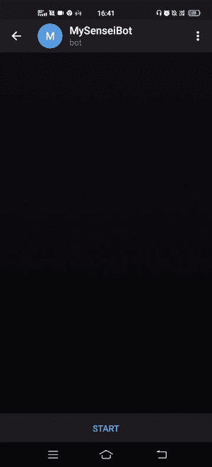
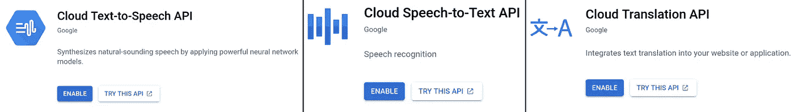
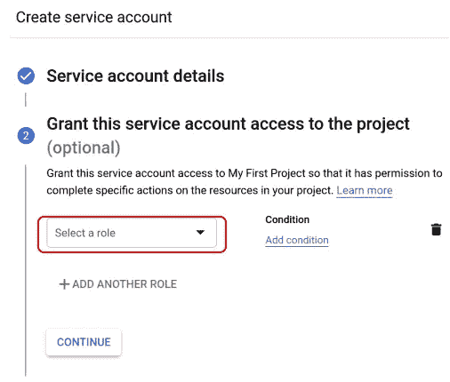
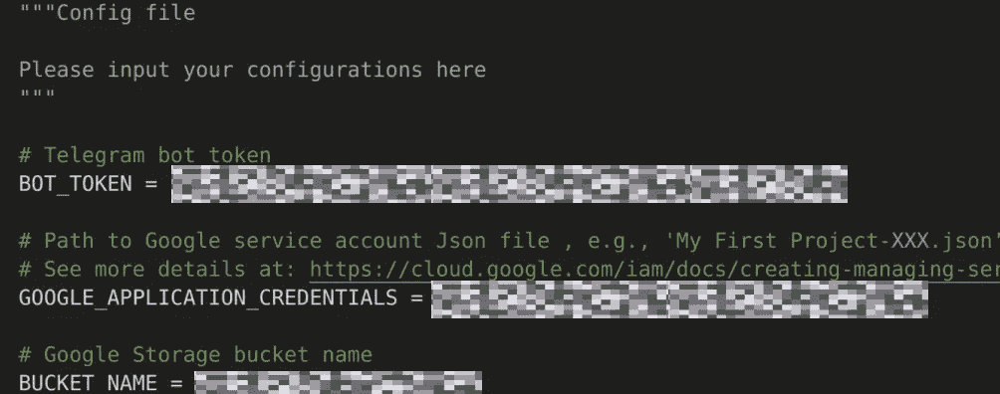
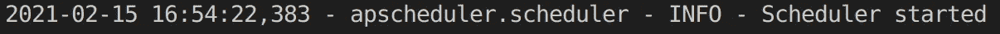
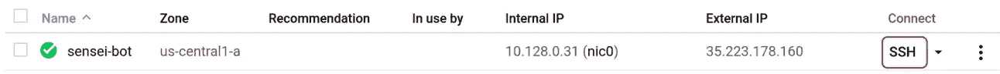
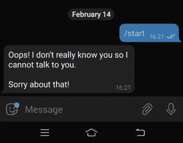

# 如何创建你的个人电报机器人来学习新的语言

> 原文：<https://towardsdatascience.com/heres-your-personal-telegram-bot-to-learn-new-language-4c874252c744?source=collection_archive---------26----------------------->

## 总是鼓励你，随时准备和你一起学习


照片由[捕捉人心。](https://unsplash.com/@dead____artist?utm_source=medium&utm_medium=referral) on [Unsplash](https://unsplash.com?utm_source=medium&utm_medium=referral)

10-20 年前，学习一门新语言是很困难的。对于那些到了一定年龄的人来说，你可能还记得，学习一门新的语言要么是购买带有录音的语言书籍，要么是去上课，老师让学生轮流发单词的音。

如今，像 Duolingo 这样的应用程序可以让你按照自己的节奏学习新语言，这要好得多。然而，有时你只是想知道如何说一个特定的单词/短语，并想知道你说得对不对。我们可以将这个过程自动化，而不是先搜索翻译再搜索发音，同时从创建自己的人工智能机器人中获得满足感。

# 介绍我的唤醒机器人…



老师在日语里是老师的意思。从 GIF 录音中，可以看到界面很简单:

1.  用户从两个选项中选择一个——“如何发音 JP 单词”或“如何用 JP 发音(EN)”。
2.  用户输入单词/短语，机器人发回带有发音的录音。
3.  如果用户选择“如何用日语说(EN)”，他/她可以对着麦克风说出这个单词/短语，机器人将验证用户是否说对了。

虽然该机器人现在适合日语，但它可以很容易地配置为其他语言。设置很简单，而且是免费的。

我们现在将看到如何在您的本地环境以及云环境中设置 bot。

# 先决条件

设置需要两个主要因素。

## 1.电报机器人

要创建你的电报机器人，只需访问机器人父亲(详情见[这里](https://core.telegram.org/bots#creating-a-new-bot))。整个过程不到一分钟，虽然你可能需要更多的时间来想一个好的用户名，但还没有被采用。最重要的是，请注意您的令牌，我们稍后将需要它来控制我们的 bot。

## 2.谷歌云账户

该机器人使用一些谷歌云 API 来展示其魔力:

*   用于单词发音的文本到语音转换 API
*   用于检查用户发音的语音到文本 API
*   翻译 API，用于将英语转换为选择的语言

最棒的是，谷歌云为新注册用户提供了 300 美元的免费试用版，而且上述 API 大部分都是免费的，所以你可以免费试用。

# 本地设置

要在您的本地环境中设置 bot 进行测试，您只需要 5 个简单的步骤。

## 1.启用 API

登录您的 Google Cloud 控制台后，启用 3 个 Google Cloud API([文本到语音](https://console.cloud.google.com/apis/library/texttospeech.googleapis.com)、[语音到文本](https://console.cloud.google.com/apis/library/speech.googleapis.com)、[翻译](https://console.cloud.google.com/apis/library/translate.googleapis.com))



我们三个火枪手的截图

## 2.创建存储桶

语音转文本 API 需要一个 Google 云存储桶来读取文件。因此，要创建一个 bucket，请前往 [Google Storage](https://console.cloud.google.com/storage/browser) 并创建一个。不要担心许多选项，您可以只保留默认设置。记下存储桶的名称，因为我们稍后会用到它。


## 3.下载服务帐户密钥

为了让我们从本地环境与 Google Cloud 交互，我们需要一个服务帐户密钥。

首先，[创建服务帐户密钥](https://cloud.google.com/iam/docs/creating-managing-service-accounts#iam-service-accounts-create-console)。在“授予此服务帐户对项目的访问权限”下选择角色时，选择基本- >所有者。您可以跳过创建服务帐户的第 3 步。



之后，您可以创建一个密钥，并作为 JSON 下载到您的本地环境中。记下保存文件的目录。


## 4.Git 克隆并安装必要的包

这里的码基是[这里的](https://github.com/jiahao87/sensei_bot.git)。Git 克隆到您的本地环境。

```
git clone [https://github.com/jiahao87/sensei_bot.git](https://github.com/jiahao87/sensei_bot.git)
```

必要的包列在 *requirements.txt* 中。在创建新环境并相应地安装软件包之前，将目录切换到 *sensei_bot* 文件夹。

```
pip install -r requirements.txt
```

## 5.安装ˌ使成形

我们的最后一步是将我们的配置输入到代码库中的 *config.py* 文件中。

相应地填写 *BOT_TOKEN* 、*GOOGLE _ APPLICATION _ CREDENTIALS*和 *BUCKET_NAME* 。



完成最后一步后，我们现在可以通过运行我们的主脚本 *app.py* 来启动我们的机器人。

```
python app.py
```

如果一切正常，您应该会看到类似下面的消息，并且您可以开始在 Telegram 中与您的机器人进行交互。😄



# Google 云设置

除非你计划 24/7 全天候开启你的电脑，否则你需要通过三个简单的步骤将你的机器人托管在云中

## 1.设置虚拟机(VM)

我们的第一步是通过谷歌云控制台设置一个计算引擎虚拟机实例。

a)登录谷歌云控制台后，启用[计算引擎 API](https://console.cloud.google.com/apis/library/compute.googleapis.com?q=compute)


b)启动谷歌云壳

您应该会在控制台页面的右上角看到一个类似于下面红框中按钮的按钮。点击它，会弹出一个终端。我们将使用这个终端来启动我们的虚拟机。


c)创建一个计算引擎虚拟机实例

将以下内容复制并粘贴到 Google Cloud Shell 中，创建一个名为 *sensei-bot* 的 VM 实例。

```
gcloud compute instances create sensei-bot \
--machine-type f1-micro \
--zone us-central1-a \
--image-family ubuntu-1804-lts \
--image-project ubuntu-os-cloud \
--scopes [https://www.googleapis.com/auth/cloud-platform](https://www.googleapis.com/auth/cloud-platform)
```

## 2.启用 API 并创建云存储桶

对于[步骤 1](#9d20) 和[步骤 2](#245b) ，遵循本地设置下的先前步骤。如果您已经这样做了，请随意跳过这一步。

## 3.Git 克隆和配置

让我们通过 SSH 进入我们的 *sensei-bot* 实例来配置我们的 VM。

转到[计算引擎页面](https://console.cloud.google.com/compute/)并为您的实例点击 SSH 按钮。您的 VM 实例的终端应该会弹出。



键入以下脚本来安装包并 git 克隆我们的代码库。

```
sudo apt update
sudo apt-get -y install python-dev build-essential
sudo apt -y install python3-pip
python3 -m pip install -U pip
export PATH="$HOME/.local/bin:$PATH"
pip3 install --upgrade setuptools
sudo apt-get -y install ffmpeg tmux
git clone [https://github.com/jiahao87/sensei_bot.git](https://github.com/jiahao87/sensei_bot.git)
cd sensei_bot
pip3 install -r requirement.txt
```

输入您的 *BOT_TOKEN* 和 *BUCKET_NAME* 修改 *config.py* :

```
nano config.py
```

由于我们的实例在 Google Cloud 本身中，我们已经在`gcloud compute instances create`脚本中提供了允许访问云 API 的指令，所以我们可以将*Google _ APPLICATION _ CREDENTIALS*保持不变，作为 *None* 。

修改完 config.py 后，按`Ctrl+x` `y` `Enter`保存修改并退出编辑器。

通过执行以下命令，使用 tmux 打开一个新窗口:

```
tmux
```

您现在可以通过运行以下命令来启动您的 bot:

```
python3 app.py
```

# 其他配置

为了让机器人真正个性化，我们在 *config.py* 中添加了一个名为 *TELEGRAM_ID* 的参数，只允许指定的用户与机器人对话。毕竟，即使云 API 是免费的，也有一个配额，你不会想因为别人在和你的机器人说话而超过这个配额。

想知道你的电报 ID，可以看看这个 [wikiHow](https://www.wikihow.com/Know-Chat-ID-on-Telegram-on-Android) 。

但是，请注意，这并不是为了生产级的安全性，尽管它满足了我们的目的。



发送给未授权用户的消息截图

最后，人们也可以探索将 *LANGUAGE_CODE* 和 *TEXTTOSPEECH_NAME* 改为其他语言。你可以在这里看到谷歌支持的语言。根据语言的独特特征，可能需要对代码进行一些修改。

通过上面的指南，我们希望你现在能够在本地和谷歌云上部署你的个人机器人来学习新的语言。也可以随意修改代码，因为可以添加更多的功能，例如每天通知新单词/短语，甚至让机器人成为高级语言学习者的会话。

感谢阅读，我希望这篇文章是有用的:)也请随时评论您可能有的任何问题或建议。

# 参考

[](https://core.telegram.org/bots) [## 机器人:开发者入门

### 机器人是运行在 Telegram 内部的第三方应用程序。用户可以通过向机器人发送信息来与它们互动…

core.telegram.org](https://core.telegram.org/bots)