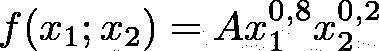
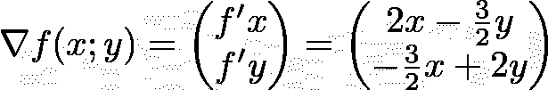
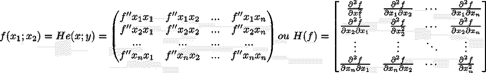
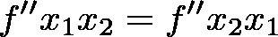
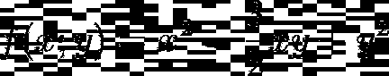
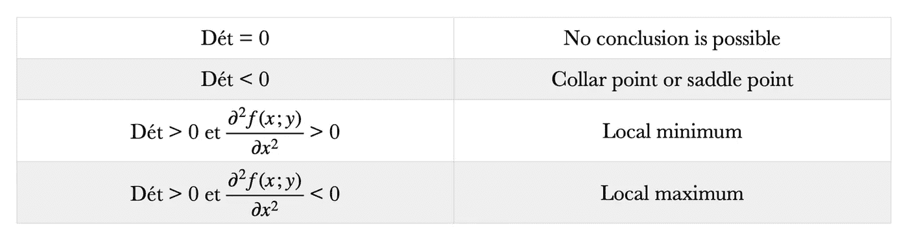

# Python 3.8 中的 Hessian 矩阵和优化问题

> 原文：<https://towardsdatascience.com/hessian-matrix-and-optimization-problems-in-python-3-8-f7cd2a615371?source=collection_archive---------6----------------------->

## 如何在没有 TensorFlow 或 PyTorch 的情况下执行经济优化

**建议**

与 Python 3.8 的兼容性测试，在 MacOS 11.3 和 Linux Ubuntu Server 20.04 LTS 环境下执行。

使用的库:Numpy，Sympy。

```
pip3.8 install numpy sympy
```

Hessian 矩阵用于牛顿型方法中的大规模优化问题，因为它们是函数的局部泰勒展开的二次项的系数。偏导数在经济学中扮演着重要的角色，在经济学中，大多数描述经济行为的函数都假设经济行为取决于不止一个变量。例如，一个社会消费函数可以描述消费商品的花费取决于收入和财富；边际消费倾向就是消费函数相对于收入的偏导数。

Hessian 矩阵也通常用于在图像处理和计算机视觉中表达图像处理算子(参见高斯拉普拉斯(LoG)斑点检测器)。海森矩阵也可以用于正常模式分析，以计算红外光谱中不同的分子频率。


由[christofer engstrm](https://unsplash.com/@christoffere?utm_source=medium&utm_medium=referral)在 [Unsplash](https://unsplash.com?utm_source=medium&utm_medium=referral) 上拍摄的照片

数值函数的 Hessian 矩阵是其二阶偏导数的方阵，记为 H(f)。在数学中，多变量函数的偏导数是它对其中一个变量的导数，其他变量保持不变。

示例:



梯度向量可以解释为“最快增加的方向和速率”。

如何用 sympy 求偏导数？

如果函数的梯度在点 *p* 不为零，梯度的方向就是函数从 *p* 增加最快的方向，梯度的大小就是那个方向的增加率，最大的绝对方向导数。



在有序集合 E 中，部分 A 的一个元素是 A 的最大元素或最大值，如果它属于 A 并且大于 A 的任何其他元素。对于有序集合的任何部分，最大值的存在通常是不确定的。另一方面，在存在条件下，这样的元素是唯一的。类似地，最小元素或最小值(如果存在的话)是比的任何其他元素都小的的元素。

目标是通过求解以下方程来确定最大或最小候选值:


Python 3.8 中的实现非常简单，需要 Sympy 库中的“solve”函数。

现在，我们需要执行二阶导数来获得 hessian 矩阵:



顺便说一下，这是程序的主要功能，它仲裁所有指令块之间的变量分配:

在我们的程序中，我们将施瓦兹定理应用于多变量函数的二阶偏导数，使得:



然而，我们不会证明这个定理，也不会试图在本文中解释它。下面是一个 numpy.matrix 格式的 hessian 矩阵示例，用于函数:



```
Hessian matrix that organizes all the second partial derivatives of the function x**2–1.5*x*y + y**2 is : 
[[2 -1.50000000000000]
[-1.50000000000000 2]]Determinant in the critical point {x: 0.0, y: 0.0} is : 1.75000000000000
```

行列式是一个标量值，它是一个方阵的元素的函数。


它允许表征矩阵和由矩阵表示的线性映射的一些属性。特别地，行列式非零当且仅当矩阵可逆，且矩阵所表示的线性映射是同构的。

因此，对于正半定和负半定 Hessian，该测试是不确定的(Hessian 半定但不确定的临界点可能是局部极值或鞍点)。



图片由 Louis Brulé Naudet 提供。

在我们的例子中，对于临界点(0；0)，行列式为 1.75 > 0，f'xx > 0，那么，临界点是一个局部极小值，所以函数是严格凸的。

> Tensorflow 或其他机器学习库无疑是强大的，但它们仍然过度消耗资源，并且可能成为低性能机器的障碍，本文旨在解释一种构建 Hessian 矩阵的新方法，使用一种更轻便的科学计算工具:sympy。

Louis Brulé Naudet 拥有巴黎萨克莱大学的法律和经济学/管理学双学位。

<https://louisbrulenaudet.com> 