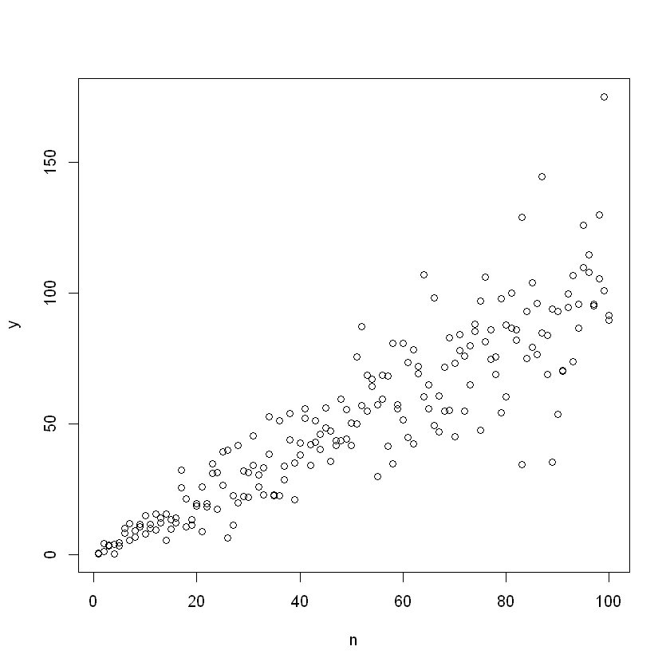
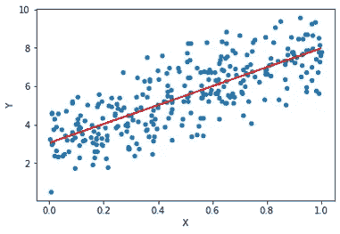
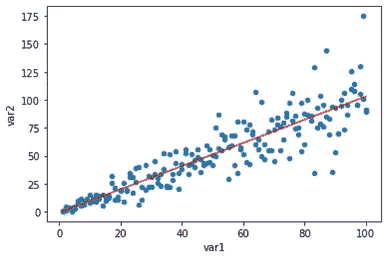
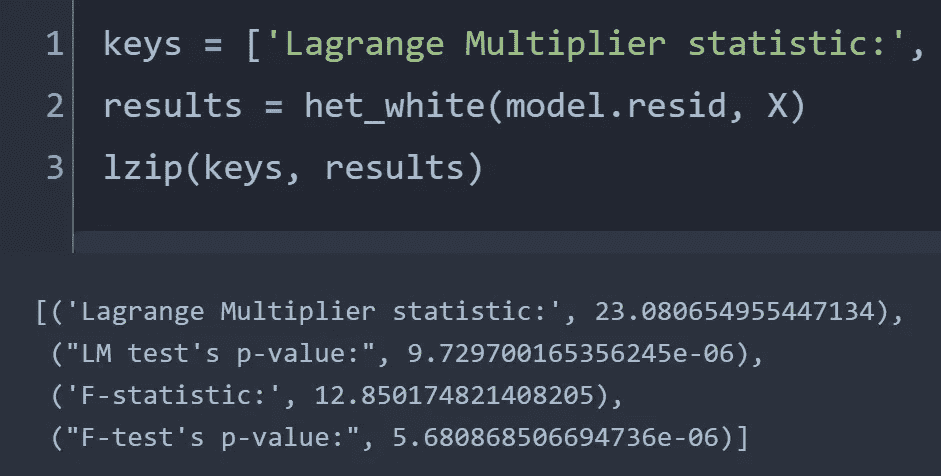
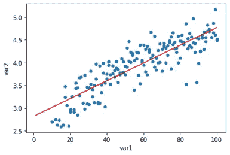
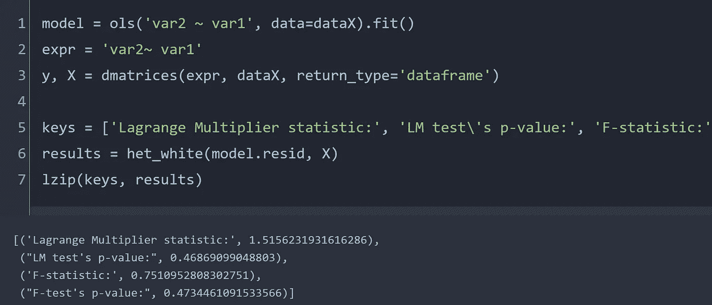

# 回归模型中的异方差性

> 原文：<https://towardsdatascience.com/heteroscedasticity-in-regression-model-21d9f5a93e59?source=collection_archive---------6----------------------->

## 使用统计模型检查异方差性

图片来自 [Unsplash](https://unsplash.com/photos/rpVQJbZMw8o)

> **简介**

通常，回归分析是对可能具有跨不同自变量值的高方差的内置特征的数据进行的。这类数据的一个缺陷是异方差，它表示拟合值周围的可变方差。当我们观察异方差时，通常需要验证模型，有时在这种情况下回归数据可能不可靠。

> **什么是异方差？**

当我们执行回归时，数据点分散在拟合线周围。对于一个好的回归模型，散射应该尽可能小。当散射是均匀的时，这个模型称为均匀散射模型。如果不是，模型就是异方差的。典型的异方差分布类似于锥形，如下所示

异方差数据的锥形分布。作者图片

从上图可以看出，很明显，在独立变量(n)的值较低时，散射非常紧密，而当 n 的值较高时，方差较高。

> **什么原因导致异方差？**

大多数情况下，数据本身就是这种锥形分布的原因。有时，因变量的方差在整个数据集内变化且不恒定是很自然的。例如，在时间序列数据的情况下，因变量的初始值可能非常接近，但在最近的时间内，分散可能会扩大。在 20 世纪 50 年代，美国所有 50 个州的苹果价格可能非常相似，但在最近一段时间可能会有很大差异。换句话说，最近的数据点之间的变化可能比早期数据之间的变化更大。

> **用 python 实现**

对于上面显示的数据集，我们可以通过使用 python 的 *statsmodels* 库来检查异方差性。 *Statsmodels* 包含 *het_white* 模块，这是针对异方差性的 white 拉格朗日乘数检验。[文档](https://www.statsmodels.org/dev/generated/statsmodels.stats.diagnostic.het_white.html#statsmodels.stats.diagnostic.het_white)显示可以对任何样本数据进行测试，输出 p 值作为异方差检验的指标。零假设取为“残差数据无异方差”。

让我们先检查一下同质数据。

拟合线周围的均匀散射。作者图片

我创建了一个合成数据集作为异方差数据的样本。

拟合线周围的非均匀散射。作者图片

我们可以对这个数据进行 White 的检验[1]来检验是否存在异方差。

作者图片

在这种情况下，p 值非常小，因此我们拒绝零假设，并确认数据集中存在潜在的异方差。

> **修正异方差**

异方差使得回归模型不太可靠，因为残差不应该遵循任何特定的模式。为了使模型稳健，散射应该在拟合线周围是随机的。处理异方差的一个非常流行的方法是[转换因变量](https://scholarworks.umass.edu/cgi/viewcontent.cgi?article=1331&context=pare)【2】。我们可以对变量执行对数转换，并用 White 的测试再次检查。为了演示，我们删除了 y 轴上的一些低值。

转换变量。作者图片

作者图片

当进行怀特检验时，p 值变高，表明数据变得同方差。然而，当执行数据转换时，原始数据的定义不再存在，而是被新的变量所取代。

> **结论**

异方差会降低回归模型的稳健性。本质上，预测误差因自变量的不同范围而异，表明模型并不完美。在本文中，我们使用 *statsmodel* 演示了异方差的原因及其在 python 中的检测实现。在进行任何回归分析后，应始终检查残差图，并确保残差的可变性不遵循任何模式，或者换句话说，残差的散布应在整个回归线上是均匀的。

[Github 页面](https://mdsohelmahmood.github.io/2021/07/28/Heteroscedasticity.html)

> **参考文献**

[1] [异方差没什么可怕的](/heteroscedasticity-is-nothing-to-be-afraid-of-730dd3f7ca1f)

[2] [多元回归分析中的异方差性:什么是异方差性，如何检测异方差性，如何解决异方差性，以及在 R 和 SPSS 中的应用](https://scholarworks.umass.edu/cgi/viewcontent.cgi?article=1331&context=pare)