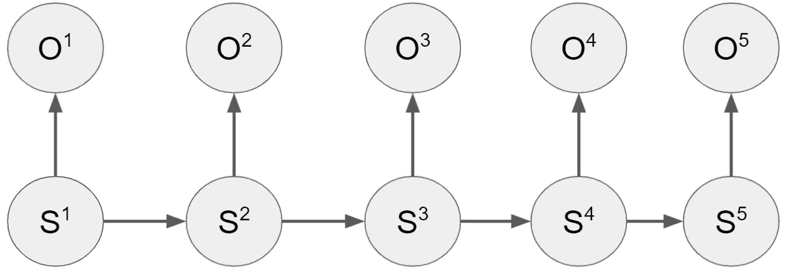
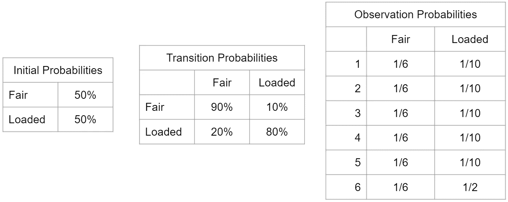
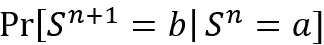
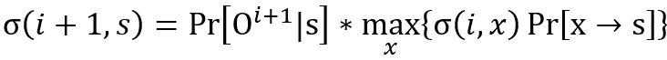
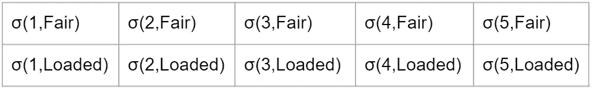
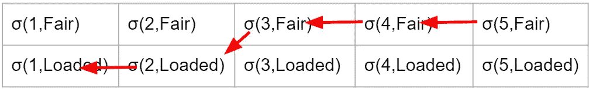
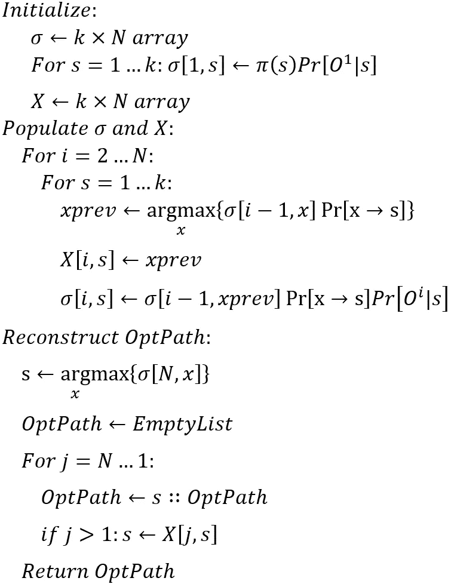

# 隐马尔可夫模型:综述

> 原文：<https://towardsdatascience.com/hidden-markov-models-an-overview-98926404da0e?source=collection_archive---------15----------------------->

## [实践教程](https://towardsdatascience.com/tagged/hands-on-tutorials)、[行业笔记](https://towardsdatascience.com/tagged/notes-from-industry)

有许多工具可用于分析顺序数据。隐马尔可夫模型(HMMs)是最简单、最灵活、最经得起时间考验的模型之一。它们最初是为信号处理而开发的，现在在生物信息学中无处不在。

在数据科学社区中，有一种倾向是支持像 LSTMs 这样的机器学习选项。虽然这些工具非常强大，但它们也是出了名的复杂和难以理解。因此，你经常会看到数据科学家努力使用复杂的方法，而简单的方法会更好。

本文旨在解决这一问题，让技术人员了解经常被忽视的 HMM 的概念和应用。在 [Zeitworks](https://www.zeitworks.com/) 我们非常依赖最先进的机器学习技术，但作为经验丰富的数据科学家，我们也知道有时 HMM 是这项工作的工具。

# 激发真实世界的例子

以下是我使用 hmm 解决的一些问题:

1.  在[zei networks](http://www.zeitworks.com)我们使用计算机事件日志研究人类工作流程。其中一部分是获取用户的原始事件日志(击键、访问的 URL 等。)并确定他们每次都在做什么(背景研究、文档审查等)。).有时你可以孤立地从一个事件中猜测，但通常你也需要看看前后的事件才能有信心。
2.  你有一本小说中某一页的照片，你想将文本数字化。照片已经被分割成单词的图像。大部分都可以用 OCR 解码，但是有些字因为原页面上的污垢而模糊不清(那是“快”还是“嘎嘎”？).你想用周围的词来挑选最佳选项。
3.  当一个人在玩电子游戏时，你有一系列每秒钟拍摄的大脑扫描。在游戏中，他们的化身在建筑物中进进出出，你的目标是仅使用大脑扫描来猜测它是在室内还是室外。任何给定的扫描都是非常不明确的，但是头像通常会在里面/外面停留几秒钟。你预计化身在(外)侧的时间跨度很大，大脑扫描平均看起来稍微更偏向(外)侧。

为这些问题中的每一个建立一个定制的解决方案是可能的，但是这是一个非常大的任务，有脆弱或易受攻击的风险。通常，特别是如果工作部分是探索性的，你想要更轻的东西。hmm 提供了一个框架，它足够通用，可以涵盖所有这些情况，足够灵活，可以包含大量领域知识，并且足够简单，可以理解。

# 数学模型

让我们从商业现实过渡到数学理想化。上述业务问题有几个共同点:

1.  有一个离散的潜在现实世界的“状态”，随着时间的推移而变化。在示例(1)和(3)中，状态很少改变。在示例(2)中，状态是页面上的单词，并且它几乎在每个时间步都发生变化。我们把这个现实世界的状态叫做 s。
2.  在每个时间步长，您都有一个“观察”，可以用来以一定的置信度猜测状态(对于 OCR 示例，置信度通常很高，但是对于大脑扫描，置信度很低)。让我们把这个观测称为 O。注意，虽然状态 S 是离散的，O 可以是离散的，也可以是连续的。
3.  这个想法是使用时间 T 时的观察值 O 来猜测状态 S，然后使用 T 前后的观察值来改进我们的猜测。

整体情况看起来是这样的，状态一个接一个，每一个都产生一个观察结果:

HMM 中状态和观察值之间的依赖结构

具体来说，在你的头脑中保持下面的画面。状态 S 是可以掷出的骰子，观察值 O 是哪一面出现。为简单起见，假设有两个骰子，其中一个是公平的，另一个有 50%的机会是 6。掷出公平骰子后，有 10%的几率我会换到另一个骰子，在掷出装载的骰子后，有 20%的几率我会换。我做了很多次掷骰子——从来没有告诉你我用的是哪个骰子——而你的工作就是猜测骰子什么时候是公平的或者是装满的。你需要的最后一条信息是，在第一次掷骰子时，我使用公平骰子还是装载骰子的可能性有多大；让我们称之为 50/50。这种情况可以归纳为三个表格:

一个简单的 HMM 的数学描述与骰子，一个加载和一个公平。

为了用数学术语表达这一点，我们需要:

*   每个州的初始概率，P[S⁰=s].这个矢量通常被称为π。
*   转移概率矩阵

为了简单起见，我称之为 *Pr[a → b]* 。

*   给定状态下观察值的概率分布，Pr[O=o|S=s]。因为骰子 O 是离散的，概率分布放在一个表格里。但是数学上 O 可以是任何东西；对于算法，我们只需要一个函数，它接受状态(从 1 到 k 的整数)和观察值(可以是任何值)并返回一个非负数。

我应该指出，如果我们忘记观察，状态 S 构成一个更简单的模型，称为“马尔可夫链”。几乎随机分析中的所有东西要么是马尔可夫链，要么是马尔可夫链的变体；hmm 是一种变体，其中链的状态对我们的知识是隐藏的(因此得名)，并且必须通过不完美的观察来猜测。

# hmm 的局限性及优化

我想讨论一下 HMM 模型中一些很少是 100%真实的理想化情况，以及对此你能做些什么。如果您只想了解如何使用 HMMs，可以跳过这一部分:)

最大的理想化是所谓的“马尔可夫假设”，即下一个状态只依赖于当前状态。我喜欢把它比作一只患了健忘症的青蛙，在睡莲叶间跳跃；他不知道他在当前的发射台呆了多久，也不知道他之前在哪里，所以他只根据他从当前位置看到的东西来选择下一个发射台(或者根本不跳)。您可以通过一个 n 阶马尔可夫链来部分解决这个问题，其中您的“状态”实际上是一个滑动窗口，覆盖了包括当前状态在内的最后 n 个状态。在自然语言中使用 hmm 时，你会经常看到这种情况。这在计算上变得有风险，因为你现在要跟踪 k^n 不同的“州”。

HMMs 的下一个假设是状态是真正离散的。通常情况下，状态是由人来决定的，地面上的现实可能并不完全符合其中一种状态。hmm 没有混合状态的概念，但是它们支持关于状态的*不确定性*；当模型表明两种状态的可能性相当时，可能是信号很弱，但也可能是世界不适合我们的盒子。

最后是最重要的 Pr[O|S],给定潜在状态下你观察到的概率。在我们的玩具骰子示例中，它只是一个查找表。不过，在我引用的现实世界的例子中，制作 Pr[O|S]本身就是一个项目，包括建模假设和拟合历史数据。HMM 对 Pr[O|S]的复杂程度没有限制，但它确实假设 O 仅*依赖于当前的 S，而不依赖于任何先前的 S 或 O。这一假设当然不成立——因为 S 中没有捕捉到真实世界的动态，所以观察值通常是相关的——但在实践中这很少会有问题。*

# 计算状态:维特比算法

现在让我们把这个模型付诸实践吧！你可以用 HMM 做很多事情，但是在商业中 90%的时间是这样的:*给定一系列 N 次观察，猜猜状态是什么*。为此，我们使用著名的维特比算法，该算法计算给定我们的观察的基础状态的最优序列。

当我说“最优”时，我指的是“最有可能”——1)从基础马尔可夫链中获得状态序列，然后 2)该序列生成已知观察值的概率。

为了做到这一点，考虑一个相关的子问题:找到直到时间步 i *的最佳序列，该时间步 I*在特定状态 s* 结束。让我们定义σ(i，s)为该序列的概率。想想骰子的例子:关键的见解是，直到 i+1 结束的最佳序列是公平的，或者是{直到 I 结束的最佳序列是公平的}+{公平}，或者是{直到 I 结束的最佳序列是装载的}+{公平}。如果我们知道到时间 I 为止的最佳序列，那么 i+1 就很容易了！在数学中，这告诉我们:*

我们可以将所有σ(i，s)排列在一个表格中，如下所示:

一旦这个表被填充，我们几乎完成了维特比算法！我们可以通过查看哪个 s 最大化σ(N，s)来找到最优序列中的最后一个状态。然后我们逆向工作——在计算σ(N，s)时，我们用哪个 x 来表示σ(N-1，x)？您可以通过画一个从σ(i，s)到σ(i-1，x)的箭头来形象化这个过程，如下所示:

这样，我们可以重建整个最佳序列。如果我们想表达这是伪代码，我们可以写:

只有一个小的实现细节我必须注意。所述的算法将会遇到数值问题，因为概率变得如此之小。这很容易通过对概率的对数进行操作，并计算 Log[σ(i，s)]而不是σ(i，s)的表来解决。最大化 Log[σ(i，s)]等价于最大化σ(i，s)。

# 离别赠言

当我告诉科技行业的人我们在 Zeitworks 做什么时，我得到的典型回应是“哦，你可以用 LSTM 来做这个！”。虽然这些现在确实很流行，但是还有很多分析序列数据的工具，它们各有所长。

lst ms——以及其他深度学习模型——在现实世界模式不可理解的情况下大放异彩。这些是“数据驱动”的工具；有了足够的数据来训练，有了足够的旋钮来转动，它们可以学习模仿人类从未记录下来的复杂模式。作为交换，它们很难解释，如果问题发生变化也很难概括，并且依赖于大量的数据。

hmm 则相反。它们是“模型驱动的”:一种对人类友好的世界叙事，被浓缩成方程式。这些方程中的参数符合数据，但它们是有意义的数字，有现实世界的解释，而不是一个数字巫术。模型驱动的工具不如数据驱动的工具强大，但是作为交换，它们训练起来很便宜，很容易理解，而且你可以把专业知识融入其中。

数据驱动和模型驱动工具是互补的，而不是对立的。它们是解决不同问题的理想选择，在 Zeitworks，我们将两者结合在一起。但是做到这一点取决于批判性地思考你的武器库中所有工具的能力，理解它们的优势，以便你可以将它们与正确的任务相匹配。

我在本文中的目标是让您理解 hmm。它们是强大的模型——尽管在数据科学界经常被低估——它们通常是这项工作的最佳工具。

**下一篇** : [训练嗯](https://medium.com/@field.cady/training-hidden-markov-models-831c1bdec27d)