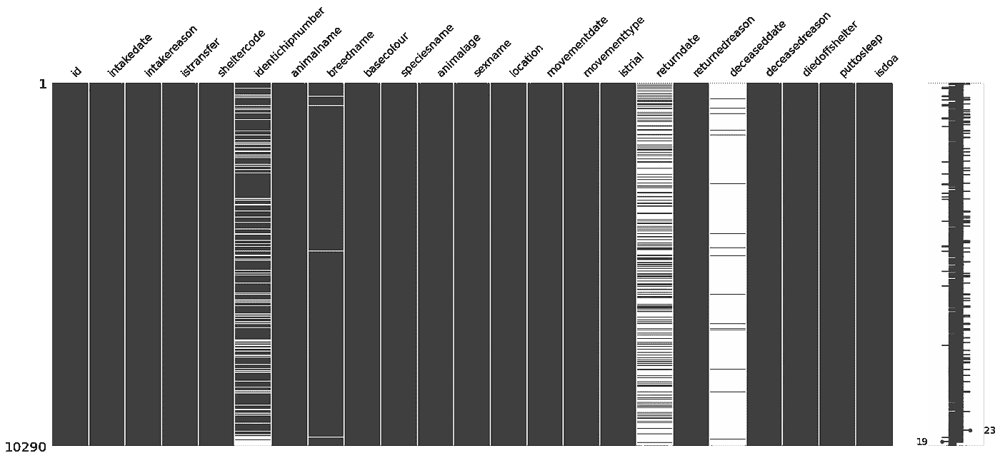
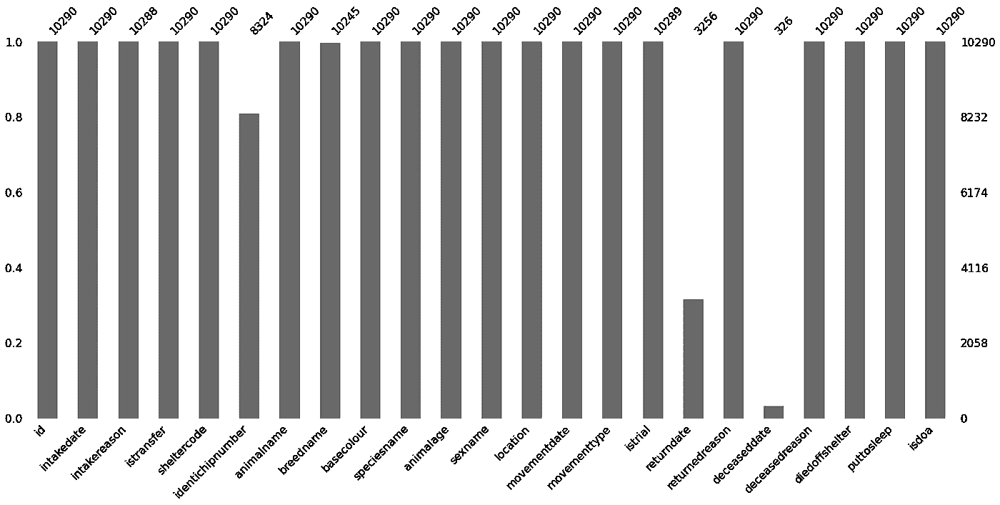
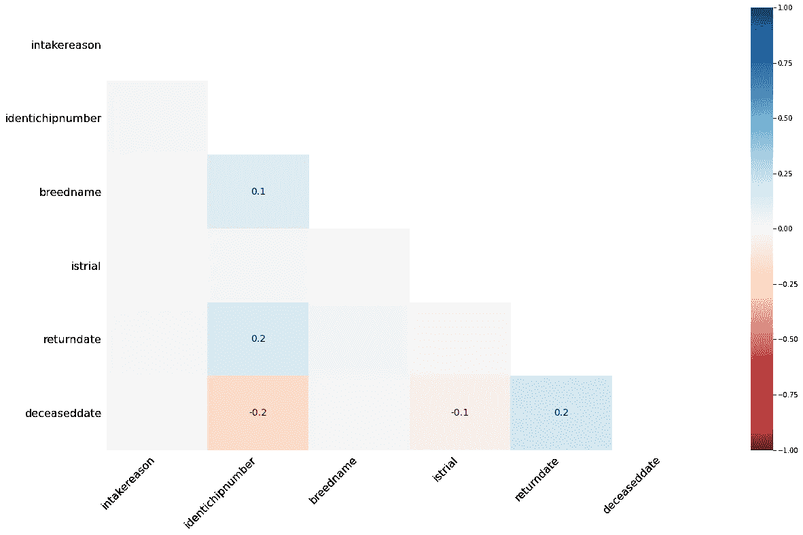
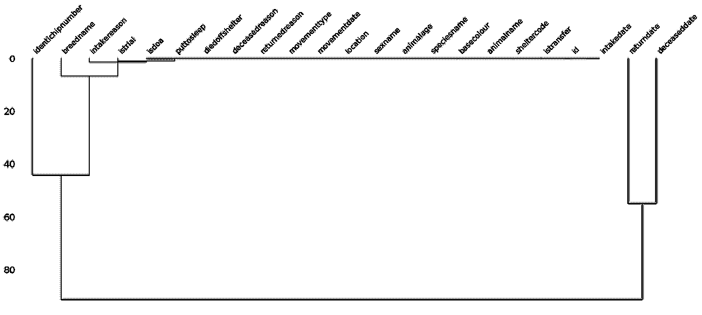
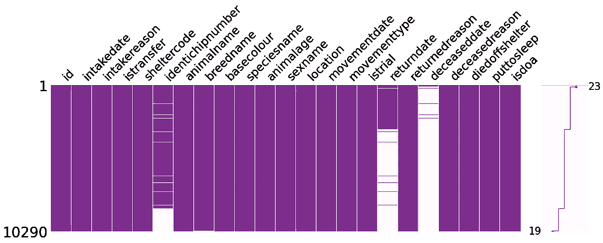
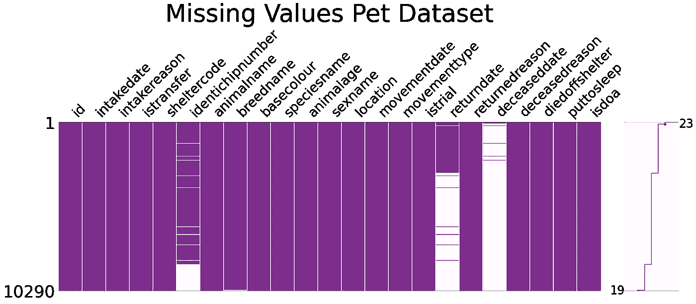

# 蟒蛇的隐藏宝藏

> 原文：<https://towardsdatascience.com/hidden-treasures-of-python-78ae604f7e33?source=collection_archive---------23----------------------->

## 很少使用的库以及如何使用它们


来自 [Unsplash](https://unsplash.com/photos/CTNHIGI2WcU)

Python 编程语言中有成千上万的库，所以本文的标题基本上可以涉及到几乎所有的库，只有几百个库除外。描述所有的 Python 库可能需要一个真正的图书库。不过，在本文中，我们将重点介绍几个用于解决特定任务或娱乐的工具。

为了实践我们的库，我们将从 Kaggle 下载一个数据集— [动物护理和控制收养的动物](https://www.kaggle.com/jinbonnie/animal-data)。

```
import pandas as pd
df = pd.read_csv('animal-data-1.csv')
print('Number of pets:', len(df), '\n')
print(df.columns.tolist())**Output**:Number of pets: 10290 ['id', 'intakedate', 'intakereason', 'istransfer', 'sheltercode', 'identichipnumber', 'animalname', 'breedname', 'basecolour', 'speciesname', 'animalage', 'sexname', 'location', 'movementdate', 'movementtype', 'istrial', 'returndate', 'returnedreason', 'deceaseddate', 'deceasedreason', 'diedoffshelter', 'puttosleep', 'isdoa']
```

# 1.缺少编号

*库安装* : `pip install missingno`

Missingno 是一个特殊的库，用于显示数据帧中缺失的值。当然，出于这个目的，我们可以使用任何可视化库中的 seaborn 热图或条形图。然而，在这种情况下，我们必须首先使用`df.isnull().sum()`创建一个包含每列中缺失值的序列，而 missingno 在幕后完成所有工作。该库提供了几种类型的图表:

*   `matrix`显示数据帧中多达 50 列的数据完成密度模式，它类似于 seaborn 缺失值热图。此外，通过右侧的迷你图，它显示了数据完整性的大致形状，强调了具有最大和最小空值的行。
*   `bar chart`以列为单位显示无效可视化。
*   `heatmap`测量范围从-1 到 1 的无效相关性。本质上，它显示了一个变量的存在与否对另一个变量的存在有多么强烈的影响。没有丢失值或正好相反，完全为空的列被排除在可视化之外，没有有意义的相关性。
*   `dendrogram`与热图一样，度量列之间的空关系，但在这种情况下不是成对的，而是在列组之间，检测缺失数据的簇。那些在图表上位置更近的变量显示出更强的零相关性。对于少于 50 列的数据帧，树状图是垂直的，否则，它翻转成水平的。

让我们在 pet 数据集上使用默认设置来尝试所有这些图表:

```
import missingno as msno
%matplotlib inline
msno.matrix(df)
```



```
msno.bar(df)
```



```
msno.heatmap(df)
```



```
msno.dendrogram(df)
```



我们可以对数据集进行以下观察:

1.  一般来说，缺少的值很少。
2.  最空的列是`deceaseddate`和`returndate`。
3.  大多数宠物都有芯片。
4.  无效相关性:

*   被植入芯片和死亡之间有一点负面影响，
*   略显积极——被植入芯片与被归还，被归还与死亡。

有几个选项可以自定义缺失无图表:`figsize`、`fontsize`、`sort`(按完整性对行进行排序，升序或降序)、`labels`(可以是`True`或`False`，表示是否显示列标签)。有些参数是特定于图表的:矩阵图和条形图的`color`，矩阵图的`sparkline`(是否绘制)和`width_ratios`(矩阵宽度到迷你图宽度)，条形图的`log`(对数刻度)，热图的`cmap`颜色图，树状图的`orientation`。让我们将其中一些应用到上面的图表中:

```
msno.matrix(
            df, 
            figsize=(25,7),
            fontsize=30, 
            sort='descending',
            color=(0.494, 0.184, 0.556), 
            width_ratios=(10, 1)
            )
```



最后，如果还有什么我们想要调整的，我们总是可以将 matplotlib 的任何功能添加到缺少的图形中。为此，我们应该添加参数`inline`并将其赋给`False`。让我们给矩阵图添加一个标题:

```
import matplotlib.pyplot as plt
msno.matrix(
            df, 
            figsize=(25,7),
            fontsize=30, 
            sort='descending',
            color=(0.494, 0.184, 0.556), 
            width_ratios=(10, 1),
            inline=False
            ) 
plt.title('Missing Values Pet Dataset', fontsize=55)
plt.show()
```



[缺少文件](https://github.com/ResidentMario/missingno)

# 2.有平面的

*库安装* : `pip install tabulate`

这个库用于用 Python 漂亮地打印表格数据。它允许智能和可定制的列对齐，数字和文本格式，通过小数点对齐。

`tabulate()`函数采用表格数据类型(dataframe、列表或字典列表、字典、NumPy 数组)、一些其他可选参数，并输出一个格式良好的表格。让我们在 pet 数据集的一个片段上练习一下，从最基本的漂亮打印的表格开始:

```
from tabulate import tabulate
df_pretty_printed = df.iloc[:5, [1,2,4]]
print(tabulate(df_pretty_printed))**Output**:-  -----------  -----------------------  ------
0  Jadzia       Domestic Short Hair      Female
1  Gonzo        German Shepherd Dog/Mix  Male
2  Maggie       Shep Mix/Siberian Husky  Female
3  Pretty Girl  Domestic Short Hair      Female
4  Pretty Girl  Domestic Short Hair      Female
-  -----------  -----------------------  ------
```

我们可以在表中添加一个`headers`参数。如果我们赋值`headers='firstrow'`，则使用第一行数据，如果`headers='keys'`，则使用数据帧/字典的键。对于表格格式化，我们可以使用一个`tablefmt`参数，该参数可以从众多选项中选择一个(以字符串形式赋值):`simple`、`github`、`grid`、`fancy_grid`、`pipe`、`orgtbl`、`jira`、`presto`、`pretty`等。

默认情况下，制表将包含浮点数的列靠小数点对齐，整数靠右，文本列靠左。这可以通过使用`numalign`和`stralign`参数(`right`、`center`、`left`、`decimal`用于数字，或`None`)来覆盖。对于文本列，可以禁用默认的前导和尾随空格删除。

让我们自定义我们的表格:

```
print(tabulate(
               df_pretty_printed, 
               headers='keys',
               tablefmt='fancy_grid',
               stralign='center'
               ))**Output**:╒════╤══════════════╤═════════════════════════╤═══════════╕
│    │  animalname  │        breedname        │  sexname  │
╞════╪══════════════╪═════════════════════════╪═══════════╡
│  0 │    Jadzia    │   Domestic Short Hair   │  Female   │
├────┼──────────────┼─────────────────────────┼───────────┤
│  1 │    Gonzo     │ German Shepherd Dog/Mix │   Male    │
├────┼──────────────┼─────────────────────────┼───────────┤
│  2 │    Maggie    │ Shep Mix/Siberian Husky │  Female   │
├────┼──────────────┼─────────────────────────┼───────────┤
│  3 │ Pretty Girl  │   Domestic Short Hair   │  Female   │
├────┼──────────────┼─────────────────────────┼───────────┤
│  4 │ Pretty Girl  │   Domestic Short Hair   │  Female   │
╘════╧══════════════╧═════════════════════════╧═══════════╛
```

这里唯一要记住的是，漂亮打印的表格最好在笔记本电脑和计算机上显示，但有时在较小的屏幕上可能会有问题(智能手机和 iPhones)。

[将文件制成表格](https://pypi.org/project/tabulate/)

# 3.维基百科(一个基于 wiki 技术的多语言的百科全书协作计划ˌ也是一部用不同语言写成的网络百科全书ˌ 其目标及宗旨是为全人类提供自由的百科全书)ˌ开放性的百科全书

*库安装* : `pip install wikipedia`

维基百科图书馆，顾名思义，方便从维基百科获取信息。使用它可以完成的一些任务包括:

*   搜索维基百科— `search()`，
*   获取文章摘要— `summary`，
*   获取完整的页面内容，包括图片、链接、维基百科页面的任何其他元数据，
*   选择页面语言— `set_lang()`。

在上面印刷精美的表格中，我们看到了一种叫做西伯利亚哈士奇的狗。作为练习，我们将把语言设置为俄语(我的母语🙂)并搜索相应维基百科页面的一些建议:

```
import wikipedia 
wikipedia.set_lang('ru') 
print(wikipedia.search('Siberian Husky'))**Output**:'Сибирский хаски', 'Древние породы собак', 'Породы собак по классификации кинологических организаций', 'Маккензи Ривер Хаски', 'Ричардсон, Кевин Майкл']
```

让我们取第一个建议，取该页摘要的第一句话:

```
print(wikipedia.summary('Сибирский хаски', sentences=1))**Output**:Сибирский хаски — заводская специализированная порода собак, выведенная чукчами северо-восточной части Сибири и зарегистрированная американскими кинологами в 1930-х годах как ездовая собака, полученная от аборигенных собак Дальнего Востока России, в основном из Анадыря, Колымы, Камчатки у местных оседлых приморских племён — юкагиров, кереков, азиатских эскимосов и приморских чукчей — анкальын (приморские, поморы — от анкы (море)).
```

现在，我们将从该页面获得一张哈士奇图片的链接:

```
print(wikipedia.page('Сибирский хаски').images[0])**Output**:[https://upload.wikimedia.org/wikipedia/commons/a/a3/Black-Magic-Big-Boy.jpg](https://upload.wikimedia.org/wikipedia/commons/a/a3/Black-Magic-Big-Boy.jpg)
```

想象这个美丽的生物:


来自[维基百科](https://ru.wikipedia.org/wiki/Сибирский_хаски)

[维基百科文档](https://wikipedia.readthedocs.io/en/latest/code.html#api)

# 4.Wget

*库安装* : `pip install wget`

Wget 库允许下载 Python 中的文件，而不需要打开它们。我们还可以添加一个保存该文件的路径作为第二个参数。

下面下载上面哈士奇的图片:

```
import wget
wget.download('[https://upload.wikimedia.org/wikipedia/commons/a/a3/Black-Magic-Big-Boy.jpg'](https://upload.wikimedia.org/wikipedia/commons/a/a3/Black-Magic-Big-Boy.jpg'))**Output**:'Black-Magic-Big-Boy.jpg'
```

现在，我们可以在与此笔记本相同的文件夹中找到该图片，因为我们没有指定保存它的路径。

由于互联网上的任何网页实际上都是一个 HTML 文件，这个库的另一个非常有用的应用是抓取整个网页，包括所有的元素。让我们下载数据集所在的 Kaggle 网页:

```
wget.download('[https://www.kaggle.com/jinbonnie/animal-data'](https://www.kaggle.com/jinbonnie/animal-data'))**Output**:'animal-data'
```

产生的`animal-data`文件如下所示(我们将只显示前几行):

```
<!DOCTYPE html>
<html lang="en">
<head>
    <title>Animal Care and Control Adopted Animals | Kaggle</title>
    <meta charset="utf-8" />
    <meta name="robots" content="index, follow" />
    <meta name="description" content="animal situation in Bloomington Animal Shelter from 2017-2020" />
    <meta name="turbolinks-cache-control" content="no-cache" />
```

[获取文档](https://pypi.org/project/wget/)

# 5.骗子

*库安装* : `pip install Faker`

该模块用于生成假数据，包括姓名、地址、电子邮件、电话号码、工作、文本、句子、颜色、货币等。faker 生成器可以将区域设置作为参数(默认为 en_US 区域设置)，以返回本地化数据。为了生成一段文本或一个句子，我们可以使用缺省的 lorem ipsum 或者，我们可以提供我们自己的单词集。为了确保所有创建的值对于某个特定的实例都是惟一的(例如，当我们想要创建一长串惟一的假名时)，应用了`unique`属性。相反，如果有必要产生相同的值或数据集，就使用`seed()`方法。

让我们看一些例子:

```
from faker import Faker
fake = Faker()print(
      'Fake color:', fake.color(), '\n'
      'Fake job:',   fake.job(),   '\n'
      'Fake email:', fake.email(), '\n'
      )*# Printing a list of fake Korean and Portuguese addresses*
fake = Faker(['ko_KR', 'pt_BR'])
for _ in range(5):
    print(fake.unique.address())     *# using the `unique` property*print('\n')*# Assigning a seed number to print always the same value / data set*
fake = Faker()
Faker.seed(3920)
print('This English fake name is always the same:', fake.name())**Output**:Fake color: #bde2f9 
Fake job: Transport planner 
Fake email: chad52@yahoo.com 

Rua Marcos Vinicius Costela, 66
Vila Nova Gameleira 2ª Seção
86025006 da Costa / MG
충청남도 평창군 언주1거리 (우진장읍)
Núcleo de Peixoto, 87
Havaí
90291-013 Campos / MS
Lago da Luz
Minas Brasil
85538436 Porto da Mata / TO
인천광역시 중랑구 서초중앙0로

This English fake name is always the same: Kim Lopez
```

回到我们的数据集，我们发现至少有两只不幸的宠物有着不太好听的名字:

```
df_bad_names = df[df['animalname'].str.contains('Stink|Pooh')]
print(df_bad_names)**Output**: identichipnumber animalname            breedname speciesname 
1692              NaN    Stinker  Domestic Short Hair         Cat    
3336  981020023417175       Pooh  German Shepherd Dog         Dog  
3337  981020023417175       Pooh  German Shepherd Dog         Dog  

     sexname           returndate                     returnedreason  
1692  Male                    NaN                              Stray  
3336  Female  2018-05-14 00:00:00  Incompatible with owner lifestyle  
3337  Female                  NaN                              Stray
```

最后 2 排的狗实际上是同一只，因为与主人的生活方式不兼容而被送回收容所。用我们的新技能，让我们拯救这两种动物的名声，给它们重新起个更体面的名字。因为这只狗是德国牧羊犬，我们将为她选择一个德国名字。至于猫，根据这个[维基百科页面](https://en.wikipedia.org/wiki/Domestic_short-haired_cat)，家养短毛是美国最常见的品种，所以我们会为它取一个英文名字。

```
*# Defining a function to rename the unlucky pets*
def rename_pets(name):
    if name == 'Stinker':
        fake = Faker()
        Faker.seed(162)   
        name = fake.name()
    if name == 'Pooh':
        fake = Faker(['de_DE'])
        Faker.seed(20387)
        name = fake.name()
    return name*# Renaming the pets*
df['animalname'] = df['animalname'].apply(rename_pets)*# Checking the results*
print(df.iloc[df_bad_names.index.tolist(), :] )**Output**: identichipnumber            animalname     breedname speciesname
1692             NaN         Steven Harris  Domestic Short Hair  Cat          
3336 981020023417175  Helena Fliegner-Karz  German Shepherd Dog  Dog   
3337 981020023417175  Helena Fliegner-Karz  German Shepherd Dog  Dog       

     sexname           returndate                     returnedreason  
1692    Male                  NaN                              Stray  
3336  Female  2018-05-14 00:00:00  Incompatible with owner lifestyle  
3337  Female                  NaN                              Stray
```

对于一只猫和一只狗来说，史蒂文·哈里斯和海伦娜·弗利格纳-卡兹听起来有点太夸张了，但绝对比他们以前的名字好得多！

[Faker 文档](https://faker.readthedocs.io/en/master/)

# 6.数字计算器

*库安装* : `pip install numerizer`

这个小 Python 包用于将自然语言数字转换成数字(整数和浮点数)，并且只包含一个函数— `numerize()`。

现在让我们在数据集上尝试一下。一些宠物的名字包含数字:

```
df_numerized_names = df[['identichipnumber', 'animalname', 'speciesname']][df['animalname'].str.contains('Two|Seven|Fifty')]   
print(df_numerized_names)**Output**: dentichipnumber animalname speciesname
2127              NaN      Seven         Dog
4040  981020025503945  Fifty Lee         Cat
6519  981020021481875   Two Toes         Cat
6520  981020021481875   Two Toes         Cat
7757  981020029737857    Mew Two         Cat
7758  981020029737857    Mew Two         Cat
7759  981020029737857    Mew Two         Cat
```

我们将把这些名字的数字部分转换成实数:

```
from numerizer import numerize
df['animalname'] = df['animalname'].apply(lambda x: numerize(x))
print(df[['identichipnumber', 'animalname','speciesname']]\
        .iloc[df_numerized_names.index.tolist(), :])**Output**: identichipnumber animalname speciesname
2127              NaN          7         Dog
4040  981020025503945     50 Lee         Cat
6519  981020021481875     2 Toes         Cat
6520  981020021481875     2 Toes         Cat
7757  981020029737857      Mew 2         Cat
7758  981020029737857      Mew 2         Cat
7759  981020029737857      Mew 2         Cat
```

[编号器文档](https://pypi.org/project/numerizer/)

# 7.表情符号

*库安装* : `pip install emoji`

通过这个库，我们可以根据由 [Unicode Consortium](http://www.unicode.org/emoji/charts/full-emoji-list.html) 定义的表情符号代码，将字符串转换成表情符号，如果指定了`use_aliases=True`，还可以补充[别名](https://www.webfx.com/tools/emoji-cheat-sheet/)。表情包只有两个功能:`emojize()`和`demojize()`。默认英语(`language='en'`)可以更改为西班牙语(es)、葡萄牙语(pt)或意大利语(it)。

```
import emoji
print(emoji.emojize(':koala:'))
print(emoji.demojize('🐨'))
print(emoji.emojize(':rana:', language='it'))**Output**:🐨
:koala:
🐸
```

让我们给我们的动物表情符号。首先，我们将检查它们独特的物种名称:

```
print(df['speciesname'].unique())**Output**:['Cat' 'Dog' 'House Rabbit' 'Rat' 'Bird' 'Opossum' 'Chicken' 'Wildlife' 'Ferret' 'Tortoise' 'Pig' 'Hamster' 'Guinea Pig' 'Gerbil' 'Lizard' 'Hedgehog' 'Chinchilla' 'Goat' 'Snake' 'Squirrel' 'Sugar Glider' 'Turtle' 'Tarantula' 'Mouse' 'Raccoon' 'Livestock' 'Fish']
```

我们必须将这些名称转换成小写，给每个名称添加前导和尾随冒号，然后将`emojize()`应用于结果:

```
df['speciesname'] = df['speciesname']\
 .apply(lambda x: emoji.emojize(f':{x.lower()}:', use_aliases=True))
print(df['speciesname'].unique())**Output**:['🐱' '🐶' ':house rabbit:' '🐀' '🐦' ':opossum:' '🐔' ':wildlife:' ':ferret:' ':tortoise:' '🐷' '🐹' ':guinea pig:' ':gerbil:' '🦎' '🦔' ':chinchilla:' '🐐' '🐍' ':squirrel:' ':sugar glider:' '🐢' ':tarantula:' '🐭' '🦝' ':livestock:' '🐟']
```

让我们将家兔、乌龟和松鼠重命名为表情库可以理解的同义词，并再次尝试对它们进行表情符号化:

```
df['speciesname'] = df['speciesname']\
                      .str.replace(':house rabbit:', ':rabbit:')\
                          .replace(':tortoise:', ':turtle:')\
                          .replace(':squirrel:', ':chipmunk:')
df['speciesname'] = df['speciesname']\
  .apply(lambda x: emoji.emojize(x, variant='emoji_type'))
print(df['speciesname'].unique())**Output**:['🐱' '🐶' '🐇️' '🐀' '🐦' ':opossum:️' '🐔' ':wildlife:️' ':ferret:️' '🐢️' '🐷' '🐹' ':guinea pig:' ':gerbil:️' '🦎' '🦔' ':chinchilla:️' '🐐' '🐍' '🐿️' ':sugar glider:' '🐢' ':tarantula:️' '🐭' '🦝' ':livestock:️' '🐟']
```

剩下的物种是或统称(野生动物和家畜)，或者没有一个表情符号对等物，至少现在还没有。我们将让它们保持原样，仅删除冒号，并将它们转换回标题大小写:

```
df['speciesname'] = df['speciesname'].str.replace(':', '')\
                                     .apply(lambda x: x.title())
print(df['speciesname'].unique(), '\n')
print(df[['animalname', 'speciesname', 'breedname']].head(3))**Output:**['🐱' '🐶' '🐇️' '🐀' '🐦' 'Opossum️' '🐔' 'Wildlife️' 'Ferret️' '🐢️' '🐷' '🐹' 'Guinea Pig' 'Gerbil️' '🦎' '🦔' 'Chinchilla️' '🐐' '🐍' '🐿️' 'Sugar Glider' '🐢' 'Tarantula️' '🐭' '🦝' 'Livestock️' '🐟'] 

  animalname  speciesname                breedname
0     Jadzia           🐱      Domestic Short Hair
1      Gonzo           🐶  German Shepherd Dog/Mix
2     Maggie           🐶  Shep Mix/Siberian Husky
```

[表情符号文档](https://pypi.org/project/emoji/)

# 8.皮阿兹特罗

*库安装* : `pip install pyaztro`

PyAztro 似乎是为了娱乐而不是工作而设计的。这个图书馆为每个星座提供了一个占星术。该预测包括那天的标志描述、该标志的日期范围、心情、幸运数字、幸运时间、幸运颜色、与其他标志的兼容性。例如:

```
import pyaztro
pyaztro.Aztro(sign='taurus', day='tomorrow').description**Output**:"If the big picture is getting you down, narrow your focus a bit and try to enjoy the smaller aspects of life. It's a good day to remember what you're truly thankful for in life and to spread the word."
```

好建议！事实上，我不会等到明天，现在就把注意力集中在数据集上，研究一些相关的信息😀

有一只猫和一只狗叫白羊座:

```
print(df[['animalname', 'speciesname']][(df['animalname'] == 'Aries')])**Output**: animalname  speciesname
3036      Aries           🐱
9255      Aries           🐶
```

还有很多叫狮子座的宠物:

```
print('Leo:', df['animalname'][(df['animalname'] == 'Leo')].count())**Output**:Leo: 18
```

让我们假设那些是他们相应的黄道十二宫😉有了 PyAztro，我们可以查看明星们今天为这些动物准备了什么:

```
aries = pyaztro.Aztro(sign='aries')
leo = pyaztro.Aztro(sign='leo')print('ARIES: \n',
      'Sign:',             aries.sign,          '\n',
      'Current date:',     aries.current_date,  '\n',
      'Date range:',       aries.date_range,    '\n', 
      'Sign description:', aries.description,   '\n',
      'Mood:',             aries.mood,          '\n', 
      'Compatibility:',    aries.compatibility, '\n',
      'Lucky number:',     aries.lucky_number,  '\n',
      'Lucky time:',       aries.lucky_time,    '\n',
      'Lucky color:',      aries.color,       2*'\n',

      'LEO: \n',
      'Sign:',             leo.sign,            '\n',
      'Current date:',     leo.current_date,    '\n',
      'Date range:',       leo.date_range,      '\n', 
      'Sign description:', leo.description,     '\n',
      'Mood:',             leo.mood,            '\n', 
      'Compatibility:',    leo.compatibility,   '\n',
      'Lucky number:',     leo.lucky_number,    '\n',
      'Lucky time:',       leo.lucky_time,      '\n',
      'Lucky color:',      leo.color)**Output**:ARIES: 
 Sign: aries 
 Current date: 2021-02-22 
 Date range: [datetime.datetime(2021, 3, 21, 0, 0), datetime.datetime(2021, 4, 20, 0, 0)] 
 Sign description: Throw away your old to-do list and start over. There may be some stuff on it that just holds you back because you know you'll never do it and you might pop off some cool new projects while you're at it. 
 Mood: Refreshed 
 Compatibility: Scorpio 
 Lucky number: 67 
 Lucky time: 1am 
 Lucky color: Sky Blue 

 LEO: 
 Sign: leo 
 Current date: 2021-02-22 
 Date range: [datetime.datetime(2021, 7, 23, 0, 0), datetime.datetime(2021, 8, 22, 0, 0)] 
 Sign description: Try something new and different today - eat out somewhere you've never been, experiment with new techniques to clean your house or just pick an activity at random and give it a go! 
 Mood: Curious 
 Compatibility: Taurus 
 Lucky number: 75 
 Lucky time: 11am 
 Lucky color: Teal
```

这些预测在 2021 年 2 月 22 日有效，所以如果你想查看我们宠物当天的星座(或者你自己的)，你必须重新运行上面的代码。很明显，除了`sign`和`date_range`之外，所有的属性在 GTM 午夜都在改变。

[皮阿兹托文件](https://github.com/sameerkumar18/pyaztro)

当然，还有许多其他有趣的 Python 库，如 PyAztro，包括:

*   [**艺术**](https://pypi.org/project/art/) —用于将文本转换为 ASCII 艺术，比如:ʕ •`ᴥ• ʔ
*   [**龟**](https://docs.python.org/3/library/turtle.html) —用于绘图，
*   [**象棋**](https://pypi.org/project/chess/) —用于下棋，
*   [**圣诞老人**](https://pypi.org/project/santa/)——随机配对秘密圣诞老人礼物和接收者，

甚至

*   [**火绒**](https://pypi.org/project/pynder/)——用于使用火绒。

我们可以肯定，有了 Python，我们永远不会感到无聊！

# 结论

总之，我希望数据集中的所有宠物都能找到他们可爱和有爱心的主人，以及 Python 用户——发现更多令人惊叹的库，并将其应用到他们的项目中。

如果你喜欢这篇文章，你也可以发现下面这些有趣的:

[](https://medium.com/mlearning-ai/11-cool-names-in-data-science-2b64ceb3b882) [## 数据科学中的 11 个酷名字

### 你可能不知道它们是什么意思

medium.com](https://medium.com/mlearning-ai/11-cool-names-in-data-science-2b64ceb3b882) [](https://medium.com/geekculture/creating-toyplots-in-python-49de0bb27ec1) [## 在 Python 🧸中创建玩具图

### 高质量的极简交互式可视化，非常适合电子出版

medium.com](https://medium.com/geekculture/creating-toyplots-in-python-49de0bb27ec1) [](https://python.plainenglish.io/the-little-prince-on-a-word-cloud-8c912b9e587e) [## 用 Python 为《小王子》生成单词云

### 文字云上的小王子:我们可以这样解开他的一些谜团吗？

python .平原英语. io](https://python.plainenglish.io/the-little-prince-on-a-word-cloud-8c912b9e587e)