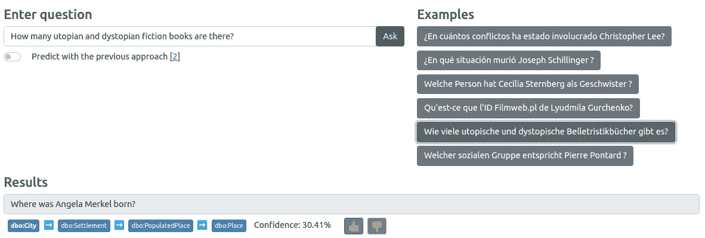
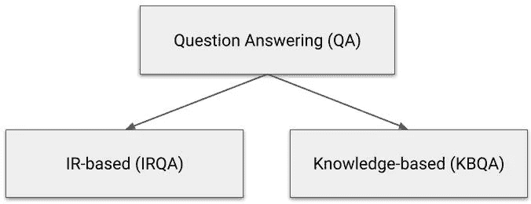
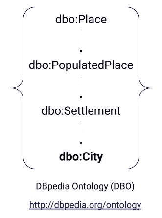
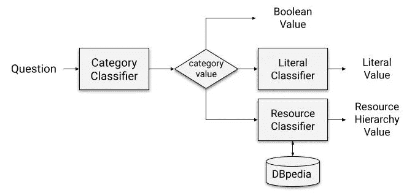

# 知识图问答中期望答案类型的层次分类

> 原文：<https://towardsdatascience.com/hierarchical-classification-of-expected-answer-type-in-knowledge-graph-question-answering-6c7b72d65923?source=collection_archive---------10----------------------->

## [思想和理论](https://towardsdatascience.com/tagged/thoughts-and-theory)

## 机器如何理解用户在问什么？

# TLDR

人们在寻找一个问题的答案时使用的一个重要步骤是了解哪种类型的答案最适合[1]。例如，对于“现在几点了？”我们希望听到“时间”类型的回答，以及“伊万·彼得罗夫出生在哪里？”—类型为“城市”或“国家”的答案。

基于知识图的问答系统也是如此，其目的是找到仿真问题的答案。本文介绍了一个用于确定预期答案类型(EAT)的模块，该模块不仅能够预测单个类，还能够构建类的层次结构作为预测值。该模块既作为[网络界面(UI)](https://webengineering.ins.hs-anhalt.de:41009/eat-classification) 提供，也作为 [RESTful API](https://webengineering.ins.hs-anhalt.de:41020/docs) 提供。该功能允许最终用户获得 [104 种语言](https://github.com/google-research/bert/blob/master/multilingual.md#list-of-languages)的答案类型预测，查看预测的可信度并留下反馈。此外，API 允许研究人员和开发人员将 EAT 分类模块集成到他们的系统中。

> *通过问题理解一个人在问什么是人类用来找到相应答案的第一步。*



预期答案类型分类器的 Web 用户界面(图片由作者提供)

# 知识图问答系统

*开发问答系统*有两种范式:(1)基于非结构化数据(基于 IR)，其目标是在一组文本文档中找到最相关的段落，(2)基于结构化数据和知识(KBQA)，这类系统将自然语言问题翻译成形式化的查询(SQL、SPARQL 等)。) [2].另外，我们应该提到知识图问答系统(KGQA)，它是 KBQA 的一个子集，最近变得越来越流行。



开发问答系统的范例(图片由作者提供)

顾名思义， *KGQA 系统由知识图*驱动，通常使用[资源描述框架(RDF)](https://www.w3.org/TR/rdf-primer/) 存储，这又允许通过 [SPARQL](https://www.w3.org/TR/rdf-sparql-query/) 查询访问数据。换句话说，KGQA 系统的目标是将自然语言问题转换成 SPARQL 查询，以便简化最终用户的数据访问。

向 KGQA 系统提出的问题是基于事实的。例如，当我们问“安格拉·默克尔出生在哪个城市？”我们希望看到“城市”类型的答案，在这个例子中是汉堡。在这种情况下，“城市”是预期的答案类型。根据 KGQA 系统中使用的特定知识图，这些类型通常被组织成层次分类法或本体(例如 [DBpedia 本体](https://www.dbpedia.org/resources/ontology/))。考虑“安格拉·默克尔出生在哪个城市？”预期的答案类型层次结构(基于 DBpedia 本体中的类)如下所示。



问题“安格拉·默克尔出生在哪个城市？”的预期答案类型层次结构给出 DBpedia 本体(图片由作者提供)

在这个层次中，第一种类型是最具体的，而最后一种类型是最普遍的。

*为什么 KGQA 系统需要知道预期的答案类型？*非常简单——它将答案的搜索空间缩小了数倍。这可以通过一个简单的例子(参见下面的代码片段)来说明，这个例子使用了我们熟悉的安格拉·默克尔问题。

```
# without EAT prediction
PREFIX dbr: <[http://dbpedia.org/resource/](http://dbpedia.org/resource/)>
SELECT (COUNT(DISTINCT ?obj) as ?count)
WHERE {
  dbr:Angela_Merkel ?p ?obj .
}
# ?count = 861
```

如代码片段所示，这个 SPARQL 查询根据 DBpedia 中的安格拉·默克尔资源计算可能的候选答案。结果是巨大的——861。让我们试着用预测的 EAT 缩小搜索空间。

```
# with EAT prediction
PREFIX dbr: <[http://dbpedia.org/resource/](http://dbpedia.org/resource/)>
PREFIX rdf: <[http://www.w3.org/1999/02/22-rdf-syntax-ns#](http://www.w3.org/1999/02/22-rdf-syntax-ns#)>
SELECT (COUNT(DISTINCT ?obj) as ?count)
WHERE {
  dbr:Angela_Merkel ?p ?obj .
  ?obj rdf:type ?type .
  FILTER(?type = dbo:City)
}
# ?count = 6
```

现在，由于我们使用类型“城市”限制了候选答案集，因此只有 6 个可能的候选答案。这确实令人印象深刻，因为从 6 个候选人中找出正确答案比从 861 个候选人中找出正确答案要容易得多。在下一节中，将介绍特定的 EAT 分类器架构。

# 预期答案类型分类器的体系结构

*层次分类有三种方法*【3】:扁平化、局部化、全局化。扁平方法忽略了层次结构，甚至可以说是扁平的，在这种情况下，我们处理的是多标签分类。局部方法为层次结构的每个级别(节点)使用几个分类器，而全局方法在一次调用中预测整个层次结构。

*在本文中，我们使用局部方法*(见架构图)对 EAT 进行分层分类。该解决方案基于多语言 BERT 模型[4]，其中一个由 *n* 个神经元组成的全连接层被附加到【CLS】令牌输出中，其中 *n* 是在特定层次级别(节点)预测的类的数量。



分层 EAT 分类器的架构(图片由作者提供)

该图示出了 3 种模型——类别分类器、文字分类器和资源分类器。总共有三个类别:布尔、文字和资源。还有三种文字:数字、数据和字符串。对于资源，事情要复杂得多，因为有一个完整的层次分类(参见简介中的例子)。在我们的解决方案中，资源分类器预测最具体的响应类型(例如 [dbo:City](https://dbpedia.org/ontology/city) )，然后我们简单地使用 SPARQL query 从 DBpedia 获取层次结构的其余部分到顶层，如下所示。

给定最具体的本体类型，获取 DBpedia 本体层次结构的源代码

下面的代码用于创建基于 BERT 的 EAT 分类器。完整的源代码可以在我们的 [Github 资源库](https://github.com/Perevalov/iswc-classification)中找到。

使用变压器库创建多类分类器的源代码

分类器输出的例子如下所示。

```
[
 {
   "id": "dbpedia_1",
   "question": "Who are the gymnasts coached by Amanda Reddin?",
   "category": "resource",
   "type": ["dbo:Gymnast", "dbo:Athlete", "dbo:Person", "dbo:Agent"]
 },
 {
 "id": "dbpedia_2",
 "question": "How many superpowers does wonder woman have?",
 "category": "literal",
 "type": ["number"]
 }
 {
   "id": "dbpedia_3",
   "question": "When did Margaret Mead marry Gregory Bateson?",
   "category": "literal",
   "type": ["date"]
 },
 {
   "id": "dbpedia_4",
   "question": "Is Azerbaijan a member of European Go Federation?",
   "category": "boolean",
   "type": ["boolean"]
 }
]
```

类别分类器的质量由准确度度量来测量，而其他分类器使用 NDCG 5 和 NDCG 10 度量来评估，这些度量被设计来评估排名列表。运行评估脚本后，我们获得了以下结果:准确率:98%，NDCG@5: 76%，NDCG@10: 73%。这些结果也可以在语义答案类型预测任务 2020 的公共排行榜上找到:[https://smart-task.github.io/2020](https://smart-task.github.io/2020)。

# 结论

这篇短文介绍了一个用于分类预期答案类型的组件，它可以用于基于知识图的问答系统。*分类器支持多语言输入，在预测质量方面表现相当好*。重要链接如下:

*   Out 原文 PDF:[http://ceur-ws.org/Vol-2980/paper349.pdf](http://ceur-ws.org/Vol-2980/paper349.pdf)
*   GitHub:[https://github.com/Perevalov/iswc-classification](https://github.com/Perevalov/iswc-classification)
*   web UI:[https://web engineering . ins . hs-an halt . de:41009/eat-class ification](https://webengineering.ins.hs-anhalt.de:41009/eat-classification)
*   API:【https://webengineering.ins.hs-anhalt.de:41020/docs 

# 参考

1.  郝，，等。“利用问题目标词特征通过语义关系扩展进行答案类型分类。”*基于知识的系统*133(2017):43–52。
2.  朱拉夫斯基、丹尼尔和詹姆斯·马丁。"语音和语言处理(草案)."*可从:* [*https://web。斯坦福。edu/~茹拉夫斯基/slp3*](https://web.stanford.edu/~jurafsky/slp3/) (2021)。
3.  卡洛斯·新罗和亚历克斯·弗雷塔斯。"不同应用领域的层次分类综述."*数据挖掘和知识发现*22.1(2011):31–72。
4.  伯特:用于语言理解的深度双向转换器的预训练。 *arXiv 预印本 arXiv:1810.04805* (2018)。

# 感谢

我要感谢我的导师 Andreas Both 教授，他给了我写博士论文的机会。我还要感谢安哈特应用科技大学的支持。最后，我要感谢 T21 的 Axel-Cyrille Ngonga Ngomo 博士教授，他同意共同指导我的博士论文。