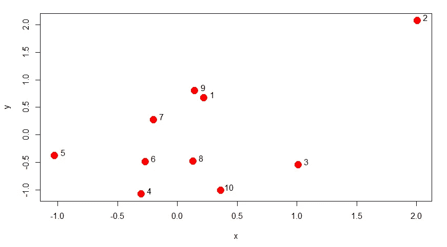
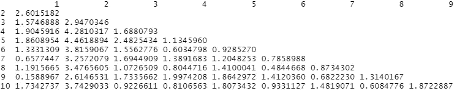
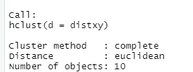
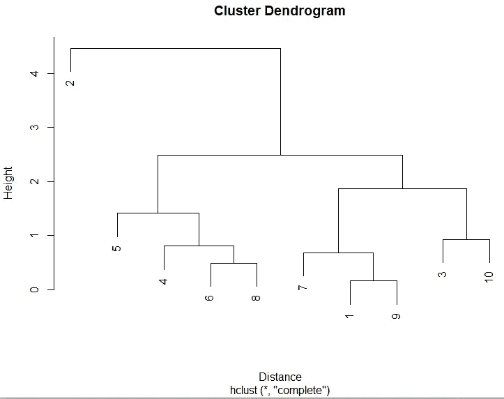
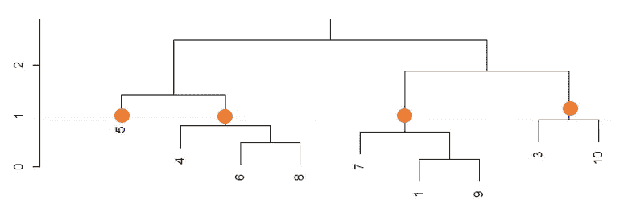

# 数据科学 R 中的层次聚类和树状图

> 原文：<https://towardsdatascience.com/hierarchical-clustering-and-dendrograms-in-r-for-data-science-5ab076fabf76?source=collection_archive---------13----------------------->

## 理解聚类技术、它的应用、优缺点以及用 r。

在执行数据分析的早期阶段，一个重要的方面是获得对多维数据的高级理解，并找到不同变量之间的某种模式——这就是聚类的用武之地。定义层次聚类的一个简单方法是:

***`根据相似的特征将一个庞大的数据集划分成较小的组，这将有助于以一种信息丰富的方式理解数据。`***


图片 via【unsplash.com】上[的](https://unsplash.com/) [@jeremythomasphoto](https://unsplash.com/@jeremythomasphoto)

分层聚类可以分为两种类型:

**分裂(自上而下):**一种聚类技术，其中 N 个节点最初属于单个聚类，然后根据距离度量被分解成更小的聚类，直到在分层结构中达到期望的聚类数量。

**agglomerate(自下而上):**一组 N 个观察值，其中最接近的两个节点被分组在一个单独的簇中，剩下 N-1 个点，然后递归地遵循相同的模式，直到我们得到一个单独的簇，形成最终的树状图，该树状图将所有的簇解决方案包含在一个单独的树中。

这篇博文将关注**凝聚层次聚类**，它的应用以及 r 中的一个实际例子。 **1)** 当我们说我们将两个最近的节点分组在一起时，我们如何定义 close？和 **2)** 用什么合并方法将它们分组？

为了计算距离，可以使用几种方法(欧几里德距离是最常用的):

**欧几里德距离**:一种连续的直线相似性，即毕达哥拉斯定理

**连续相关相似度**

**二元曼哈顿距离:**计算两个向量之间的绝对距离(用于不能用直线定义距离的地方，如城市地图)

让我们从一个小数据集开始，了解 RStudio 中的树状图是如何形成的:

**步骤 1:生成随机数据**

我使用了正态分布来计算数据集的 x 和 y 坐标，并且为我们的理解对数据点进行了编号。

```
Set.seed(12)
x <- rnorm(10, sd = 1)
y <- rnorm(10, sd = 1)plot(x, y, col = "red", pch = 19, cex = 2)
text(x + 0.07, y + 0.06, labels = as.character(1:10))
```



(图片由作者提供)数据图

**第二步:准备好我们的地块来创建一个树状图**

首先，我们将 x 和 y 数据集存储为数据帧的 x 和 y 坐标。接下来，我们缩放坐标以使用平均值 0 和方差 1(标准化)来标准化我们的特征。最后，我们使用 dist()函数来计算数据帧中各行之间的距离。

```
dF <- data.frame(x = x, y = y)
dF <- scale(dF)
distxy <- dist(dF)
```



(图片由作者提供)例如，从点 3 到点 2 的距离是 2.94，而从点 6 到点 4 的距离是 0.603

**第三步:调用 hclust()**

这形成了基于数据集(在这种情况下为 10 个)中对象集合的距离度量(在这种情况下为“欧几里得”)的数据点的分级聚类

```
cluster <- hclust(distxy)
```



作者图片

**第四步:创建一个树状图**

另一种尝试的方法是使用*图(as.dendrogram(cluster))* ，它会产生相同的结果。

```
plot(cluster, ylab = "Height", xlab="Distance", xlim=c(1,10), ylim=c(1,10))
```



作者图片

**第五步:获得您想要的集群数量**

根据手头的问题，你想要从你的系统树图中分离出来的类的数量根据你画线的位置而变化。这里，由于直线在 1 处切割高度，我们得到 4 个集群。

```
abline(h=1.0, col= "blue")
```



作者图片

**应用:**

从动物/植物物种的**分类**到确定病毒变体的**相似性**到营销活动的**客户分类**，树状图有许多用途。例如，在**客户细分**中，将具有相似特征和购买可能性的人分组。一旦你有了分组，你就可以用不同的营销文案对每个分组进行测试，这将有助于你更好地确定未来活动的目标。

**好的和坏的:**

树状图是 **1)** 一种**简单的**方法，通过聚集的方法来聚集数据，并且 **2)** 帮助**更快地理解数据**。不需要有一组预定义的聚类，我们可以在数据集中看到所有可能的关联。

然而，树状图的最大问题是 **1)可扩展性**。拥有包含大量观察值(即 100+或 1000+等)的大型数据集。)根本不会得出结论性的结果。它在计算上是昂贵的，因为一个不良凝聚簇具有 O(n)的时间复杂度。