# 分层聚类解释

> 原文：<https://towardsdatascience.com/hierarchical-clustering-explained-e59b13846da8?source=collection_archive---------3----------------------->

## [实践教程](https://towardsdatascience.com/tagged/hands-on-tutorials)

## 以简化的方式说明层次聚类中使用的分析和过程

照片由[Unsplash 的 Alina Grubnyak 拍摄](https://unsplash.com/photos/ZiQkhI7417A?utm_source=unsplash&utm_medium=referral&utm_content=creditShareLink)

在我们的[上一篇关于高斯混合模型(GMM)](/demystifying-gaussian-mixture-models-and-expectation-maximization-a66575deaea6?source=friends_link&sk=59872fe11490c66ab485ae4b4b20948e) 的文章中，我们探索了一种基于样本在其特征向量空间中的位置来聚类数据点的方法。在 GMM，基于系统中数据点的分布，我们能够以概率的方式分配每个样本属于每个聚类的可能性。

但是，如果我们不仅仅关注数据点在整个系统中的分布密度，而是想定量估计系统中每个样本之间的关系，并研究系统中每个数据点之间的相关程度，会怎么样呢？为了实现这个目标，在本文中，我们将探索另一种聚类方法，它属于一个完全不同的聚类分析家族，称为层次聚类。

## 系统树图

层次聚类的唯一概念在于构建和分析树状图。树状图是一种树状结构，它解释了系统中所有数据点之间的关系。

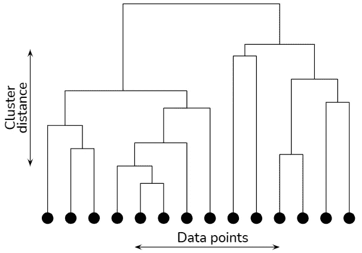

x 轴为数据点，y 轴为聚类距离的树状图(图片由作者提供)

然而，像常规的[系谱树](https://en.wikipedia.org/wiki/Family_tree)一样，树状图不需要从上到下以规则的间隔分支，因为其中的垂直方向(y 轴)以某种度量表示聚类之间的距离。随着您沿着一条路径继续走下去，您会不断地将集群分成越来越小的单元，直到您的粒度级别达到数据样本。在反过来的情况下，当你在向上的方向上移动时，在每一层，你都将较小的集群包含到较大的集群中，直到到达整个系统。因此，层次聚类也被称为聚类的聚类。

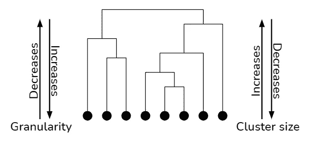

遍历树状图时粒度和聚类大小的影响(图片由作者提供)

## 聚类数

在层次聚类中，在构建树状图时，我们不需要对聚类数做任何假设。一旦构建了树状图，我们就可以水平分割这个结构。在水平切割下形成的所有结果子分支代表系统中最高级别的单个分类，它为每个数据样本定义相关的分类成员。请注意，我们之所以称之为最高级别，是因为即使在您创建了集群之后，您仍然知道后续子集群之间的关系，并且您始终可以选择增加/减少集群的粒度级别。

然而，树状图并不能正确理解放置水平切割后集群的样子。您必须用得到的聚类索引在特征向量空间中单独标记数据点，以便直观地看到聚类的效果。

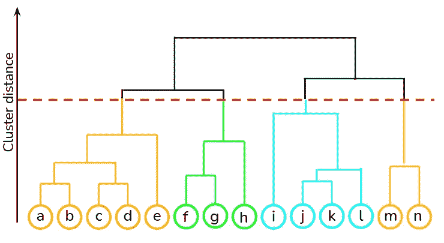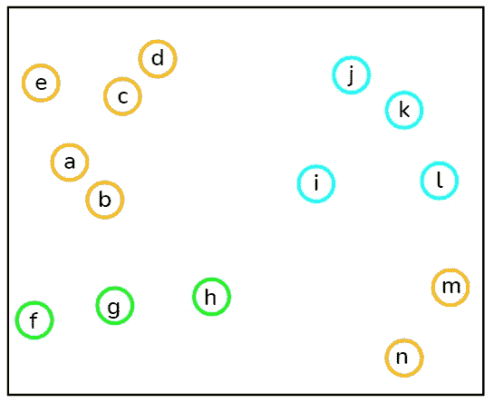

切片树状图，其结果聚类标记在右侧相应的特征向量空间中(图片由作者提供)

下一个要考虑的问题是你应该在哪里放置水平切口。切片的位置可以通过视觉来决定，甚至可以根据您希望聚类之间的最小距离“y”(y 轴上的切割位置)来决定。

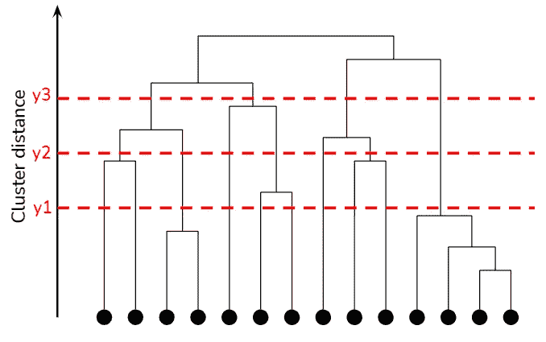

聚类距离为 y1、y2、y3 时的树状图切片可能性(图片由作者提供)

此外，它不是一个约束，你必须在一个恒定的距离切割树状图。基于您试图解决的问题的应用程序和领域知识，树状图可能被不一致地切割。例如，在下面的异常值检测应用程序中，为了分离两个相邻的异常值，水平切割在不同的位置发生变化。

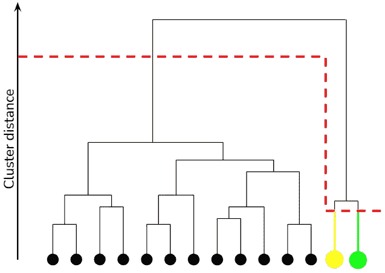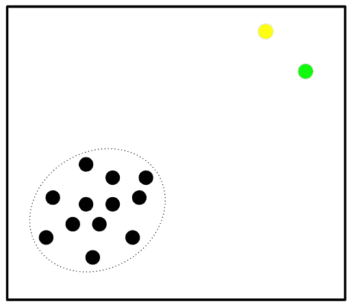

右侧为特征向量空间投影的异常值检测应用程序的可变长度树状图切割(图片由作者提供)

## 树状图的解释

树状图的每一层对其数据成员之间的关系都有微妙的意义。在一个常规的关系图中，你可以解释为最上面是祖父母或第一代，下一层是父母或第二代，最后一层是孩子或第三代。同样，在树状图的每一个分支过程中，所有具有每一层成员资格的数据点都属于某一类。

然而，为了推断这个类实体，必须仔细检查公式化聚类中每个级别的几个单独的样本，并找出结果聚类中的共同特征。此外，这些推断的类在姐妹分支处不需要相似。例如，在级别 2 中，猫被聚集在大耳朵和平静的行为上，但是狗被聚集在相似的大小属性上。

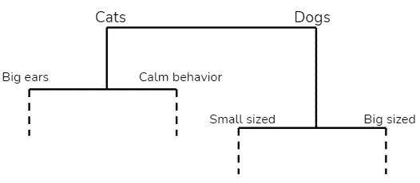

用户在树状图中推断的数据类别(图片由作者提供)

## 树状图的构建

既然我们已经理解了什么是树状图，让我们学习如何构建它。有两种方法来构建它。构建它的一种方法是自下而上，从底层开始，不断合并各个数据点和子聚类，一直到顶层。这就是所谓的凝聚集群。

另一种方法是与自顶向下相反的过程，首先将整个系统视为一个集群，然后继续对其进行子集群，直到获得单个数据样本。这个过程被称为分裂聚类。这些方法中的每一种都有单独的算法来实现其目标。

## a)聚集聚类

用于执行聚集聚类的最简单和容易理解的算法之一是单链接。在该算法中，我们首先将每个数据点视为一个子聚类。我们定义了一个度量来度量每一步中所有子聚类对之间的距离，并在每一步中保持合并最近的两个子聚类。我们重复这个过程，直到系统中只有一个集群。

## **b)分裂聚类**

用于执行分裂聚类的算法之一是递归 k-means。顾名思义，在每个中间聚类上递归地执行 k-means 过程，直到遇到系统中的所有数据样本或一个聚类中您希望拥有的最小数量的数据样本。在该算法的每一步中，您都必须注意接下来要创建多少个集群。

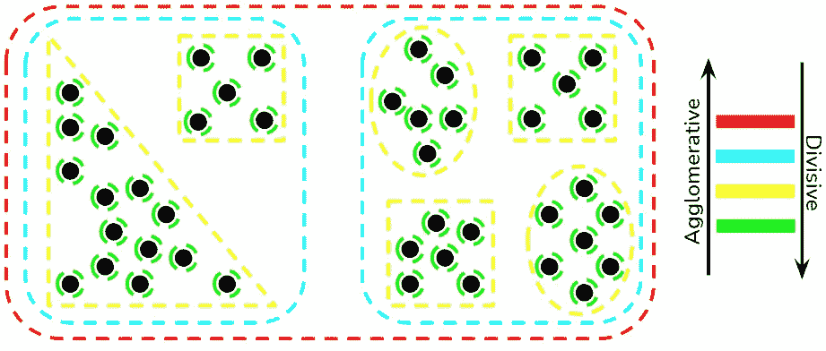

用黑点表示的数据样本形成聚集/分裂聚类(图片由作者提供)

在这两种聚类方法中，当我们绘制树状图时，我们必须注意两个包含类之间的距离，并且距离尺度的变化保持在树状图的 Y 轴上。

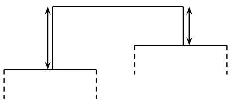

基于聚类距离的树状图中分枝高度的变化(图片由作者提供)

最后，让我们来看看层次集群的优点和缺点。

## 优势

*   使用分层聚类，您可以创建形状更复杂的聚类，这在 GMM 中是不可能的，并且您不需要对聚类的最终形状做任何假设。

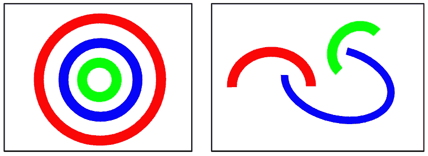

分层聚类形成的复杂结构形状(图片由作者提供)

*   在一次操作中，您可以首先以不同的粒度级别对数据集进行聚类，然后决定您希望在数据集中包含的聚类数量。
*   如果你使用某种类型的[闵可夫斯基距离](https://en.wikipedia.org/wiki/Minkowski_distance)，比如说[欧几里德距离](https://en.wikipedia.org/wiki/Euclidean_distance)来测量你的聚类之间的距离，那么从数学上来说，你的聚类过程会变得非常容易理解。

## 不足之处

*   当您开始分析树状图并做出决策时，您会意识到层次聚类在很大程度上是由试探法驱动的。这导致过程中的大量手动干预，因此，需要应用程序/领域特定的知识来分析结果是否有意义。
*   尽管层次聚类在数学上很容易理解，但它是一种数学上非常繁重的算法。在任何层次聚类算法中，您必须不断计算数据样本/子聚类之间的距离，这增加了所需的计算量。
*   我们将列出的最后一个缺点是最大的不利因素之一，这就是为什么分层聚类通常被 ML 工程师避开。在我们所有的可视化中，我们已经展示了数据样本非常少的树状图。如果数据样本的数量增加(很可能每次都增加)，那么可视化地分析树状图并做出决策就变得不可能了。

在本文中，我们探讨了层次聚类的概念。请在评论区分享你的观点。