# 人工智能代理引擎的分层有限状态机

> 原文：<https://towardsdatascience.com/hierarchical-finite-state-machine-for-ai-acting-engine-9b24efc66f2?source=collection_archive---------13----------------------->

## 学习分层有限状态机(HFSM)的细节，它如何解决有限状态机(FSM)中发现的问题，以及它如何与行为树进行比较。

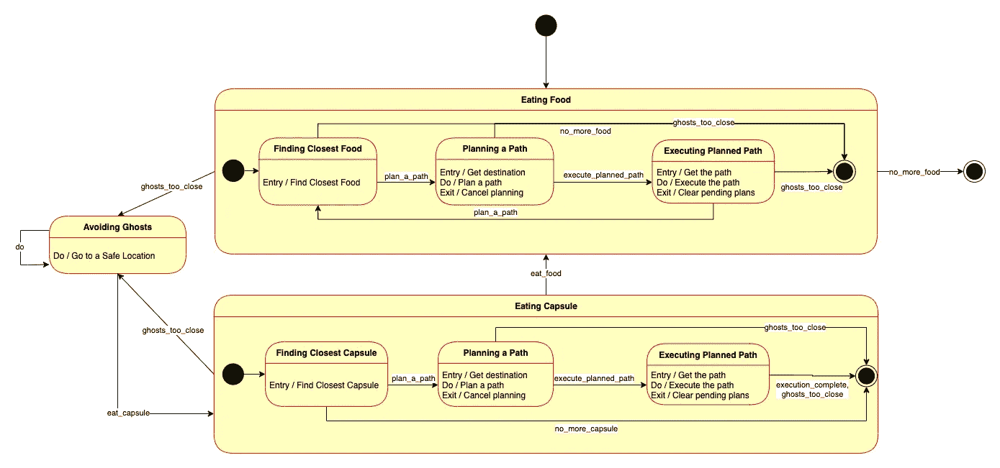

Pacman HFSMs(图片由作者提供)

# 介绍

实现人工智能代理(如机器人或视频游戏中的角色)正变得越来越复杂，因为它们需要复杂的行为来在动态环境中执行任务。今天，有限状态机(FSM)仍然是模拟人工智能主体行为最常用的算法。

尽管分层有限状态机(HFSM)部分解决了它的缺点，但它易于理解和实现的事实使它成为最常用的算法。

这篇文章将研究 FSM，它的优点和缺点，以及为了减轻 FSM 的一些缺点而开发的 HFSM。

> 我们在这里的讨论集中在从自动规划和行动的角度来组织我们的人工智能代理的行为 HFSM。

在下面的部分中，我们将研究什么是 FSM 和 HFSM，并将它们用于 Pacman 代理，并将它们与行为树进行比较。

在以前的文章中，我们已经看到了一个更新的，也可以说是更好的方法，行为树。请参见下面链接中的帖子，了解行为树。

</designing-ai-agents-behaviors-with-behavior-trees-b28aa1c3cf8a>  </behavior-trees-with-automated-planning-capability-ad2a9ff9b28e>  

在整篇文章中，我们将互换使用这些术语:行为、决策和代理引擎。

# 分层有限状态机

## 有限状态机

一个 FSM 或者有时只是简称为简单的状态机是 [*一个数学计算模型*。](https://en.wikipedia.org/wiki/Computational_model)

它(sigma)由一组有限的状态(S)、转换(gamma)、事件(E)和动作(A)组成。

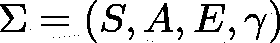

过渡系统(图片由作者提供)

我们用动作来表示代理人做了什么导致了世界的变化，而事件则用于表示代理人控制之外发生的事情，它们可能是其他代理人的动作或世界动态的一部分。

在实践(实现)中，为了简单起见，我们将事件用于事件和动作。

现在让我们看一个简单的门的有限状态机的例子。我们有两个状态**{打开，关闭}** ，两个动作/事件**{打开，关闭}** 和下面的转换。

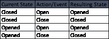

门 FSM 的过渡(图片由作者提供)

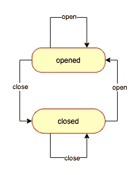

一扇门 FSM(图片由作者提供)

很简单，不是吗？现在让我们看看 FSM 的更多特性。

## 州

有两种状态，**简单状态**和**复合状态**。

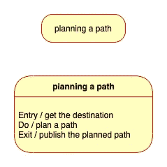

简单状态(图片由作者提供)

它可以简单到仅仅是状态的名称，或者用标签来指定在以下时间执行什么动作:

*   **进入**:进入状态时
*   **做**:该状态下正在进行的动作
*   **退出**:退出一种状态时

复合状态是一个包含子状态的状态，我们将在下面关于 HFSM 的章节中讨论。

除了这两种状态之外，还有特殊的状态，或者也称为伪状态，例如初始状态和退出状态。UML(统一建模语言)定义了一些其他的状态，但是对于我们的实现，我们很少使用它们。

## 过渡

转换表示作为动作/事件被触发的结果，从一种状态到另一种状态的变化。

过渡具有以下属性:

*   触发转换的一组动作/事件
*   发生转换时需要满足的条件
*   转换发生时执行的动作

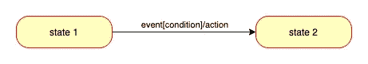

过渡(图片由作者提供)

只有当事件被触发并且条件被满足时，转换才会发生。

> 这里需要注意的一点是，当发生转换时，操作的执行顺序是:状态 1 的退出操作、状态 2 的转换操作和进入操作

现在我们来看看 FSM 的优势:

*   它在软件工程中被广泛使用
*   它易于理解和实现

然而，在这个例子中，我们只有两种状态。在实践中，复杂的系统，如人工智能代理引擎，将有更多的状态，这将导致非常复杂的有限状态机，难以维护，容易出现人为错误。下面是有限状态机的缺点:

*   每次我们想要对 FSM 进行更改，比如添加或删除状态，我们都需要重新评估所有相关的转换。这使得维护和扩展变得困难，而维护和扩展是软件工程中的两件重要事情
*   模块化和可重用性问题，很难为其他 FSM 重用一些状态，因为它们可能依赖于一些内部变量

## 分层有限状态机

HFSM 通过改进以下内容解决了我们在 FSM 中看到的问题:

*   模块化和可重用性
*   层级(顾名思义)结构

HFSM 引入了以下概念:

*   父状态机:一个状态所属的状态机
*   子状态机:一个状态拥有的状态机，当进入该状态时启动，当退出该状态时停止

关于为什么等级制度是必要的一点背景知识。这是因为可以说，我们在生活中所做的几乎所有事情(我们的行动)都是有层次的，它们从一些抽象的东西开始，可以被分解成我们可以执行的更具体的行动。因此，对我们来说更直观的是将一些本质上接近的状态分组到更高级别的状态中，并使用多级 FSM。转换可以发生在 FSM 的所有级别。

AI 智能体的决策组件也是如此。在*“行动者对自动化计划和行动的看法:一份立场文件”*，**马利克、达纳和保罗**认为，不管代理的内部架构如何，它都会分层次地查看、准备和执行其行动。

这正是 HFSM 为我们提供的解决我们在 FSM 中发现的问题的方法。

> HFSM 让 FSM 对我们来说更直观，更容易理解。

现在让我们看一个例子来理解所解释的内容。

让我们想象一下，我们有一个货运机器人，它配备了一个可以从一个房间移动到另一个房间的手臂，可以携带一块积木。它能够通过抓住石块并将其放在身上来装载石块。它的工作是去积木所在的房间，装上积木，在这个过程中通过躲避障碍物回到原来的位置。FSM 将如下所示:

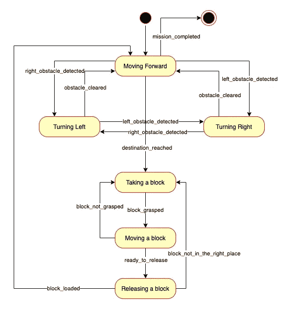

货运机器人 FSM(图片由作者提供)

可能会有更多的转换和状态，但是这个图对于我们的目的来说已经足够了。如果我们看一下这个 FSM，它对于这个简单的任务来说是不必要的复杂。我们可以看到有两个主要任务:

*   正在向目的地移动
*   以及，加载块

使用这种高级 FSM 将更容易理解:

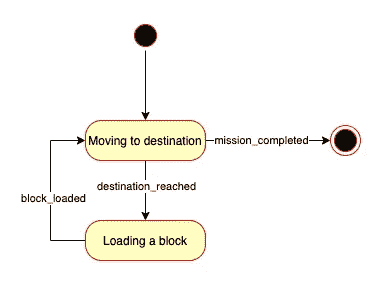

高级 FSM(图片由作者提供)

HFSM 的图表是这样的:

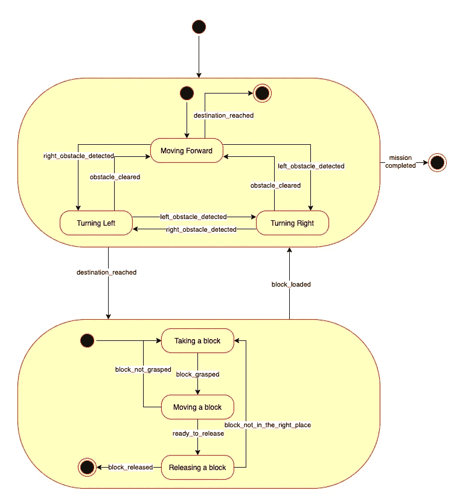

货运机器人 HFSM(图片由作者提供)

我们可以在多个层次上看到整个系统，在最高层次上它只包含两个状态，在每个状态下它有三个子状态。

现在我们可以看到为什么它是分层的、可重用的和模块化的。子状态机是可以作为软件模块实现的独立状态机。这意味着我们可以很容易地在其他父状态机中使用它，使其模块化和可重用。

我们已经有了足够的概念，现在我们可以在我们的 Pacman 代理上实现它，看看它的表现如何。

# “吃豆人”用 HFSM 作为代理引擎

为了完成它的任务，我们的 Pacman 必须以最有效的方式吃掉世界上的所有食物，在这个过程中避免鬼魂，并吃胶囊让鬼魂害怕，这样它就不需要在移动到食物位置时担心它们。

我们设计 FSM 具有以下状态:

*   寻找最近的食物
*   规划路径
*   执行计划路径
*   寻找最近的太空舱
*   还有，避开鬼魂

## 有限状态机版本

下图描述了 FSM 版本:

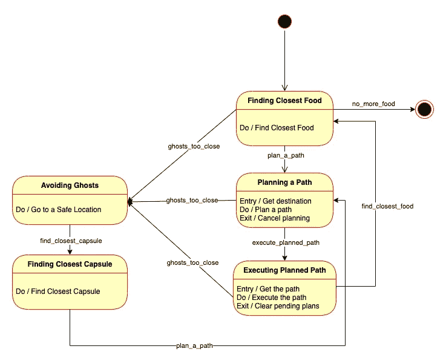

Pacman 简单有限状态机(图片由作者提供)

你可能注意到的一件事是我们在美国使用标签。在每种状态下，只要它停留在该状态，您就可以很容易地看到当它进入、退出和执行时采取了什么动作。

一个例子是在**规划一条路径**状态下:

*   进入此状态将执行“获取目的地”操作
*   在这种状态下，路径规划是异步执行的
*   当路径规划正在进行时离开这种状态将导致它被取消，例如当幽灵在规划时离 Pacman 太近时(因为当它在规划/思考时，幽灵仍在移动)

使用这种 FSM，Pacman 可以很好地完成它的任务，正如你在下面的视频中看到的。

吃豆人与 FSM(视频由作者提供)

## HFSM 版本

如果我们使用正确的层次结构，在最高级别我们有三个状态:

*   吃食物
*   东方胶囊
*   躲避鬼魂

这是吃豆人的三个高级状态。只要它在执行任务，它就应该处于这些状态之一。

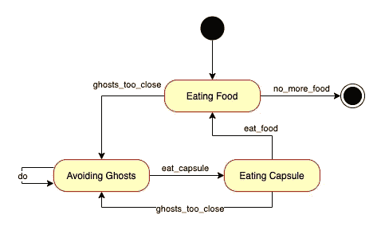

Pacman 高级 FSM(图片由作者提供)

吃食物和吃胶囊这两种状态可以分解成以下状态机。

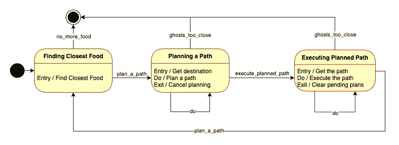

吃食物 FSM(图片由作者提供)

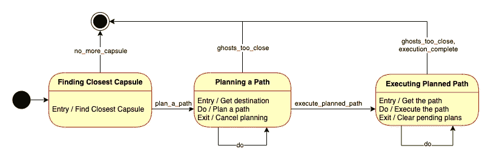

食用胶囊 FSM(图片由作者提供)

它们非常相似，都有**规划路径**和**执行规划路径**的状态。区别在于它找到食物或胶囊的最近位置的状态。

另一个不同点是，在执行计划的路径进食后，**进食 FSM** 将重复该过程，而**进食胶囊 FSM** 将退出。

将这三个 FSM 组合起来，得到下面的 HFSM。

吃豆人 HFSM(图片由作者提供)

我们可以看到，与简单的 FSM 实现相比，这更容易理解，更模块化，更可重用。Pacman 的行为或多或少与 FSM 版本相同，可以在下面的视频中看到。

吃豆人和 HFSM(视频由作者提供)

# 结论

我们现在已经研究了什么是有限状态机，因为它容易理解，所以被广泛使用。然而，它也有一些缺点:

*   由于许多过渡必须手动设计，因此难以维护和扩展
*   它在模块化和可重用性方面也有问题

分层有限状态机通过引入父状态机和子状态机的概念解决了模块化和可重用性的问题。它还通过使用组件的层次结构帮助我们理解一个更复杂的系统。

## 与行为树相比

然而，即使有了 HFSM，难以维护和扩展的问题依然存在。正如我们在以前的帖子中讨论的，行为树已经改进了这一点。

的确，我们可以用 HFSM 和行为树来实现一个人工智能代理的决策/执行引擎，但是我认为使用行为树是一个更好的方法。我们可以在下面看到 HFSM 和英国电信为吃豆人制作的图表，以作比较。

Pacman HFSMs(图片由作者提供)

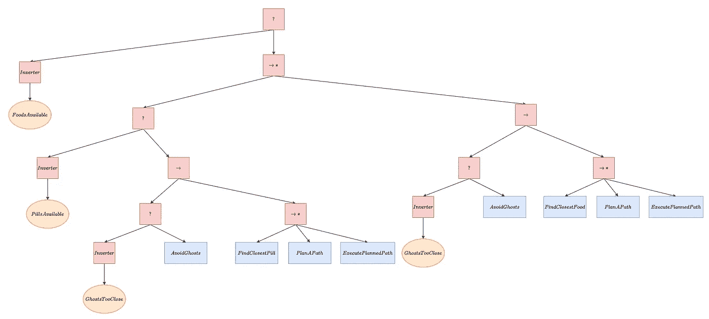

Pacman BTs(图片由作者提供)

我希望这篇文章能让你很好地理解 FSM，HFSM，以及它如何与 BT 相比较，以便你能为你的 AI 代理选择正确的决策或代理引擎。

## Python 中的 HFSM 开源

我试图在 Python 中寻找一个好的 HFSM 实现，但找不到，所以我实现了它。我会在我的 Github 上分享，并在下一篇帖子中更新！