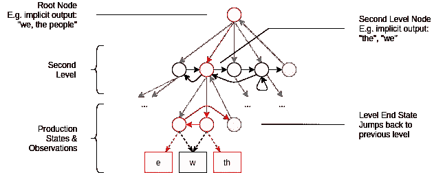
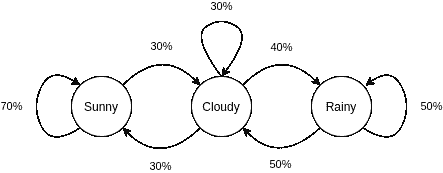
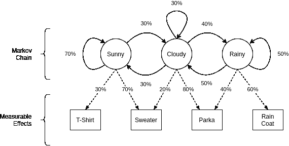

# 分层隐马尔可夫模型

> 原文：<https://towardsdatascience.com/hierarchical-hidden-markov-models-a9e0552e70c1?source=collection_archive---------4----------------------->

## [思想和理论](https://towardsdatascience.com/tagged/thoughts-and-theory)

## 雷·库兹韦尔认为这是大脑皮层结构的近似

在[最近的一篇帖子](https://www.kurzweilai.net/dialogue-a-conversation-on-creating-a-mind)中，著名的未来学家雷·库兹韦尔提到——在他看来——[新皮层](https://en.wikipedia.org/wiki/Neocortex)中的大脑结构在技术上类似于层级隐马尔可夫模型(HHMM)。他还在 2012 年出版的《如何创造思维》一书中详细阐述了这一观点[1]。

然而不幸的是，这篇文章和这本书都没有足够的信息来详细理解这个机器学习模型，更不用说实现它了。对于任何对意识机器的实现感兴趣的爱好人工智能科学家来说，这是一个遗憾！

因此，让我们利用这篇文章来尝试和理解层次隐马尔可夫模型。我们将对它所构建的大多数概念进行简要的、高层次的介绍，并为实际的实现做好准备(由于篇幅原因，将在另一篇文章中介绍)。

分层隐马尔可夫模型顾名思义是基于隐马尔可夫模型，而隐马尔可夫模型又是基于马尔可夫链，都是随机过程。我们将从最后一个概念开始，并向后追溯。

注意:这是一个关于 HHMM 话题的简单介绍。我们将坚持使用例子和简单的概念，并将数学推迟到后续文章中实现它的时候。

# 随机过程，简要介绍

如前所述，本文中我们要研究的所有东西都是随机过程。我相信您可能已经知道那是什么，但是因为它是整篇文章的基础，所以让我们再简单地看一下:

[维基百科将随机过程](https://en.wikipedia.org/wiki/Stochastic_process)非正式地定义为:

> 随机变量序列

为了理解这意味着什么，想象一个特定类型的随机事件，如天气或掷硬币，按顺序测量或观察，例如每天一次，或连续 10 次。当试图用数学方法描述它时，我们可以利用一个随机过程。我们会简化现实世界的现象，并试图计算未来状态的概率分布。

与[统计模型](https://en.wikipedia.org/wiki/Statistical_model)不同的是，这将包括迭代的元素:先前的状态影响当前的观察。今天下雨了吗？那么，根据经验，很有可能明天至少会是多云天气。

另一方面，我觉得这也更类似于我们在心理上构建模型的方式:我们倾向于考虑“如果-x-发生-现在-然后-y-可能发生-以后”类型的模型，而不是考虑输入与输出变量(线性或其他)的平滑函数关系。

例如，代替思考

> 如果我观察到温度为 ABC，气压为 XYZ，以 UVW 的速率变化，那么在 3 小时 20 分钟内(或多或少 10 分钟)，我可以预计降雨强度为 DEF。

我们可能宁愿认为

> 整天都是阴天，而且似乎越来越暗，越来越冷，所以很有可能很快就会下雨。

这不仅仅是因为我们没有坐下来用温度计、气压计和秒表来预测天气，还因为很难在头脑中建立和使用这种功能模型。我假设这与卡尼曼在“思考，快与慢”[2]中的观点有关，我从中得出结论，我们通常更喜欢使用快速的模式匹配思维，而不是缓慢的分析思维——但我无法为此提供任何科学证据。

无论如何，随机过程的理论比这些例子所暗示的要丰富得多。然而，为了理解 HHMMs，我们现在不需要所有的细节。

基于这些想法，现在理解马尔可夫链几乎是微不足道的——我保证！所以事不宜迟，现在让我们进入下一个话题。

# 马尔可夫模型和链

以俄罗斯数学家[安德烈·马尔科夫](https://en.wikipedia.org/wiki/Andrey_Markov)命名的[马尔科夫模型](https://en.wikipedia.org/wiki/Markov_model)是一个随机模型(或过程),它具有一个特定的属性——可能有人已经猜到了，叫做马尔科夫属性——要求过程的未来状态只取决于当前状态。

让我们回到天气上，简单地用三种状态(我们每天早上检查的状态)建模:“晴天”、“多云”和“雨天”。现在，通过写下我们在一段时间内的观察结果，并计算“晴”之后出现“多云”的频率，我们可以创建一个与此类似的模型:

**一个简单天气模型的状态转移概率图。请注意，从一个状态到另一个状态的所有转换仅取决于当前状态，它们的概率总和为 100%。(图文由作者提供)**

这样，我们定义了一个简单的[马尔可夫链](https://en.wikipedia.org/wiki/Markov_chain)。也就是说，我们包括了建模系统的简化状态及其转移概率。这也清楚地显示了马尔可夫性质:概率仅依赖于当前状态。

让我们再坚持这个概念一会儿，看看另一个例子:简化的文本生成。

我们可以将文本视为单词(和标点符号)的序列，其中某些单词的组合比其他组合更有可能出现，即一些单词比其他单词更有可能一个接一个出现。在某种程度上，这可以通过简单地读取样本文本并计算单词到单词的出现次数来用马尔可夫链来表示。(这里:赫尔曼·梅尔维尔的《莫比·迪克》的开头)

> ***叫我*** 以实玛利。几年前——不要管具体是多久——我的钱包里很少或没有钱，在岸上也没有什么特别感兴趣的东西，我想我应该航行一段时间，看看世界上的水上部分。

*   ***调用*** → me (100%)
*   ***me***→Ishmael(50%)
*   ***me*** → on (50%)
*   …

诸如此类。这也可以扩展到几个单词，即在两个或多个单词组合后找到下一个单词(也分别称为 2-grams 或 [n-grams](https://en.wikipedia.org/wiki/N-gram) )。

这不仅允许我们建立一个研究文本的随机模型，我们还可以用它来生成更多类似的文本:从一个随机的起始单词开始，然后根据记录的概率选择下一个单词。

# 隐马尔可夫模型

为了建立前面讨论的马尔可夫链，我们需要能够直接观察状态的出现。继续上一个例子:为了创建词到词的概率模型，你需要读入大量的文本，即大量的词到词对。

但是世界上的很多事情都是无法直接观察到的，我们只能通过观察这些‘隐藏’状态有哪些可测量的影响来估计正在发生的事情。

回到天气的例子，你可以想象站在室内透过窗户向外看，试图判断天气是否冷到可以穿外套、戴帽子和手套，或者你是否可以只穿毛衣就出门。如果你没有温度计，感觉不到温度，你仍然可以通过观察它的影响来推理:例如，其他人穿什么或者外面是否有雪和霜。

对这些不可观察的过程及其影响进行建模就是[隐马尔可夫模型](https://en.wikipedia.org/wiki/Hidden_Markov_model)的目的。直观地说，根据我们之前所学的，它们的核心是一个马尔可夫链，包含状态和概率转移。现在的问题在于，系统的这些状态是不可观察或测量的，这使得我们没有简单的方法来直接计算转移概率。然而，除此之外，我们还可以测量国家造成的其他影响。这些影响本身是随机的。

让我们再来看看天气以及它可能对世界产生的潜在影响:

**具有影响及其概率的‘隐藏’马尔可夫链的状态转移图。请注意，一个状态可能具有一个以上的可观测效应，这导致了状态不能从观测值直接推断的问题。(图文由作者提供)**

在这个例子中，我们同样有三种潜在的天气状态(有点简单，但是很好)。然而，这一次我们也展示了它们对世界的可观察到的影响(在这种情况下，人们穿着什么)以及看到它们的概率。

注意，马尔可夫链在概念上也可以建模为 hmm。如果每种状态只能确切地产生一个观察结果(100%的时间)，那么我们又回到了更简单的马尔可夫链模型。

## 典型应用

像这样的模型通常以两种不同的方式用于预测:

*   1.估计某个观察序列的概率。例如:观察穿“毛衣”→“雨衣”→“毛衣”→“雨衣”的可能性有多大？我想这也取决于你是否在英国…
*   2.基于一系列的观察，尝试估计它产生的状态序列。例如，如果你看到“t 恤”→“毛衣”*→“t 恤”，世界的状态很可能是“晴朗”、“晴朗”、“晴朗”。不错！*

*也就是说，如果您已经创建了模型并推断出了它的参数。如果这还没有完成，您将面临另一个挑战:*

*   *3.给定一个模型结构(即状态、转换和效应)和一系列观察序列，尝试找出所有“箭头”最可能的概率。也就是说，训练模型。*

*最后但同样重要的是，一个很少提及的用途是数据创建:*

*   *4.使用现有的训练模型和起始状态(也基于模型参数选择)来迭代模型的状态。根据模型中记录的概率选择下一个状态(和输出)。*

*不言而喻，所有这些问题都已经解决了很多年，公式也是众所周知的。我们将在实现它们时更详细地讨论它们。*

# *分层隐马尔可夫模型*

*到目前为止，我们只看了一些天气状态的非常简单的 HMM。这很简单，但是很清楚地说明了模型的要点。让我们对 Fine 等人在 1998 年的论文[3]中描述的分层隐马尔可夫模型做同样的事情。*

*正如我们已经看到的，hmm 可以理解为状态的有向图，其中每个状态都是可到达的。从某种意义上来说，分级版本更受限制，同时也更复杂。(实际上,[3]的作者还提到，HHMM 可以表示为全连接的 HMM，其缺点是失去了层次结构的语义，正如我们将看到的)。*

*那么什么是层次隐马尔可夫模型呢？简单地说，顾名思义，分层 HMM 为隐藏状态添加了一个树状层次结构。*

*它从代表顶层(或第一层)的根节点开始，该层具有到第二层状态的每个状态的可能状态转换。第二层本身的结构类似于马尔可夫链，即状态之间有转换。然而，该层中的每个状态都可以是另一个 HHMM 的根节点。*

*这样循环下去，直到我们到达叶节点，称为生产状态，其行为类似于“正常”HMM 状态，因为它们输出单个观察或符号。它们也是相互关联的。*

*每一层都有最后一个特殊的“结束”状态，当到达该状态时，会自动(100%可能)跳回到上一层的父状态。*

*就顺序而言，状态转换首先深入。然后，当信号通过较低级别的结束状态返回时，同一级别的其他状态被激活。使用这种结构，非生产状态没有直接分配的输出。然而，它们的输出隐含地由较低级别的生产状态的输出序列来描述。*

*为了说明这一点，可以把生产节点想象成文本中的字母或字符。然后，更高级别的节点可以逐步表示音节、单词、单词组合、句子等等。这就是这里的层次结构的本质:它用于表示简单概念的抽象。*

*前面提到的论文使用该方法在英语文本语料库上训练该模型，该模型很好地展示了该思想。让我们用这个例子来描绘这样一个网络的一部分可能是什么样子:*

**

*简化分层隐马尔可夫模型中的状态转移和示例路径。这里，我们展示了从字母或字母组合到短词再到句子的各个部分的文本生成。概率不包括在内，以提高易读性。(图文由作者提供)*

*在上面的例子中，我们跟踪了一个生产路径，从根节点通过第二层向下到生产状态，生产状态将输出字母(或字母组合)。*

*每个向下的灰色箭头都是一个“垂直”过渡，如果可能的话，将在考虑任何黑色“水平”箭头之前进行。这意味着一个状态的灰色箭头和黑色箭头的概率总和必须分别为 1。*

*用红色标记的部分路径将产生单词“The ”,作为第二级激活状态的隐含输出。然后，这种产生可以继续通过第二层的其它状态，直到它最终跳回到根节点，并且完成字符的发射。*

## *与人类大脑的关系*

*根据 Kurzweil 的说法，这些模式匹配器和/或输出生产者的层次结构是我们如何在概念层面上描绘人类新大脑皮层的结构[1]。这是我们大脑中承担复杂任务的部分，如语言理解和生产。*

*在文本生成模型中，层级越高，输出就越复杂。最低级别的生产状态将生成一些单个字母，而在根节点级别，我们可以期望看到完整的句子。*

*Kurzweil 提到在新大脑皮层中也有类似的层级。他们处理语言处理，从单词的一部分到最高层的幽默和讽刺的概念。这种相似性是他建议 HHMMs 作为有意识思维建模的可能基础的原因。*

## *使用*

*一般来说，HHMMs 和 hmm 都用于类似的领域:顺序数据不能直接记录，但其他数据可以直接记录的地方。那么，这个模型的目的就是从记录的任何其他效应中推断出实际的数据。*

*一个非常著名的例子是语音识别和语音合成(实际上从 20 世纪 70 年代开始)。在那里，使用傅立叶变换分析短的声音序列，并将其“翻译”成最可能的音素，并在更高的层次上翻译成已知词汇表中的单词。*

*从那时起，这些算法不断改进，现在我们可以在移动设备上使用 Siri 或 Alexa 等语音助手。*

*对于更多的灵感，[维基百科有一个更长的应用列表](https://en.wikipedia.org/wiki/Hidden_Markov_model#Applications)。*

## *限制*

***拓扑。**正如 Kurzweil 在文章中提到的，到目前为止，我们希望提前知道网络的拓扑结构是什么样的(即有多少内部状态和级别，以及状态是如何连接的)。有了这些信息，我们就可以使用上述算法来训练模型，并从中提取有用的信息。*

*但是这种网络拓扑的前期知识很少存在。例如，我们必须如何构建网络才能正确地生成一定长度的英语句子？即使没有分配概率，这也是一项极其困难的任务。*

*文献[3]作者的实验表明，层级结构的微小变化会对网络的语言分析能力的质量产生相当大的影响。*

*一种用于语音识别的解决方案是，开始创建只能识别单个单词的小部分网络，并将这些网络聚合成一个更大的模型。*

*Kurzweil 还提到了一种基于遗传算法的改进网络拓扑的方法，我认为这只是许多可应用的优化技术之一。*

***状态空间。**在我们看到的例子中，状态空间以及可能输出的空间都是离散且有限的。这意味着我们在前面提到的网络拓扑中有一组状态和观察值。*

*我不确定 HHMMs 是否可以推广到更广的范围，但是 hmm 在一定程度上显然可以。例如，可以假设一个连续的状态空间(想想:实数，例如在多维向量中指定一个状态)。*

*这似乎与 Kurzweils 的模拟大脑部分的想法无关，所以我们不会详细讨论这部分。*

***转移和输出概率。**这些模型的另一个限制来自马尔可夫属性本身:由于概率是静态的，并且只取决于当前状态，因此没有办法将依赖于时间的上下文信息包括到模型输出中。*

*这对于使用 HHMM 或 HMM 的文本生成来说将是特别有趣的，因为它将使我们能够学会对外部刺激做出“响应”。*

*例如，想象一下，您有一个巨大的 HHMM，可以生成关于各种主题的复杂文本。如果你想在一个对话界面中使用这个模型(比如说一个聊天机器人)，能够学习*根据用户的要求用什么*来响应将会很棒。有趣的是，这已经在所谓的输入/输出 hmm[4]中进行了探索。*

# *后续步骤*

*如前所述，我将根据[3]中的研究，用一篇更具技术性的文章来阐述 HHMM 的实现，从而继续这个主题。我的希望是复制(在一篇教程风格的文章中)他们在自然语言分析上的一些结果。在最好的情况下，我们可以看到如何将样本文本映射到一些好的层次级相关抽象上。*

*与此相关的所有完成的源文件、笔记本和代码也可以在 [Github](https://github.com/ephe-meral/hhmm) 上获得。请留下反馈并提出改进建议。*

*如果你想支持这篇和类似精彩文章的创作，你可以[注册一个中级会员](https://medium.com/@johannaappel/membership)和/或[关注我的账户](https://medium.com/subscribe/@johannaappel)。*

*[1] R. Kurzweil，“如何创造思维:揭示人类思维的秘密”(2012)，企鹅出版社*

*[2] D .卡尼曼，《思考，快与慢》(2011)，麦克米伦出版社*

*[3] S. Fine、Y. Singer 和 N. Tishby，[“分层隐马尔可夫模型:分析和应用”](https://link.springer.com/content/pdf/10.1023/A:1007469218079.pdf) (1998)，机器学习 32.1(第 41-62 页)*

*[4] Y. Bengio 和 P. Frasconi，[“输入输出 HMM 架构”](http://www.iro.umontreal.ca/~lisa/bib/pub_subject/finance/pointeurs/iohmms.pdf) (1995)，神经信息处理系统的进展(第 427-434 页)*