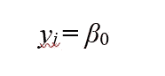

# 分层线性建模:逐步指南

> 原文：<https://towardsdatascience.com/hierarchical-linear-modeling-a-step-by-step-guide-424b486ac6a3?source=collection_archive---------1----------------------->

## [入门](https://towardsdatascience.com/tagged/getting-started)

## 利用 R 进行混合模型分析

在大多数情况下，数据往往是聚集的。分级线性建模(HLM)使您能够探索和理解您的数据，并降低 I 型错误率。本教程用 R 来演示 HLM 在社会科学研究中的基本步骤。


鸣谢:【https://pixabay.com/users/geralt-9301/】T2 来自 Pixabay

在开始分析之前，让我们先简要谈谈什么是 HLM。

HLM(又名多层建模)分析以有组织的模式聚集的数据，如各州的大学、科技公司的非白人男性和医院的诊所。HLM 是一个普通的最小二乘法(OLS ),要求满足所有假设(查看[我的教程](https://medium.com/swlh/data-screening-32b7896af0a)OLS 假设和数据筛选),除了误差假设的独立性。这一假设很可能被违背，因为 HLM 允许跨集群的数据相互关联。

HLM 的预测因子可以分为随机效应和固定效应。随机效应指的是不是研究的主要焦点，但可能影响因变量，因此需要包括在模型中的变量。另一方面，固定效应是这项研究的关键预测因素。例如，一位心理学家想要预测童年的不利创伤对一个人成年后发展为边缘型人格障碍(BPD)的趋势的影响。参与者来自集体主义和个人主义文化，这两种文化可能对父母的行为有不同的定义。个人主义文化中的人，如美国或英国的人，可能会认为父母打屁股是虐待，而集体主义者，如亚洲人和非洲人，可能会认为打屁股是加强孩子纪律的一种方式。因此，来自不同文化的参与者可能在童年时期受到来自其父母的相同行为的不同影响，并且可能在不同的水平上发展出 BPD 症状。根据这个例子，童年创伤被视为基于人格文学和研究者作为心理学家的兴趣的固定效应。文化可以被视为随机效应，因为这一变量可能会影响边缘型人格的发展，但不是研究的主要焦点。值得注意的是，随机效应应该是分类的，而固定效应可以是虚拟变量(具有两个水平的分类变量)或连续变量。

你们中的一些人可能会想，*为什么我们不使用一个单一水平的回归模型来控制潜在的随机效应(例如，根据上述例子的文化)？*这样做可能会引入错误的标准误差估计，因为残差(即同一组中的观察值)往往是相关的。例如，来自相同文化的人可能以相同的方式看待一种行为。单水平模型的误差项代表跨水平的聚类数据误差，限制了我们在控制参与者嵌套的文化后，了解关键预测因子(如童年创伤)对一个人发展 BPD 倾向的影响。

还在迷茫？让我们看看下面的等式:

*易***=***β*0+*β1xi*+*ei***一元回归模型— (1)**

*yij*=*β*0+***uj***+****eij***一个方差分量模型——(2)*****

****yij*=*β*0+*β1xij***+***uj***+***eij***混合模型(带随机截距)——(3)*****

****i* 是观察的数量(例如，参与者#1、#2、#3..).***

****j* 是每个观察所属的文化的范畴(即 j = 1 是集体主义，j = 0 是个人主义)。***

****β1* 是不良童年创伤***

****y* 是 BPD 倾向。***

****u* 是无法用文化解释的 y 方差，控制其他预测因子。***

***e 是 y 的方差，它不能通过控制其他预测因子的童年创伤来解释。***

***根据等式 1，误差项( *ei* )表示未被关键独立变量(例如，童年创伤)解释的结果方差。等式 2 显示了两个误差项，包括随机效应的误差项( *uj* )(即文化)和嵌套在随机效应中的固定效应的误差项( *eij* )(不同文化中的童年创伤评分)。等式 3 表示整合了等式 1 和等式 2 的混合模型，相对于等式 1 中的单级回归模型，说明了更精确的误差估计。***

***现在你已经有了一些 HLM 的基础，让我们在分析之前看看你需要什么。***

*   *****长格式数据:**数据通常以宽格式组织(即每列代表一个变量，每行描述一个观察)。您需要将数据转换为长格式(例如，案例的数据分布在各行中。一列描述变量类型，另一列包含这些变量的值)。查看[这篇教程](http://Wide%20data%20has%20a%20column%20for%20each%20variable.%20Whereas%20long%20format%20data%20has%20a%20column%20for%20possible%20variable%20types%20&%20a%20column%20for%20the%20values%20of%20those%20variables.)，了解如何将数据从宽格式转换为长格式。***
*   ***用于线性和非线性模型测试的 **R 包** : [nlme](https://cran.r-project.org/web/packages/nlme/nlme.pdf)***

```
*install.packages("nlme")
library(nlme)*
```

# ***个案研究***

***本教程使用了一个虚构的数据集。我们将研究一个人的自恋是否能预测他们对亲密关系的满意度，假设自恋症状(例如，自恋、说谎、缺乏同理心)会随着不同生活事件发生的时间而变化。因此，固定效应是自恋型人格障碍的症状(NPD)。结果变量是一个人的亲密关系满意度(满意度)。随机效应是时间，三个等级编码为 1(婚前)，2(婚后 1 年)，3(婚后 5 年)。***

# ***分析前步骤***

*****第一步**:导入数据***

```
*#Set working directory
setwd("insert your file location:")
#import data
library(foreign)
data<-read.spss("HLM.sav(your data name)," use.value.label = TRUE, to.data.frame = TRUE)*
```

*****第二步**:数据清理***

***本教程假设您的数据已经被清理。如果您想了解更多关于清理数据的信息，请查看[我的数据准备教程](https://medium.com/swlh/data-screening-32b7896af0a)。对于我当前的数据集，所有的假设，除了误差的独立性，都符合 HLM 要求。***

# ***HLM 分析步骤***

*****步骤 1** :仅拦截型。***

***仅截距模型是 HLM 的最简单形式，建议作为添加任何其他预测项之前的第一步。这种类型的模型测试使我们能够了解在不考虑其他预测因素的情况下，结果变量得分(即本教程中的关系满意度)是否明显不同于零(即参与者表示了特定的关系满意度)。对于 OLS 模型，截距也称为常数，在仅截距模型中，截距是结果变量的平均值，如下式所示:***

******

****作者图片****

***我们将使用 [gls](https://www.rdocumentation.org/packages/nlme/versions/3.1-151/topics/gls) 函数(即广义最小二乘法)来拟合线性模型。gls 函数使误差相互关联并具有不同种类的方差，这很可能是聚类数据的情况。我将我的“仅拦截”模型标识为“模型 1”***

```
*model1=gls(Satisfaction~1, data = data, method = "ML," na.action = "na.omit")
summary(model1)*
```

***结果如下:***

```
*Generalized least squares fit by maximum likelihood
  Model: Satisfaction ~ 1 
  Data: data 
      AIC      BIC    logLik
  6543.89 6555.678 -3269.945Coefficients:
               Value  Std.Error t-value p-value
(Intercept) 5.087982 0.01582679 321.479       0Standardized residuals:
       Min         Q1        Med         Q3        Max 
-4.9894040 -0.5142181  0.0960345  0.7644064  1.1131222Residual standard error: 0.8193328 
Degrees of freedom: 2681 total; 2680 residual*
```

***p 值显著，表明参与者的关系满意度与零显著不同。***

*****第二步:**随机截距模型。***

***这一步添加了我的随机效应(即时间)，以查看相对于之前的仅截距模型(模型 1)，预测值是否增加了我的因变量中解释的显著方差。***

***从统计学的角度来说，如果你还记得前面的等式，单截距模型整体回归的截距仍然是 *β* 0。但对于每组随机效应(即婚后的每个时间点)，截距为 *β* 0+ *uj* (当 *uj* 表示因变量的误差未被时间解释时)。***

***为了测试随机截距模型，我将使用 [lme](https://www.rdocumentation.org/packages/nlme/versions/3.1-151/topics/lme) 函数作为上述 gls 函数之外的替代方法。像 gls 一样，lme 函数用于测试线性混合效应模型，允许嵌套随机效应和组内误差之间的相关性。lme 和 gls 都支持最大似然应用。***

***在将时间作为随机效应包括在内之前，请确保变量是明确的:***

```
*is.factor(data$Time)
[1] FALSE*
```

***输出显示“false”，因此我需要将时间转换为分类变量。***

```
*data$Time = as.factor(data$Time)#Check again whether Time is categoricalis.factor(data$Time)[1] TRUE*
```

***模拟随机截距；***

```
*model2 = lme(Satisfaction~1, data = data, method = “ML”, na.action = “na.omit”, random = ~1|Time)summary(model2)*
```

***结果是:***

```
*Linear mixed-effects model fit by maximum likelihood
 Data: data 
       AIC      BIC    logLik
  6533.549 6551.231 -3263.775Random effects:
 Formula: ~1 | Time
        (Intercept)  Residual
StdDev:  0.06596515 0.8165719Fixed effects: Satisfaction ~ 1 
               Value  Std.Error   DF  t-value p-value
(Intercept) 5.092783 0.04124424 2678 123.4786       0Standardized Within-Group Residuals:
       Min         Q1        Med         Q3        Max 
-5.0747125 -0.4169725  0.1953434  0.6985522  1.2158700Number of Observations: 2681
Number of Groups: 3*
```

***现在，你可能想知道我如何知道我的随机效应(即时间)是否显著。有几种方式来看待这个问题。***

1.  ***比较仅截距模型(模型 1)的 AIC 和随机截距模型(模型 2)的 AIC。 **AIC = 2k — 2(对数似然)，**当 k 为模型中包括截距在内的变量个数时)，对数似然为模型拟合测度，可从统计输出中获得。从 [Satisticshowto 查看这些有用的信息。](https://www.statisticshowto.com/akaikes-information-criterion/)***

***从我的模型 1 和模型 2 的输出，你会看到模型 1 的 AIC = 6543.89，模型 2 的 AIC = 6533.549。通常，两个 **AIC** 值相差超过 2 表示模型拟合有显著差异。AIC 值越低，模型越适合。你可以看到在模型 2 中把时间作为随机效应包括进来改进了我的模型 1 (6543.89 -6533.549 > 2)。***

***2.除了 AIC，我们还可以使用 [ANOVA](http://The%20gls%20function%20is%20used%20to%20fit%20the%20extended%20linear%20model,%20using%20either%20maximum%20likelihood,%20or%20restricted%20maximum%20likelihood.%20It%20can%20be%20veiwed%20as%20an%20lme%20function%20without%20the%20argument%20random.) 函数来比较仅截距模型和随机截距。***

```
*anova(model1, model2)*
```

***结果如下:***

```
*Model df      AIC      BIC    logLik   Test  L.Ratio p-value
model1     1  2 6543.890 6555.678 -3269.945                        
model2     2  3 6533.549 6551.231 -3263.775 1 vs 2 12.34079   4e-04*
```

***p 值 4e-04 等于 4 x 10^-4，表明结果非常显著。因此，添加随机截距显著改进了仅截距模型。***

***除了 nlme 包中的 gls 和 lme 函数，我们还可以使用 lme4 包中的 lmer。一般来说，lme 和 lmer 都是混合数据分析的有效函数，但需要考虑一些差异:***

1.  ***lmer 不像 lme 那样分析一些相关结构。***
2.  ***nlme 是一个更大的工具包，他们关于混合模型的代码更容易理解。***
3.  ***nlme 可以用来定义交叉随机效应，比 lme 更容易和更快。***
4.  ***由 nlme 软件包(例如 lme 和 gls 函数)和 lme4 软件包(例如 lmer 函数)拟合的模型假定抽样方差是已知的。***

***简单地说，对于简单的 HLM 分析，lme4 和 nlme 都应该提供相近的参数值。你可以查看[这一页](https://rawgit.com/bbolker/mixedmodels-misc/master/notes/corr_braindump.html)来比较这些包装。***

***如果你想尝试 lme4，你需要先安装 [merTools](https://cran.r-project.org/web/packages/merTools/index.html) :***

```
*install.packages(“merTools”)
library(lme4)
library(merTools)*
```

***让我们使用 lme4 的 lmer 来运行我们的随机截距模型***

```
*model2.1<-lmer(Satisfaction~1+(1|Time), REML = FALSE, data = data)
summary(model2.1)*
```

***结果:***

```
*Linear mixed model fit by maximum likelihood  ['lmerMod']
Formula: Satisfaction ~ 1 + (1 | Time)
   Data: dataAIC      BIC   logLik deviance df.resid 
  6533.5   6551.2  -3263.8   6527.5     2678Scaled residuals: 
    Min      1Q  Median      3Q     Max 
-5.0747 -0.4170  0.1953  0.6986  1.2159Random effects:
 Groups   Name        Variance Std.Dev.
 Time     (Intercept) 0.004351 0.06597 
 Residual             0.666790 0.81657 
Number of obs: 2681, groups:  Time, 3Fixed effects:
            Estimate Std. Error t value
(Intercept)  5.09278    0.04124   123.5*
```

***可以看到模型 2 (lme4)和模型 2.1 (nlme)的参数相当接近。***

***我们还可以运行 ICC(又名组内相关系数)来查看组内观察结果的相关性(例如，在我的案例中，每个时间点内的关系满意度)。ICC 指数范围从 0 到 1，数值越大表明组内同质性越高(Gelman & Hill，2007)。***

```
*ICC(outcome = “Satisfaction”, group = “Time”, data = data)
[1] 0.01019326*
```

***你可以看到我的 ICC 值大约是. 01，说明嵌套在一个时间点内的参与者的关系满意度彼此差异很大。***

***在进入下一个 HLM 分析步骤之前，我想确保我的固定效应回归系数是准确的。为此，我将使用 confint 请求 95%的置信区间(CI)。***

***如果您不熟悉 CI，该术语指的是一系列值，可能包括具有一定置信百分比范围(通常为 95%)的真实总体参数。公式是***

******

***作者图片***

***x 条是样本平均值***

***z 是置信水平值***

***n 是样本大小***

***s 是样本 SD***

***假设 95%的 CI 包含两个端点。我们可能会设置一个 1%的下限，这意味着真实总体参数低于我们数据得分的 1%限制的概率仅为 1%。我们还可以设置一个 96%的上限，这意味着真实总体参数超出我们数据得分的 96%限制的概率仅为 4%。上限和下限一起表示我们将发现真实总体参数超出我们设置的范围(1% — 96%)的区间或概率是 5% (1% + 4%)。因此，我们有 95%的置信区间，真实参数将在样本的上限和下限范围内。如果您想了解更多关于 CI 及其与 t 分布的关系，请查看此[链接](https://www.statisticshowto.com/probability-and-statistics/confidence-interval/)。***

***现在，*的置信水平*不同于*的置信区间。*如果我们多次重新运行一项研究，并以 95%置信区间估计一个感兴趣的参数，我们每次都会得到不同的 95%置信区间值，这是由于我们的数据中存在误差，这些误差可能是由多种因素造成的，例如参与者的因素、测量误差、我们每次分析时的情绪。然而，那些不同 CI 值的 95%将覆盖真实参数值，这个概念就是*置信水平*。如果我们将置信水平的下限设置为 1%，这意味着在我们重复进行的许多实验中，只有 1%的实验的真实参数值低于 1%的限制。如果我们设置一个 96%的上限，我们将发现高于上限的真实参数值的概率是我们重复进行的几次实验的 4%。***

***由于人类喜欢对称的东西，所以人们经常将 95%的置信区间设定为下限 2.5%和上限 97.5%。在 2.5%的重复研究中，真实总体参数值将低于该区间，而在另外 2.5%的重复研究中，真实总体参数值将高于该区间。因此，在所有进行的研究中，置信水平将覆盖 95%的真实参数。***

***让我们回到我们的例子。如果我想知道模型 2.1 的置信水平，我将使用下面的代码。***

```
*confint(model2.1)*
```

***结果:***

```
*2.5 %    97.5 %
.sig01      0.0267156 0.2084871
.sigma      0.7951820 0.8389382
(Intercept) 4.9785129 5.2081911*
```

***结果表明，如果我重新运行我的研究几次，95%的情况下，截距系数(即，考虑时间随机影响的人群中关系满意度的真实平均值)将大约在 4.98-5.21 之间。***

*****第三步**:随机截距模式中的固定效果***

***由于我主要对 NPD 的固定效应感兴趣，我将在我的随机截距模型(模型 2 或模型 2.1)中包括预测值。我仍然让截距变化，这意味着每个时间点可能有不同的关系满意度得分截距。为了在随机截距模型中生成固定效果，我将使用 nlme 包中的 lme()。***

```
*model3 = lme(Satisfaction~ NPD, data = data, method = “ML”, na.action = “na.omit”, random = ~1|Time)
summary(model3)*
```

***结果:***

```
*Linear mixed-effects model fit by maximum likelihood
 Data: data 
      AIC      BIC   logLik
  6468.46 6492.036 -3230.23Random effects:
 Formula: ~1 | Time
        (Intercept)  Residual
StdDev:  0.07411888 0.8063175Fixed effects: Satisfaction ~ NPD 
               Value  Std.Error   DF  t-value p-value
(Intercept) 4.672165 0.06842444 2677 68.28210       0
NPD         0.122980 0.01491822 2677  8.24362       0
 Correlation: 
    (Intr)
NPD -0.746Standardized Within-Group Residuals:
       Min         Q1        Med         Q3        Max 
-5.0666244 -0.4724214  0.1792983  0.7452213  1.6161859Number of Observations: 2681
Number of Groups: 3*
```

***固定效应是显著的。我们来比较一下固定效应的随机截距模型(模型 3)是否优于随机截距模型(模型 2)。***

```
*anova(model3, model2)*
```

***结果:***

```
*Model df      AIC      BIC    logLik   Test L.Ratio p-value
model3     1  4 6468.460 6492.036 -3230.230                       
model2     2  3 6533.549 6551.231 -3263.775 1 vs 2 67.0889  <.0001*
```

***结果显示了两个模型之间的显著差异，表明添加固定效应显著改善了随机截距模型。***

***步骤 3 中模型拟合的替代方法是使用 lmer 函数:***

```
*model3.1 <-lmer(Satisfaction~1+NPD+(1| Time), REML = FALSE, data = data)
summary(model3.1)*
```

***结果:***

```
*Linear mixed model fit by maximum likelihood  ['lmerMod']
Formula: Satisfaction ~ 1 + NPD + (1 | Time)
   Data: dataAIC      BIC   logLik deviance df.resid 
  6468.5   6492.0  -3230.2   6460.5     2677Scaled residuals: 
    Min      1Q  Median      3Q     Max 
-5.0666 -0.4724  0.1793  0.7452  1.6162Random effects:
 Groups   Name        Variance Std.Dev.
 Time     (Intercept) 0.005494 0.07412 
 Residual             0.650148 0.80632 
Number of obs: 2681, groups:  Time, 3Fixed effects:
            Estimate Std. Error t value
(Intercept)  4.67216    0.06840  68.308
NPD          0.12298    0.01491   8.247Correlation of Fixed Effects:
    (Intr)
NPD -0.746*
```

***可以看到，lme 和 lmer 函数的参数估计值非常接近。***

*****第四步**:添加随机斜率项。***

***在 HLM，添加随机斜率允许随机效应组的回归线在斜率系数方面有所不同。在我的案例中，一个人的 NPD 和结果(关系满意度)在不同时间水平上的斜率可能会有所不同，因为人们的 NPD 症状可能会在不同时间点减弱或增强，这取决于他们的生活事件。为了测试这一假设，我将把 NPD 特质按时间嵌套，并允许 NPD 和关系满意度的斜率在不同的时间水平上变化。***

```
*model4= lme(Satisfaction~ NPD, data = data, method = “ML”, na.action = “na.omit”, random = ~NPD|Time, control = lmeControl(msMaxIter = 200))
summary(model4)*
```

***结果:***

```
*Linear mixed-effects model fit by maximum likelihood
 Data: data 
      AIC      BIC   logLik
  6472.46 6507.823 -3230.23Random effects:
 Formula: ~NPD | Time
 Structure: General positive-definite, Log-Cholesky parametrization
            StdDev      Corr  
(Intercept) 0.072374062 (Intr)
NPD         0.002428596 0.131 
Residual    0.806315723Fixed effects: Satisfaction ~ NPD 
               Value  Std.Error   DF  t-value p-value
(Intercept) 4.672058 0.06779927 2677 68.91016       0
NPD         0.123021 0.01498469 2677  8.20977       0
 Correlation: 
    (Intr)
NPD -0.742Standardized Within-Group Residuals:
       Min         Q1        Med         Q3        Max 
-5.0663508 -0.4722466  0.1806865  0.7456579  1.6137660Number of Observations: 2681
Number of Groups: 3*
```

***输出表明时间截距的变化符合 0.0724 的较大 SD。预测关系满意度的 NPD 斜率的变化符合 0.0024 的较小 SD。结果表明，参与者的关系满意度在不同时间水平上的差异可能比每个时间点内 NPD 症状的严重程度更大。***

***弱正相关(Corrr=0.131)意味着截距的更正值与斜率的更正值稍微相关。如果参与者的截距增加一个标准差单位，斜率只会增加 0.131 个标准差。换句话说，关系满意度的截距随时间明显不同，而 NPD 和关系满意度之间的相关性斜率的变化更微妙。因此，模型 4(添加随机斜率项)很可能不会显著改善模型 3(随机截距模型)。让我们测试一下这个假设。***

```
*anova(model3, model4)*
```

***结果:***

```
*Model df     AIC      BIC   logLik   Test     L.Ratio p-value
model3     1  4 6468.46 6492.036 -3230.23                           
model4     2  6 6472.46 6507.823 -3230.23 1 vs 2 0.000787942  0.9996*
```

***正如预期的那样，添加随机斜率项不会显著改善随机截距模型并增加 AIC 值(即更差的拟合)。是否排除随机斜率项取决于几个因素，例如为您的数据提供信息的理论，排除或包括随机斜率是否会使模型收敛，以及您是否希望得到一个最节省或最大的模型。这完全取决于你的决定和学习领域。这篇[文章](https://rpubs.com/yjunechoe/correlationsLMEM)提供了更多关于随机效应的细节，值得一读。***

*****附加步骤:*****

***如果您有一个交互项，您可以测试添加该交互项是否会改进您的模型。我将测试是否添加边缘型人格障碍特征(BPD)，它与 NPD 高度共病，作为一个调节子将改善我的随机截距模型(模型 3)。我选择忽略随机斜率模型(model4 ),因为这个术语并没有改进模型，而且研究认为 NPD 特征可能不会随着时间点而改变。***

```
*model3withBPD<-lme(Satisfaction~NPD+BPD+BPD*NPD,
data = data, method = “ML”, na.action = “na.omit”, random = ~1|Time)
summary(model3withBPD)*
```

***结果:***

```
*Linear mixed-effects model fit by maximum likelihood
 Data: data 
       AIC      BIC    logLik
  6425.735 6461.098 -3206.867Random effects:
 Formula: ~1 | Time
        (Intercept)  Residual
StdDev:  0.07982052 0.7992555Fixed effects: Satisfaction ~ NPD + BPD + BPD * NPD 
                Value  Std.Error   DF  t-value p-value
(Intercept)  4.443310 0.09474416 2675 46.89799       0
NPD          0.153825 0.02988573 2675  5.14709       0
BPD          0.017154 0.00251750 2675  6.81408       0
NPD:BPD     -0.003436 0.00058873 2675 -5.83621       0
 Correlation: 
        (Intr) NPD    BPD   
NPD     -0.807              
BPD     -0.417  0.251       
NPD:BPD  0.600 -0.578 -0.907Standardized Within-Group Residuals:
       Min         Q1        Med         Q3        Max 
-5.2024359 -0.4590723  0.1866308  0.7317000  1.8891006Number of Observations: 2681
Number of Groups: 3*
```

***相互作用项是重要的。我们将看到添加交互是否会改进模型 3:***

```
*anova(model3, model3withBPD)*
```

***正如所料，添加交互项显著改进了我的仅随机截距模型:***

```
*Model df      AIC      BIC    logLik   Test  L.Ratio p-value
model3            1  4 6468.460 6492.036 -3230.230                        
model3withBPD     2  6 6425.735 6461.098 -3206.867 1 vs 2 46.72568  <.0001*
```

***我希望到现在为止，你已经知道如何指挥简单的 HLM 了。请继续关注未来更复杂的 HLM 分析。***

***有关本教程中使用的完整代码，请参见以下内容:***