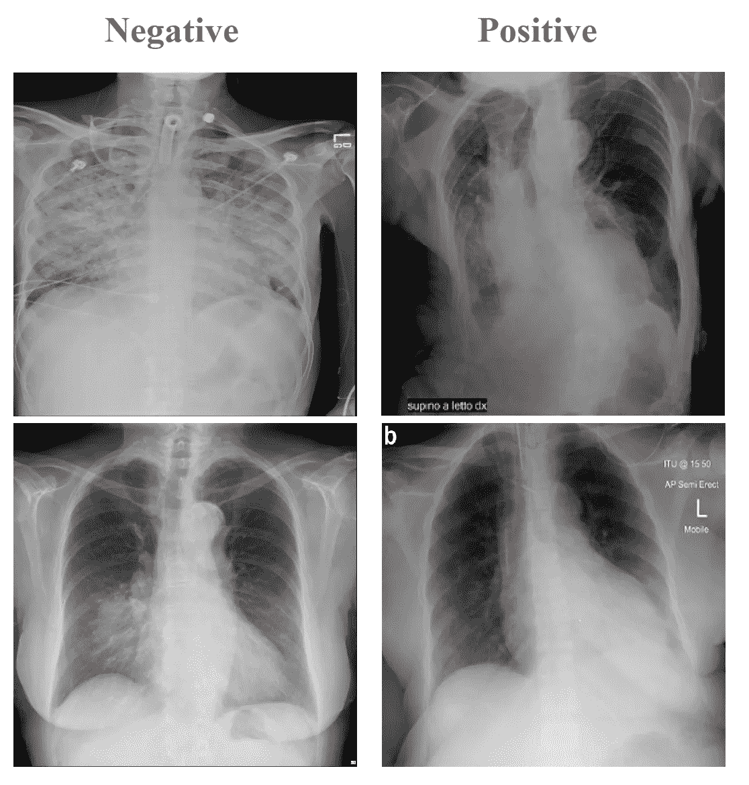
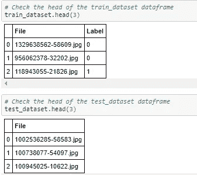
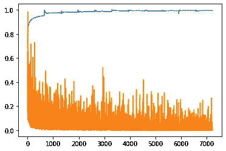
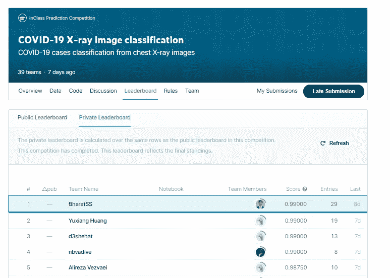

# 使用 PyTorch 中预先训练的卷积神经网络从胸部 X 射线图像进行高精度 Covid 19 预测

> 原文：<https://towardsdatascience.com/high-accuracy-covid-19-prediction-from-chest-x-ray-images-using-pre-trained-convolutional-neural-2ec96484ce0?source=collection_archive---------5----------------------->

*利用 Efficientnet 架构在与 Covid19* 相关的医学成像数据集上实现 99%以上的预测准确率

在这篇文章中，我将分享我开发卷积神经网络算法的经验，以高精度从胸部 X 射线图像预测新冠肺炎。我在参加深度学习博士课程的课堂 Kaggle 竞赛时开发了这个算法。我很高兴从最终的比赛排行榜中得知 [**我在比赛**](https://www.kaggle.com/c/stat946winter2021/leaderboard) 中在 40 名参赛的统计学和计算机科学系的博士和硕士研究生中名列第一！我将提及我在开发和训练模型时所面临的挑战，以及我如何找到解决这些挑战的方法，而不是直接讨论结果。在研究这个问题的时候，我亲身体验了“享受过程，结果会自然发生”这句话的道理！

你可以在 GitHub [这里](https://github.com/bsets/Covid19_Detection_from_XRay_Images/tree/main)找到我的完整代码。

**挑战简介**

**给定一幅输入的胸部 x 光图像，算法必须检测该人是否感染了新冠肺炎病毒**。我们有一组受监督的 X 射线图像，已经由放射科医生仔细标记，模型必须在这些图像上进行训练。这种模型可以帮助卫生保健专业人员比放射科医师更快地诊断新冠肺炎病例，尤其是在需要在短时间窗口内对大量人员进行测试的情况下，放射科医师必须逐个进行每次扫描。

我们举个例子。下面的图片来自竞赛网站，分别是没有(阴性)和有(阳性)新冠肺炎的人。



没有(左)和有(右)新冠肺炎的人的胸部 x 光照片(来源:竞赛网站:[https://www.kaggle.com/c/stat946winter2021/overview](https://www.kaggle.com/c/stat946winter2021/overview))

**数据集描述**

训练数据集由 15264 幅(512×512 像素)图像组成，这些图像已经由放射科专家分类。测试数据集由来自相同分布的 400 个这样的图像组成。你可以在这里找到数据集[。](https://drive.google.com/drive/folders/1RlQ2ONSfM0nAaUGvHcm3lgF6NqR7vq5E?usp=sharing)

我发现训练数据集**明显不平衡，大约 90%的图像属于非 Covid 类。显著不平衡集合的问题是，即使简单地输出多数类的类作为输出的朴素学习算法也将获得高精度。换句话说，它会将每个人标记为无 Covid，并达到 90%的“准确率”，即使大约 10%的人实际上有 Covid。最初，我从不平衡的训练数据集开始。事后看来，这并不是最好的起点，但我们必须从自己拥有的东西开始，在这种情况下，就是训练数据集。我将在本文后面更详细地描述它。**

**攀登绩效阶梯——步骤和失误**

> 深度学习算法有许多活动的部分，我发现训练一个高性能的模型既是一门艺术，也是一门数学。一个人在开始时并不知道大多数答案，必须通过实验来学习。

我现在将描述我是如何选择每个超参数的，以及我在这个过程中学到了什么。

**学习率**:学习率越低，收敛越好，但不一定测试精度最好。问题可能是算法还没有学习到导致测试集的最低误差的权重集。另一方面，较高的学习速率会导致算法超过最优的权重集。我试验了 10e-3、10e-4 和 10e-5 的学习率，发现 10e-4 导致测试数据集的错误率最低。

**批处理大小:**在将批处理大小增加到 256 甚至减少到 64 时，我遇到了内存问题，因此不得不选择更小的批处理大小。我用 32 和 16 做实验。在这两个批量中，32 的批量导致最低的错误率，学习率为 10e-4。在这篇[论文](https://www.sciencedirect.com/science/article/pii/S2405959519303455)中，我们已经很好地探讨了学习速度、批量大小和准确性之间的相互作用。作者为 VGG16 CNN 实验了各种学习速率和批量大小。我从一个较低的学习速率(lr = 0.0001 as aginst 0.001)开始，后来证明这是一个更好的选择，并根据经验将批量大小设置为 32，这在深度学习实践中很常见。我感谢作者让我从他们的研究中得到的线索。

> 像深度学习这样的复杂领域从来都不是孤狼式的努力，我们都站在彼此的肩膀上，而不仅仅是巨人的肩膀上，向前看。

**预训练模型:**来到**T3 使用哪个预训练模型的问题；我在谷歌人工智能博客上看到了一篇有趣的[文章](https://ai.googleblog.com/2019/05/efficientnet-improving-accuracy-and.html)，该文章比较了 Imagenet 数据集上的准确性与几个预训练模型的模型参数数量。计算机视觉是一个快速发展的领域，新的模型也在快速发展。最初，我计划使用 VGG16 或 Resnet50，但当我在 Efficientnet 上看到这篇文章时，我改变了主意，转而支持 Efficientnet。我有一个 RTX 2070 GPU，我的硬件限制对我可以使用的模型施加了约束。我开始使用 b7 版本的 Efficientnet，但我的 GPU 很快就放弃了，因为这个模型不适合它的内存。在 b7、b6、b5 和 b4 模型上运行了无数次 Kill -9 job_number(在 Linux 中从计算机内存中删除模型的命令:)之后，我选择了 Efficientnet b3。当时这样做的唯一原因是，它是 Efficientnet 系列中最大的型号，最终适合我的 GPU 内存。后来，这被证明是一个极好的选择！**

**时期:**对于像 Efficientnet b3 这样拥有 1200 万个参数和数万个训练数据集实例的模型，很容易过度训练模型。实际上我在用 20 个纪元训练模型的时候，得到的训练准确率是 1！不要问我那种情况下的测试精度:)我使用了范围从 1 到 30 的 epochs，用于各种学习速率和批量大小的组合。

**采样:**我从没有采样开始。奇怪的是，这个模型将几乎所有的测试用例归类为“1”，与我预期的“0”相反。我觉得问题是测试图像没有像训练图像那样被转换，并且未转换的测试图像在某种程度上类似于标签为“1”的转换后的训练图像(稍后将详细讨论这个关键主题)。然后，我使用了一个加权随机采样器，这导致了在训练数据集中 0 和 1 类几乎各占一半。但是，这也导致整个训练数据集的大小从大约 15000 减少到大约 3000 以下。使用这种采样技术，精度有所提高，但稳定在 0.86 左右。接下来，我从少数民族类中进行了额外的采样，并将两个类中的图像数量进行了对比。通过这样做，我的训练数据集从 15000 增加到 26000。这当然有帮助，因为我现在的准确度达到了 90 %,我得到了大约 0.94 的准确度。

**转换——将训练数据集上使用的相同转换应用于测试数据集:**我的准确率稳定在 0.94，其他人的准确率达到了 0.975。这让我开始认真思考我的模型中缺少了什么。在洗澡、做饭和走路的时候，我一遍又一遍地追踪这些步骤。

*突然，灵机一动:配送！所有的机器学习都基于这样的假设，即测试数据的分布与训练数据的分布相同。否则，我们从训练数据集中学到的东西将不会应用到测试数据集中。通过旋转和平移变换训练图像，我改变了分布。然而，通过让测试图像保持原样，我无意中在一个“不同的”分布上应用了该算法。我立即对测试图像应用了相同的变换，你瞧，我第一次看到了 0.975 的精确度！*

**调优:**一旦有了这种认识，剩下要做的就是调优超参数，以获得可能的最佳结果。我尝试了各种时期，发现对于这个具有我使用的预训练模型、学习率和批量大小的数据集，在 11 个时期的训练后，我获得了最佳的测试准确性。

我还能做得更好吗？

或许使用 Efficientnet-b7 配合更大的批量可以获得更高的准确度。如果有人有更强大的 GPU/分布式计算系统，请尝试一下并告诉我。

**实际应用**:使用这种算法，医生可以快速准确地识别 100 个人中的 99 个人的 Covid(在 15000 幅图像上训练该算法并在 400 幅图像上运行该算法大约需要 40 分钟)，仅考虑测试图像的分类时间，该算法对 400 幅图像进行分类仅需要 1 分钟。因此，这对于现场工作人员快速筛选图像并识别测试呈阳性的人非常有用。

在向您介绍了算法发现之旅之后，我现在转到具体的开发部分。

**py torch 中的算法开发**

我在 PyTorch 中开发了我的算法，py torch 是一个非常适合计算机视觉任务的机器学习库。

1.  作为第一步，我导入了 numpy、pandas、os、torch 等，并设置了数据文件夹所在的基本路径。然后，我创建了 pandas 数据框，分别包含训练数据集图像名称及其标签和测试数据集图像名称。

导入库和创建数据框架(作者代码片段)

2.要检查数据帧是否正确加载，最好检查 train_dataset 和 test_dataset 的前几行。下面是 Jupyter 笔记本的代码和结果输出:



查看训练和测试数据集数据帧的前几行(图片由作者提供)

我们看到图像的名称在文件列中，标签在训练图像的标签列中。对于测试图像，我们在文件列中有名称。

3.下面是查看训练数据集文件夹中的一些图像的代码，

绘制一些训练数据集图像的代码(图像由作者提供)

该代码将产生 15 个如上所示类型的 X 射线图像。

4.下一步是以 Pytorch 可以处理的形式从图像和标签中创建训练数据集。Dataloader 是 Pytorch 中的一个功能，它使我们能够方便地将图像和它们的标签配对，以创建一个矩阵/张量，然后 PyTorch 可以将其用作学习算法的输入。

创建将图像和标签配对的类(按作者分类的图像)

5.然后，我将学习率设置为 10e-4

设置学习率(图片由作者提供)

6.接下来，我使用在步骤 4 中创建的 Dataset dataloader 类准备了训练集。我将其命名为 training_set_untransformed，因为我还没有对图像应用旋转或平移等数据转换。

创建训练数据集(图片由作者提供)

7.然后我创建了一个变换。Compose 方法来调整图像的大小，随机应用旋转和水平平移，并将结果矩阵转换为张量。这种变换对于数据扩充是有用的。

创建一个变换函数来增强图像(作者的图像)

8.下一步是对训练数据集使用 transforms 方法。对于少数类中的图像(covid 情况)，我对它们进行了上采样，以便在应用变换后两个类中的图像数量相同。

对少数类进行上采样并应用变换(图片由作者提供)

9.然后，我将这些新创建的图像按照 80:20 的比例分成训练集和验证集。

将数据集拆分为训练集和验证集(图片由作者提供)

10.使用 Pytorch 的 Dataloader 函数，我从训练数据集中创建了每批 32 个的数据，并对它们进行了混洗，以确保所有批中两个类的表示大致相等。

从训练数据集创建批次(作者图片)

11.为了启用 GPU 计算，我使用了 cuda.is_available()命令。深度学习代码也可以在 CPU 上运行，但需要更长的时间。

启用 GPU 计算(图片由作者提供)

12.以下是从 Pytorch 导入 Efficientnet-b3 并将类的数量设置为 2 的命令。

导入 Efficientnet-b3 模型(图片由作者提供)

13.导入后，模型必须加载到 GPU 的内存中。如果您的型号对于 GPU 内存来说太大，您将会收到一条错误消息，并且需要选择另一个适合内存的型号。在 Jupyter 笔记本上运行该命令，欣赏 Efficientnet 的复杂性！

将模型加载到系统中(图片由作者提供)

14.定期保存训练过程产生的权重是有好处的。如果模型由于某种原因崩溃，我们可以调用保存的权重并恢复训练，而不是从头开始。

创建一个文件夹来保存权重(图片由作者提供)

15.我使用交叉熵损失作为损失计算的标准，因为我们正在处理一个分类问题。我使用了 Adam 优化器，这是一种众所周知的深度学习的权重更新方法，并将历元数设置为 11(这种学习是在大量实验后产生的)。学习率衰减是用于在每个时期之后更新学习率的参数，并且我设置了 0.99 的保守衰减率，因为学习率已经很低了。我创建了两个列表来跟踪准确性和损失历史。

设置超参数(图片由作者提供)

16.训练模型:下面是代码的训练部分。我运行了 11 个时期的模型，并保存了模型的第 1、第 10 和最终(第 11)版本。训练它大概花了 40 分钟。

训练模型(图片由作者提供)

```
*At the end of the 11th Epoch, I got an accuracy of 99% on the training dataset for both classes.* Accuracy of     0: 99 %
Accuracy of     1: 99 %
[11 epoch] Accuracy of the network on the Training images: 99 
```

17.这是一张训练精度和迭代交叉熵损失的图表。有 7227 次批量迭代，该图显示了这些值如何随着批量迭代而变化。



损失和准确性历史(图片由作者提供)

18.下一步是应用变换。组合到测试数据集，使其符合与训练数据集相同的分布。

将转换应用到测试数据的函数(图片由作者提供)

19.为了预测测试图像的类别，我们需要定义一个 predict_image 函数:

预测和图像功能(作者提供的图像)

20.以下代码片段检查模型在验证数据集上的表现。

预测验证准确性(图片由作者提供)

21.通过下面几行，我们可以预测测试集图像的类别，并将它们存储在一个 csv 文件中。

预测测试图像类别并存储它们(按作者分类的图像)



劳动的果实！—竞赛排行榜(来源:[竞赛网站](https://www.kaggle.com/c/stat946winter2021/leaderboard)

**结论**

通过这次 Kaggle 比赛，我了解到构思和开发深度学习算法需要一些耐心，我们必须不断寻找模型中的漏洞以及其他人的发现，以使我们的模型变得更好。我的文章是将它转发给机器学习社区的一种小小的方式，这样我们就可以一起分享和学习，并改进我们的算法，以更好的方式解决问题！

希望你能从我的帖子中学到一些有用的东西。请分享您的宝贵反馈！

鸣谢:我非常感谢 Kartik Dutt，他为一个不同的计算机视觉挑战开发了代码，我发现他的代码部分适合这个深度学习任务，并融入了我的工作。([https://github . com/kartikdutt 18/ka ggle-ATPOS-Efficient _ Net/blob/master/Efficient _ Net . ipynb](https://github.com/kartikdutt18/Kaggle-ATPOS-Efficient_Net/blob/master/Efficient_Net.ipynb))