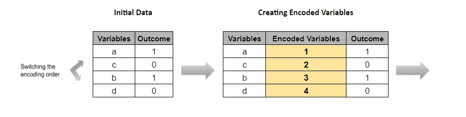

# 大量的唯一值和基于树的模型

> 原文：<https://towardsdatascience.com/high-number-of-unique-values-and-tree-based-models-c30167b63edd?source=collection_archive---------18----------------------->

照片由 [Siora 摄影](https://unsplash.com/@siora18?utm_source=medium&utm_medium=referral)在 [Unsplash](https://unsplash.com?utm_source=medium&utm_medium=referral) 上拍摄

## 基数有多高会影响购物车的性能和解释

H 使用高基数的数据列会对模型的性能产生负面影响。这篇文章的想法源于我在各种项目中使用基于树的解决方案的个人经历。在本文中，我将尝试使用简单的**决策树**来展示这对几个数据集的影响。在进入示例之前，让我们首先了解

**什么是基数，树模型如何工作**

**基数**可以定义为机器学习上下文中数据的唯一性。具有大量唯一值的字段示例包括城市、国家、医疗诊断代码、网飞电影类别、冰激凌口味等。

*作者图片*

决策树示例。*作者图片*

为了使大多数**树模型**工作，所有变量类型都必须转换成数字。机器学习树基于高于或低于值来分割它们的节点，即年龄大于低于 25，权重小于 50。这对于连续数据或任何顺序数据都非常有效。

## 收入数据示例

为了说明高基数对树分裂的影响，我将使用的第一个数据集是来自 Kaggle 的[收入分类](https://www.kaggle.com/lodetomasi1995/income-classification)数据。该数据包含连续和分类的个人数据，以预测个人是高收入还是低收入的二元结果。

我将缩小范围的特征是职业类别变量。这一列中有 13 个唯一值，它们是用**标签编码的。**

编码映射。*作者图片*

在拟合决策树之后，通过观察整个树模型模式，我捕获了在任何节点中使用 occupation 进行分割的所有值。完整的树模式太大，无法显示，可在此处查看。

通过提取使用 occupation 拆分节点的所有节点，我们可以从右侧的表中看到哪些点的数据用于拆分。*作者的图表和表格*

占领的分裂发生在这些值:

**0.5，2.5，3.5，5.5，8.5，9.5，10.5**

将其映射到编码表显示了在整个树中用于分类数据点的决策边界。

# 这似乎不对

观察决策边界后，我的第一个想法是，所有的值都应该被分成离散值。它们彼此之间没有关系，不能用更高或更低的数值来表示。

如果不对每个不同的值进行拆分，一些值将属于同一个存储桶，在进行拆分时会被集中在一起。这导致某些分组没有直观意义，例如

**武装部队，**和****

******[** 机器操作检查、其他服务、私人服务 **]******

****如从上面的分裂边界所观察到的。****

****此外，默认情况下，职业是按字母顺序编码的。通过改变编码顺序，模型超参数实际上受到了影响！****

****在第一次运行中，使用网格搜索交叉验证在 max_depth 为 8 处拟合最佳估计值。但是，使用新的编码顺序再次运行它，同时保持其他所有内容不变，会产生不同的最大深度值 10 和不同的 occupation 类分割边界。****

# ****使用虚拟数据进行调查****

****为了更好地理解这些影响，我决定深入研究以验证我的发现。我对只有 4 行的简单虚拟数据运行了相同的步骤。用决策树对初始数据进行编码和分割。一眼看去，该树可以在值[1，2]和[3，4]之间一分为二。****

****************

*****作者提供的图片*****

********

****决策树架构。*作者图片*****

****左侧显示了用 *sklearn.tree* 绘制的相应树模式。****

****为了以文本形式描述它，顶部的节点指定那些值小于 1.5 的被归类为 1，那些值大于 1.5 的被归类为 0，最佳地将我们的数据分成正确的结果(0 基尼系数杂质)。到目前为止一切顺利。****

****接下来，我以不同的顺序重新排列了变量，并将它们编码如下:****

****************

*****作者提供的图片*****

****由于决策树是基于数值来分隔数据点的，因此为了分隔数据，决策树必须创建更多的拆分。****

********

****决策树架构。*作者图片*****

****也就是说，现在需要三个不同的分裂 **≤0.5、≤1.5** 和 **≤2.5** ，创建一个更深的树以达到最佳结果，即使使用的数据完全相同。****

****这表明编码顺序影响结果，树分裂将持续分裂，直到它不再能减少杂质。****

****因此，我们知道，对于收入分类数据，即使数据点仍然集中在一起，这也是分离可以达到的最高粒度级别。树的分割按预期工作，进一步分割值只会使模型过拟合。****

# ****如果这棵树能做出最佳的分裂次数，为什么不顺其自然呢？****

****事实上，虽然模型结果没有受到显著影响，但我们已经观察到树必须更加努力地分割数据。这仅仅是因为列中的唯一值越多，树就必须进行越多的拆分来分隔数据。****

****这种影响在使用**最大深度**或其他等效超参数控制数据分割程度时最为明显。上述任何增加都会反过来增加模型训练时间。虽然我在我的例子中使用了决策树，但是这个问题影响了所有基于树的模型。给定足够多的具有高基数的特征，即使更复杂的算法也会受到影响。****

****我敢肯定，我们不希望以较差的模型性能为代价，平衡拟合一个较浅/不太复杂的树来减少训练时间。****

****那么我们该如何着手呢？****

# ****处理数据中的高基数****

****在这里，我将简要介绍一些解决这个问题的有用方法:****

1.  ******将数据**组合成组。这可能需要领域知识。这个想法是通过将唯一值分成有意义的集合来减少它们的数量**。**这是一个很好的方法，只要分组不会显著降低模型性能和对业务涉众的可解释性。****
2.  ****尝试不同的编码方法。诸如均值/计数编码、散列等方法在减少数据级别方面特别有效。然而，它们可能对模型的可解释性有害。****
3.  ****使用**非基于树的模型**，例如带有实体嵌入的神经网络。如果没有树，基于树的模型没有问题，但现在你将有一个全新的问题要处理。****
4.  ****具体来说，为了处理输入数据中所示的解释问题，可以使用一个热编码**,尽管它仍然不得不创建更多的分割。******

****作为一个认为树模型的力量是理所当然的人，深入研究树和数据基数之间的关系帮助我改进了建模方法。希望这篇文章也能以同样的方式帮助你。这里是所用代码的 [github 库](https://github.com/WeiHanLer/Tree-Cardinality-Article)。感谢阅读！****

****<https://github.com/WeiHanLer/Tree-Cardinality-Article> ****