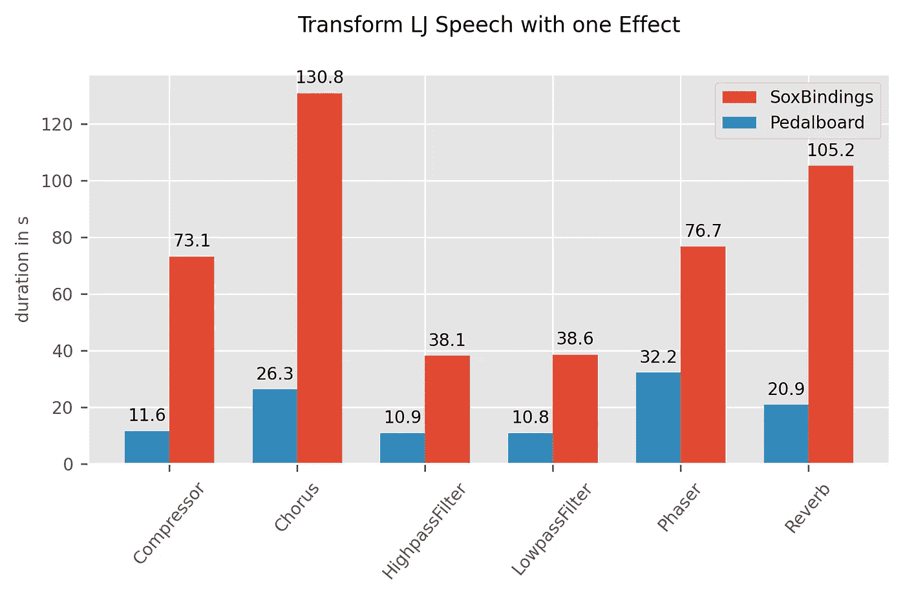
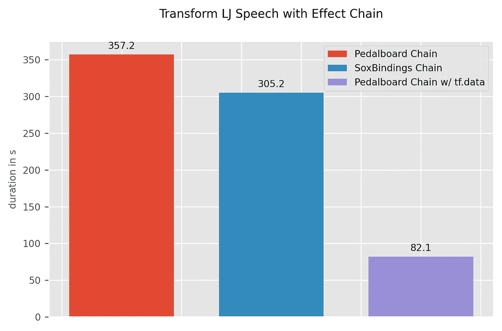

# 利用 Pedalboard 和 tf.data 实现高性能音频处理

> 原文：<https://towardsdatascience.com/high-performance-audio-processing-with-pedalboard-and-tf-data-9bd2c64ca5bd?source=collection_archive---------48----------------------->

最近，Spotify 发布了一个用于音频处理的 Python 库，名为 Pedalboard。在这个故事中，我想研究它在 tf.data 管道中机器学习任务的数据增强环境中的表现。

图 1:表达爱意|作者图片

Pedalboard 由 Spotify 的[音频智能实验室](https://research.atspotify.com/audio-intelligence/)开发，用于在 Python 和 TensorFlow 中实现录音室质量的音频效果。在引擎盖下，Pedalboard 是一个围绕 [JUCE](https://juce.com) 的 Python 包装器，这是一个强大的框架，用于构建音频应用程序，如 [VST3s](https://www.steinberg.net/en/company/technologies/vst3.html) 甚至移动应用程序[1]。到目前为止，他们声称与数字音频工作站(DAW)中使用的效果不相上下似乎是合理的。此外，pedalboard 能够作为 VST3 和[音频单元](https://en.wikipedia.org/wiki/Audio_Units) (AU)的独立主机。

因为我对音频数据进行机器学习的主要工具是 TensorFlow，所以我一直在寻找能够加速我的预处理流水线的库。我常常羡慕 Torchaudio，它已经有了一组不同的函数和自己的 SoX 包装器。当然，有很多音频处理的替代方案，但是所有流行的解决方案要么是像 SoX 和 ffmpeg 这样的命令行工具，要么不是线程安全的。因此，Pedalboard 似乎是 TensorFlow 中快速高质量音频处理的一个很有前途的库。

今天我想比较一下 Pedalboard 和 [SoxBindings](https://github.com/pseeth/soxbindings) 在 tf.data 管道中使用时的处理速度。SoxBindings 是一个很棒的围绕 SoX 的 Python 包装器，它至少在多线程环境中不会失败，但也不会使用它(参见正在进行的 I[issue](https://github.com/pseeth/soxbindings/issues/6))【2】。

# 方法

对于这个任务，我们将使用 [LJ 语音数据集](https://keithito.com/LJ-Speech-Dataset/) [3]作为我们的音频数据输入。该数据集在美国属于公共领域，对其使用没有限制[4]。该数据集由 13，100 个长度为 1 至 10 秒的音频片段组成，总长度约为 24 小时[3]。在下面的每个实验中，我们将迭代整个数据集并测量运行时间。**我们选择了一组在 Pedalboard 和 SoxBindings 中都存在的音效:**

*   压缩机
*   合唱
*   高通滤波器
*   低通滤波器
*   相位器
*   混响

然后我们单独使用每个效果来转换数据集。在第二个实验中，我们将所有 6 个效果链接成一个转换。当然，在大多数增强任务中，你会想要随机初始化每个效果的参数。然而，初步测试表明随机参数化对处理速度没有负面影响，所以为了代码的可读性，我们忽略了它。所有实验都在一个 12 核的 CPU 上运行。

# 密码

首先，我们加载 LJ 语音数据集，并将其仅映射到音频数据:

然后，我们定义一个包装 SoxBindings 转换的包装器，这样我们就可以在 tf.data map 调用中使用它:

踏板也是如此:

当在 tf.data map 中调用 SoxBindings 函数时，保留`num_parallel_calls = None`很重要，否则您的内核会无声无息地死去。这可能是由于 SoxBindings 没有在`C`扩展中释放 GIL[5]。

包含所有实验的完整笔记本可以在我的 [GitHub-Page](https://github.com/iCorv/pedalboard_with_tfdata) 上找到！

# 结果

第一个实验的结果不言自明，Pedalboard 在处理时间上远远落后于 SoxBindings。在图 2 中，我们可以看到所选效果的加速在 2.5 倍到 6 倍之间。

图 2:按效果分类的数据集转换持续时间|按作者分类的图像

第二个实验展示了使用 Pedalboard 和 SoxBindings 的内置效果链的性能。第三个设置*Pedalboard Chain w/TF . data*使用 tf.data map 调用来连续链接各个 pedal board 效果。这种方法产生了迄今为止最好的性能，比另一种方法快 4 倍。

图 3:使用效果链的数据集转换持续时间|作者图片

# 摘要

结果显示，在 tf.data 管道中，通过 SoxBindings 使用 Pedalboard 时，速度有了很大的提高。然而，当使用 Pedalboard 的内置效果链时，似乎会有巨大的性能损失，在这种情况下，性能会低于 SoxBindings 实现。也许 tf.data 只是在并行计算方面比 Pedalboard 更好，我们只是看到了让 tf.data 做它的事情的好处。使用 Pedalboard 的一个缺点是此时可用的效果相对较少。虽然 SoX 和 SoxBindings 已经有了相当多的算法库，但 Pedalboard 仍然需要迎头赶上。这种情况将来可能会改变，在某些情况下，您已经可以使用 VST3 或 AU。

就我而言，我肯定会在一些现实世界的应用程序中尝试一下 Pedalboard，看看它是否能给我更好更快的音频处理管道！

如果有人在我的实现方法中发现系统缺陷，请告诉我，我很乐意让音频处理更快；)

# 资源

[1]【https://juce.com】
【2】[https://github.com/pseeth/soxbindings](https://github.com/pseeth/soxbindings)
【3】k . Ito 和 l . Johnson:LJ 语音数据集(2017 年)[https://keithito.com/LJ-Speech-Dataset/](https://keithito.com/LJ-Speech-Dataset/)
【4】LJ 语音数据集许可(2021 年)[https://librivox.org/pages/public-domain/](https://librivox.org/pages/public-domain/)
【5】[https://github.com/pseeth/soxbindings/issues/6](https://github.com/pseeth/soxbindings/issues/6)

如果你正在阅读这篇文章，我们可能有相似的兴趣或在同一个行业，欢迎你联系我。在[*LinkedIn*](https://www.linkedin.com/in/corvin-jaedicke-ab1341186/)*上找我。*